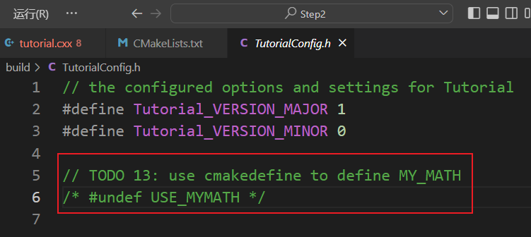

## 练习1	创建库

#### 目标	添加和使用库

完成TODO 1~6

#### 命令

- `add_library()`

  在MathFunctions目录下的CMakeLists.txt

  ```cmake
  # TODO 1: Add a library called MathFunctions
  # Hint: You will need the add_library command
  add_library(MathFunctions mysqrt.cxx)
  ```

- `add_subdirectory()`

  在STEP2/CMakeLists.txt中添加`add_subdirectory()`以便构筑库

  `target_include_directories()`

  `target_link_libraries()`

  `PROJECT_SOURCE_DIR = STEP2` 

  `PROJECT_BINARY_DIR = STEP2/build `

  ```cmake
  cmake_minimum_required(VERSION 3.10)
  
  # set the project name and version
  project(Tutorial VERSION 1.0)
  
  # specify the C++ standard
  set(CMAKE_CXX_STANDARD 11)
  set(CMAKE_CXX_STANDARD_REQUIRED True)
  
  # configure a header file to pass some of the CMake settings
  # to the source code
  configure_file(TutorialConfig.h.in TutorialConfig.h)
  
  
  # TODO 2: Use add_subdirectory() to add MathFunctions to this project
  add_subdirectory(MathFunctions)
  # add the executable
  add_executable(Tutorial tutorial.cxx)
  
  # TODO 3: Use target_link_libraries to link the library to our executable
  target_link_libraries(Tutorial PUBLIC MathFunctions)
  # TODO 4: Add MathFunctions to Tutorial's target_include_directories()
  # Hint: ${PROJECT_SOURCE_DIR} is a path to the project source. AKA This folder!
  target_include_directories(Tutorial PUBLIC
                             "${PROJECT_BINARY_DIR}"
                             "${PROJECT_SOURCE_DIR}/MathFunctions"
                             )
  
  
  ```


## 练习2	使我们的库可选

#### 目标	可选择是否构建、链接MathFunctions库

完成TODO 7~13

#### 命令

- `if()`

  `list()` [list介绍](https://www.jianshu.com/p/89fb01752d6f)

  `option()`[option介绍](https://www.jianshu.com/p/035bc18f8f62)

  设置一个宏USE_MYMATH

  `option(USE_MYMATH "Use tutorial provided math implementation" ON)`

  然后去cmakedefine

  ```cmake
  cmake_minimum_required(VERSION 3.10)
  
  # set the project name and version
  project(Tutorial VERSION 1.0)
  
  # specify the C++ standard
  set(CMAKE_CXX_STANDARD 11)
  set(CMAKE_CXX_STANDARD_REQUIRED True)
  
  # TODO 7: Create a variable MY_MATH using option and set default to ON
  option(USE_MYMATH "Use tutorial provided math implementation" ON)
  # configure a header file to pass some of the CMake settings
  # to the source code
  configure_file(TutorialConfig.h.in TutorialConfig.h)
  
  # TODO 8: Use list() and APPEND to create a list of optional libraries
  # called  EXTRA_LIBS and a list of optional include directories called
  # EXTRA_INCLUDES. Add the MathFunctions library and source directory to
  # the appropriate lists.
  #
  # Only call add_subdirectory and only add MathFunctions specific values
  # to EXTRA_LIBS and EXTRA_INCLUDES if USE_MYMATH is true.
  message("EXTRA_LIBS is " ${EXTRA_LIBS}) # EXTRA_LIBS is 
  if(USE_MYMATH)
    add_subdirectory(MathFunctions)
    list(APPEND EXTRA_LIBS MathFunctions) # 在此处定义了EXTRA_LIBS变量并将MathFunctions追加到EXTRA_LIBS中
    list(APPEND EXTRA_INCLUDES "${PROJECT_SOURCE_DIR}/MathFunctions")
  endif()
  message("EXTRA_LIBS is " ${EXTRA_LIBS}) # EXTRA_LIBS is MathFunctions
  # add the executable
  add_executable(Tutorial tutorial.cxx)
  
  # TODO 9: Use EXTRA_LIBS instead of the MathFunctions specific values
  # in target_link_libraries.
  target_link_libraries(Tutorial PUBLIC ${EXTRA_LIBS})
  
  target_include_directories(Tutorial PUBLIC
                             "${PROJECT_BINARY_DIR}"
                             "${PROJECT_SOURCE_DIR}/MathFunctions"
                             )
  # TODO 10: Use EXTRA_INCLUDES instead of the MathFunctions specific values
  # in target_include_directories.
  target_include_directories(Tutorial PUBLIC
                              "${PROJECT_BINARY_DIR}"
                              ${EXTRA_INCLUDES}
  )
  
  ```

  

- `cmakedefine`

  TutorialConfig.h.in文件中添加

  ```
  // TODO 13: use cmakedefine to define MY_MATH
  #cmakedefine USE_MYMATH
  ```

  build后build/TutorialConfig.h会变成

  ```c
  // TODO 13: use cmakedefine to define MY_MATH
  #define USE_MYMATH
  ```

最后在tutorial.cxx文件中添加预编译命令

```cc
#ifdef USE_MYMATH
#include "MathFunctions.h"
#endif
...
#ifdef USE_MYMATH
  const double outputValue = mysqrt(inputValue);
#else
  const double outputValue = sqrt(inputValue);
#endif
```

> **\**加入想修改option为OFF，则要删除`build/CMakeCache.txt`重新构建**

如果`option(USE_MYMATH "Use tutorial provided math implementation" OFF)`

则USE_MYMATH不会define

