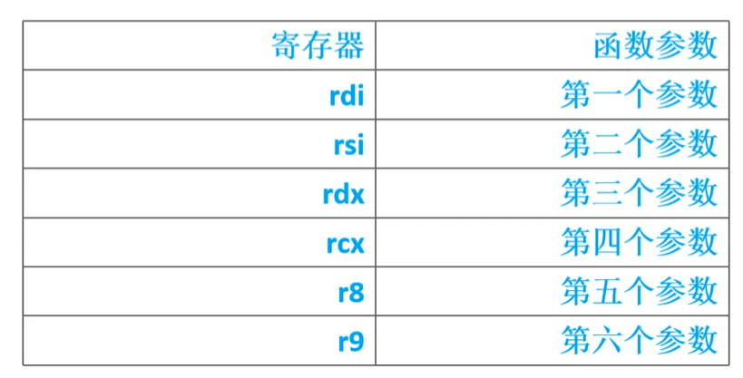
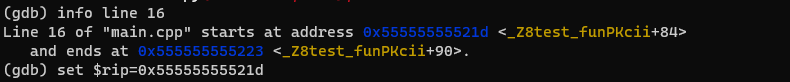

## 查看寄存器

```bash
i registers
i r rdi #查看rdi寄存器
```




多于6个参数放入栈中

  

## 修改寄存器

修改程序计数寄存器(pc/rip)，它存放下一条即将执行的指令，修改它从而改变当前执行的流程

```cc
#include <iostream>
#include <cstring>
using namespace std;
struct test_struct
{
        char name[12];
        char gender;
        int age;
};
int test_fun(const char* name,int age,int gender)
{
        test_struct test;
        memset(&test,0,sizeof(test));
        strcpy(test.name,name);
        test.age = age;
        test.gender = gender;
        return 0;
}

int main(int argc,char** argv)
{
        test_fun("SimpleSoft",25,'m');

        return 0;
}
```

**info line 16查看第16行的反汇编地址(也可以使用disassemble命令查看全部反汇编代码)**，将rip寄存器的地址修改，使其跳过第15行

set $rip = 0x55555555521d

