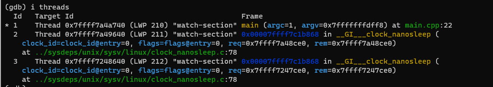

## 观察点

一种特殊的断点，当表达式值变化时，将中断下来。

- watch 写观察点 写中断
- rwatch 读观察点 读中断
- awatch 读写断点 读写中断
- info watch 查看观察点
- delete/disable/enable 删除/禁用/启用观察点

watch可以只为单独线程 中断

i threads查看当前存在的线程

只想观察gdata在线程id为3的情况，则输入`watch gdata thread 3`，只会在指定线程中断

#### 指定条件中断

watch gdata+gdata2 > 10