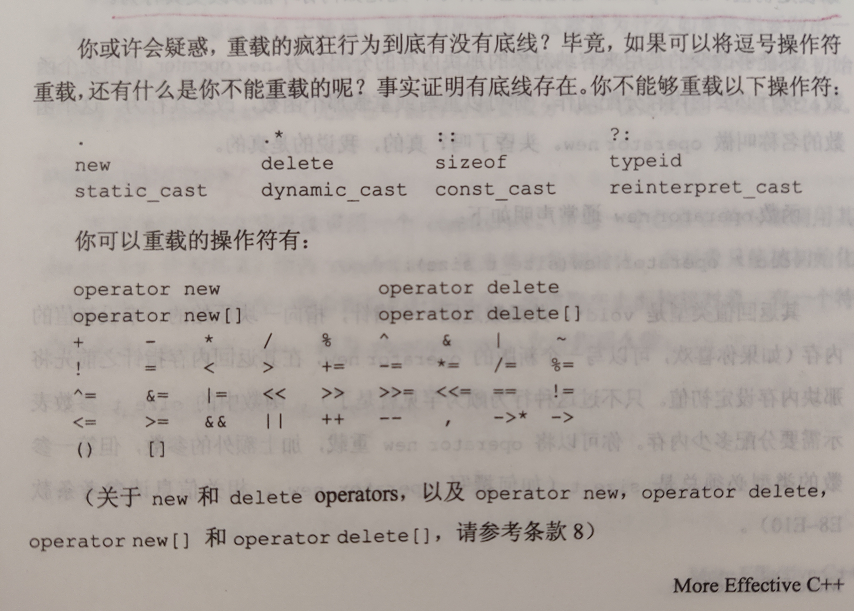

# 条款05	对定制的“类型转换函数”保持警觉

```cpp
class Rational{
public:
	...
	operator double() const;//将Rational转换为double
	
};
Rational r(1,2);
cout<<0.5*r;//r转换为double运算
//最好不要提供类型转换函数
//因为可能会导致错误的函数被调用
//正确做法是以功能对等函数来替代
//例如添加一个函数
    double asDouble() const;
cout<<0.5*r.asDouble();
```


```cpp
template<class T>
class array{
public:
	array(int low,int high);
	array(int size);
	T& operator[](int index);
	...
};
bool operator==(const array& lhs,const array& rhs);

array<int> a(10);
array<int> b(10);
for(int i=0;i<10;++i){
    if(a==b[i])//这里本应该是a[i]==b[i]
		...
}
    
//但以上并不会报错，编译器将其转化为如下
//每次a都会和一个大小为b[i]的临时数组进行比较
if(a == static_cast<array<int>>(b[i]))
    ...
//可使用explicit关键词解决，将ctor声明为explicit即可
	explicit array(int size);
if(a == b[i])//不会进行隐式转换为array<int>
```

```cpp
//如果编译器不支持explicit
//以下方法能实现
//			1.允许由一个int来作为ctor的参数
//			2.可以阻止一个整数类型隐式转换为一个临时的array对象
template<class T>
class array{
public:
	class arraysize{//新加入的class
		public:
			arraysize(int num):size(num){}
			int size() const {return size;}
		private:
			int size;
	};
	array(int low,int high);
	array(arraysize size);
	T& operator[](int index);
	...
};

array<int> a(10);//编译器被要求使用一个为int参数的ctor，但是没有，因此将10转换为临时的				  //arrysize对象
bool operator==(const array& lhs,const array& rhs);
if(a == b[i])//此时编译器不能考虑将int转换为一个临时性的arraysize对象，然后再由这个临时对象产生一个array<int>对象，因为这会调用两个类型转换，是禁止的
    
//类似于arraysize的类，往往被称为proxy classes代理对象
```


# 条款06	区别前置后置的increment和decrement

```cpp
T& operator--();//前置
const T operator--(int);//後置
//为什么要是const？如果不这样，下列动作是合法的
T t;
t++++;//t.operator(0).operator(0);
		//不期待这样
```


# 条款07	千万不要重载&&、||和，操作符

- ### 如果重载||或&&，就没有办法提供预期的某种行为模式

- 


# 条款08	了解各种意义不同的new和delete

- ### operator new

  ```cpp
  string *ps = new string("123");
  /**
  调用了operator new和ctor
  1.分配一个string对象的内存
  2.调用一个ctor
  */
  void* mem = operator new(sizeof(string));
  call string ctor;
  string *ps = static_cast<string*>(mem);
  ```

- ### placement new

  ```cpp
  #include <new>
  class Widget{
  	Widget(int size);
  	...
  };
  Widget* constructWidgetInBuffer(void* buffer,int size){
  	return new(buffer) Widget(size);//在buffer处调用new
  }
  ```

- ### delete

  - 为避免资源泄漏，每个动态分配都必须匹配一个相反的释放
    - operator new对应operator delete
    - malloc对应free

  ```cpp
  void* mem = malloc(sizeof(Widget));
  Widget* pw = constructWidgetInBuffer(mem,sizeof(Widget));
  delete pw;//no!因为mem不是来自于operator new，而是malloc
  pw->~Widget();//ok
  free(mem);//ok
  ```

- ### 数组

  - delete []而不是delete

  ```cpp
  string* arr = new string[10];//调用operator new[]分配10个string的内存，对每个内存调用默认ctor
  delete arr;//error 如果这样，只有arr[0]被delete，其余会泄露
  delete [] arr;//ok
  ```