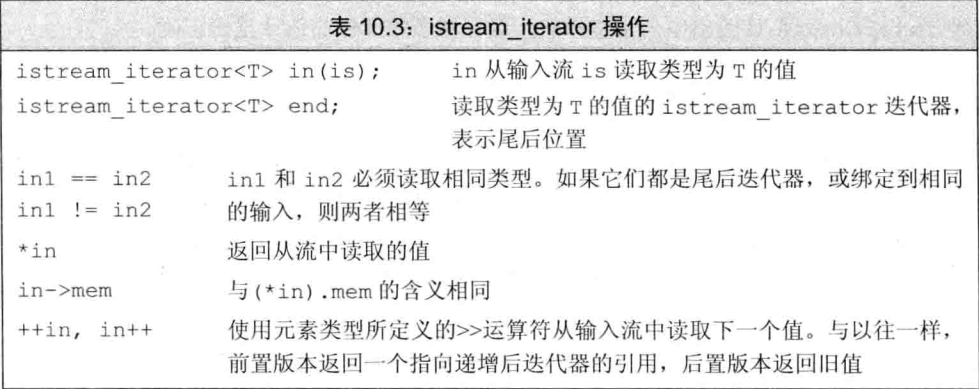
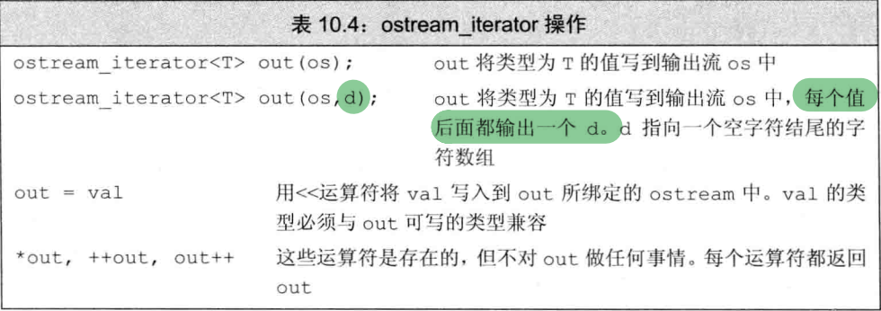

## iostream迭代器

虽然iostream类型不是容器，但标准库仍然定义了可用于这些IO类型的迭代器

istream_iterator读取输入流，ostream_iterator向输出流写数据

#### istream_iterator

```cc
istream_iterator<int> int_it(cin); 	//从cin读取int
istream_iterator<int> int_eof;		//尾后迭代器
ifstream in("afile");
istream_iterator<string> str_in(in);//从afile中读取string
istream_iterator<string> str_eof;

vector<string> vec;
//读取数据到vec中
while (str_in != str_eof) {
    vec.push_back(*str_in++);
}

vector<int> vec2(int_it,int_eof);//根据标准输入构造vec2 	
```




### ostream_iterator



```cc
ostream_iterator<int> out_iter(cout," ");//每次输出后面加一个" "
for (auto e : vec)
	*out_iter++ = e;
cout << endl;
//也可使用copy打印vec元素
copy(vec.begin(),vec.end(),out_iter);
cout << endl;
```

