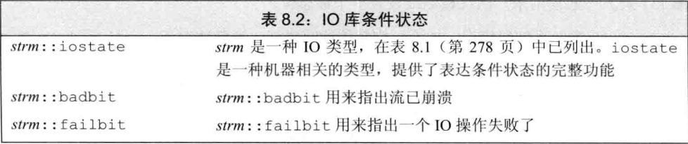
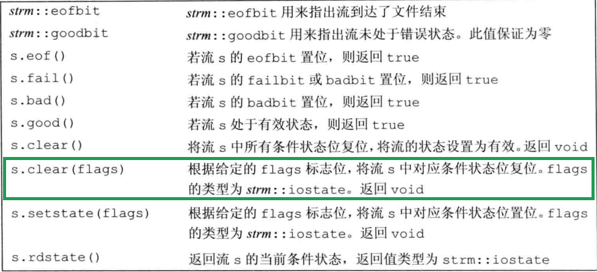
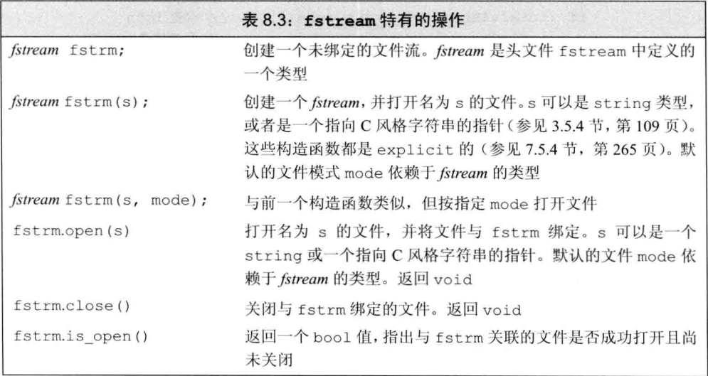
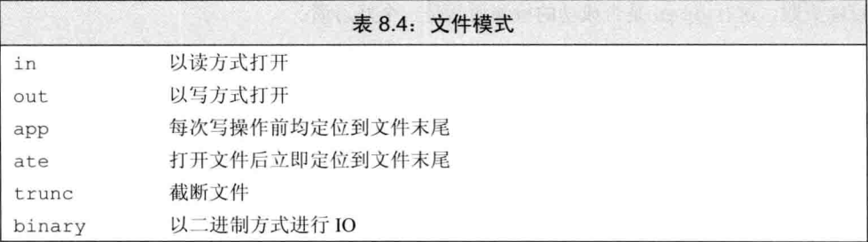
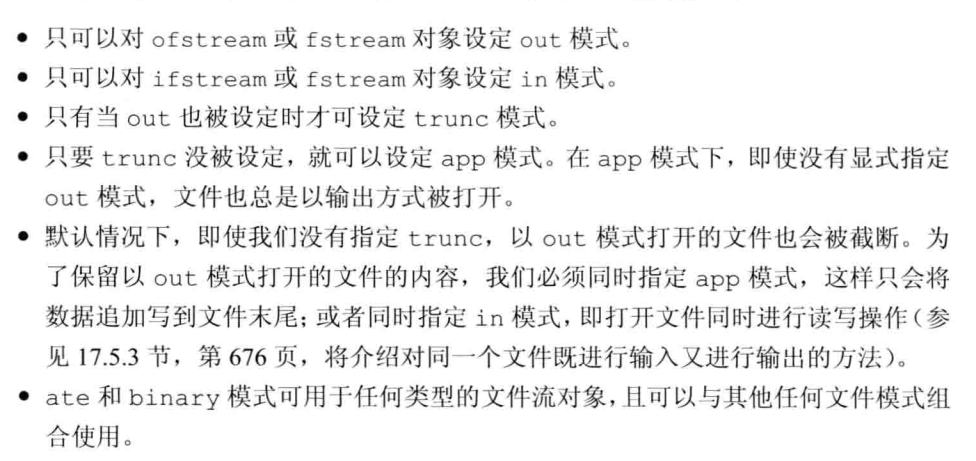
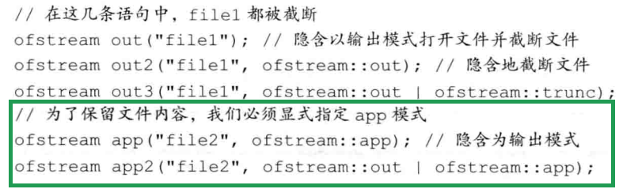

# C++ IO库

## 流的条件状态





```cc
int i;
cin >> i;
// 一旦输入数字外的符号，cin会进入错误状态，后续IO操作全部失败
```

#### 确定一个流对象的状态最简单的方法是将它当作一个条件

```cc
while(cin >> word){
	//ok
}
```

#### 查询流的状态

- badbit表示系统级错误，不可恢复的错误，流无法再使用
- failbit，当发生IO操作失败等可恢复错误或到达文件结束位置后被置位，流还可以使用
- eofbit，当到达文件结束位置后被置位
- goodbit==0表示流未发生错误
- badbit failbit eofbit任意一个被置位，则检测流状态的条件就会失败

#### 管理状态条件

```cc
//记住当前cin的状态
auto old = cin.rdstate();
cin.clear();
process_input(cin);
cin.setstate(old);
```

```cc
//复位failbit和badbit，保持其他标志位不变
cin.clear(cin.rdstate() & 	~cin.failbit & ~cin.badbit);
```

#### 管理缓冲输出

- endl可显示刷新缓冲区
- 缓冲区满后需要刷新缓冲才能继续写入缓冲区

```cc
cout << "123" << endl; // 输出 123和一个换行，然后刷新缓冲区
cout << "123" << endl; //输出 123，然后刷新缓冲区，不附加任何额外字符
cout << "123" << ends; //输出 123和一个空字符，然后刷新缓冲区
```

- unitbuf  每次输出都会刷新缓冲区

  ```cc
  cout << unitbuf; // 所有输出操作后都会立刻刷新缓冲区
  cout << nounitbuf; // 回到正常的缓冲方式
  ```

#### 关联输入输出流

当一个输入流被关联到输出流时，任何试图从输入流读取数据的操作都会先刷新关联的输出流

```cc
cin >> val;//会刷新cout的缓冲区
```

```cc
cin.tie(&cout); //标准库默认将cin cout关联
ostream *oldtie = cin.tie(nullptr);//cin不再与其他流关联
cin.tie(&cerr);	//cin读取后，刷新cerr
cin.tie(old); //恢复为cout
```


## 文件输入输出



#### open前必须close之前关联的文件


### 文件模式





#### out模式打开文件会丢弃已有数据

##### 保留被ofstream打开的文件中已有数据唯一方法是显示指定app或in模式

##### 每次open都会确认文件模式，默认out模式


## string流