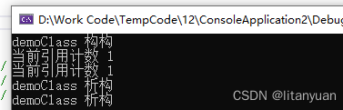
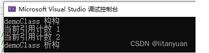
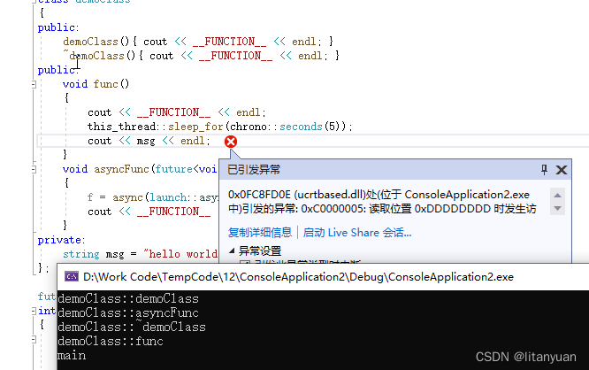
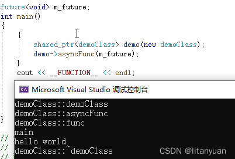

## enable_shared_from_this作用

### 1、获取this的shared_ptr

#### 作用是在类的内部安全的得到 this 指针的 shared_ptr 版本。

```cc
class demoClass
{
public:
    demoClass(){ cout << "demoClass 构构" << endl; }
    ~demoClass(){ cout << "demoClass 析构" << endl; }

    void func()
	{
        shared_ptr<demoClass> sp(this);
        cout << "当前引用计数 " << sp.use_count() << endl;
    }
};

int main()
{
    demoClass* demo = new demoClass;
    shared_ptr<demoClass> sp(demo);
    cout << "当前引用计数 " << sp.use_count() << endl;
    demo->func();

    system("pause");
    return 0;
}

```



使用enable_shared_from_this实现

```cc
class demoClass: public enable_shared_from_this<demoClass>
{
public:
    demoClass(){ cout << "demoClass 构构" << endl; }
    ~demoClass(){ cout << "demoClass 析构" << endl; }

    void func()
{
        shared_ptr<demoClass> sp = shared_from_this();
        cout << "当前引用计数 " << sp.use_count() << endl;
    }
};

int main()
{
    demoClass* demo = new demoClass;
    shared_ptr<demoClass> sp(demo);
    cout << "当前引用计数 " << sp.use_count() << endl;
    demo->func();
 
    return 0;
}

```



### 2、类的内部异步使用 this 指针

使用 std::async 可以开启一个异步任务，返回一个 std::future 对象

**若在异步任务执行期间该对象已经被释放，则会出错。**

```cc
class demoClass 
{
public:
    demoClass(){ cout << __FUNCTION__ << endl; }
    ~demoClass(){ cout << __FUNCTION__ << endl; }
public:
    void func()
{
        cout << __FUNCTION__ << endl;
        this_thread::sleep_for(chrono::seconds(5));
        cout << msg << endl;
    }
    void asyncFunc(future<void> & f )
{
        f = async(launch::async, bind(&demoClass::func, this )); 
        cout << __FUNCTION__ << endl;
    }
private:
    string msg = "hello world";
};

future<void> m_future;//为确保真的异步
int main()
{
    {
        shared_ptr<demoClass> demo(new demoClass);
        demo->asyncFunc(m_future);      
    }//释放 demo
    cout << __FUNCTION__ << endl;
   
    m_future.wait();
   
    return 0;
}
```



使用延长对象生命周期

```cc
class demoClass : public enable_shared_from_this<demoClass>
{
public:
    demoClass(){ cout << __FUNCTION__ << endl; }
    ~demoClass(){ cout << __FUNCTION__ << endl; }
public:
    void func()
{
        cout << __FUNCTION__ << endl;
        this_thread::sleep_for(chrono::seconds(5));
        cout << msg << endl;
    }
    void asyncFunc(future<void> & f )
{
        f = async(launch::async, bind(&demoClass::func, shared_from_this() )); 
        cout << __FUNCTION__ << endl;
    }
private:
    string msg = "hello world";
};

future<void> m_future;
int main()
{
    {
        shared_ptr<demoClass> demo(new demoClass);
        demo->asyncFunc(m_future);      
    }
    cout << __FUNCTION__ << endl;
   
    m_future.wait();
   
    return 0;
}
```



### 注意

继承自 enable_shared_from_this 类可以安全的得到 this 的 shared_ptr 版本，关键在于其 private 的 weak_ptr 变量 ，因此在使用时必须注意以下两点

①．**必须 public 继承**自 enable_shared_from_this，只有public 继承**才可以继承父类的 private 成员**。

②．必须使用 shared_ptr 来管理对象，确保 weak_ptr 变量被初始化。