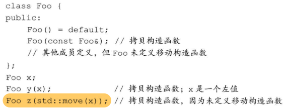
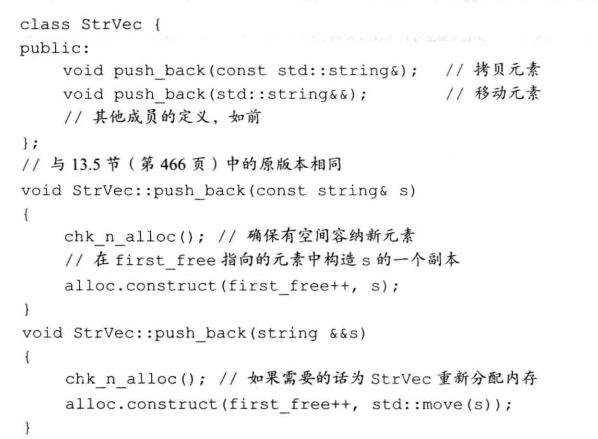

## 右值引用

- 右值引用只能绑定到一个将要销毁的对象上

```cc
int i = 42;
int &r = i;
int &&rr = i; // error 不能将一个右值引用绑定在左值上
int &r2 = i * 2; // i*2是右值
const int &r3 = i * 2; // ok 可以将const引用绑定到右值上
int &&rr2 = i * 2; // ok
```

- 左值持久，右值短暂

- 变量是左值，因此我们不能将一个右值引用直接绑定到一个变量上，即使这个变量是右值引用类型也不行

```cc
int &&r = 42; // ok
int &&r2 = r; // error 表达式r是左值！
```

### std::move

`std::move` 函数的作用就先通过 `std::remove_reference` 函数得到传入参数的原始类型 `X`，然后再把参数强转成 `X&&` 返回即可，参数的 `_Tp` 的推导参考引用折叠规则。

```cc
#include <utility>
  template<typename _Tp>
    constexpr typename std::remove_reference<_Tp>::type&&
    move(_Tp&& __t) noexcept
    { return static_cast<typename std::remove_reference<_Tp>::type&&>(__t); }

//std::remove_reference 实现可能如下 就是返回去掉引用的原始类型。
template <typename T>
struct remove_reference {
    using type = T;
};

template <typename T> // 模板特化
struct remove_reference<T&> {
    using type = T;
};

template <typename T> // 模板特化
struct remove_reference<T&&> {
    using type = T;
};

```

可以将一个左值转换为对应的右值引用类型

### 移动构造函数和移动赋值运算符

```cc
A::A(A&& a) noexcept {
	...
	destroy(a);
}
// 必须保证a以后不使用
A& A::operator=(A&& a) noexcept {
    if(this != &a) {
        free(this);
        ...
    }
    return *this;
}
```

#### 移动后源对象必须保持有效、可析构状态，但不能保证值仍然是原来的值


### 合成的移动操作

- #### 如果一个类定义了自己的拷贝构造函数、拷贝赋值运算符或者析构函数，编译器就不会为其合成移动构造函数和移动赋值运算符

  ```cc
  struct X {
  	int i;	//内置类型可移动
  	std::string s;	//string内部定义了自己的移动操作
  };
  struct hasX {
      X mem; // x有合成的移动操作
  }
  X x,x2 = std::move(x); // 使用合成的移动构造函数
  hasX hx,hx2 = std::move(hx); // 使用合成的移动构造函数
  ```

  #### 只有一个类没有定义自己的任何版本的拷贝控制成员(构造函数、拷贝构造函数、拷贝赋值运算符、移动构造函数、移动赋值运算符、析构函数)，编译器才会为其合成移动构造或移动赋值运算符

  

#### **移动构造函数被定义为删除的函数条件：

- 有类成员定义了自己的拷贝构造但未定义移动构造，或者有类成员未定义自己的拷贝构造并且编译器不能为其合成移动构造
- 类成员的移动构造或移动赋值运算符被定义为删除或不可访问
- 类的析构函数被定义为删除或不可访问
- 类成员是const或引用

```cc
struct Y {
	Y() = default;
	Y(Y&);
	...
};
// Y定义了自己的拷贝构造，因此编译器不会为其生成移动构造
struct hasY {
	hasY() = default;
	hasY(hasY&&) = default;
    Y mem; // x有合成的移动操作
}
// hasY显式要求一个移动构造函数，但编译器无法为其生成
// 因此hasY有一个删除的移动构造
```


### 如果没有移动构造，右值也被拷贝

一个类如果没有移动构造，函数匹配规则保证该类型对象会被拷贝，即使通过`std::move`移动它也是如此




### 原则：所有5个拷贝控制成员应该看作一个整体（构造函数、拷贝构造函数、拷贝赋值运算符、移动构造函数、移动赋值运算符）如果定义了任何一个拷贝操作，就应该定义剩余的操作


### 右值引用和成员函数

区分移动和拷贝的重载函数通常一个版本接收`const T&` 另一个版本接收`T&&`



#### 右值和左值引用成员函数

```cc
string s1 = "123",s2 = "456";
auto n = (s1 + s2).find('4'); // ok
// 在string右值上调用find

s1 + s2 = "wow"; // bad but ok! 我们对右值进行了赋值
```

但我们希望阻止这种方法，我们希望强制左侧为一个左值

因此可以使用**引用限定符**

```cc
class Foo {
public:
	Foo &operator=(const Foo&) &; //只能由左值调用
};
Foo & Foo::operator=(const Foo&) & {
	...
	return *this;
}
```

#### 引用限定符可以是&或&&

```cc
Foo &retFoo();	// 返回一个左值
Foo retVal();	// 返回一个右值
Foo i,j;
i = j;
retFoo() = j;	// ok 调用operator=的是一个左值
retVal() = j;	// error 调用operator=的是一个右值
```

#### 一个函数可同时使用const和引用限定

```cc
class Foo {
public:
	Foo func() const &; // const必须在前面
    					// 表示该函数不可修改成员且必须由左值调用
};
```

- #### 注意：如果定义了两个或以上具有相同名字和参数列表的成员函数，其中一个用了引用限定符，则必须对所有函数加上限定符

  ```cc
  class Foo {
  public:
  	Foo sorted() &&;
  	Foo sorted() const &;// 必须加上&
  	using Comp = bool(const int&,const int&);
  	Foo sorted(Comp*);	// ok 参数列表不同
  	Foo sorted(Comp*) const; // ok 没用引用限定符就行
  };
  ```

  

