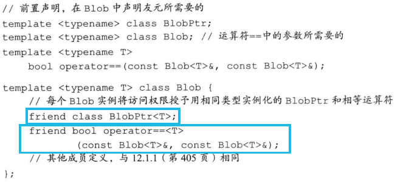
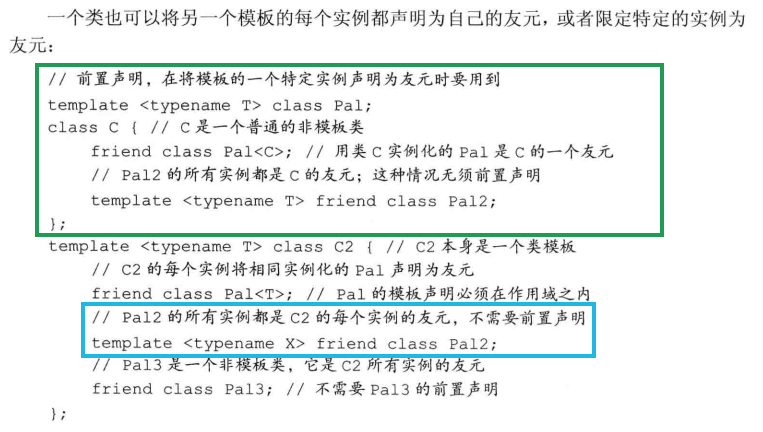
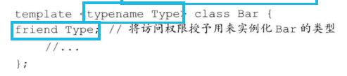
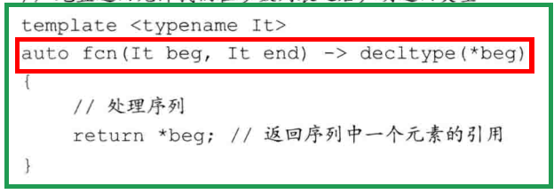
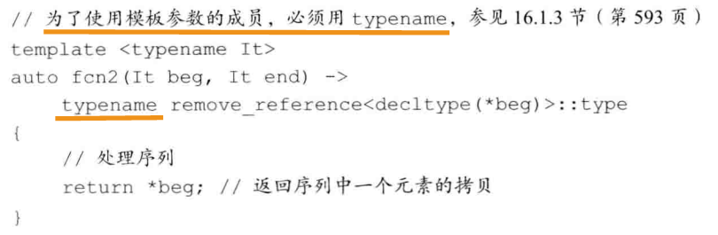
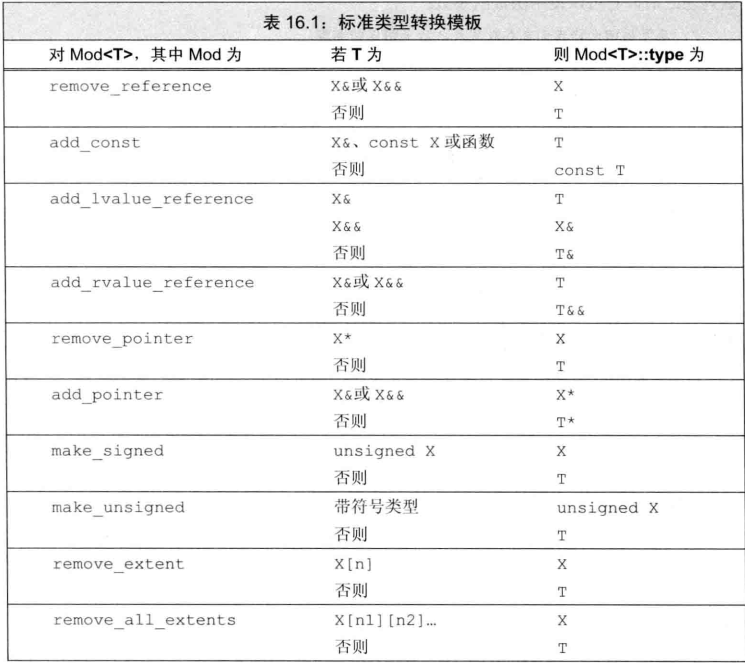
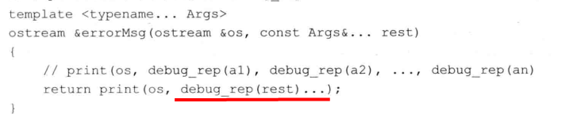
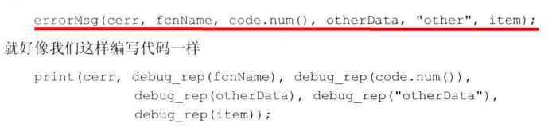

## 模板杂记

```cc
template<unsigned N,unsigned M>
int compare(const char (&p1)[N], const char (&p2)[M]) {
	return strcmp(p1,p2);
}
```

- #### 定义在类模板内的成员函数被隐式声明为内联函数

- #### 对于一个实例化的类模板，其成员只有在使用时才被实例化，而实例化定义会实例化所有成员

### 模板与友元

- #### 一对一友好关系

  

- #### 通用和特定的模板友好关系

  

- #### 令模板自己的类型参数称为友元

  


### 模板类型别名

**由于模板不是一个类型，因此我们不能用typedef引用一个模板**

可以使用`using`来解决这一问题

```cc
typedef Blob<string> StrBlob; // no!
template<typename T>
using partNo = pair<T,unsigned>; // ok
```


### 类模板的static成员

```cc
template<typename T>
class Foo {
public:
	static size_t count() const { return ctr; }
private:
	static size_t ctr;
};
```

对于任意一个给定类型X，都有一个`Foo<X>::ctr`和一个`Foo<X>::count()`

```cc
Foo<int> f1,f2,f3; // 这三个对象共享Foo<int>::ctr和Foo<int>::count()
```


### 模板参数

我们可以使用任何名字作为模板参数

#### 模板参数与作用域

遵循普通作用域规则，一个**模板参数名的可用范围是在其声明之后到模板声明或定义结束之前**

```cc
typedef double A;
template <typename A,typename B>
void f(A a,B b) {
	A tmp = a;	// tmp参数类型为A，而不是double
	double B;	// error 重声明模板参数B,不能重用模板参数名
}
```

正常的名字隐藏规则决定了A的typedef被类型参数A隐藏。因此tmp不是double，而是使用f时所绑定的类型参数A

#### 模板声明

模板声明必须包含模板参数

```cc
// 声明但不定义compare和Blob
template<typename T> int compare(const T&,const T&);
template<typename T> class Blob;

```


#### typename使用类的类型成员

对于`T::size_type`编译器不知道它是一个类型成员还是一个类型，因此为了明确表达它是一个类型，前面加`typename`即可

```cc
template<typename T>
typename T::value_type top(const T& c) {
	...
}
```


#### 默认模板实参

```cc
template<class T = int>
class Num {
public:
    Num();
private:
    T val;
};
Num<double> d;
Num<> i;	// 空<>表示使用默认实参
```


### 控制实例化**

当两个或多个独立编译的源文件使用了相同的模板，并提供了相同的模板，每个文件中就都会有一个该模板的实例

在多个文件中实例化相同模板的额外开销可能非常严重，因此我们可以通过**显式实例化**避免这种开销

```cc
extern template class Blob<string>;				// 声明
template int compare(const int&,const int&);	// 定义

extern template int add<int>(int t1, int t2);	//显式实例化声明
extern template class Dylan<int>;            	//显式实例化声明
 
template int add<int>(int t1, int t2);       	//显式实例化定义
template class Dylan<int>;                   	//显式实例化定义
```

当编译器遇到**extern的模板声明**时，它不会在本文件中生成实例化代码，将一个实例化声明为extern就表示承诺在程序中的其他位置有该实例化的一个非extern声明(定义）。对于一个给定的实例化版本，可能有多个extern声明，但必须只有一个定义

当编译器遇到**显式实例化定义**时，根据定义所提供的模板实参去实例化模板，生成针对该模板实参的实例化定义。

#### 用途

模板类、函数通常定义在头文件中，这些头文件会被很多cpp文件包含，在这些cpp文件中会多次使用这些模板，比如下面的例子：

```cc
//template.hpp
template<typename T>
class Dylan
{
public:
    T m_data;
};
 
//test1.cpp
#include "template.hpp"
Dylan<int> t1;
Dylan<int> t2;
 
//test2.cpp
#include "template.hpp"
Dylan<int> t3;
Dylan<int> t4;
```

在test1.cpp/test2.cpp 中多次实例化了Dylan\<int\>类，按说编译完后的可执行程序中会包含多份Dylan\<T\>的定义，然而实际上，整个程序中却只有一份Dylan\<T\>的定义

#### 解决方法

```cc
// template.hpp
template<typename T>
class Dylan
{
public:
    Dylan(T t);
    T m_data;
};
 
// template.cpp
#include "template.hpp"
template<typename T>
Dylan<T>::Dylan(T t)
{
    m_data = t;
}
 
template class Dylan<int>; //模板实例化定义
 
// main.cpp
#include "template.hpp"
extern template class Dylan<int>; //模板实例化声明，告诉编译器，此实例化在其他文件中定义
                                  //不需要根据模板定义生成实例化代码  
int main()
{
    Dylan<int> dylan(3);//OK, 使用在template.cpp中的定义
    Dylan<float> dylan1(3.0);//error, 引发未定义错误
}
```

上面的代码中，我们将模板类的具体定义放在template.cpp中，并且在template.cpp中通过显式实例化定义语句具体化了Dylan\<int\>。在main.cpp中，我们通过显式实例化声明告诉编译器，Dylan\<int\>将在其他文件中定义，不需要在本文件中根据template.hpp的类模板实例化Dylan\<int\>。

由于我们没有针对Dylan\<float\>做显式实例化的声明和定义，因此Dylan\<float\> dylan(3.0)会根据template.hpp中的类模板定义进行隐式实例化，然而构造函数是在template.cpp文件中定义的，在template.hpp中找不到构造函数的定义，因而报错。如果把构造函数的定义挪回template.hpp，那Dylan\<float\>就能通过编译了。


### 函数模板显式实参

编译器无法推断出T1类型，因此调用sum时须为T1提供一个**显式模板实参**

```cc
template<typename T1,typename T2,typename T3>
T1 sum(T2,T3);
auto val = sum<long long>(1,(long)1000);
```

**显式模板实参匹配顺序从左到右**

```cc
// 糟糕设计 用户必须指定所有模板参数
template<typename T1,typename T2,typename T3>
T3 sumFool(T2,T1);
// error 不能推断
auto val2 = sumFool<long long>(1,(long)1000);
// ok 显式指定了三个模板参数
auto val3 = sumFool<long long,int,long>(1,(long)1000);
```


### 尾置返回类型和类型转换



由于解引用运算符返回一个左值，因此通过decltype推断出来的类型表示的元素的类型的引用

因此如果对一个string类型调用fcn，则返回类型则是string&

#### 类型转换

```cc
#include <type_traits>
```

可以通过`remove_reference<decltype(*beg)>::type`获得引用的元素的类型






### 函数指针和实参推断


```cc
template<typename T> int compare(const T&,const T&);
int (*pf1)(const int&,const int&) = compare;
void func(int(*)(const string&,const string&));
void func(int(*)(const int&,const int&));
func(compare);		// error 使用哪个compare
func(compare<int>);	// ok
```


### 模板实参推断和引用

```cc
template<typename T> void f1(T&);	// 实参必须是一个左值
f1(4);		// error 必须是左值
template<typename T> void f2(const T&);	// 实参可以是一个右值

template<typename T> void f3(T&&);	// 通过推断来判断类型
```

### 引用折叠

[万能引用](./万能引用.md)

[右值引用](./右值引用 移动语义.md)

- X&	&、X&	&&、X&&	&都会折叠成X&

- X&& &&折叠成X&&

  ```cc
  int i = 0;
  const int ci = 1;
  f3(i); 	// 实参是一个左值，模板参数T为int&
  f3(ci);	// 实参是一个左值，模板参数T为const int&
  ```

- ```cc
  template<typename T> void f(T&&);		// 绑定到非const右值
  template<typename T> void f(const T&);	// 左值和const右值
  ```

  

### std::move

[右值引用 移动语义](./右值引用 移动语义.md)

### 转发

前提是通过[万能引用](./万能引用.md)才能实现完美转发

[stdforward完美转发](./stdforward完美转发.md)


### 可变参数模板

```cc
template<typename T,typename... Args>
void f(const T& t,const Args& ... args)
```

#### 参数包参数的个数

```cc
sizeof...(Args); // 类型参数的个数
sizeof...(args); // 函数参数的个数
```

#### 包扩展

扩展一个包就是将它分解为构成的元素，对每个元素应用模式，获得扩展后的列表。我们通过在模式右边放一个`...`来触发扩展操作

```cc
template<typename T,typename... Args>
ostream& print(ostream& os,const T& t,const Args&... args) {
	os << t << " ";
	print(os,args...);	// 扩展args
}
```





#### 转发参数包

可以使用`std::forward`来转发参数包

```cc
std::bind(std::forward<Func>(f),std::forward<Args>(args)...)
```


### 模板特例化

特例化的**本质是实例化**一个模板，而不是重载，**特例化不影响函数匹配**

```cc
template<>
void f(int a) {
	...
}
```