## 正则表达式

```cc
#include <regex>
```

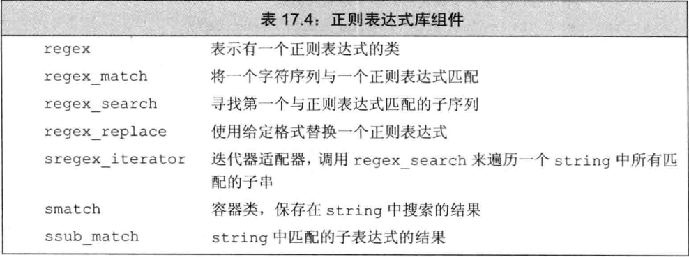

regex_ match和regex_search确定一个给定字符序列和一个给定regex是否匹配，如果整个输入序列匹配与表达式匹配，regex_ match返回true；如果输入序列中一个子串与表达式匹配，则regex_search返回true

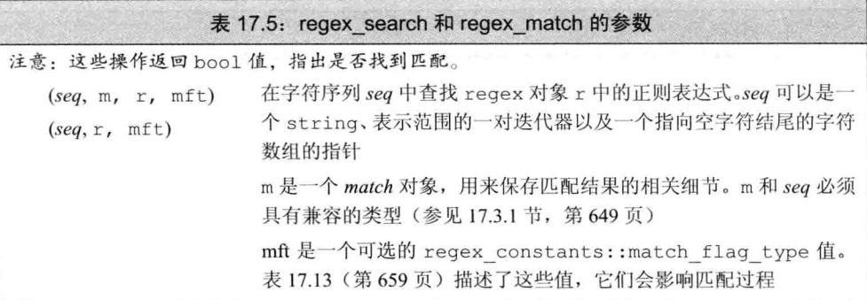


```cc
#include <regex>
#include <iostream>
#include <string>

using namespace std;

int main(int argc, char const *argv[])
{
    // 查找不在字符c之后的字符串ei
    string pattern("[^c]ei");
    // 需要包含pattern的整个单词
    pattern = "[[:alpha:]]*" + pattern + "[[:alpha:]]*";
    regex r(pattern);
    smatch res; // 定义一个对象保存搜索结果

    string test_str = "receipt freind theif receive";
    // 用r在test_str中查找与pattern匹配的子串
    if (regex_search(test_str, res, r))
    {
        cout << res.str() << endl;
    }
    return 0;
}
```

默认情况下，regex使用的时`ECMAScript`。在`ECMAScript`中，模式`[[:alpha:]]`匹配任意字母，符号+ *分别代表“一个或多个” “零个或多个匹配”，因此 [[:alpha:]]\*表示匹配零个或多个字母

regex_search只要找到一个匹配子串就会返回，并保存在smatch中

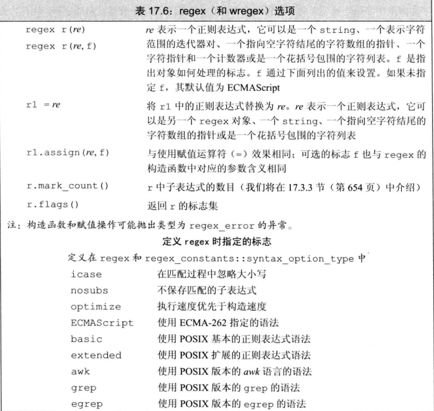

### 指定或使用正则表达式时的错误

错误时会抛出`regex_error`的异常

```
try {
	regex r();
} catch (regex_error e) {
	cout << e.what() << "\ncode:" << e.code() << endl;
} 
```

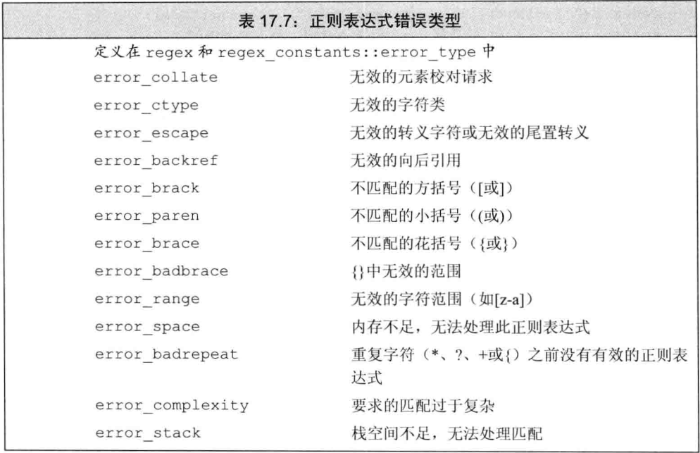

### 正则表达式类和输入序列类型

regex对应char，wregex对应wchar_t

smatch对应string类型的输入序列、cmatch表示字符数组、wsmatch表示wstring、wcmatch表示wchar_t数组

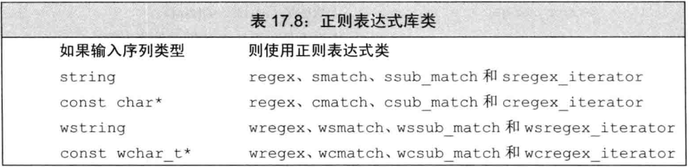


### regex迭代器

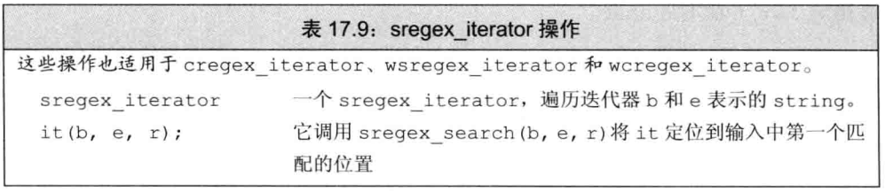

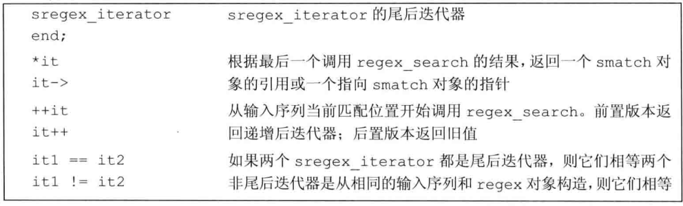

```cc
for (sregex_iterator it(test_str.begin(), test_str.end(), r), eof; it != eof; ++it)
{
	cout << it->str() << endl;
}
```

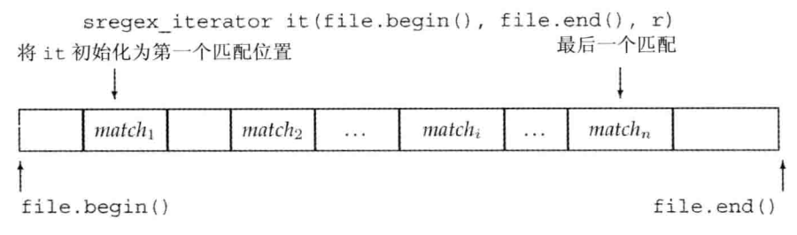

### 使用匹配数据

还可以将匹配到的数据，调用`prefix`和`suffix`使用其前后相邻的数据

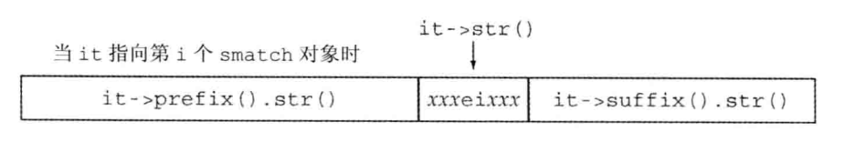

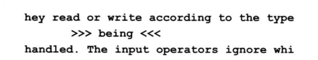

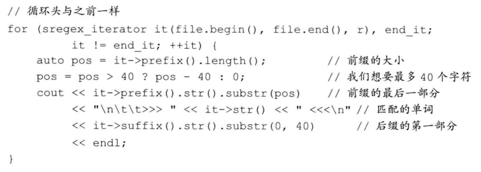