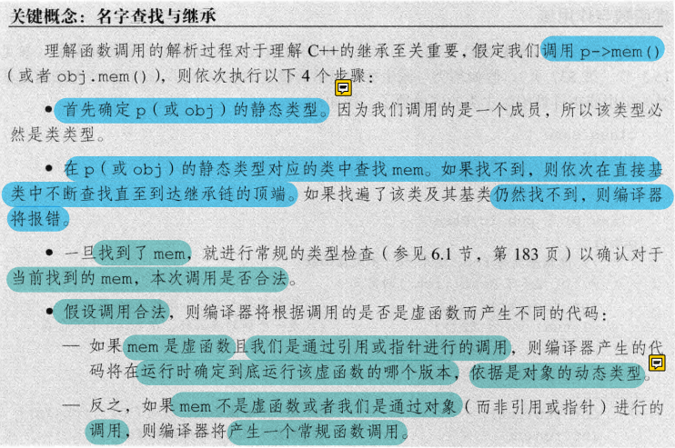
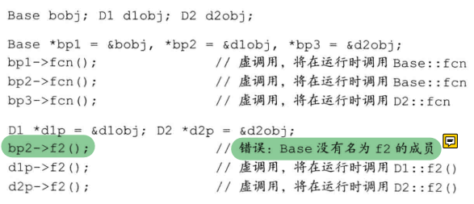
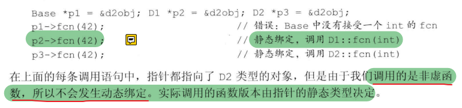
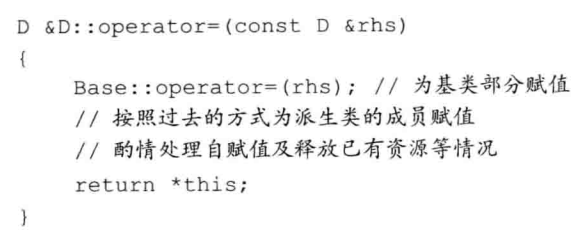
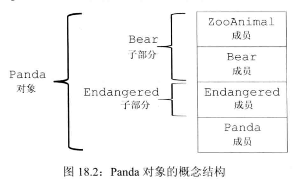
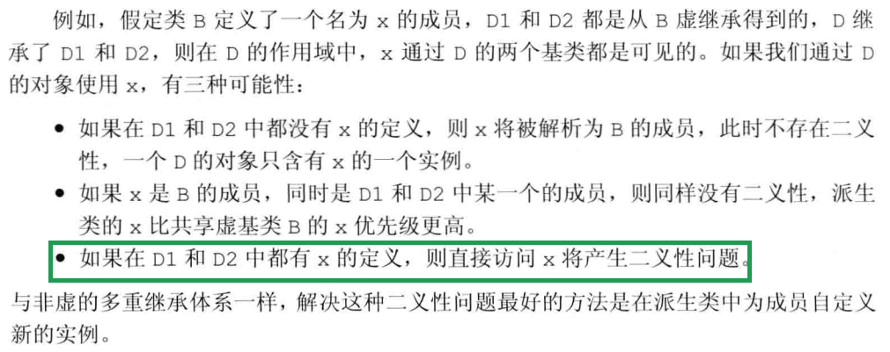
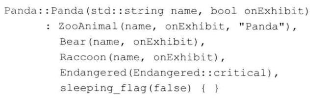
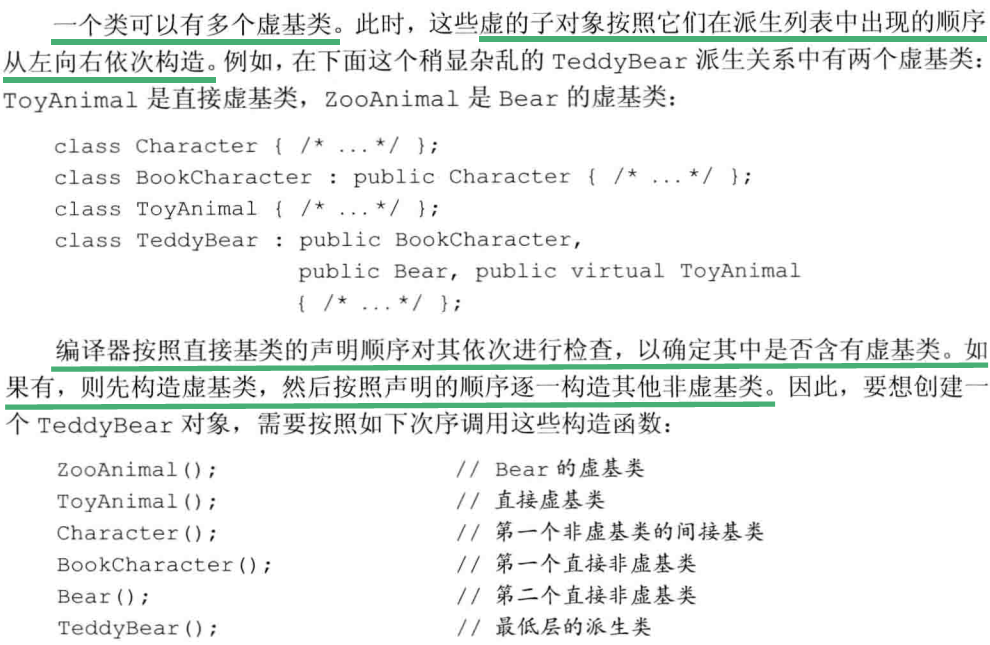

c++中，对于某些函数，基类希望其派生类各自定义，这时候需要**虚函数**

```cc
class Quote {
public:
	std::string isbn() const;
	virtual double price(std::size_t n) const; 
};
// 派生类必须在其内部对所有重新定义的虚函数进行声明
class Bulk_quote : public Quote {
public:
	double price(std::size_t n) const override; 
};
```

### 动态绑定

**当我们在基类的引用(或指针)中调用一个虚函数，就会发生动态绑定**

使用动态绑定可用同一段代码处理Quote和Bulk_quote对象。

```cc
double print(ostream& os,const Quote& item,size_t n) {
	os << item.price() << "\n";
}
```

#### **基类通常都需要定义一个虚析构函数，除非你明确它不需要作为基类**


### 成员函数与继承

基类通过在其成员函数声明语句之前加上关键字`virtual`使得该函数执行动态绑定

任何构造函数之外的非静态函数都可以是虚函数

**virtual关键字只能出现在类内部的声明语句中**

**成员函数如果没被声明为虚函数，则其解析过程发生在编译期而不是运行期**


### 派生类对象与基类对象类型转换

继承自基类的部分和派生类部分不一定是连续存储的

**从派生类向基类的类型转换只针对指针、引用**

```cc
Quote item;				
Bulk_quote bulk;			
Quote* p = &item;			// p指向Quote对象
p = &bulk;					// p指向bulk的Quote部分
Quote& r = bulk;			// r绑定到bulk的Quote部分
```

每个类控制自己成员的初始化过程

```cc
Bulk_quote(const std::string& book,double p,std::size_t size,double disk) : Quote(book,p), ... {}
```

#### 不存在基类向派生类的隐式类型转换

```cc
Quote item;
Bulk_quote* builP = &item;	// error 不能将基类转换为派生类
Bulk_quote& bulkRef = item;	// error 不能将基类转换为派生类
```

如果我们明确某个基类向派生类转换是安全的，可用`static_cast`强制覆盖掉编译器的检查工作


### 派生类的声明

声明中包含的类名不能包含它的派生列表

```cc
class Bulk_quote : public Quote; // error
class Bulk_quote; // ok
```

**如果想将某个类用作基类，则该类必须已经定义而非声明**

```cc
class Quote;		// 声明
class Bulk_quote : public Quote {...}; // error Quote必须被定义
```


### 静态类型(左)和动态类型(右)

**静态类型**在编译时总是已知的，它是**变量声明时的类型或表达式生成的类型**

**动态类型**则是变量或表达式表示的**内存中的对象的类型**，直到运行时才可知

表达式如果既不是指针又不是引用，则其动态类型和静态类型永远一致


### 虚函数

当派生类覆盖了某个基类的虚函数时，该函数在基类的形参必须与派生类中的形参严格匹配

```cc
struct B {
	virtual void f1(int) const;
    virtual void f2();
    void f3();
};
struct D1 : B {
	void f1(int) const override;	// ok f1与基类的f1匹配
	void f2(int) override;			// error B没有f2(int)的函数
    void f3() override;				// error f3不是虚函数
	void f4() override;				// error f4没有f4函数
};
```

函数若定义为final则任何尝试覆盖该函数的操作都将引发错误

```cc
struct D2 : B {
	void f1(int) const final;
};
struct D3 : D2 {
	void f2();				// ok 覆盖从间接基类B继承而来的f2
	void f1(int) const;		// error D2已将f2声明为final
};
```

#### 回避虚函数

```cc
// 强行调用基类中定义的函数版本而不管动态类型是什么
auto x = baseP->Quote::price();
```

#### 纯虚函数

如果有纯虚函数，则类变为抽象基类

不能直接创建一个抽象基类

可以为纯虚函数提供定义，但只能在类外部

```cc
class Test{
	virtual void f() = 0;
};
void Test::f() {
    ...
}
```


### 访问控制与继承

派生类可以继承定义在基类中的成员，但派生类成员函数不一定有权访问基类成员

派生类能访问公有成员(public)，不能访问私有成员(private)

如果基类希望派生类能访问，但禁止其他用户访问，则可用`protected`

#### 受保护的成员(protected)

**派生类成员或友元只能通过派生类对象来访问基类的受保护成员**

**派生类对于一个基类对象中受保护成员没有任何访问特权**

**派生类的成员和友元只能访问派生类对象中的基类部分的受保护成员；对于普通的基类对象中成员不具有特殊的访问权限**

```cc
class Base {
protected:
	int mem;
};
class Sneaky : public Base {
	friend void clobber(Sneaky&); 	// 能访问Sneaky::mem
	friend void clobber(Base&);		// 不能访问Sneaky::mem
	int j;
};
// ok 能访问Sneaky的private和protected成员
void clobber(Sneaky& s) {
	s.j = s.mem = 0;
}
// error 不能访问Base的protected成员
void clobber(Base& b) {
	b.mem = 0;
}
```

### 公有、私有和保护继承

#### private继承也不影响派生类的访问权限

```cc
class Base {
public:
	void pub_mem();
protected:
	int prot_mem;
private:
	char priv_mem;
};

struct Pub_Derv : public Base {
    // ok 派生类能访问protected成员
    int f() { return prot_mem; }
    // error private成员对于派生类不可访问
    char g() { return priv_mem; }
};

struct Priv_Derv : private Base {
	// private不影响派生类的访问权限
	int f1() const { return prot_mem; }
};
Priv_Derv d2;
d2.pub_mem();	// error pub_mem在派生类中是private的
```

#### 派生访问说明符还可以控制继承自派生类的新类的访问权限

```cc
// 派生访问说明符还可以控制继承自派生类的新类的访问权限

struct Derived_from_Public : public Pub_Derv {
    // ok Base::prot_mem在Pub_Derv中仍然是protected的
    int use_base() { return prot_mem; }
};
struct Derived_from_Private : public Priv_Derv {
    // error Base::prot_mem在Priv_Derv中是private的
    // 因为Priv_Derv继承自Base的所有成员都是私有的
    int use_base() { return prot_mem; }
};
```


### 派生类向基类的类型转换

只有公有继承，**用户代码**才能由派生类向基类进行类型转换

```cc
class base {
   public:
       int a;
};

class derived : protected base {
   public :
       int b;
};
int main() {
    base b;
    derived d;
    base * pd = &d; // error!
    return 0;
}
//  error: 'base' is an inaccessible base of 'derived'
```

派生类乌无论什么方式继承基类，派生类的成员函数和友元都能使用派生类向基类的转换

派生类向其直接基类的类型转换对于派生类的成员和友元来说是永远可以访问的

```cc
class base {
   public:
       int a;
};

class derived : private base {
   public :
       int b;
       void test(){
           base * pd = this; // ok
           cout << pd->a << endl;
       }

};
int main() {
    base b;
    b.a = 100;
    derived d;
    d.b = 100;    
    d.test();
    return 0;
}
```

如果派生类继承基类是**公有或受保护的**，则**派生类的派生类**的成员和友元可使用派生类向基类的类型转换

```cc
#include <iostream>
using namespace std;
class base {
   public:
       int a;
};

class derived : protected base { // private 则testdd报错
   public :
       int b;
       void test(){
           base * pd = this;
           cout << pd->a << endl;
       }
};

class dd : public derived {
    public:
        void testdd(){
            derived d;
            base *pd = &d; // ok
            cout << pd -> a <<endl;
        }
};
int main() {
    base b;
    b.a = 100;
    derived d;
    dd d1;
    d.test();
    d1.testdd();
    return 0;
}
```


### 友元与继承

派生类友元不能随意访问基类成员

**例如pal是base的友元，则pal能访问base对象的成员，包括base派生类对象中的base部分**


### 改变个别成员的可访问性

使用`using`声明语句改变成员的可访问性

```cc
class Base {
public:
	std::size_t size() const { return n; }
protected:
	std::size_t n;
};
class Derived : private Base {
public:
	// 保持对象相关成员的访问级别
	using Base::size;
protected:
	using Base::n;
};
```


### 继承中的类作用域

- #### 编译时进行名字查找

  ```
  class Quote {
  public:
  	void test() {
  		cout << "test" << endl;
  	}
  };
  class Bulk_quote : public Quote{
  public:
  	void test2(){
  		cout << "test2" << endl;
  	}
  };
  
  Quote *q= new Bulk_quote();	// 静态类型和动态类型不一致
  q->test();	// ok
  q->test1(); // error
  ```

  q是Quote的指针，对test2的搜索将从Quote开始，显然Quote不包含test2函数

- #### 名字冲突与继承

  派生类也可重用定义在其直接基类或间接基类中的名字，此时定义在内层作用域(即派生类)的名字将隐藏定义在外层作用域(即基类)的名字

  **派生类的成员将隐藏同名的基类成员**

  **也可以通过作用域运算符来使用隐藏的成员**

  ```cc
  struct Base {
  public:
  	Base() : mem(0) {}
  protected:
  	int mem;
  };
  struct Derived : Base {
  public:
  	Derived(int i) : mem(i) {}
  	int get_mem() { return mem; }
      int get_base_mem() { return Base::mem; }
  protected:
  	int mem;
  };
  Derived d(2);
  d.get_mem(); // 2
  ```

  

- #### 名字查找先于类型检查

  派生类(内层作用域)的成员与基类(外层作用域)存在成员**同名**，则**派生类将在其作用域隐藏该基类成员**，**即使形参列表不同**

  

  ```cc
  struct Base {
  	int memfunc();
  };
  struct Derived : Base {
  	int memfunc(int); // 形参列表不同一样会隐藏Base::memfunc
  };
  Derived d;
  d.memfunc(2);		// 调用Derived::memfunc
  d.memfunc();		// error 被隐藏了
  d.Base::memfunc();	// 调用Base::memfunc
  ```

- #### 虚函数与作用域

  #### ******要注意隐藏和覆盖的区别

  ​	名字相同，形参列表不同，会隐藏

  ​	名字相同，形参列表相同，会覆盖

  **综上可知，基类与派生类中的虚函数必须具有相同的参数列表，否则无法通过引用或指针调用派生类的虚函数**

  ```cc
  class Base {
  public:
  	virtual int f();
  };
  class D1 : public Base {
  public:
  	// 形参列表不一致，隐藏了基类的f，这个f(int)不是虚函数，注意并没有覆盖
  	// D1继承了Base::f()的定义
  	int f(int);	
  	virtual void f2();
  };
  class D2 : public D1 {
  public:
  	int f(int);	
  	int f();		// 覆盖了Base的虚函数f
  	void f2();		// 覆盖了D1的虚函数f2
  };
  ```

  

  

- #### 覆盖重载的函数

  成员函数无论是否是虚函数都能被重载

  有时一个类仅需覆盖重载集合中的部分函数，如果我们不得不覆盖基类中的每个版本，则会极其繁琐

  可以提供一条**using声明语句**，如此便无需覆盖基类中的每一个重载版本了，using声明语句指定一个名字而不指定形参列表，就**可以把该函数的所有重载实例添加到派生类作用域中**


### 虚析构函数

如果删除的是一个指向派生类对象的基类指针，则需要虚析构函数

### 合成拷贝控制与继承

- 基类中的默认构造函数、拷贝构造函数、拷贝赋值运算符或析构函数是被删除的或者不可访问，则派生类对应成员是删除的
- 基类中有一个不可访问或删除掉的析构函数，派生类中合成的默认和拷贝构造函数是被删除的
- [移动构造函数被定义为删除的函数条件](./右值引用 移动语义.md)

```cc
class B {
public:
	B();
	B(const B&) = delete;
	// 不含移动构造
};
class D : public B {};
D d;
D d2(d);		// error D的合成拷贝构造函数是删除的
D d3(std::move(d));	// error 隐式的使用了D被删除的移动构造函数
```

**如果基类希望自己的派生类能被拷贝、移动，则派生类需自定义相应版本的构造函数**

### 移动操作与继承

**默认情况下，基类通常不含合成的移动操作，而且在其派生类中也没有合成的移动操作，因为基类缺少移动构造则会阻止派生类合成自己的移动操作**

**因此一旦基类定义了自己的移动操作，那么必须同时显式定义拷贝操作**


### 派生类的拷贝控制成员

**派生类的拷贝、移动构造和赋值运算符时，在拷贝、移动自己的成员时，也需要拷贝、移动基类的成员**

然而析构函数只需要负责销毁属于自己的资源，基类的会自动调用




### 容器与继承

```cc
vector<Quote> v;
v.push_back(Bulk_quote());// 只能将其Quote部分拷贝
```

#### 在容器中放(智能)指针而对象

```cc
vector<shared_ptr<Quote>> v;
v.push_back(make_shared<Bulk_quote>());// ok
```


### 多重继承与虚继承

#### 多重继承

```CC
class Bear : public ZooAnimal {};
class Panda : public Bear, public Endangered {};
```



初始化次序：

ZooAnimal->Bear->Endangered->Panda

**销毁次序与初始化次序相反**

##### 继承的构造函数

```cc
struct Base1 {
	Base1() = default;
	Base1(const std::string&);
	Base1(std::shared_ptr<int>);
}
struct Base2 {
	Base2() = default;
	Base2(const std::string&);
	Base2(int);
}
// error D1试图从两个基类中都继承D1::D1(const std::string&)
struct D1 {
	using Base1::Base1;	// 从Base1继承构造函数
	using Base2::Base2; // 从Base2继承构造函数
}
```


##### 多重继承下的类作用域

如果ZooAnimal、Endangered都定义了max_weight成员函数，则Panda在派生过程中拥有两个max_weight成员，是合法的，派生只是产生了潜在的二义性，不调用它就可避免，另外如果调用时明确调用的版本如`ZooAnimal::max_weight`或`Endangered::max_weight`则不会产生二义性


#### 虚继承

`istream`和`ostream`分别继承了名为`base_ios`的抽象基类，`iostream`继承了`istream`和`ostream`，因此`iostream`继承了`base_ios`两次

默认情况下，派生类含有继承链上每个类对应的字部分，因此**iostream将包含两个base_ios对象**，但iostream希望在同一个缓冲区进行读写，因此也会要求条件状态能同时反映输入和输出的操作，**因此如果内部包含两个base_ios对象，共享行为就无法实现了**

**C++通过虚继承机制解决以上问题**，虚继承目的是令某个类做出声明，承诺愿意共享它的基类，不论虚继承在继承体系中出现多少次，派生类都只包含唯一一个共享的虚基类子对象

```cc
class Bear : public virtual ZooAnimal {};
class Raccoon : public virtual ZooAnimal {};
class Panda : public Bear, public Raccoon, public Endangered {};
```

Panda通过Raccoon和Bear继承ZooAnimal，Bear和Raccoon通过虚继承继承ZooAnimal，因此Panda中只有一个ZooAnimal基类部分

##### 虚基类成员的可见性




##### 构造函数与虚继承

- **虚基类是由最低层的派生类初始化的**

```cc
class Bear : public virtual ZooAnimal {};
class Raccoon : public virtual ZooAnimal {};
class Panda : public Bear, public Raccoon, public Endangered {};
```



##### 虚继承对象的构造方式

**首先使用提供给最低层派生类构造函数的初始值初始化该对象的虚基类子部分，接下来按照派生列表顺序进行初始化**

例如构建Panda对象：

1. 构建ZooAnimal部分，如果**没有显式地初始化ZooAnimal基类，则ZooAnimal默认构造函数将被调用，如果ZooAnimal没有默认构造，则报错**
2. 构造Bear部分
3. 构造Raccoon部分
4. 构造Endangered部分
5. 构造Panda部分


##### 构造函数与析构函数次序

