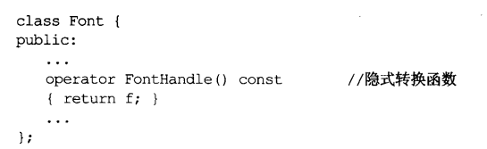
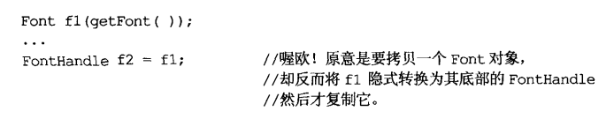
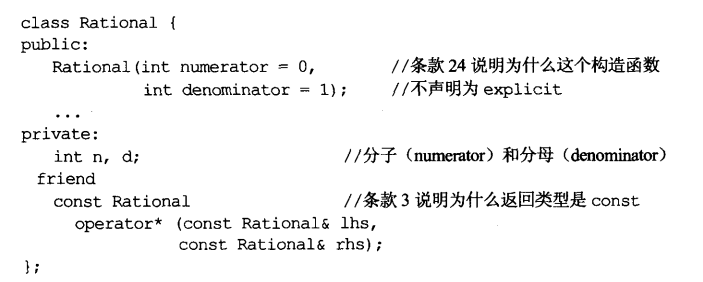
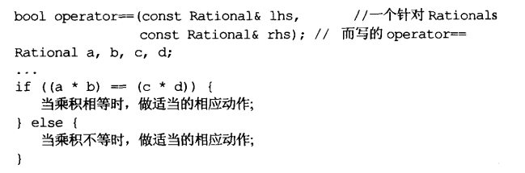

# 条款13	以对象管理资源

- **为防止资源泄漏，请使用RAII（资源取得时便初始化）对象，它们再构造函数中获得资源并在析构函数中释放资源**
- **两个常用的RAII classes是tr1::shared_ptr和auto_ptr。最好别用auto_ptr**

# 条款14	在资源管理类中小心copying行为

条款13的shared_ptr等智能指针不适合作为资源管理类，例如mutex，可以将其函数封装成类

```cpp
void lock(Mutex* pm);
void unlock(Mutex* pm);

class Lock{
public:
	explict Lock(Mutex* pm):mutex(pm){lock(mutex);}
	~Lock(){unlock(mutex)}
private:
	Mutex *mutex;
};
Mutex m;
Lock l1(&m);
Lock l2(l1);//l1复制到l2上，会发生什么？
```

上面的问题可以归类为，**当一个RAII对象被复制，会发生什么？**

有以下两种可能：

1. **禁止复制（常见方法）**

   许多时候允许RAII对象复制并不合理，因此可将其copying声明为private（条款6）
   
2. 对底层资源使用“引用计数法”

   ```cpp
   class Lock{
   public:
   	//unlock作为删除器
   	explict Lock(Mutex* pm):mutex(pm,unlock){lock(mutex.get());}
   	//~Lock(){unlock(mutex)}
   private:
   	std::tr1::shared_ptr<Mutex> mutex;
   };
   ```

3. 复制底部资源（深拷贝）

4. 转移底部资源拥有权


# 条款15	在资源管理类中提供对原始资源的访问

- APIs往往要求访问原始资源，每个RAII class应提供一个取得原始资源的方法，类似JAVA的getter

- 对原始资源访问可能通过显式转换或隐式转换。显式更安全，隐式对用户更方便

  

  ​	

# 条款16	成对使用new和delete时要采取相同形式

- new 时使用[] delete时也用 []

```cpp
typedef std::string AddressLines[4];
std::string* pal = new AddressLines; //等同于 new string[4]

delete [] pal;
```

# 条款17	以独立语句将newed对象置入智能指针

```cpp
processWidget(std::tr1::shared_ptr<Widget>(new Widget),priority());
```

调用过程可能如下：

1. 执行 new Widget
2. 调用priority
3. 调用shared_ptr

如果priority导致异常，new Widget返回的指针可能遗失，因为它尚未置入shared_prt中

**解决方法**：

​	**以单独语句将其放入智能指针**

```cpp
std::tr1::shared_ptr<Widget> pw(new Widget);

processWidget(pw,priority());
```

# 条款18	让接口容易被使用，不易被误用

- **cross-DLL problem**

  对象在DLL中被new创建，却在另一个DLL内被delete销毁，导致运行期错误 

  使用shared_ptr就不会产生此类问题，因为shared_ptr缺省的删除器是来自shared_ptr所诞生的哪个DLL的delete

- 阻止误用接口的办法：

  - 建立新类型
  - 限制类型操作
  - 束缚对象值
  - 消除客户的资源管理责任

# 条款19	设计class犹如设计type

#### 考虑以下问题：

1. **新type对象应如何建立、销毁？**

   构造、析构函数

   内存分配和释放函数：operator new,operator new[],operator delete,operator delete[]

2. **对象的初始化和对象的赋值该有什么差别？**

   不要混淆**初始化**和**赋值**，它们对应不同的函数调用

3. **新type对象如果是值传递，意味着什么？**

   拷贝构造函数用来定义一个type的值传递如何实现

4. **什么是新type的“合法值”？**

   通常只有某些数值集是有效的，它决定了约束条件

5. **新type需要配合某个继承体系吗？**

   需要继承其他类，则可能需要实现其virtual方法

   需要被继承，则虚析构

6. **新type需要什么样的转换？**

   `operator Foo()`转型为Foo类型

7. **什么样的操作符和函数对此新type而言是合理的？**

8. **什么样的标准函数应驳回？**

   应将其声明为private

9. **谁该取用新type的成员？**

   决定哪个成员为public、protected、private

   决定哪个函数或类为友元

10. **什么是新type的“未声明接口”？**

    它对效率、异常安全性以及资源运用（多任务锁定和动态内存）提供何种保证

11. **新type有多么一般化？**

    如果需要定义整个types家族。则不应该定义一个class，而是定义一个class template

# 条款20	宁以pass-by-reference-const替换pass-by-value

- **缺省情况下C++为值传递**
- **但对于内置类型（int、bool等）、STL迭代器、函数对象，pass-by-value更好**
- **同时引用传参可避免slicing（对象切割）问题，一个derived class对象值传递并被视为base class对象时，base class copy构造调用，仅留下一个base class对象**

```cpp
class person{
public:
	person();
	virtual ~person();
private:
	string name;
	string address;
};
class student:public person{
public:
	student();
	~student();
private:
	string schoolName;
	string schoolAddress;
};


bool validateStu(student s);
student s;
bool b = validateStu(s);
```

**上述代码以值传递，导致了student copy构造、person拷贝构造、四次string copy构造等，一共6次构造、6次拷贝**

#### 我们希望回避这些构造、析构，可以使用**pass-by-reference-const**

#### `bool validateStu(const student& s); `

# 条款21	必须返回对象时，别妄想返回其reference

- 绝对不要返回一个pointer或reference指向一个local stack对象或者一个reference指向一个heap-allocated对象，或返回一个pointer或reference指向local static对象，因为可能会产生很多static对象
- 条款4关于单线程环境中local static返回reference提供了一种情况



```cpp
//版本1（stack）
const Rational& operator* (const Rational& lhs,const Rational& rhs){
	Rational res(lhs.n*rhs.n,lhs.d*rhs.d);
	return res;//warning
}
```

**上述代码返回了一个local对象的引用，local对象在函数退出前就被销毁了**

```cpp
//版本2(heap)
const Rational& operator* (const Rational& lhs,const Rational& rhs){
	Rational* res = new Rational(lhs.n*rhs.n,lhs.d*rhs.d);
	return *res;
}
```

上述代码问题在于到底该如何delete，返回的引用和原对象取址指针不同，这样只能对引用取值delete

```cpp
//版本3(定义于内部的static对象)
const Rational& operator* (const Rational& lhs,const Rational& rhs){
	static Rational res;//warning 
	res = ...;
	return res;
}
```

上图可能产生如下情况：



此时a\*b c\*d 各产生一个static对象

### 正确写法：

```cpp
//正确写法，但必须承受构造、析构成本
inline const Rational operator* (const Rational& lhs,const Rational& rhs){
	return Rational(lhs.n*rhs.n,lhs.d*rhs.d);
}
```

