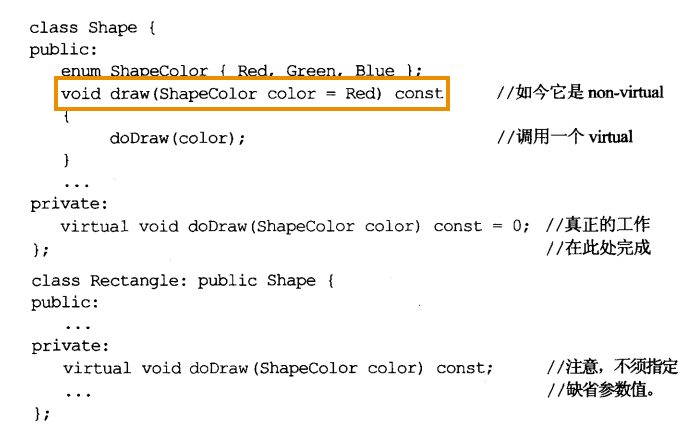

# 条款35	考虑virtual函数以外的其他选择

- **Non-Virtual Interface手法实现Template Method模式**：令客户通过public non-virtual成员函数间接调用private virtual函数，得以在一个virtual函数被调用之前**设定好场景**，并在调用结束之后**清理场景**

  ```cpp
  class A{
  public:
  	void test() const{
  		privateFunc();
  	}
  private:
  	virtual void privateFunc() const{
  		...
  	}
  }
  ```

  

- **藉由Function Pointers实现Strategy模式**：可以由构造函数**接受一个指针**，指向一个提供的函数，例如：

  ```cpp
  class GameCharacter;                               // 前置声明
  int defaultHealthCalc(const GameCharacter& gc);    //缺省函数
  class GameChaaracter{
  public:
      typedef int(*HealthCalcFunc)(const GameCharacter&);
      explicit GameCharacter(HealthCalcFunc hcf=defaultHealthCalc)
          :healthFunc(hcf)
      {}
      int healthValue()const
      { return healthFunc(*this); }
      ...
  private:
          HealthCalcFunc healthFunc;           //函数指针
  };
  ```

- **藉由tr1::function完成Strategy模式**：改用一个类型为**tr1::function**的对象，这样的对象可以保存**任何可调用物**（callable entity，即函数指针、函数对象、成员函数指针），只要其签名式兼容于需求端，typedef语句修改为：

  ```cpp
  typedef std::tr1::function<int (const GameCharacter&)> HealthCalcFunc;
  ```

- **古典的Strategy模式**：将继承体系内的virtual函数替换为另一个继承体系内的virtual函数，如下：

  ```cpp
  class GameCharacter;//forward declaration
  class HealthCalcFunc{
  public:
      ……
      virtual int calc(const GameCharacter& gc) const
      { …… }
      ……
  };
  
  HealthCalcFunc defaultHealthCalc;
  class GameCharacter{
  public:
      explicit GameCharacter(HealthCalcFunc* phcf=&defaultHealthCalc)
      :pHealthCalc(phcf)
      {}
      int healthValue() const
      { return pHealthClac->calc(*this); }
      ……
  private:
      HealthCalcFunc* pHealthCalc;
  };
  ```

# 条款36	绝不重新定义继承而来的non-virtual函数

- non-virtual函数是**静态绑定**的，virtual函数是**动态绑定**的


# 条款37	绝不重新定义继承而来的缺省参数值

**virtual函数是动态绑定，而缺省参数值是静态绑定**

```cpp
class shape{
public:
	enum shapeColor{RED,GREEN,BLUE};
	virtual void draw(shapeColor color = RED) const = 0;
	...
};
class Rectangle: public shape{
public:
	//注意，赋予不同的缺省参数，不好！
	virtual void draw(shapeColor color = GREEN) const;
	...
};
class Circle:public shape{
public:
    virtual void draw(shapeColor color) const;
    //注意，用对象调用此函数时，一定要指定参数值
    //	因为静态绑定这个函数并不从其base继承缺省参数值
    //用pointer或reference调用则可以不指定参数值
    //	因为动态绑定这个函数会从base继承缺省参数值
};
```

```cpp
shape* ps;
shape* pc = new Circle;
shape* pr = new Rectangle;

ps = pc;//ps动态类型为Circle*
ps = pr;//ps动态类型为Rectangle*

pc->draw(shape::RED);//Circle::draw(shape::RED)
pr->draw(shape::RED);//Rectangle::draw(shape::RED)

pr->draw()//Rectangle::draw(shape::RED)
//pr动态类型Rectangle* 调用Rectangle virtual函数，但由于pr静态类型shape*，所以调用缺省参数值来自shape class而非Rectangle class
```

- 为了运行期效率，c++坚持缺省参数值为**静态绑定**，防止运行期复杂的决定

- 使用**NVI手法**（令public non-virtual函数调用private virtual函数）可以防止缺省参数值被重新定义



# 条款38	通过复合塑模处has-a或“根据某物实现出”

- **复合：当某种类型对象内含它种类型的对象**
- 当复合发生于**应用域**内的对象之间，表现**has-a**的关系；当它发生于**实现域**内则是表现**is-implemented-in-terms-of**的关系

- 复合的意义和public继承完全不同，public继承为is-a，复合为has-a


# 条款39	明智而审慎地使用private继承

- **private继承规则：**

  - **编译器不会自动将一个derived class对象转换为一个base class对象，不是is-a**
  - **所有成员都会变成private属性**

- 尽可能使用复合，必要时使用private继承

  何时使用？当protected成员或virtual函数牵扯进来的时候

- **private继承可以造成empty base最优化(EBO)**

  ```CPP
  class empty{};
  class A{
  private:
  	int x;
  	empty e;
  };
  class B:private empty{
  private:
  	int x;
  };
  sizeof(A)>sizeof(int);
  sizeof(B)==sizeof(int);
  sizeof(empty)==1;
  ```