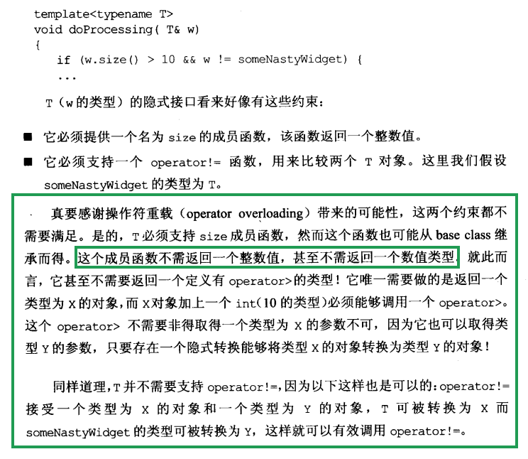
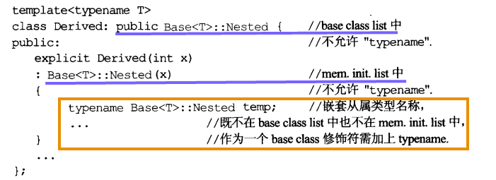

# 条款40	明智而审慎地使用多重继承

- 多重继承可能从多个base class继承相同名称，

  ```cpp
  
  class A{
  	void check();
  };
  class B{
   	void check();
  };
  class C:public A,public B{
  	...
  };
  C c;
  c.check();//歧义
  c.A::check();//明确指出哪个base class
  c.B::check();
  ```

- **也可能导致要命的“菱形继承”（base class被多次构造，可以使用virtual继承解决）**

  ```cpp
  class File{...};
  class InputFile:public File{...};
  class OutputFile:public File{...};
  class IOFile:public InputFile,public OutputFile{...};
  ```

  **如果这样则导致IOFile继承两份File的内容**

  ```cpp
  class InputFile:virtual public File{...};
  class OutputFile:virtual public File{...};
  ```

- 使用virtual继承导致对象体积大，访问成员变量速度慢等问题；因此，非必要不要使用virtual bases，如果要使用，尽可能避免在其中放置数据（相当于对virtual继承）

- **虚基类的初始化要由most derived class负责**

- 多重继承的一个正当用途是“复合+继承”技术，单一继承更受欢迎

- **多重继承一种合理实现：public继承某接口，private继承某实现**

# 条款41	了解隐式接口和编译期多态

- **classe和template都支持接口和多态**
- **对class而言接口是显式的，由函数签名式构成；多态是通过virtual函数发生于运行期**
- **对template而言接口是隐式的，由有效表达式组成；多态是通过template具现化和函数重载解析发生于编译期**



# 条款42	了解typename的双重意义

- 声明template参数时，前缀关键字class和typename可以互换

- 使用typename标识嵌套从属类型名称（如果编译器在template中遭遇一个嵌套从属名称，它便假设这名称不是个类型），但是不得在base class lists或member initialization list内作为base class修饰符

  

- C::const_iterator可能是一个对象或一个类型

  告诉编译器C::const_iterator为一个类型，`typename C::const_iterator `即可

  或者typedef	`typedef typename C::const_iterator cit `

# 条款43	学习处理模板化基类内的名称

- **可在derived class templates内通过“this->”指涉base class template内成员的名称，或通过明白写出的"base class资格修饰符"完成**
- **base class template可能被特化，而特化版本可能提供不同的接口，导致编译器往往拒绝模板化基类内寻找继承而来的名称** 

```cpp
class CompanyA{
public:
	void sendClearText(const std::string &msg){std::cout<<"A"<<std::endl;}
	void sendSecretText(const std::string &msg);
};
class CompanyB{
public:
	void sendClearText(const std::string &msg){std::cout<<"B"<<std::endl;}
	void sendSecretText(const std::string &msg);
};

class MsgInfo{};

template<class Company>
class MsgSender{
public:
	void sendClear(const MsgInfo& info){
		std::string msg;
		Company c;
		c.sendClearText(msg);
	}
	//类似sendClear，只是调用c.sendSecretText
	void sendSecret(const MsgInfo& info){...}

};
```

使用模板

#### *base class template可能被特化，而特化版本可能提供不同的接口。、

#### *因此编译器往往拒绝模板化基类（下例的MsgSender\<Company\>）内寻找继承而来的名称 

```cpp
template<class Company>
class LoggingMsgSender:public MsgSender<Company>{
public:
	
	void sendClearMsg(const MsgInfo& info){
		...
		sendClear(info);//调用base class函数，无法通过编译，因为
		...
	}
};

//因为class template LoggingMsgSender并不知道自己继承的是什么样的class
//无法确定继承的类种是否有sendClear函数，如下所示
//如果LoggingMsgSender继承的是MsgSender<CompanyZ>，CompanyZ没有sendClearText函数，MsgSender的全特化也没有sendClear
class CompanyZ{
public:
	//void sendClearText(const std::string &msg);
	void sendSecretText(const std::string &msg){
		std::cout<<"C Secret"<<std::endl;}
};
//MsgSender的CompanyZ全特化版本，没有sendClear
template<>
class MsgSender<CompanyZ>{
public:
	void sendSecret(const MsgInfo& info){
		std::string msg;
		CompanyZ c;
		c.sendSecretText(msg);
	}
};
```

### 解决方法：

```cpp
template<class Company>
class LoggingMsgSender:public MsgSender<Company>{
public:
	//using MsgSender<Company>::sendClear;
	void sendClearMsg(const MsgInfo& info){
        ...
		//法一：使用this->，假设sendClear将被继承
		//this->sendClear(info);
		//法二：using声明，将被掩盖的base class名称带入derived作用域
		//sendClear(info);
		//法三指出被调用的函数位于base class内
		MsgSender<Company>::sendClear(info);
		...
    }
};
```

```cpp
#include <string>
#include <iostream>
class CompanyA{
public:
	void sendClearText(const std::string &msg){std::cout<<"A"<<std::endl;}
	void sendSecretText(const std::string &msg);
};
class CompanyB{
public:
	void sendClearText(const std::string &msg){std::cout<<"B"<<std::endl;}
	void sendSecretText(const std::string &msg);
};
class CompanyZ{
public:
	//void sendClearText(const std::string &msg);
	void sendSecretText(const std::string &msg){
		std::cout<<"C Secret"<<std::endl;}
};
class MsgInfo{};

template<class Company>
class MsgSender{
public:
	void sendClear(const MsgInfo& info){
		std::string msg;
		Company c;
		c.sendClearText(msg);
	}
	void sendSecret(const MsgInfo& info){}

};

//MsgSender的CompanyZ全特化版本，没有sendClear
template<>
class MsgSender<CompanyZ>{
public:
	void sendSecret(const MsgInfo& info){
		std::string msg;
		CompanyZ c;
		c.sendSecretText(msg);
	}
};

template<class Company>
class LoggingMsgSender:public MsgSender<Company>{
public:
	//using MsgSender<Company>::sendClear;
	void sendClearMsg(const MsgInfo& info){
		//法一：使用this->
		//this->sendClear(info);
		//法二：using声明
		//sendClear(info);
		//法三指出被调用的函数位于base class内
		MsgSender<Company>::sendClear(info);
	}
};

int main(){
	//MsgSender<CompanyA> ms;
	//ms.sendClear(*new MsgInfo);
	MsgSender<CompanyZ> ms;
	ms.sendSecret(*new MsgInfo);
	std::cout<<"123"<<std::endl;
	return 0;
}
```

