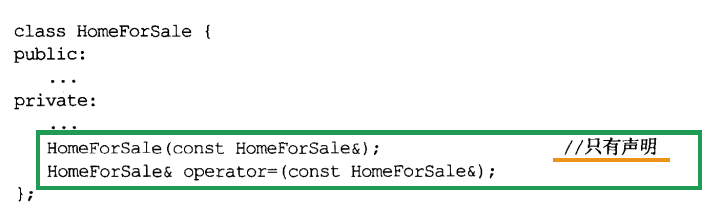
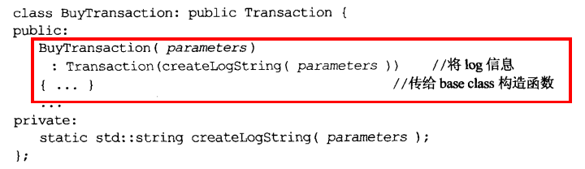
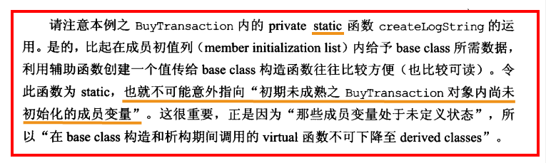
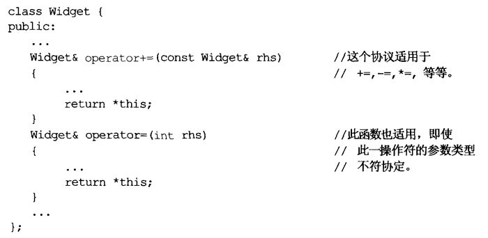
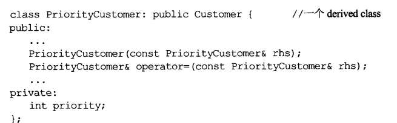
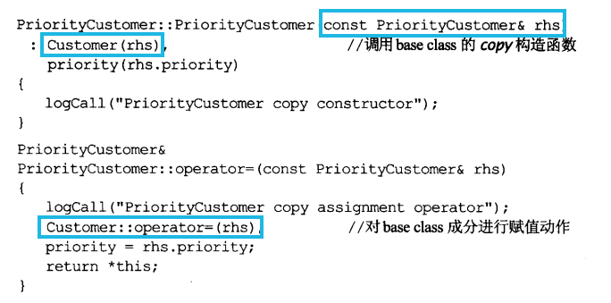

# 条款05	了解C++默默编写调用哪些函数

**声明了一个构造函数，编译器就不会再为它创建默认构造**

```cpp
#include <string>
#include <iostream>
using namespace std;
template <class T>
class A
{
public:
    A(std::string &name, const T &val) : name(name), obj(val) {}
    void print()
    {
        cout << "name:" << name << "\nT:" << obj << endl;
    }
    A &operator=(const A a)
    {
        this->name = a.name;
        return *this;
    }

private:
    std::string &name;
    const T obj;
};

int main()
{
    std::string a("123");
    std::string b("abc");
    A<int> p(a, 2);
    A<int> s(b, 3);
    p.print();
    s.print();
    (p = s).print();
    p.print();
    s.print();
}
```

**编译器会报错，因为如果你想在内含引用成员的class内支持赋值操作，必须自己定义一个copy 赋值操作符**

**内含const成员的class编译器反应也一样，因为更改const成员不合法**

**如果某个base classes将copy赋值操作符声明为private，编译器将拒绝为其derived classes生成一个copy 赋值操作符**

# 条款06	若不想使用编译器自动生成的函数，就该明确拒绝

**所有编译器产生的函数都是public，为阻止这些函数被创建，需要自行声明**

## 1、**可将其声明为private，可以阻止其被调用**

上述做法不是绝对安全，因为成员函数和friend函数还可以调用private函数。因此可以**将private处只声明而不实现**。



## 2、若不想被拷贝，还可专门设计一个阻止拷贝的base class

```cpp
class Uncopyable{
protected:
	Uncopyable(){}
	~Uncopyable(){}
private:
	Uncopyable(const Uncopyable&);	//阻止copying
	Uncopyable& operator=(const Uncopyable&);
};

class HomeForSale:private Uncopyable{
	...
};
```

当尝试拷贝HomeForSale对象，编译器会尝试调用base class的对应函数，而那些函数无法被调用，因为是private

# 条款07	为多态基类声明virtual析构函数

- **当class内至少含有一个virtual函数，才为其声明virtual析构函数**
- **polymorphic（多态性质的）base class应该声明一个虚析构**
- **class设计目的不是作为base class，或不是为了具备多态性，就不该声明虚析构**

```cpp
class Base{
	Base();
	//virtual ~Base();
	~Base();
    ...
};
class Derived{
	Derived();
	~Derived();
	...
};

Base *pb=new Derived();
delete pb;//通过base指针指向derived,而base只有一个non-virtual析构，这导致实际执行时derived的成分没有销毁
```

解决方法：基类为虚析构****

**如果class不含virtual函数，通常表示它并不打算作为一个base class。**

例如：

```cpp
class specialString:public std::string{//bad std::string没有虚析构！
    ...
};
specialString *pss=new specialString("123");
std::string* ps;
ps = pss;
delete ps; //未定义，*ps的specialString会泄露，因为specialString析构未被调用
```

**同上，STL容器等都不带虚析构**

**不打算作为base class的函数，析构往往不需要virtual，因为会附加vptr，增加对象体积**


***pure virtual会导致该类抽象类，但如果你需要一个抽象class，但没有任何pure virtual函数，可以***

```
class A{
public:
	vitual ~A() = 0;	//声明
}
A::~A(){}//纯虚析构定义
```

# 条款08	别让异常逃离析构函数

C++并不禁止析构函数抛出异常，但最好别这样

```cpp
class DBConnection{
public:
	...
	static DBConnection create();  //返回一个DBConnection对象
	
	void close(); 					//关闭；失败则抛出异常
};
//为确保客户不忘记调用DBConnection的close(),创建一个DBConn类来管理它
class DBConn{
public:
	...
	~DBConn(){			//确保数据库连接总会关闭
		db.close();
	}
private:
	DBConnection db;
};


//此时就可能产生以下代码
{
DBConn dbc(DBConnection::create());//创建DBConnection对象并交给DBConn管理
									//结束时自动销毁调用close()
}
```

看上去还好，但是万一调用异常，DBConn析构也会抛出该异常

***两个办法可避免以上问题***

1. 如果close抛出异常就结束程序。通常调用abort完成

   ```cpp
   DBConn::~DBConn(){
   	try{
   		db.close();
   	}catch(...){
   		...
   		std::abort();
   	}
   }
   ```

2. 吞下因调用close产生的异常

   ```
   DBConn::~DBConn(){
   	try{
   		db.close();
   	}catch(...){
   		...
   	}
   }
   ```

但以上两个方法都无法对“导致close抛出异常”的情况做出反应


较佳策略：重新设计DBConn接口，使用户能有机会对可能出现的问题做出反应

```cpp
class DBConn{
public:
	...
	~DBConn(){			//确保数据库连接总会关闭
		if(!closed){	//如果已关闭无需再关闭
            try{
                db.close();
            }catch(...){
                ...
            }
        }
	}
    void close(){		//供用户使用
        db.close();
        closed=true;
    }
private:
	DBConnection db;
	bool closed;
};
```

# 条款09	绝不再构造和析构过程中调用virtual函数

**再derived class对象的base class构造期间，对象类型时base而不是derived**

**对象在derived class构造函数开始执行前不会成为一个derived class对象**

**若在其中调用virtual函数，调用的函数可能与期望不符，因为这类调用不下降至derived class**





# 条款10	令operator=返回一个reference to *this

**为了连锁赋值**



# 条款11	再operator=中处理自我赋值

自我赋值发生在对象被赋值给自己时：

```cpp
class Widget{
    ...
private:
    Bitmap *pb;
};
Widget w;
...
w = w;

//not safe
//如果自我赋值则会删除自己的pb指针
Widget& Widget::operator=(const Widget& rhs){
    delete pb;
    pb = new Bitmap(*rhs.pb);
    return *this;
}
```

**因此要处理自我赋值**

```cpp
//版本1
Widget& Widget::operator=(const Widget& rhs){
 	if(this == rhs) return *this; //处理自我赋值的情况（证同测试）
    delete pb;
    pb = new Bitmap(*rhs.pb);//此处发生异常则this持有的指针pb无效
    return *this;
}
//版本2
Widget& Widget::operator=(const Widget& rhs){
 	Bitmap* temp=pb;	//保存原先的pb
    pb = new Bitmap(*rhs.pb);	//pb指向一个副本 此时抛出异常pb也能保持原状
 	delete temp;	//删除原先的pb
    return *this;
}

```

## **使用copy and swap技术**

可以保证代码**异常安全**和**自我赋值安全**

```cpp
class Widget{
    ...
    void swap(Widget& rhs); //交换*this和rhs数据，见条款29
private:
    Bitmap *pb;
};
//版本3
Widget& Widget::operator=(const Widget& rhs){
 	Widget temp(rhs);
 	swap(temp);
 	return *this;
}
//版本4（不推荐）
Widget& Widget::operator=(Widget rhs){//注意这里是传值，将拷贝动作从函数体内移至“函数参数构造阶段”，有时可能更高效
 	swap(rhs);	//*this和rhs数据互换
 	return *this;
}
```

# 条款12	复制对象时勿忘每一个**成分**

- **当你编写一个copying函数，确保：**
  1. **复制所有local成员变量**
  2. **调用所有base classes内适当的copying函数**
- **copy 赋值操作符调用copy构造函数不合理，相反也不合理,如果二者有重复代码，可以建立一个新private函数让它们调用，从而消除代码重复**



