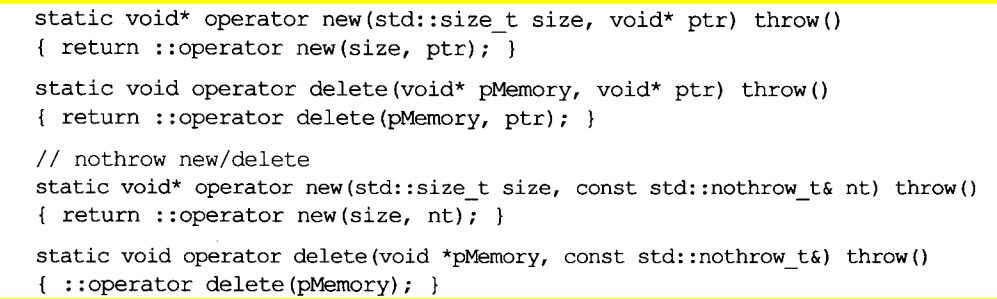

# 条款51	编写new和delete时需固守常规

- operator new应该内含一个无限循环，并在其中尝试分配内存，如果它无法满足内存需求，就该调用new-handler。它也应该有能力处理0 bytes申请。class专属版本则还应该处理“比正确大小更大的（错误）申请”

  ```cpp
  void *operator new(std::size_t size) throw(std::bad_alloc){
      using namespace std;
      size = size == 0 ? 1 : size;
  	while(true){
          void* mem = malloc(size);
          if(mem) return mem;
          new_handler h = set_new_handler(nullptr);//获得原来的new_handler
          set_new_handler(h);
          if(h)
              (*h)();
          else throw std::bad_alloc();
      }
  }
  ```

- derived class继承base class，如果自己不声明operator new

  ```cpp
  class base{
  public:
  	static void* operator new(std::size_t size) throw(std::bad_alloc);
  	...
  };
  class derived{//没声明operator new
  	...
  };
  derived* d = new derived;//调用的是 base::operator new
  
  ```

  **处理此情况最佳做法是将“内存申请量错误”的调用行为改为标准operator new**

  ```
  void* base::operator new(std::size_t size)throw(std::bad_alloc){
  	if(size != sizeof(base))	//如果是子类，则调用全局new
  		return ::operator new(size);
  	else
  		...
  }
  ```

  

- operator delete应该在收到null指针时不做任何事。class专属版本则还应该处理“比正确大小更大的（错误）申请”（如果大小错误，调用标准版本的operator new和delete）

  ```cpp
  void operator delete(void* mem)throw(){
  	if(!mem) return;//如果是null则什么都不做
      else
          归还内存...
  }
  ```

  ```cpp
  class base{
  public:
  	static void* operator new(std::size_t size) throw(std::bad_alloc);
  	static void operator delete(void* mem) throw();
  	...
  };
  class derived{//没声明operator new
  	...
  };
  void base::operator delete(void* mem) throw(){
      if(!mem) return;
      if(size != sizeof(base)){
          ::operator delete(mem);
      	return
      }
      归还内存
      return; 	   
  }
  ```

  ### 如果被删除的对象派生自某个没有virtual 析构的base class，则c++传给operator delete的size不正确，导致无法运作


# 条款52	写了placement new也要写placement delete

- #### new表达式先后调用**operator new**和**default构造函数**

  ```cpp
  A* a = new A;
  ```

- #### placemet delete只有在“伴随placement new调用而触发的构造函数”出现异常时才会调用，一般调用delete只是调用正常形式的

- #### 成员函数的名称会掩盖其外围作用域中的相同名称，假如只声明一个placement new，则无法使用正常形式的new

- #### derived class的operator new会掩盖global版本和继承的operator new

- #### 要对每个可用的operator new提供相应的operator delete

  

# 条款53	不要轻忽编译器的警告

# 条款54	让自己熟悉包括TR1在内的标准程序库

# 条款55	让自己熟悉Boost