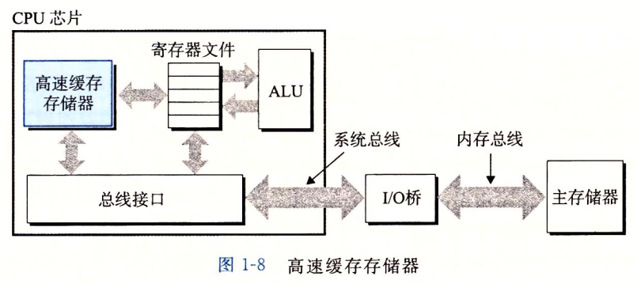
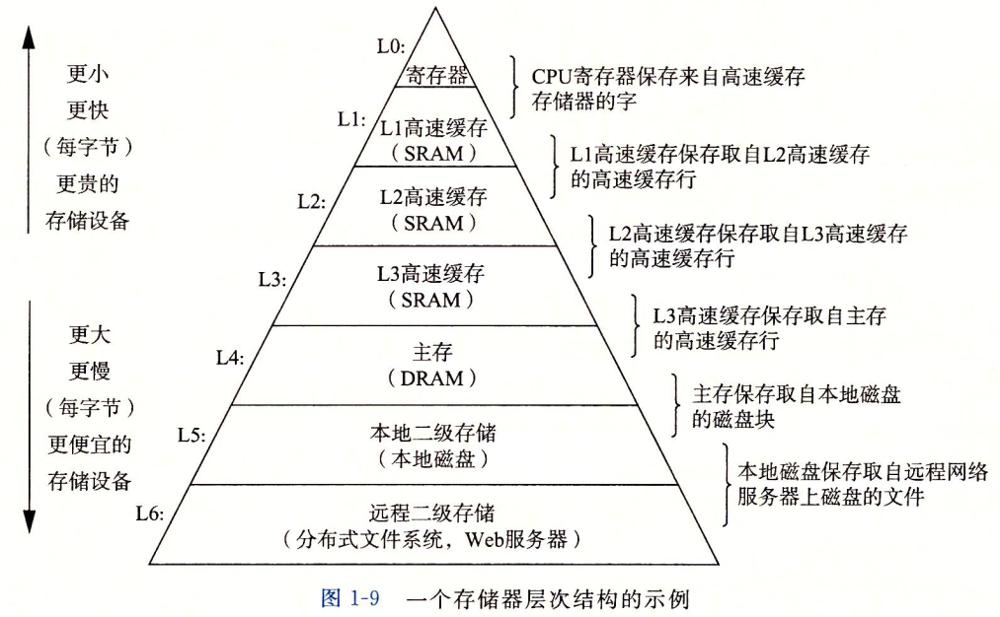
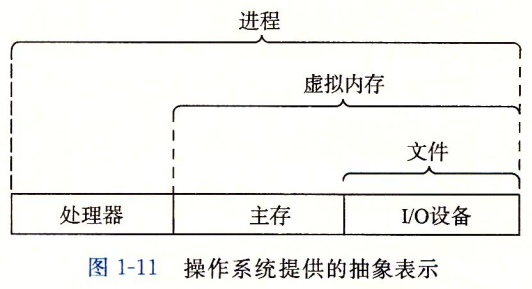
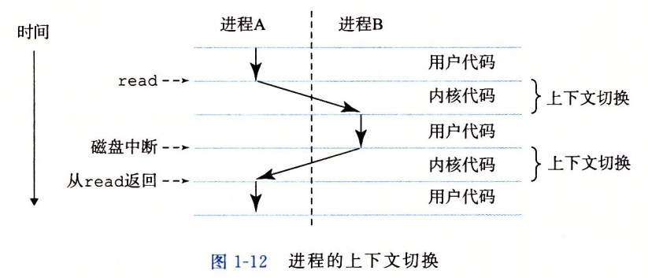
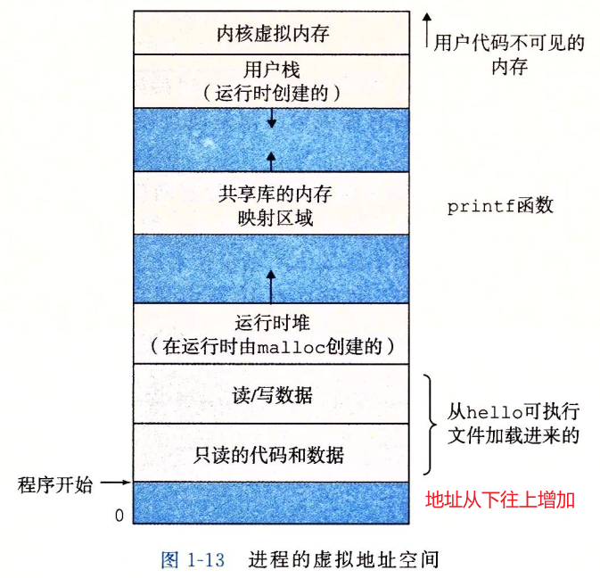
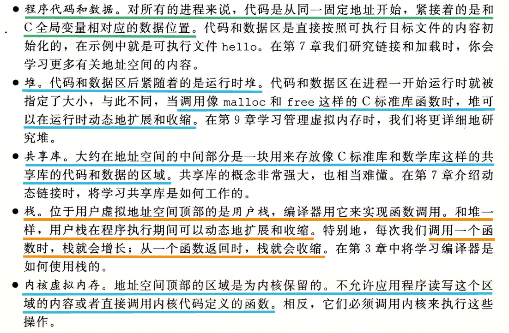
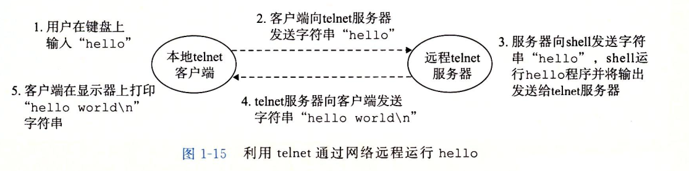
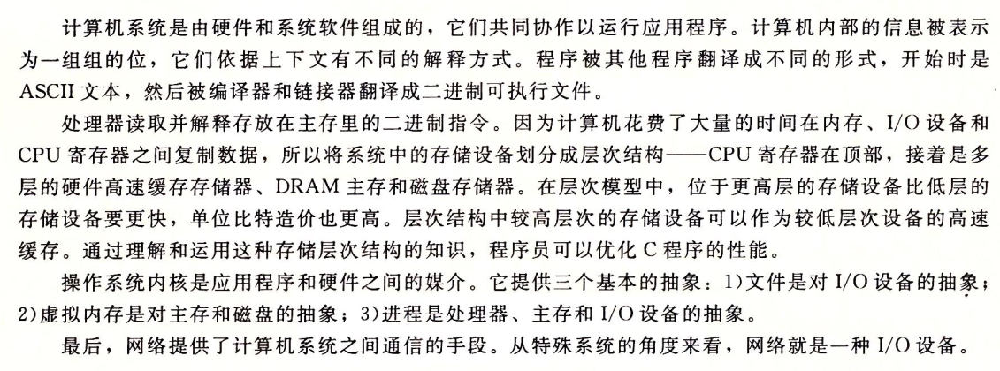

### 高速缓存至关重要

系统花费大量事件把信息从一个地方移到另一个地方。如hello程序的机器指令最初在磁盘，程序加载时放到主存中，运行时又从主存复制到处理器。"hello,world\n"最初在磁盘，后来被复制到主存，最终到显式设备上。

**从磁盘驱动器读取一个字的时间开销要比从主存中读取开销大得多**

针对这种处理器与主存之间的差异，系统设计者采用更小更快的存储设备，称为**高速缓存存储器(cache memory)**作为暂时的集结领域，**存放近期可能需要的信息**

大部分内存操作都可以在高速缓存中完成

### 存储设备形成层次结构

处理器和一个较大的慢速设备之间插入一个更小更快的设备已成为普遍的观念

### 操作系统管理硬件

操作系统有两个基本功能

- 防止硬件被失控的应用程序滥用
- 向应用程序提供简单一致的机制来控制复杂而又通常大不相同的低级硬件设备

操作系统通过几个基本的抽象概念（进程、虚拟内存和文件）来实现这两个功能

#### 进程

进程是操作系统对一个正在运行的程序的一种抽象

操作系统保持跟踪**进程运行所需的所有状态信息**，这种状态，也就是**上下文**，如PC和寄存器文件的当前值，以及主存的内容

**当操作系统决定将控制权从当前进程转移到某个新进程时**，就会进行**上下文切换**

##### hello shell上下文交换

两个并发进程shell和hello，开始时只有shell进程运行，等待命令行输入。当我们请求它允许hello程序时，shell通过调用一个专门的函数，即**系统调用**来执行我们的请求，系统调用会将控制权传给操作系统，操作系统保存shell进程的上下文，再创建一个新的hello进程及其上下文，然后将控制权交给hello进程。hello进程终止后，操作系统恢复shell进程上下文，控制权再传回给shell，shell进程就会等待下一个命令行输入

#### 线程

一个进程实际上可以由多个线程，每个线程是一个执行单元

#### 虚拟内存

一个抽象概念，它**为每个进程提供一个假象，即每个内存都在独占地使用主存**，每个进程看到的内存都是一样的，称为**虚拟地址空间**

linux中，地址空间最上面区域保留给操作系统的代码和数据

底部区域存放用户进程定义的代码和数据

#### 文件

文件就是字节序列，每个I/O设备都可以看作文件

### 系统之间进行网络通信

### 小结

