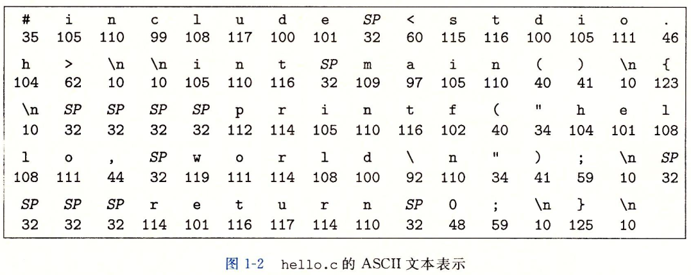
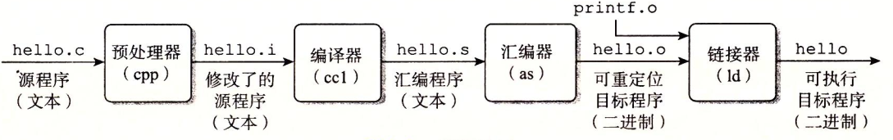
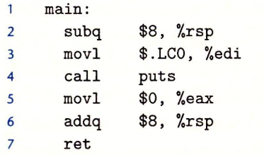
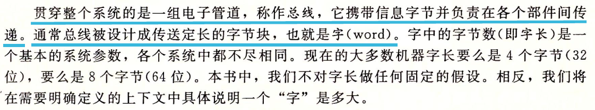
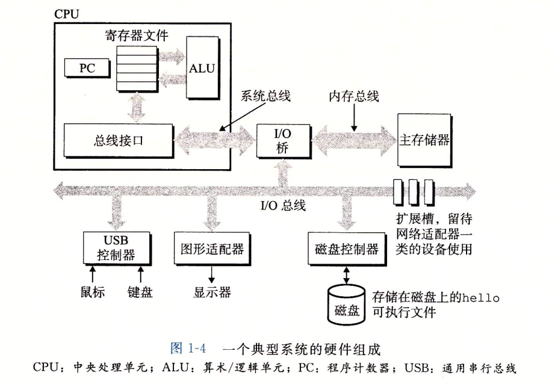
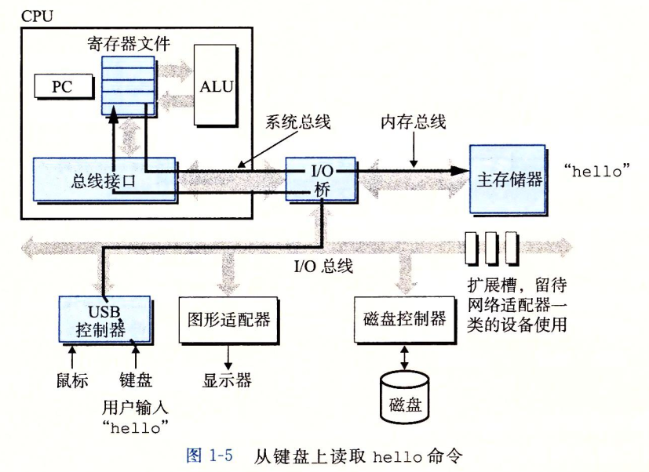
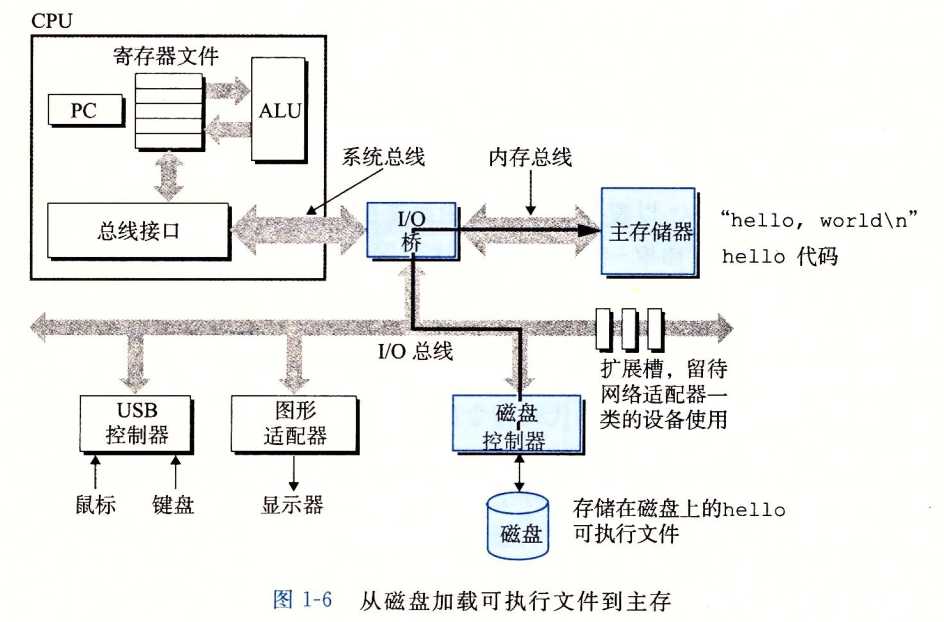
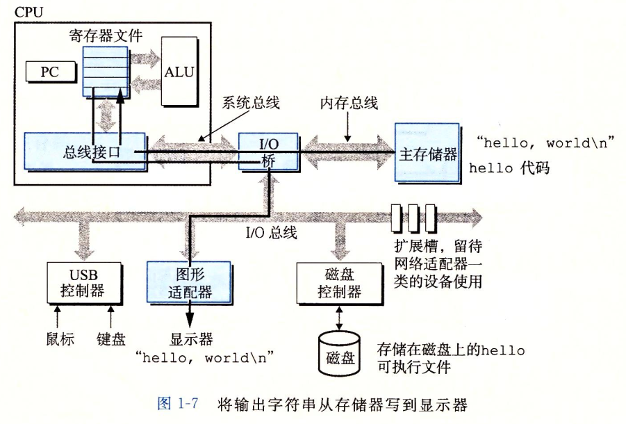

## hello.c流程

```c
#include <stdio.h>

int main() {
	printf("hello,world\n");
	return 0;
}
```



hello.c这种只由ASCII字符构成的文件称为文本文件，所有其他的文件称为二进制文件

### 编译系统阶段

```bash
$ gcc -o hello hello.c
```

这里GCC编译器驱动程序读取源程序文件hello.c，并将其翻译成一个可执行文件hello，其中**预处理器、编译器、汇编器、链接器共同构成了编译系统**



1. 预处理阶段

   预处理器(cpp)根据以字符#开头的命令，修改原始C程序，最终得到另一个C程序，通常以`.i`作为文件扩展名

2. 编译阶段

   编译器(ccl)将文本文件`hello.i`翻译成文本文件`hello.s`，它包含一个汇编语言程序，该程序包含函数main的定义，如下图：

   

3. 汇编阶段

   汇编器(as)将`hello.s`翻译成机器语言指令，将这些指令打包成一种叫做**可重定位目标程序**的格式，将结果保存在目标文件`hello.o`文件中，`hello.o`是一个二进制文件

4. 链接阶段

   调用了printf函数，函数位于一个名为printf.o的单独的预编译好了的目标文件中，而这个文件必须以某种方式合并到`hello.o`程序中。链接器(ld)就负责处理这种合并。最终得到`hello`文件，是一个**可执行目标文件**


### 处理器读并解释储存在内存中的指令

此时hello可执行目标文件以生成，并存放在磁盘上，想要运行，应在shell的应用程序中

```bash
$ ./hello
hello,world
```

#### 系统硬件组成

1. 总线

   

2. I/O设备

   系统与外部的联系通道，如键盘、鼠标、显示器、磁盘驱动器等

   最开始hello就存放在磁盘上

   每个I/O设备都通过一个控制器或适配器与I/O总线相连

   

3. 主存

   **临时存储**设备，**处理器执行程序时，存放程序和程序的数据**

4. 处理器CPU

   解释（或执行）存储在主存中指令的引擎

   处理器核心是**一个大小为一个字的存储设备（或寄存器）**，称为**程序计数器(PC)**，**任何时候PC都指向主存中某条机器语言指令**

   处理器不断地执行PC指向的指令，**读取指向内存处的指令，解释指令中的位，执行该指令，更新PC使其指向下一条指令**

#### 运行hello程序

- 首先我们在shell中输入了`./hello`，**shell程序将字符逐一读入寄存器，再将其放入内存中**

  

- 键盘上敲回车时，shell直到我们已经结束了输入的指令。**shell会执行一系列指令来加载可执行文件hello，这些指令将hello目标文件中代码和数据从磁盘复制到主存**。数据包括最终输出的`"hello,world\n"`

  

- 加载到主存后，**处理器开始执行hello程序的main程序中的及其语言指令。这些指令将`"hello,world\n"`字符串从主存复制到寄存器文件，再从寄存器文件中复制到显示设备上，最终显示在屏幕上**

  

