## 链接

### 编译器驱动程序

```c
// main.c
int sum(int *a, int n);
int array[2] = {1, 2};

int main() {
    int val = sum(array,2);
    return 0;
}
```

```c
int sum(int *a, int n) {
	int i,s = 0;
	for(int i = 0; i < n; ++i) {
	 	s += a[i];
	}
	return s;
}
```

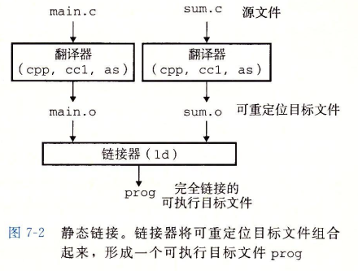

进行`gcc -Og -o prog main.c sum.c`流程如下

1. 运行C预处理器(cpp)将C源程序`main.c`翻译成一个ASCII码的中间文件`main.i`

   `cpp [other arguments] main.c /tmp/main.i`

2. 运行C编译器(cc1)将`main.i`翻译成一个ASCII汇编语言文件`main.s`

   `cc1 /tmp/main.i - Og [other arguments] -o /tmp/main.s`

3. 运行汇编器(as)将`main.s`翻译成一个可重定位目标文件`main.o`

   `as [other arguments] -o /tmp/main.o /tmp/main.s`

   同样流程形成`sum.o`

4. 最后运行链接器程序ld，将main.o和sum.o以及一些必要的系统目标文件组合起来，创建一个**可执行目标文件**prog

   `ld -o prog [system object files and args] /tmp/main.o /tmp/sum.o`


### 静态链接

链接器必须完成两个主要任务

- 符号解析

  目标文件定义和引用符号，每个符号对应一个函数、一个全局变量或一个静态变量，符号解析目的在于将每个符号引用正好和一个符号定义相关联

- 重定位

  编译器和汇编器生成从地址0开始的代码和数据节。链接器通过把每个符号定义与一个内存位置关联起来，从而重定位这些节，修改所有对于这些符号的引用，使其指向对应的内存位置


### 目标文件

#### 三种形式

- 可重定位目标文件

  包含二进制代码和数据，其形式可以在编译时与其他可重定位目标文件合并，创建一个可执行目标文件

- 可执行目标文件

  包含二进制代码和数据，其形式可以被直接复制到内存并指向

- 共享目标文件

  一种特殊类型的可重定位目标文件，可在加载或者运行时被动态地加载进内存并链接

##### 编译器和汇编器生成可重定位目标文件(包括共享目标文件)

##### 链接器生成可执行目标文件


### 可重定位目标文件

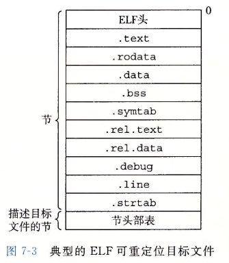

- **.text：已编译程序的机器代码**
- **.rodata：只读数据**
- **.data：已初始化的全局和静态C变量**
- **.bss：未初始化的全局和静态C变量**
- .symtab：一个符号表，存放程序中定义和引用的函数和全局变量的信息
- .rel.text：一个.text节中位置的列表，链接器把这个目标文件和其他文件组合时，需修改这些位置
- .rel.data：被模块引用或定义的所有全局变量的重定位信息
- .debug：一个调试符号表，条目是程序中定义的局部变量和类型定义，程序中定义和引用的全局变量以及原始的C源文件
- .line：原始C源程序中的行号和.text节中机器指令之间的映射
- .strtab：一个字符串表，内容包括.symtab和.debug节中的符号表，以及节头部中的节名字


### 符号和符号表

每个可重定位目标模块m都有一个符号表，包含m定义和引用的符号的信息

三种不同的符号：

- 模块m定义并能被其他模块引用的全局符号，对应非静态C函数和全局变量
- 由其他模块定义并被模块m引用的全局符号(外部符号)，对应其他模块中定义的非静态C函数和全局变量
- 只被模块m定义和引用的局部符号，对应static属性的C函数和全局变量

带有C static属性的本地过程变量是不在栈中管理的，编译器在.data或.bss中为每个定义分配空间，并在符号表中创建一个唯一名字的本地链接器符号。如下

```c
int f() {
	static int x = 0;
	return x;
}
int g() {
	static int x = 1;
	return x;
}
```

以上情况，编译器向汇编器输出两个不同名字的局部链接器符号。例如x.1表示f的，x.2表示g的

**利用static属性隐藏变量和函数名字，就像java的public和private声明一样，任何带有static属性声明的全局变量或函数都是模块私有的**


### 符号解析

**链接器解析符号引用是将每个引用与它输入的可重定位目标文件的符号表中的一个确定符号定义关联起来**

#### 链接器如何解析多重定义的全局符号

编译时，编译器向汇编器输出每个全局符号，或者是强或者是弱，汇编器把这个信息隐含地编码在可重定位目标文件的符号表里

##### 函数和已初始化的全局变量是强符号，未初始化的全局变量是弱符号

> linux链接器使用以下规则处理多重定义的符号名：
>
> 1. 不允许有多个同名强符号
> 2. 如果有一个强符号和多个弱符号同名，选择强符号
> 3. 如果有多个弱符号同名，任选一个

```c
// foo1.c
int main() {
	return 0;
}
// bar1.c
int main() {
	return 0;
}
```

例如编译上面的foo1.c bar1.c，由于**强符号main被定义多次，则产生错误**

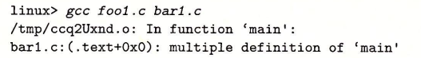

```c
// foo2.c
int x = 11111;
int main() {
	return 0;
}
// bar2.c
int x = 11111;
void f() {

}
```

对于foo2.c bar2.c也会报错，因为**强符号x被定义了两次**

```c
// foo3.c
#include <stdio.h>
void f(void);

int x = 11111;

int main() {
    f();
    printf("x = %d\n",x);
	return 0;
}
// bar3.c
int x;
void f() {
	x = 11112;
}
```

bar3.c中x未被初始化，则链接器会选择另一个模块中定义的强符号

```c
// foo4.c
#include <stdio.h>
void f(void);

int x;

int main() {
    x = 11111;
    f();
    printf("x = %d\n",x);
	return 0;
}
// bar4.c
int x;
void f() {
	x = 11112;
}
```

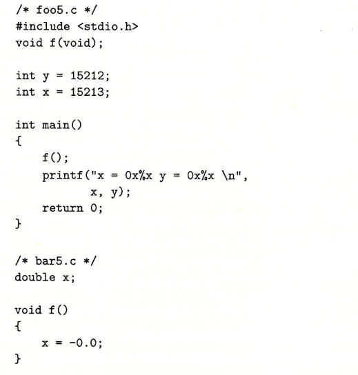

x在两个模块中定义不一样，一个int一个double，x86-64上double 8字节，int 4字节，x = -0.0会用负0的双精度浮点表示覆盖内存x和y的位置

#### 与静态库链接

编译系统提供一种机制，将所有相关目标模块打包成一个单独文件，成为静态库(static library)，链接器构造一个输出的可执行文件时，只复制静态库里被应用程序引用的目标模块

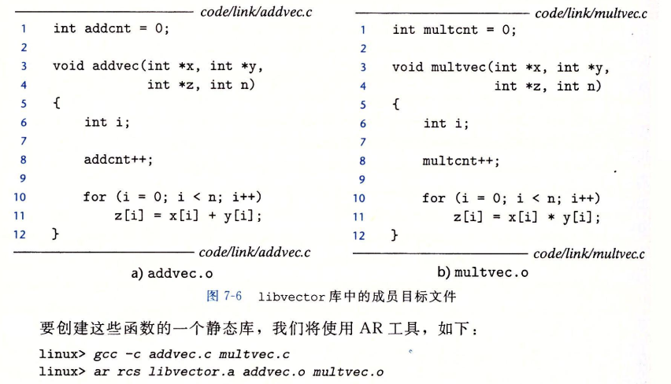

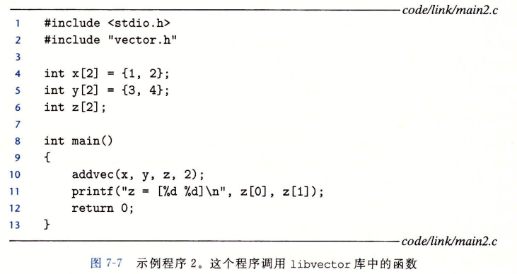

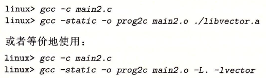

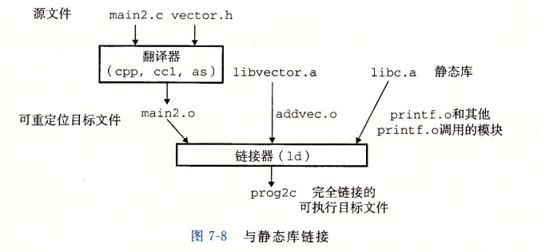

#### 链接器如何使用静态库解析引用

链接器从左至右扫描程序命令行上的可重定位目标文件和存档文件，驱动程序会自动将.c文件翻译为.o文件

链接器维护一个**可重定位目标文件的集合E、未解析符号集合U、输入文件中已定义的符号集合D**

对于每个输入文件f，链接器判断f是目标文件还是存档文件，目标文件将f放入E，修改U D来反映f中符号定义、引用，并继续下一个输入文件

f是存档文件，链接器尝试匹配U中未解析符号和由存档文件成员定义的符号。如果某个存档文件成员m，定义了一个符号来解析U中的一个引用，那么将m放入E中，并修改U D反映m中的符号定义和引用，对存档文件中所有成员目标文件都依次进行以上过程，直到U D不再变化

当完成扫描后，U是非空的，则链接器输出错误并终止，否则合并、重定位E中的目标文件，构建输出的可执行文件

库一般放在命令行末尾，如果各库成员相互独立，则无顺序要求，如果foo.c调用libx.a libz.a中的函数，而这两个库调用liby.a中的函数，则libx.a libz.a必须在liby.a之前

```bash
gcc foo.c libx.a libz.a liby.a
```

若需满足依赖，则可在命令行上重复库，foo.c调用libx.a,该库调用liby.a，而liby.a又调用libx.a的函数，则libx.a必须在命令行上重复出现

```bash
gcc foo.c libx.a liby.a libx.a
```


### 重定位

链接器完成符号解析后，把代码中每个符号关联起来。就开始重定位步骤，这个步骤，将合并输入模块，并为每个符号分配运行时地址

##### 主要由两部分组成

- 重定位节和符号定义

  所有输入模块.data节被全部合并成一个节，这个节成为输出的可执行目标文件的.data节，**这一步完成后，程序中每条指令和全局变量都有唯一的运行时的内存地址**

- 重定位节中的符号引用

  链接器修改代码节和数据节中对每个符号的引用，使其指向正确位置，执行此步依赖于可重定位目标模块中称为**重定位条目**的数据结构

#### 重定位条目

汇编器生成一个目标模块 ，并不知道数据、代码最终所处的内存位置，也不知道模块引用的任何外部定义的函数或全局变量的位置，因此无论何时汇编器遇到对最终位置未知的目标引用，都会生成一个**重定位条目**，告诉链接器在将目标文件合并成可执行文件时该如何修改该引用。**重定位条目放在.rel.text中，已初始化数据的重定位条目放在.rel.data中**

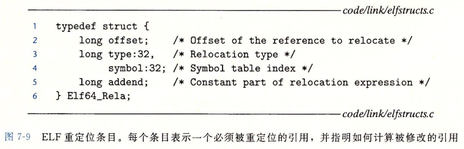

- offset是需要被修改的引用的节偏移
- symbol标识被修改引用应该指向的符号
- type告知链接器如何修改新的引用
- addend是一个有符号常数，一些重定位需要使用它对被修改引用的值做偏移调整

ELF定义32中不同重定位练习，其中最基本的两种类型为：

- R_X86_64_PC32

  重定位一个使用32位PC相对地址的引用

- R_X86_64_32

  重定位一个使用32位绝对地址的引用

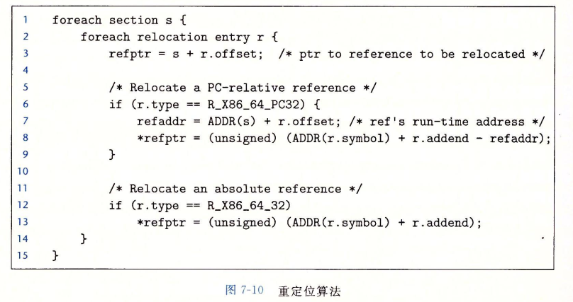

ADDR(s)表示每个节的运行时地址

ADDR(r.symbol)表示符号运行时地址

#### 重定位符号引用

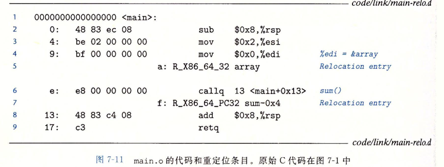

main函数引用了两个全局符号：array和sum，重定位条目告诉链接器对sum引用使用32位PC相对地址重定位，对array使用32位绝对地址重定位

- 重定位PC相对引用

  main调用sum，sum函数于sum.o中定义，call指令开始于节偏移0xe的地方，包括1字节的操作码0xe8，后面时对目标sum的32位PC相对引用的占位符

  重定位条目r由4个字段构成

  ```
  r.offset = 0xf
  r.symbol = sum
  r.type = R_X86_64_PC32
  r.addend = -4
  ```

  告诉链接器修改开始于偏移量0xf处的32位PC相对引用

  假设链接器确定`ADDR(s) = ADDR(.text) = 0x4004d0 `

  根据重定位算法，链接器首先计算引用的运行时地址

  `refaddr = ADDR(s) + r.offset = 0x4004d0 + 0xf = 0x4004df`

  然后更新该引用，使其在运行时指向sum程序

  ```c
  *refptr = (unsigned) (ADDR(r.symbol) + r.addend - refaddr) 
  		= (unsigned) (0x4004e8 + (-4) - 0x4004df)
  		= (unsigned) (0x5)
  ```

  在可执行目标文件中，call指令有如下的重定位形式：

  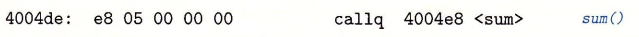

  运行时，call指令存放在地址0x4004de中，CPU执行call指令时，PC值为0x4004e3，即call指令的下一条指令的地址，为执行该指令，CPU执行如下步骤

  1. PC压栈
  2. `PC <- PC + 0x5 = 0x4004e8`

- 重定位绝对引用

图7-11第4行，mov指令将array地址复制到寄存%edi中，对应占位符条目r包括四个字段

```
r.offset = 0xa
r.symbol = array
r.type = R_X86_64_32
r.addend = 0
```

`ADDR(r.symbol) = ADDR(array) = 0x601018`

链接器使用算法第13行修改引用

```
*refptr = (unsigned) (ADDR(r.symbol) + r.addend) 
		= (unsigned) (0x601018 + 0)
		= (unsigned) (0x601018)
```

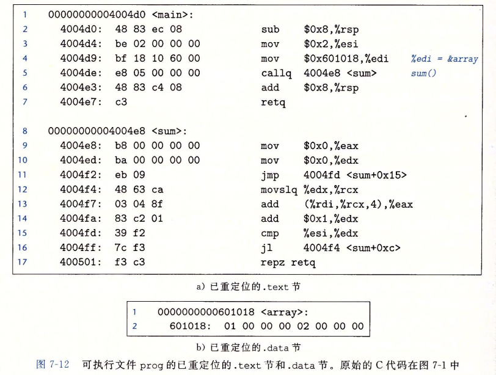


### 可执行目标文件

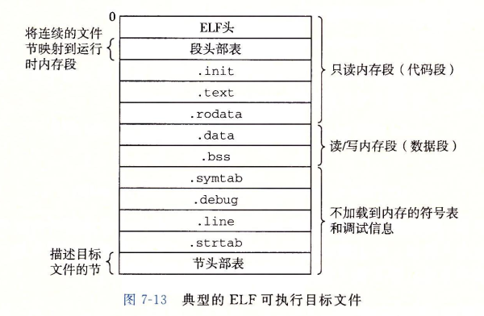

.init定义了一个函数_init，程序初始化代码会调用它

由于可执行文件已经是**完全链接的(已进行重定位)**,不再需要.rel节


### 加载可执行目标文件

运行可执行目标文件prog，可在命令行输入其名字`./prog`

prog不是shell的内置命令，因此shell认为prog是一个可执行目标文件，通过**调用某个驻留在存储器中称为加载器(loader)的操作系统代码来运行它**

**加载器将可执行目标文件的代码、数据从磁盘复制到内存中，然后通过跳转到程序第一条指令或入口点来运行该程序，这个过程叫加载**

每个linux程序都有一个运行时内存映像，如图所示

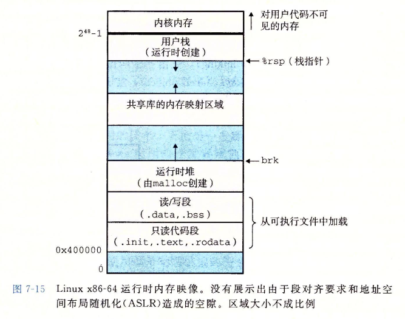


### 动态链接共享库

静态库会导致大量重复代码被复制到每个运行进程的文本段，对内存造成浪费

共享库是一个目标模块，**运行或加载时可加载到任意的内存地址，并和一个在内存的程序链接起来**，这个过程成为**动态链接**

linux通常已.so为后缀，windows已.dll为后缀

```bash
gcc -shared -fpic -o libvector.so addvec.c multvec.c
```

-fpic指示编译器生成与位置无关的代码，-shared指示创建一个共享的目标文件

```bash
gcc -o prog21 main2.c ./libvector.so
```

动态链接器通过执行下面的重定位完成链接：

- 重定位libc.so的文本和数据到某个内存段
- 重定位libvector.so的文本和数据到另一个内存段
- 重定位prog21中所有对由libc.so和libvector.so定义的符号和引用

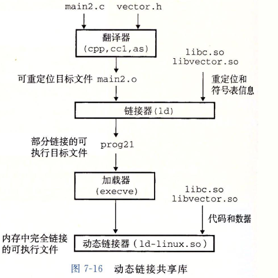


### 从应用程序中加载和链接共享库

之前讨论的都是应用程序被加载后执行前时进行共享库链接的情况

当应用程序**在运行时要求动态链接器加载和链接某个共享库时**，而无需在编译时将那些库链接

```c
#include <dlfcn.h>
void* dlopen(const char* filename, int flag);	// 成功返回句柄指针，错误返回NULL
void* dlsym(void* handle, char* symbol);		// 成功返回指向符号的指针，错误返回NULL
int dlclose(void* handle);						// 成功0 错误-1
const char* dlerror(void);						// 若前面的相关函数调用失败，则返回错误消息，否则为NULL
```

以下程序使用了上面的libvector.so，调用了addvec

```bash
gcc -rdynamic -o prog2r dll.c -ldl
```

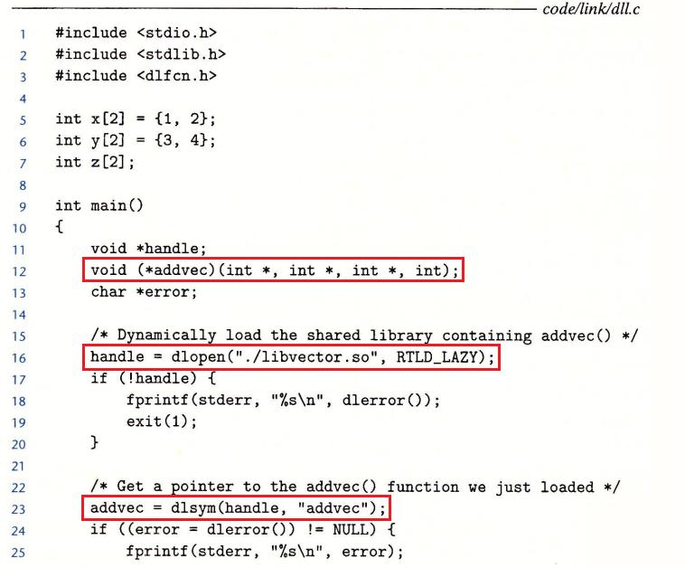

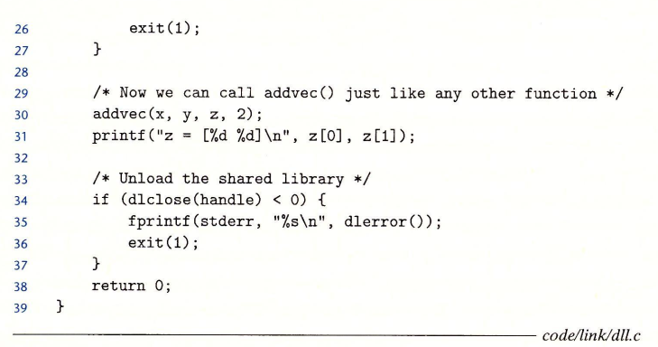


### 位置无关代码（Position-Independent Code,PIC）

- 多个进程如何共享程序的一个副本？

  生成可加载而无需重定位的代码，也叫位置无关代码PIC，sishi用户gcc -fpic选项只是GNU编译系统生成PIC代码使其可以把他们加载到内存任何位置而无需链接器修改，无限多的进程便可以共享模块的代码段的单一副本

#### PIC数据引用

无论内存何处加载一个目标模块（包括共享目标模块），数据段与代码段距离总是不变。

代码段中任何指令和数据段中任何变量间距离都是一个运行时常量，与代码段和数据段的绝对内存位置无关的。

编译器在**数据段开始的地方创建**了一个名为**全局偏移量表(Global Offset Table,GOT)**,其中每个被这个目标模块引用的全局数据目标都有一个8字节条目。编译器为GOT中每个条目生成一个重定位记录，加载时，动态链接器会重定位GOT中每个条目，使其包含正确的绝对地址。

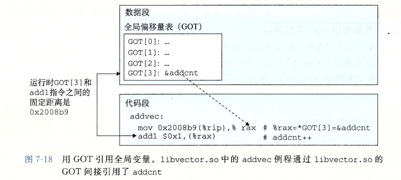

#### PIC函数调用

若程序调用共享库定义的函数，编译器无法预测该函数的运行时地址，GNU编译系统通过**延迟绑定(lazy binding)**来解决这个问题，将过程地址的绑定推迟到第一次调用该过程时

使用共享库的函数只占总体的小部分，因此**延迟绑定会减少不需要的重定位**。第一次调用开销大，后面每次调用都只会花费一条指令和一个简洁的内存引用

**延迟绑定通过GOT和过程链接表(Procedure Linkage Table,PLT)来实现**，如果一个目标模块调用定义在共享库中的任何函数，那么它就有自己的GOT和PLT，GOT时数据段的一部分，PLT是代码段的一部分


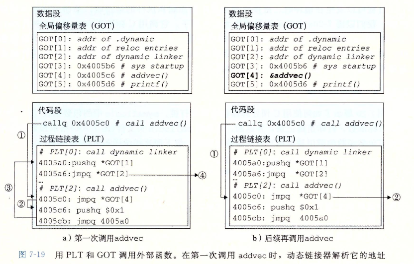

如上图所示

第一次调用addvec：

1. 初始阶段不直接调用addvec，程序调用进入PLT[2]，这是addvec的PLT条目
2. 第一条PLT指令通过GOT[4]进行间接跳转
3. 把addvec的ID（0x1）压入栈中，PLT[2]跳转到PLT[0]
4. PLT[0]通过GOT[1]间接地把动态链接器的一个参数压入栈中，然后通过GOT[2]间接跳转进动态链接器中。动态链接器使用两个栈条目来确定addvec的运行时位置，用这个地址重写GOT[4]，再把控制流传给addvec

后续调用addvec：

1. 控制传递至PLT[2]
2. 通过GOT[4]的跳转直接将控制转移到addvec


### 库打桩机制

Linux链接器支持一个名为库打桩的技术，它允许你**截获对共享库函数的调用，取而代之执行自己的代码**

思想：给定一个需要打桩的目标函数，创建一个包装函数，原型与目标函数完全一样，使用某种特殊的打桩机制，就可以欺骗系统调用包装函数而不是目标函数

包装函数通常执行自己的逻辑，然后调用目标函数，再将目标函数的返回值传递给调用者。

打桩可以发生在编译时、链接时或当程序被加载和执行的运行时。

#### 编译时打桩

需要能够访问程序的源代码

如下图所示，调用C标椎库的malloc和free函数，本地的malloc.h头文件指示预处理器将相应的目标函数的调用替换为包装函数的调用

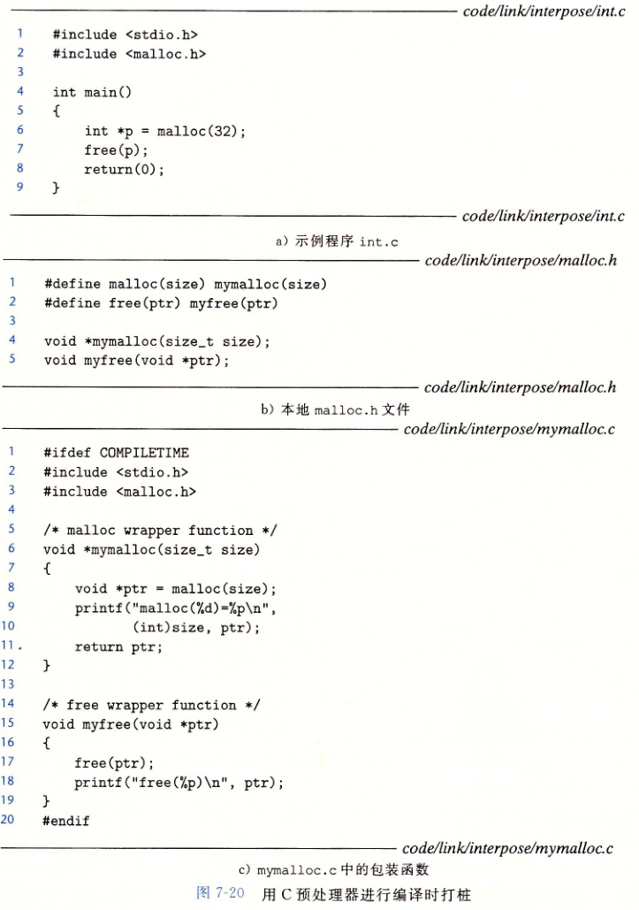

```bash
> gcc -DCOMPILETIME -c mymalloc.c
> gcc -I. -o intc int.c mymalloc.c
```

有`-I.`参数会进行打桩，告诉C预处理器在搜索系统目录前先在当前目录查找malloc.h

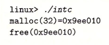

#### 链接时打桩

需要能够访问程序的可重定位文件

使用`--wrap f`标志进行链接时打桩

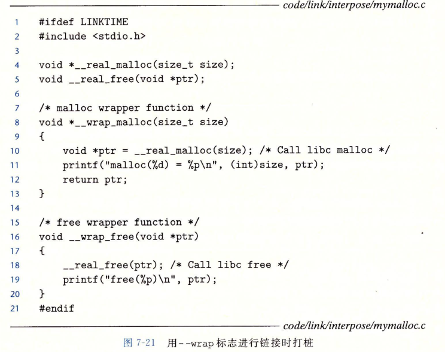

```bash
> gcc -DLINKTIME -c mymalloc.c
> gcc -c int.c
> gcc -Wl,--wrap,malloc -Wl,--wrap,free -o intl int.o mymalloc.o
```

`-Wl,option`标志把option传递给链接器。option中每个逗号都要替换为一个空格，因此`-Wl,--wrap,malloc`就把`--wrap malloc`传递给链接器

#### 运行时打桩

只需能够访问可执行目标文件

基于LD_PRELOAD环境变量

如果LD_PRELOAD环境变量被设置为一个共享库路径名列表，那么加载、执行一个程序，需要解析未定义的引用时，动态链接器会先搜索LD_PRELOAD库，然后搜索其他库


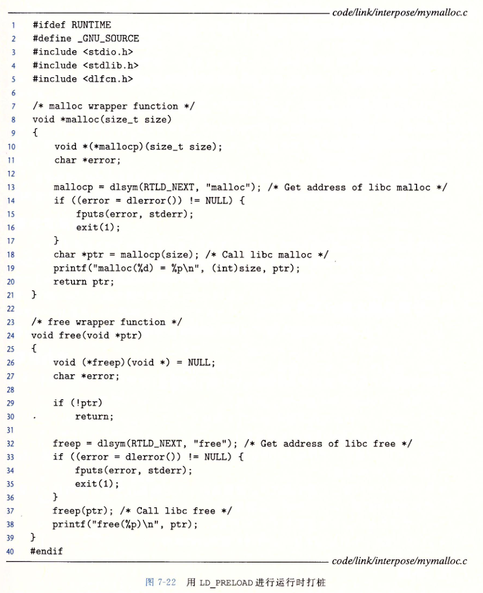

```bash
> gcc -DRUNTIME -shared -fpic -o mymalloc.so mymalloc.c -ldl
> gcc -o intr int.c

# 运行程序
> LD_PRELOAD = "./mymalloc.so" ./intr
```


处理目标文件的工具

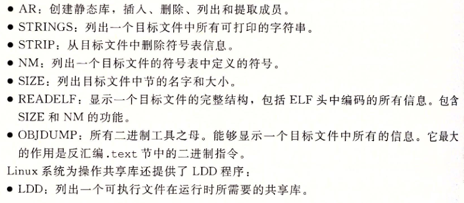


### 总结

链接可以在**编译时通过静态编译器**完成，也可在**加载、运行时通过动态链接器**完成

链接器处理称为目标文件的二进制文件，有三种形式：**可重定位的、可执行的和共享的**

可重定位目标文件由静态编译器合并成一个可执行目标文件，可加载到内存中执行

共享目标文件是在运行时由动态链接器链接、加载的，或隐含地在调用程序被加载和开始执行时，或根据需要在程序调用dlopen函数时

链接器两个主要任务

- 符号解析

  将目标文件每个全局符号绑定到唯一定义上

- 重定位

  确定每个符号的最终内存地址，并修改对那些目标的引用