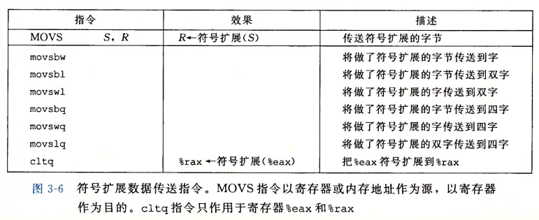
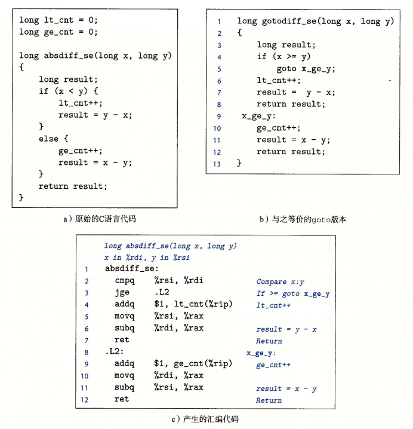
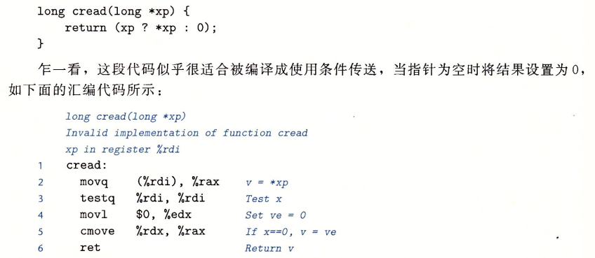
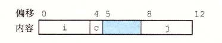
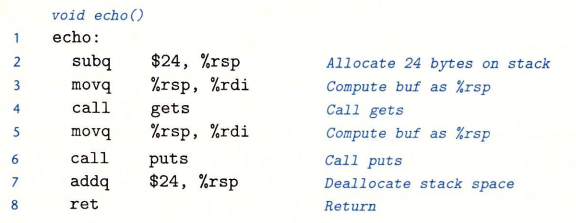
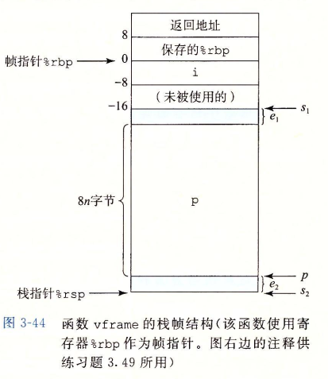

## 数据格式

**字（word）表示16位数据类型**	双字（dword）为32位数	四字（qword）64位数


gcc生成的汇编指令通常后面有一个后缀，表名操作数的大小

```assembly
movb (传送字节)
movw (传送字)
movl (传送双字) // 后缀'l'表示4字节整数和8字节浮点数
movq (传送4字)
```


## 访问信息

一个x86-64的CPU包含一组16个存储64位值的**通用目的存储器**，用于**存放整数数据和指针**

名字都以`%r`开头

8086有8个16位寄存器，%ax到%bp

IA32扩展为32位寄存器，%eax到%ebp


#### 两条规则：

1. 生成1字节、2字节数字的指令会保持剩下的字节不变
2. 生成4字节数字的指令会把高位4字节置0


大多数指令有一个或多个**操作数**，指示处执行一个操作需要使用的源数据值，以及放置结果的目的位置

### 操作数指令符

#### 操作数三种类型

1. **立即数**(immediate)表示**常数值**

   后面跟一个用标准C表示法表示的整数，如`$-577` `$0x1F`

2. 寄存器

   表示某个寄存器的内容，16个寄存器的低位1、2、4、8字节作为一个操作数，对应8、16、32、64位

   $r_a$表示**寄存器a**，$R[r_a]$表示它的**值**

3. 内存引用

   根据计算出的地址访问某个内存位置，可以将内存其看作一个很大的字节数组

   用$M_b[Addr]$表示对存储在内存中从**地址Addr开始的b个字节值**的引用


如上图$Imm(r_b,r_i,s)$表示一个立即数偏移$Imm$，一个基址寄存器$r_b$，一个变址寄存器$r_i$和一个比例因子$s$，$s$必须是1、2、4或8，有效地址计算为
$$
Imm + R[r_b] + R[r_i] * s
$$
练习：


### 数据传送指令

#### MOV


#### MOVZ

把目的中剩余字节填充为0


#### MOVS

通过符号扩展来填充，把源操作的最高位进行复制




#### 举例：

```c
void swap(long *xp, long y) 
{
  long x = *x;
  *xp = y;
  return x;
}
```

```asm
exchange:
        movq    (%rdi), %rax # 第一个参数值取址后的值mov到%rax(返回值)中
        movq    %rsi, (%rdi) # 第二个参数的值转到第一个参数的地址处
        ret					 # return
```

参数xp和y分别存储在`%rdi`和`%rsi`中，第2行从内存中读出x，把它放在寄存器`%rax`中，实现了`x = *xp`，然后用寄存器`%rax`从这个函数返回一个值x。第三行将y写入到寄存器`%rdi`中的xp指向的内存位置，实现了`*xp = y`


### 压入和弹出栈数据

栈指针`%rsp`保存**栈顶的地址**


pushq指令等同于

```asm
subq $8,%rsp
movq %rbp,(%rsp)
```

popq指令等同于

```asm
movq (%rsp),%rax
addq $8,%rsp
```


## 算数和逻辑操作


### 加载有效地址（load effective address）

指令leaq实际就是movq指令的变形，**从内存读取数据到寄存器**

不是从指定位置读取数据，而是将有效地址写入到目的操作数

例如：%rdx值为x 则`leaq 7(%rdx,%rdx,4),%rax`就是将%rax的值为5x+7

```c
long scale(long x, long y, long z) {
  long t = x + 4 * y + 12 * z;
  return t;
}
```

```asm
scale:
        leaq    (%rdi,%rsi,4), %rax  	# x + 4 * y
        leaq    (%rdx,%rdx,2), %rdx	 	# z + 2 * z = 3z
        leaq    (%rax,%rdx,4), %rax		# x + 4 * y + 4 * 3z = x + 4 * y + 12 * z;
        ret
```

### 一元和二元操作

```asm
subq %rax,%rdx # 寄存器rdx的值减去寄存器rax的值
```

### 移位操作

%cl的值为0xFF时，salb移7位，salw移动15位，sall移动31位，salq移动63位

左移指令：SAL SHL都一样

右移指令：SAR算数移位（填符号位）SHR逻辑移位（填0）

### 特殊的算数操作


下面代码将两个无符号64位数字x y生成128位的乘积

```c
#include <inttypes.h>

typedef unsigned __int128 uint128_t;

void store_uprod(uint128_t* dest, uint64_t x, uint64_t y) {
  *dest = x * (uint128_t)y;
}
```

```asm
# dest %rdi		x %rsi		y %rdx
store_uprod:
        movq    %rsi, %rax   	# long t = x;
        mulq    %rdx		 	# t = x * y
        movq    %rax, (%rdi) 	# *dest = t 
        movq    %rdx, 8(%rdi)   # *(dest+8) = %rdx 小端模式
        ret
```

下面代码计算两个64位有符号数的商和余数

**商存储在%rax，余数存储在%rdx**

**有符号除法idivq**

**无符号除法divq，通常%rdx会先设置为0**

```c
void remdiv(long x, long y, long* qp, long* rp) {
  long q = x / y;
  long r = x % y;
  *qp = q;
  *rp = r;
}
```

```asm
# x %rdi 	y% rsi		qp %rdx		rp %rcx
remdiv:
        movq    %rdi, %rax		# long t = x;
        movq    %rdx, %r8		# long *temp = qp;
        cqto					# 扩展 %rdx寄存器
        idivq   %rsi			# 有符号除法 t / y %rax中商 %rdx中余数
        movq    %rax, (%r8)		# *temp = t / y
        movq    %rdx, (%rcx)	# *rp = t % y
        ret
```


## 控制

### 条件码

除了整数寄存器，CPU还维护着一组单个位的条件码寄存器，它们描述了最近的算数或逻辑操作的属性。可以检测这些寄存器来执行条件分支指令。常用条件码如下：


CMP指令和SUB指令行为一样，但**CMP不更新目的寄存器**

TEST指令和AND指令一样，但**TEST不更新目的寄存器**

`testq %rax,%rax`检查`%rax`是正数、0还是负数

TEST指令和AND指令一样


### 访问条件码

通常不会直接读取，常用方法3种：

- 根据条件码某种组合，将一个字节设置为0或1
- 可以条件跳转到程序的某个其他地方
- 可以有条件地传送数据

SET指令可以根据条件码某种组合，将一个字节设置为0或1


`cmpq %rsi,%rdi`计算`t = a - b` <0CMP指令会设置进位标志

### 跳转指令

jmp指令可以跳过指令

jmp是无条件跳转，可以是直接跳转，也可以是间接跳转

直接跳转：跳转目标是作为指令的一部分编码的

间接跳转：跳转目标是从寄存器或内存位置中读出的


```asm
jmp *%rax # 用寄存器%rax中的值作为跳转目标
jmp *(%rax) # 以%rax的值作为读地址，从内存中读出跳转目标
```

### 跳转指令的编码

jmp Imm ，16进制中为**相对寻址**


f8补码11110111	原码10001000 = -8

跳到5：处

**链接后如下**


### 用条件控制来实现条件分支



### 用条件传送来实现条件分支

控制的条件转移机制简单，但可能会非常低效





### 循环

汇编没有相应指令，可**使用条件测试和跳转组合来实现循环效果**

#### do-while

```c
do {
	statement
} while(test-expr);
```

```asm
loop:
	statement
	t = test-expr;
	if(t)
		goto loop;
```

#### while循环

```c
while(test-expr) {
	statement
}
```

```asm
	goto test;
loop:
	statement
test:
	t = test-expr
	if(t)
		goto loop;
```


#### for循环

```c
for(init-expr; test-expr; update-expr) {
	statement
}
```

```asm
# 跳转到中间策略
	init-expr;
	goto test;
loop:
	statement
	update-expr;
test:
	t = test-expr;
	if(t) 
		goto loop;
		
# guarded-to 策略
	init-expr;
	t = test-expr;
	if(!t) 
		goto done;
loop:
	statement
	update-expr;
	t = test-expr;
	if(t)
		goto loop;
done:
```


```c
#include <iostream>
using namespace std;
// 比特位逆序
template<typename T>
long reverseBinary(T x) {
	long val = 0;
	long i;
	cout << "sizeof() = "<<sizeof(x) << endl;
	for(i = sizeof(x) * 8; i != 0; --i) {
		val = (val << 1) | (x & 0x1);
		x >>= 1;
//		cout <<"current i = " << dec << i  << hex << " x : " << x << " val : " << val <<endl;
	}
//	cout << "val : " << val << endl;
	return val;
}

int main() {
	int a = 0b10101010;
	cout << a << endl; // 170 -> 00000000 00000000 00000000 10101010 
	cout << reverseBinary(a) << endl; // 55000000 -> ‭01010101 00000000 00000000 00000000‬
	
	cout << "unsigned long size = " << sizeof(unsigned long) << endl; // windows 4Bytes linux 8Bytes
	unsigned long ul = 0x1234; //  4660 -> 00000000 00000000 00010010 00110100‬
	cout << reverseBinary(ul) << endl; //‭ 742916096‬ -> 00101100 01001000 00000000 00000000
	
	short s = 107;	// 00000000 01101011
	cout << reverseBinary(s) << endl; // ‭54784‬ -> 11010110 00000000‬
	
	return 0;
}

```

### switch

switch使用跳转表(jump table)，它是一个数组，内部包含代码段的地址

数组jt包含7个表项，每个都是一个代码块的地址


`loc_def`为default，首先将n-100后与6进行比较，判断是否为default，如果是则直接跳到default，否则再继续判断

上图jmp指令的操作数有前缀`*`，表明这是一个**间接跳转**，操作数指定一个内存位置，索引由寄存器`%rsi`给出，寄存器保存着index的值


**.L4是跳转表的位置，其余为其他case**

`jmp *.L4(,%rsi,8)`表示跳转到跳转表中索引所指向的地址，%rsi此时为index `.L4 + 8*%rsi`为对应index的地址


## 过程

> #### 过程P调用过程Q，Q执行后返回到P，包括以下多个机制

> - 传递控制：进入过程Q时，程序计数器必须被设置为Q的代码的起始地址，然后返回时，要**把程序计数器设置为P中调用Q后面那条指令**

> - 传递数据：P必须能向Q提供一个或多个参数，Q必须能向P返回一个值

> - 分配释放内存：开始时，Q可能需要为局部变量分配空间，返回前释放空间

### 运行时栈

使用后进先出的内存管理原则


**Q执行时，P的所有在向上追溯到P的调用链的过程都被挂起**

**x86-64的栈向低地址方向增长**，而栈指针`%rsp`指向栈顶元素。可使用pushq popq将数据存入栈中或从栈中取出

**x86-64过程需要的存储空间超出寄存器能够存放的大小时，就会在栈上分配空间，这个部分称为过程的栈帧**

过程P调用过程Q时，**会将返回地址压入栈中**，**指明Q执行完后P要从哪里继续执行**,Q的代码会扩展栈的边界，分配它的栈帧所需的空间

通过寄存器，P最多可传递6个整数值，如果Q需要更多参数，P可以在调用Q以前在自己的栈帧里存储好这些参数

### 转移控制

将控制从函数P到函数Q只需将**程序计数器PC设置为Q的代码起始位置**，但必须记录好P继续执行代码的位置

x86-64通过指令`call Q`调用过程Q来记录

**把地址A压入栈中，PC设置为Q的起始地址，压入A的地址为返回地址**

**ret从栈中弹出地址A，把PC设置为A**

**call ret后加q  callq retq只是强调这些是x86-64版本的调用和返回**

```asm
# func multstore
0000000000400540 <multstore>
 400540:	53			push %rbx
 400541:	48 89 d3 	mov %rdx,%rbx
 
# func main call multstore
 400563:	e8 d8 ff ff ff	callq 400540 <multstore>
 400568:	48 8b 54 24 08	mov 0x8(%rsp),%rdx
```

**如上代码，main函数中，地址0x400563调用函数multstore，此时状态如图a，指明栈指针%rsp和程序计数器%rip的值。将执行multstore函数后该继续执行的地址0x400568压入栈中，跳到函数multstore第一条指令，执行完后ret弹出地址，跳转到这个地址继续执行**


### 数据传送

<=**6个整型参数（整数、指针）**由寄存器传递


\>6个整型参数，超出的部分由栈传递参数


注意6行使用movl从内存读入4个字节


### 栈上局部存储

> 以下情况局部数据必须放在内存中

> - 寄存器不足够存放本地数据
>
> - 对一个局部变量使用地址运算符`&`，因此必须能够为它产生一个地址
> - 某些局部变量是数组或结构，因此必须能够通过数组或结构引用被访问到


如上图，caller代码开始时栈指针减16，留给两&个局部变量arg1 arg2，然后分别赋值，将两个参数寄存器%rsi %rdi分别设置为&arg1 &arg2，然后调用swap_add，接着继续进行下面的操作


### 寄存器中的局部存储空间

**寄存器是唯一被所有过程共享的资源**

%rbx %rbp和%r12~%r15被划分为**被调用者保存寄存器**，过程P调用过程Q，Q必须保存这些寄存器的值，保证它们的值在Q返回P时和Q被调用时一样

其他所有寄存器都被分类为**调用者保存寄存器**，这意味着任何函数都能修改它们


### 递归过程

每个过程调用在栈中都有自己的位置，多个未完成调用的局部变量不会互相影响


## 数组分配和访问

### 基本原则

```c
T A[N];
```

起始位置$x_a$,这里的声明表示：

- 在内存中分配一个N*L字节的连续区域，引入标识符A，A作为指向数组开头的指针，指针值即为$x_a$

可以用0~N-1的整数索引访问该数组元素，地址对应$x_a+L*i$

```c
int E[N];
__asm movl (%rdx,%rcx,4),%eax // 会执行地址计算xa+4i，都这个内存位置的值，将结果存在%eax
```

### 指针运算

如果p是指向类型为T的数据的指针，p值为$x_p$，那么`p+i`值为$x_p+L*i$

对于一个地址的表达式AExpr，*AExpr表示该地址处的值

对于某个对象表达式Expr，&Expr是给出该对象地址的一个指针

```c
A[i] == *(A + i);
```


### 嵌套数组

创建数组的数组时，例如`int A[5][3]`等价于以下声明

```c
typedef int row3_t[3]; // row3_t定义为一个3个整数的数组
row3_t A[5];	// 数组A包含5个row3_t这样的元素
```

`T D[R][C];`对应于`D[i][j]`的地址是

$$
\&D[i][j] = x_d + L(C*i + j)
$$

下面代码可将元素A\[i][j]复制到寄存器%eax中

```asm
# A in %rdi		i in %rsi 	j in %rdx
leaq	(%rsi,%rsi,2),%rax		# 3i
leaq	(%rdi,%rax,4),%rax		# x_a + 12i	一个row3_t长度12
movl	(%rax,%rdx,4),%eax		# M[x_a + 12i + 4j] sizeof(int) == 4
```


### 定长数组


如下图所示，%eax保存result，%rdi保存Aptr，%rcx保存Bptr，%rsi保存Bend


### 变长数组


## 异质的数据结构

### 结构struct

指向结构的指针就是第一个字节地址

```c
struct rec {
	int i;
	int j;
	int a[2];
	int *p;
};
```


```asm
# 将struct rec* r的i复制到j
movl	(%rdi),%eax
movl	%eax,4(%rdi)

# %rax设置为 &(r->a[i])
# r in %rdi		i in %rsi
leaq	8(%rdi,%rsi,4),%rax
```


### 联合union

union大小等于它最大字段的大小

### 数据对齐

许多计算机对**合法地址做出限制**，要求某种类型对象地址必须是某个值（通常2 4 8）的倍数

x86-64无论是否对其都能正常工作，但**对齐可提高内存系统的性能**

**大的放在头面，小的放后面**


确保每种数据类型都按照指定方式来组织分配，即每种类型的对象都满足它的对齐限制，就可保证实施对齐

编译器在汇编中放入命令，指明全局数据所需的对齐，例如：

```asm
.align 8
```

保证了它后面的数据的起始地址都是8的倍数

```c
struct s1 {
	int i;
	char c;
	int j;
};
```

9字节分配如图


不满足4字节对齐要求，取而代之是将c j中间插入一个3字节间隙



```c
struct s2 {
	int i;
	int j;
	char c;
};
struct s2 d[4];
```

数组d不满足对齐要求，地址分别为xd xd+9 xd+18 xd+27

编译器会为s2分配12字节，这样地址分别为xd xd+12 xd+24 xd+36


## 在机器级程序中将控制和数据结合起来

### 理解指针

函数指针

```c
int fun(int) {

}
int (*fp)(int);
fp = fun;
```

注意函数指针的(*fp)的括号不可缺少，若缺少，则是一个函数声明

### 使用GDB调试器


### 内存越界引用和缓冲区溢出

C对于数组引用不进行任何边界检查，而且局部变量和状态信息（例如保存的寄存器值和返回地址）都存放在栈中

缓冲区溢出：例如字符串长度超过了分配的空间，如下例所示




栈分配了24字节，由于buf长度固定为8，因此可能产生溢出情况，情况如下表


0-7为栈为buf[8]分配的区域


### 对抗缓冲区溢出攻击

1. #### 栈随机化

   栈的位置如果很容易找到，则攻击者可以插入攻击代码的指针

   栈随机化思想使得**栈的位置在每次程序运行时都有变化**

2. #### 栈破坏检测

   栈保护者机制检测缓冲区越界，思想是在**栈帧中任何局部缓冲区与栈状态之间**存储一个特殊的**哨兵值**

   将其放在一个特殊段中，标志为“只读”，这样攻击者就不能覆盖存储的哨兵值

   

   gcc会自动插入这种溢出检测，如果不想使用，用`-fno-stack-protector`阻止gcc产生

   

   

   

   

   ​	**指令`%fs:40`指明哨兵值使用段寻址从内存中读入的，在恢复寄存器状态和返回之前，函数将存储在栈位置处的值与哨兵值作比较。如果二者相同，则xorq指令会得到0，函数按正常方式完成。非零则表示哨兵值被修改过，代码就会调用一个错误处理**

3. #### 限制可执行代码区域


### 支持变长栈帧

有些函数需要局部存储是变长的


为了管理变长栈帧，**x86-64使用寄存器%rbp作为帧指针，也称基指针(base pointer)**



## 浮点代码

AVX高级向量扩展浮点体系结构允许数据存储在16个YMM寄存器中，它们名为%ymm0~%ymm15，每个YMM寄存器都是256位，当对标量数据操作时，这些寄存器只保存浮点数，而且只是用32位（float）或64位（double），汇编代码用寄存器的SSE XMM寄存器名字%xmm0~%xmm15来引用它们，每个XMM寄存器都对应YMM寄存器的低128位


### 浮点传送和转换操作


