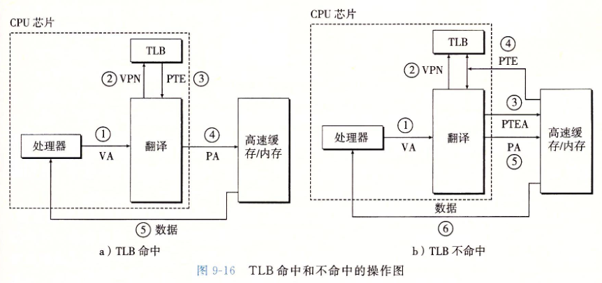
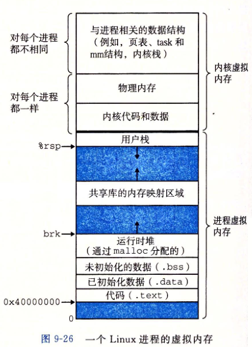
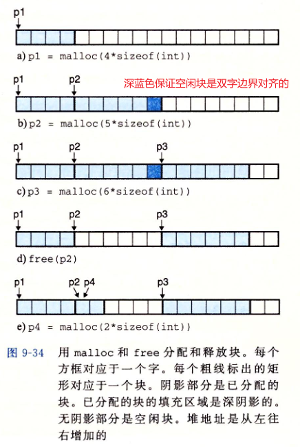
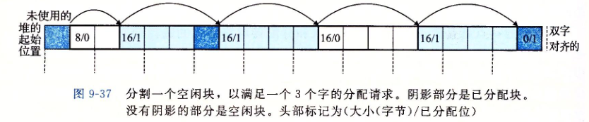

## 虚拟内存（VM）

### 物理和虚拟寻址

计算机系统主存被组织成一个M个连续字节大小的单元组成的数组，每字节都有唯一的物理地址(Physical Address,PA) ,CPU访问内存使用物理地址，这种方式称为**物理寻址**


使用虚拟寻址，CPU通过生成一个虚拟地址(Virtual Address,VA)来访问主存，虚拟地址被送到内存前转换为适当的物理地址。

将**虚拟地址转换为物理地址的任务称为地址翻译**，CPU上的地址翻译叫做**内存管理单元**(Memory Management Unit,**MMU**)，利用存放在主存中的**查询表**来动态翻译虚拟地址，该表由操作系统管理


### 地址空间

地址空间是非负整数的有序集合：{0,1,2,...}，如果**地址空间中整数连续，则说它是一个线性地址空间**

一个带虚拟内存的系统中，CPU从一个有N=2^n个地址的地址空间中生成虚拟地址，这个地址空间称为虚拟地址空间：{0,1,2,...,N-1}

物理地址空间对应于系统物理内存的M个字节,M不要求是2的幂，我们假设M = 2^m


### 虚拟内存作为缓存的工具

VM系统通过将虚拟内存分割为虚拟页的大小固定的块，每个虚拟页大小P = 2^p字节，物理内存分割为物理页(PP)，大小也为P字节，物理页也叫页帧

任意时刻，虚拟页面集合分为三个子集：

- 未分配的：VM系统还未分配(或创建)的页，不占用任何磁盘空间
- 缓存的：当前已缓存在物理内存中的已分配页
- 未缓存的：未缓存在物理内存中的已分配页


#### DRAM缓存的组织结构

SRAM缓存表示CPU和主存之间的L1、L2、L3高速缓存，DRAM缓存表示虚拟内存系统的缓存，它在主存中缓存虚拟页

DRAM比SRAM慢大约10倍，磁盘比DRAM慢大约100000倍。因此DRAM缓存中的不命中比起SRAM的缓存不命中要开销大的多

**虚拟页往往很大，通常4KB~2MB**，由于大的不命中开销，**DRAM缓存是全相联的，即任何虚拟页都可以放置在任何物理页中**。DRAM缓存总是使用写回，而不是直写

#### 页表

虚拟内存系统必须有方法来判定一个虚拟页是否缓存在DRAM中某个地方。如果是，系统还需确定这个虚拟页存放在哪个物理页，如果不命中，系统必须判断这个虚拟页存放在磁盘哪个位置，在物理内存中选择一个牺牲页，并将虚拟页从磁盘复制到DRAM中，替换这个牺牲页

以上功能由软硬件联合提供。包括**OS软件、MMU中的地址翻译硬件**和一个**存放在物理内存中叫做页表**的数据结构

**页表将虚拟页映射到物理页**，每次地址翻译硬件将一个虚拟地址转换为物理地址，都会读取页表

页表是一个页表条目(Page Table Entry,PTE)的数组，如下图所示，由有效位和地址构成，有效位为1表示指向真正的物理内存，为0则表示还未被分配


#### 页命中


如上图所示，VP2被命中，地址翻译硬件会将虚拟地址作为索引定位PTE2，并从内存中读取它。由于有效位为1，则地址翻译硬件直到VP2缓存在内存中，使用PTE中的物理内存地址，构造出这个字的物理地址。

#### 缺页

**DRAM缓存不命中称为缺页**

如下图所示，CPU引用了VP3中的一个字，VP3并为缓存在DRAM，地址翻译硬件从内存中读取PTE3，从有效位判断出VP3未被缓存，并且触发一个缺页异常，该程序会选择一个牺牲页，此例中为PP3处的VP4，如果VP4已修改，内核会将其复制到磁盘，然后将VP4移出主存。


接下来，内核从磁盘复制VP3到PP3，更新PTE3，随后返回。异常处理程序返回时，会重新启动导致缺页的指令，此时VP3已经在主存中了，产生页命中


#### 分配页面

磁盘上创建空间并更新PTE5，使它指向这个新创建的页面


### 虚拟内存作为内存管理的工具

如图，在PTE中添加三个许可位。SUP表示进程必须在内核模式下才能访问该页，READ WRITE表示对该页的读写权限

如果一条指令违反了这些许可条件，CPU触发一个一般保护故障，将控制传递给一个内核中的异常处理程序，linux shell一般将其称为**段错误(Segmentation fault)**


 

### 地址翻译

地址翻译是一个N元素的虚拟地址空间(VAS)中的元素和一个M元素的物理地址空间(PAS)中元素的映射


如上图所示，页表基址寄存器指向当前页表。n位虚拟地址包含两部分：一个p位的虚拟页面偏移(VPO)，一个(n-p)位的虚拟页号(VPN)。MMU利用VPN选择适当的PTE，将页表条目中物理页号和虚拟地址的VPO串联起来。


#### 结合高速缓存和虚拟内存

思想：地址翻译发生在高速缓存查找前

	

#### 利用TLB加速地址翻译

每次CPU产生一个虚拟地址，MMU就必须查阅一个PTE，以便转换为物理地址。如果不命中，则开销较大，因此在MMU中包括了一个关于PTE的小的缓存，称为翻译后背缓冲器(TLB)

TLB是小的、虚拟寻址的缓存，其中每一行都保存一个由单个PTE组成的块





#### 多级页表


#### Linux虚拟内存系统

linux为每个进程维护单独的虚拟地址空间



##### linux虚拟内存区域

linux将虚拟内存组织成一些区域(也叫作**段**)的集合。


##### 缺页处理

MMU试图翻译一个虚拟地址A时，触发一个缺页，处理程序执行下面步骤：

- 虚拟地址合法？（A在某个区域结构定义的区域内吗？）

  缺页处理程序搜索区域结构的链表，把A和每个区域结构的vm_start vm_end比较，如果不合法，则触发一个段错误，终止该进程

- 试图进行的内存访问是否合法？（是否有读、写或执行某个区域的权限？）

  如果不合法，触发一个保护异常

- 如果以上都为合法，则进行缺页处理

  选择一个牺牲页面，如果该页修改过，则将其交换出去，换入新页面并更新页表。缺页处理程序返回时，CPU重新启动缺页指令，这条指令再次发送A给MMU，这次MMU可以正常翻译A，不再产生缺页中断。

  

### 内存映射

linux通过将一个虚拟内存区域与一个磁盘上的对象关联起来，以初始化这个虚拟内存区域的内容，这个过程称为内存映射

虚拟内存可以映射到两种类型的对象中的一种：

- linux文件系统中的普通文件

  文件区被分成页大小的片，每一片包含一个虚拟页面的初始内容，这些虚拟页面没有实际交换进物理内存，直到CPU引用。

- 匿名文件

  匿名文件由内核创建，包含的全是二进制的0，CPU第一次引用这样一个区域的虚拟页面时，内核就在物理内存中寻找一个牺牲页，并用二进制0覆盖牺牲页并更新页表

无论哪种情况，一旦一个虚拟页面被初始化，它就在一个由内核维护的专门交换文件（交换空间、交换区域）之间进行交换

#### 再看共享对象

每个进程可以提供私有的虚拟地址空间，可避免其他进程的错误读写，不过**许多进程都有同样的只读代码区域。许多程序只需访问只读运行时库代码的相同副本，导致浪费，因此内存映射提供了一种清晰的机制，来控制多个进程如何共享对象**

一个对象可以被映射到虚拟内存的一个区域，要么为**共享对象**，要么为**私有对象**。

如果是*共享对象，则这个进程对该区域的任何写操作，对于其他也把该对象映射到虚拟内存的进程而言，也是可见的，而且这些变化也会反馈到磁盘的原始对象上。*私有对象则对其他进程时不可见的。

> **私有对象使用一种写时复制（copy on write)的技术被映射到虚拟内存中**。即每个映射私有对象的进程，相应的私有区域的页表条目都标记为只读，只要没有进程试图写自己的私有区域，则进程可继续共享物理内存中的单独副本，然而一旦有一个进程试图写私有区域，这个写操作就会触发一个保护故障，故障处理程序就会在物理内存中为该页面创建一个新副本，更新页表条目指向这个新副本，然后恢复该页面的可写权限，处理程序返回时，CPU重新执行该操作，便可在新页面上正常执行写操作。
>
> 

#### *再看fork函数*

- **fork函数被当前进程调用时**，内核为新进程创建各种数据结构，并分配一个唯一PID。为了给新进程创建虚拟内存，它创建了当前进程的mm_struct、区域结构和页表的原样副本。它将两个进程中每个页面都标记为只读，并**将两个进程中每个区域结构都标记为私有的写时复制**
- **fork在新进程返回时**，新进程当前的虚拟内存和调用fork时存在的虚拟内存相同。接下来，当这**两个进程中任意一个进行写操作时，写时复制机制便会创建新页面，因此就为每个进程保持了私有地址空间的抽象概念。**

#### 再看execve函数

```c
execve("a.out", NULL, NULL);
```

execve函数在当前进程中加载并运行包含在可执行目标文件a.out中的程序，用a.out程序替代了当前程序，需要以下步骤

- 删除已存在的用户区域

  删除当前进程虚拟地址的用户部分中已存在的区域结构

- 映射私有区域

  为新程序的代码、数据、bss和栈区域创建新的区域结构。所有这些新区域都是私有的、写时复制的。

- 映射共享区域

  如果a.out程序与共享对象链接，那么这些对象都是动态链接到这个程序的，然后再映射到用户虚拟地址空间的共享区域内。

- 设置程序计数器

  最后设置当前进程上下文中的程序计数器，使其指向代码区域的入口点


#### 使用mmap函数的用户级内存映射

```c
#include <unistd.h>
#include <sys/mman.h>
// 成功指向映射区域，错误则为MAP_FAILED(-1)
void *mmap(void *start, size_t length, int prot, int flags, int fd, off_t offset);
// 成功0 失败-1
int munmap(void* start, size_t length);
```

mmap要求内核创建一个新的虚拟内存区域，最好是从地址start开始的区域，并将文件描述符fd指定的对象的一个连续的片映射到这个新区域。连续的对象片大小为length字节，从距文件开始处偏移量为offset字节的地方开始。start地址仅仅是一个暗示，通常为NULL。

参数prot：

- PROT_EXEC：这个区域内页面由可以被CPU执行的指令组成
- PROT_READ：这个区域内页面可读
- PROT_WRITE：这个区域内页面可写
- PROT_NONE：这个区域内页面不能被访问

参数flags由描述被映射对象类型的位组成。如果设置了MAP_ANON标记位，则映射对象是一个匿名对象，相应的虚拟页面是请求二进制0的。MAP_PRIVATE表示被映射对象是一个私有、写时复制的对象，MAP_SHARED表示是一个共享对象


### 动态内存分配

虽然可以使用mmap munmap去创建、删除虚拟内存的区域，但使用**动态内存分配器**更方便，移植性更强

**动态内存分配器维护一个进程的虚拟内存区域，称为堆（heap）**，分配器将堆视为一组不同大小的块（block）的集合来维护。每个块是一组连续的虚拟内存片（chunk），要么是已分配的，要么是空闲的。空闲块用来被分配，一个已分配的块保持已分配状态直到它被释放。

> 两种风格的分配器
>
> - 显式分配器
>
>   要求应用显式地释放任何已分配的块。例如malloc free和c++的new delete操作
>
> - 隐式分配器(垃圾收集器gc)
>
>   分配器检测一个已分配块是否被程序使用，没有则释放这个块。**自动释放未使用的分配块的过程叫做垃圾收集**


#### malloc和free函数

```c
#include <stdlib.h>
void *malloc(size_t size);
void free(void *ptr);
// 通过将内核的brk指针增加incr来扩展、收缩堆，成功返回brk旧值，失败-1
void *sbrk(intptr_t incr);
```



#### 分配器要求和目标

##### 要求

1. 处理任意请求序列
2. 立即响应请求
3. 只使用堆
4. 对齐块
5. 不修改已分配的块

##### 目标

1. 最大化吞吐率
2. 最大化内存利用率

#### 碎片

内部碎片：已分配块比有效载荷大

外部碎片：空闲内存合计起来足够满足请求，但没有单独块满足

#### 隐式空闲链表


空闲块通过头部中的大小字段隐含地连接着(嵌入式指针)


#### 常见分配器策略

- 首次适配

  优点：趋向于将大的空闲块保留在链表后面

  缺点：链表容易起始处留下空闲块的碎片，增大对较大块的搜索时间

- 下一次适配：不是从链表起始处开始每次搜索，而是从上一次查询结束处开始

  内存利用率比首次适配低得多

- 最佳适配

  要求对堆彻底的搜索

#### 分割空闲块



#### 获取额外堆内存

如果分配器找不到合适的空闲块：

- 选择合并物理上相邻的空闲块
- 调用sbrk函数向内核申请额外堆内存，将额外的内存转化为一个大内存块，插入到空闲链表，然后将请求的块放在新块中

#### 合并空闲块

分配器释放一个已分配块，可能其他空闲块与其相邻，引发一种现象，叫做**假碎片**，即有许多可用空闲块分为小的、无法使用的空闲块

为解决上述问题，必须合并相邻的空闲块，有两种方式：

- 立即合并：释放时立刻合并，但对于某些请求模式，这种方式会产生一种抖动，即块合并后立刻分割
- 推迟合并：快速分配器通常会选择该模式

#### 带边界标记的合并

每个块结尾添加一个脚部（footer，边界标记），通过检查脚部，判断前面一个块的起始位置和状态，脚部总是距当前块开始位置一个字的距离


分配器释放当前块的所有可能：


缺点在于如果操作多个小块时，会显著增加内存开销


#### 实现一个简单的分配器

见mem文件夹

#### 显式空闲链表

对于通用的分配器，隐式空闲链表不适合，更好的方法是将空闲块组织为某种形式的显式数据结构。

缺点在于空闲块必须足够大，以包含所有需要的数据结构，导致了最小块更大的尺寸，潜在提高了内部碎片的程度


#### 分离空闲链表

一种流行的减少分配时间的方法，通常称为**分离存储**，维护多个空闲链表，每个链表中的块大小相同，当分配器需要一个大小为n的块，则去对应的链表中查询，如果没有匹配则搜索下一个链表

- 简单分离存储

  每个链表包含相同大小的块，分配一个给定大小的块，检查相应链表，非空则分配其中第一块，空则分配器向操作系统请求一个固定大小的额外内存片，通常是页大小的整数倍，将片分为大小相同的块，在串联成新的链表。释放块则将块插入到空闲链表前部即可

  优点：分配、释放都是很快的常数时间操作，每个块内存开销小，链表单向即可

  缺点：很容易造成内部、外部碎片，不会合并空闲块，会导致极多的外部碎片

- 分离适配(malloc使用这种方法)

  分配器维护一个空闲链表数组，每个链表包含潜在的不同大小的块

  分配时查找合适的块，如果找到则(可选地)分割它，并将剩余部分插入到适当地空闲链表中，找不到则继续搜索更大的链表，如果一直找不到则申请额外堆内存

  内存利用率近似于对整个堆得最佳适配搜索的内存利用率

- 伙伴系统

  


### 垃圾收集

垃圾收集器（gc）是一种动态内存分配器，自动释放程序不再需要的已分配块

#### 基本知识

垃圾收集器将内存视为一张有向的可达图，堆节点对应一个已分配块，根节点对应一种不在堆中的位置，例如寄存器、栈变量、虚拟内存中读写区域内的全局变量等。


java等语言的gc，对应用如何创建、使用指针有严格的控制，能够维护可达图的精确表示，能够回收所有垃圾。

而C、C++通常不能维持可达图的精确表示，这种gc也称为**保守的gc**


上图展现如何讲一个保守gc加入到已存在的malloc包中，需要堆空间就malloc，如果malloc找不到合适块，就调用gc，希望能够通过回收一些垃圾到空闲链表，收集器识别出垃圾，通过调用free返回给堆。

#### Mark&Sweep垃圾收集器

mark标记出根节点的所有可达的和已分配的后继

sweep释放每个未被标记的已分配块


上图所示，**根节点指向第4块，标记后有1 3 4 6的标记，因为是根节点可达的。2 5不可达，因此在清除阶段不会被回收到空闲链表**

#### C程序保守的Mark&Sweep

**将已分配块集合维护成一棵平衡二叉树**

- 左子树中所有块放在较小地址处，右子树放在较大地址处
- 保证会标记所有从根节点可达的节点
- 保守的，因为可能不正确地标记实际上不可达的块，可能不会释放某些垃圾
- 不影响程序正确性，但可能导致不必要的外部碎片


### C程序中常见与内存相关的错误

- 间接引用坏指针

  ```c
  int val;
  scanf("%d",val);  	// error
  scanf("%d",&val); 	// ok
  ```

- 读未初始化的内存

  **bss内存位置总被加载器初始化为0，但对于堆不同**，**常见错误即为假设堆内存初始化为0**

  ```c
  int *y = (int *)malloc(sizeof(int) * n);
  for (int i = 0; i < n; ++i) {
  	y[i] += i;	// error 应该显式地将y[i]赋值为0，或者使用calloc
  }
  ```

- 允许栈缓冲器溢出

  gets允许复制任意长度的串到缓冲区，应该使用fgets，其限制了输入串长度

  ```c
  char buf[64];
  gets(buf);	
  ```

- 假设指针和它们指向的对象是相同大小的

  ```c
  int **y = (int **)malloc(sizeof(int) * n); // 应该是sizeof(int*)，这样实际创建的是int数组，而不是int*数组
  for (int i = 0; i < n; ++i) {
  	y[i] = (int *)malloc(sizeof(int) * n);	
  }
  ```

  上述代码只有在int和int*大小相同的机器上正常运行，如果指针大小大于int则错误

- 错位错误

  ```c
  int **y = (int **)malloc(sizeof(int) * n);
  for (int i = 0; i <= n; ++i) {	// error 试图初始化n+1个元素
  	y[i] = (int *)malloc(sizeof(int) * n);	
  }
  ```

- 引用指针，而不是它所指的对象

  ```c
  // 将size值-1
  int size = 10;
  int *psize = &size;
  *psize--; 		// error 减少的是指针值
  (*psize)--; 	// ok
  ```

- 误解指针运算

  

- 引用不存在的变量

  局部变量返回地址，尽管地址合法，但程序在调用其他函数，内存将重用栈帧，则会被其他变量覆盖

- 引用空闲堆块中的数据

  

- 引起内存泄漏，没有free

  

