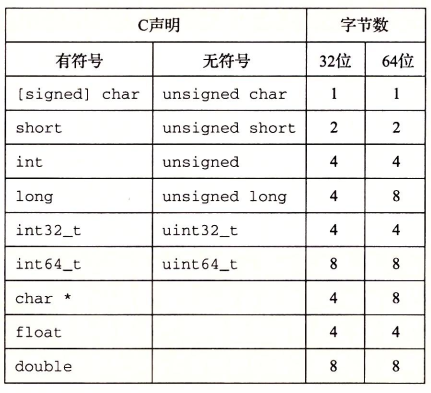
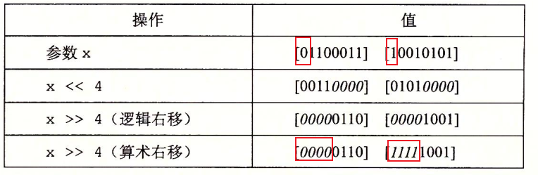
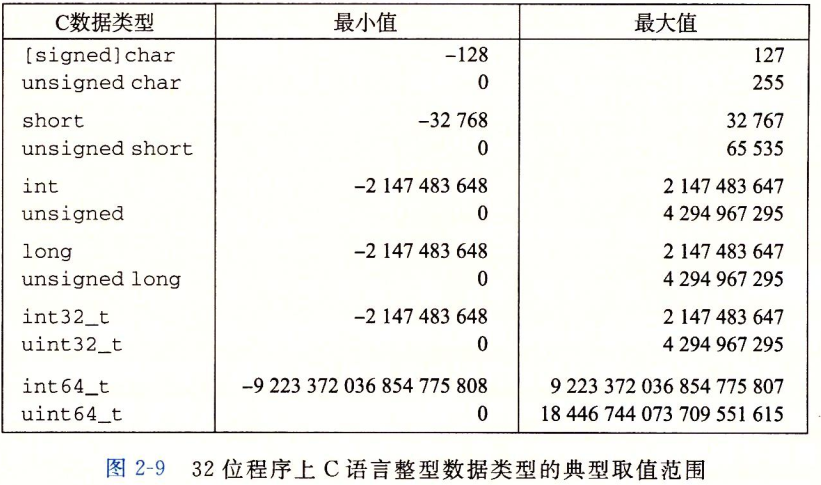
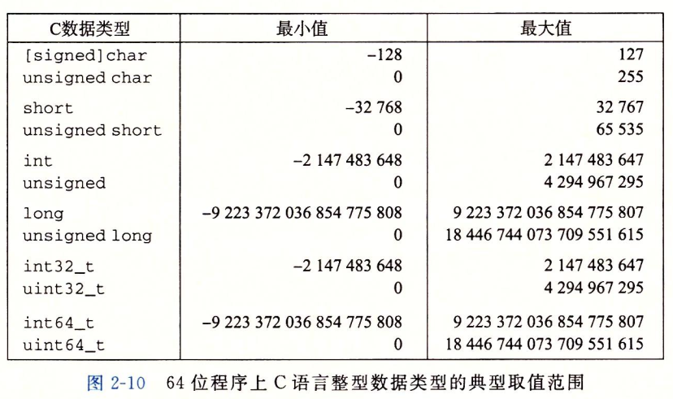

### 信息存储

大多数计算机使用字节byte作为最小的可寻址的内存单位，而不是访问内存中单独的位

**机器级程序将内存视为一个非常大的数组，称为虚拟内存**。内存的每个字节都由一个唯一的数字来表示，称其为**地址**，所有可能地址的集合就称为**虚拟地址空间**

C语言中一个指针的值都是某个存储块的第一个字节的虚拟地址。C编译器把每个指针和类型信息关联起来，这样就可以根据指针值的类型，生成不同的机器级代码来访问存储在指针所指向位置处的值

#### 字数据大小



```c
// 以下四种声明意思相同
unsigned long
unsigned long int
long unsigned
long unsigned int
```


### 移位运算

- 左移：右端补0

- 右移

  - 逻辑右移：左端补0

  - 算数右移：左端补最高位的有效值 （每个字节的最高位）



### 整型数据类型





```c
#include <stdio.h>

int fun1(unsigned word)
{
    return (int)((word << 24) >> 24);
}

int fun2(unsigned word)
{
    return (int)((word >> 24) << 24);
}

int main(int argc, char const *argv[])
{
    printf("fun1(0x00000076) = %d\tfun2(0x00000076) = %d\n", fun1(0x00000076), fun2(0x00000076));
    printf("fun1(0x87654321) = %d\tfun2(0x87654321) = %d\n", fun1(0x87654321), fun2(0x87654321));
    printf("fun1(0x000000C9) = %d\tfun2(0x000000C9) = %d\n", fun1(0x000000C9), fun2(0x000000C9));
    printf("fun1(0xEDCBA987) = %d\tfun2(0xEDCBA987) = %d\n", fun1(0xEDCBA987), fun2(0xEDCBA987));
    return 0;
}
```


判断补码加法是否溢出，不溢出返回1

```c
int tadd_ok(int x,int y) {
	int sum = x + y;
	int neg = x < 0 && y < 0 && sum >= 0;
	int pos = x >= 0 && y >= 0 && sum < 0;
	return !neg && !pos;
}
```


```c
-x == ~x + 1;
/*
	x  = +13 = 01101  补码 01101
	-x = -13 = 11101  补码 10011
	~x = 10010 
	~x + 1 == x
*/
```

