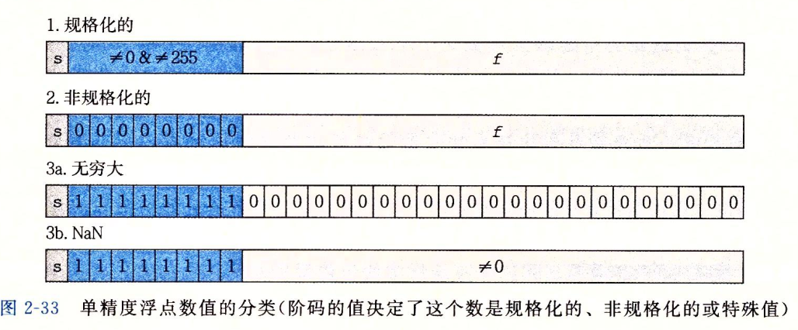

## 浮点数

$$
V = (-1)^s×M×2^E
$$

### 情况1 规格化的值

exp位不全为0或1

阶码字段被解释为以**偏置**形式表示的有符号整数，阶码值 `E = e - Bias`，e是无符号数，e即为e
$$
e = e_{k-1}...e_1e_0
$$
Bias是一个偏置值，单精度127 双精度1023
$$
Bias = 2^{k-1}-1
$$

小数字段frac 为描述小数值f，0<=f<1，其二进制表示为
$$
0.f_{n-1}...f_1f_0
$$
尾数M定义为
$$
M = 1 + f
$$

### 情况2 非规格化的值

阶码域全为0

阶码值 E = 1 - Bias

尾数 M = f

### 情况3 特殊值

阶码全为1

小数域全为0 表示无穷

小数域非0 为NaN（Not a Number）

整数值和单精度浮点值
$$
12345 = 0X3039 = 1.1000000111001_2*2^{13}
$$
使用单精度形式编码，丢弃开头的1，为补全23位，还差10位，末尾增加10个0，得到【10000001110010000000000】

构造阶码	13加上偏置量127 = 140 二进制为【10001100】再加上符号位0

0 10001100 10000001110010000000000即为12345.0

12345.0  0x4640E400

### int float double转换

