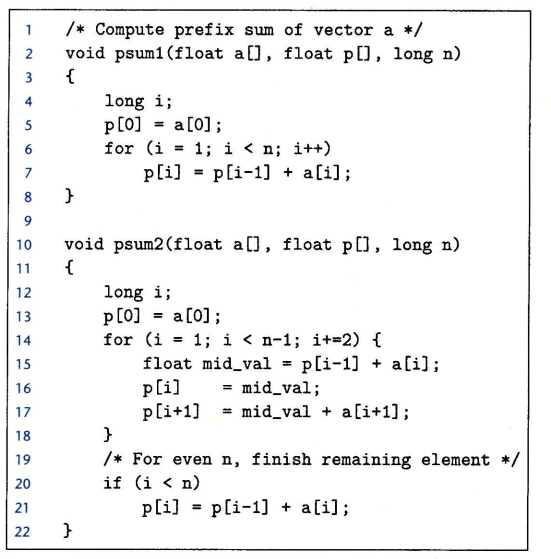
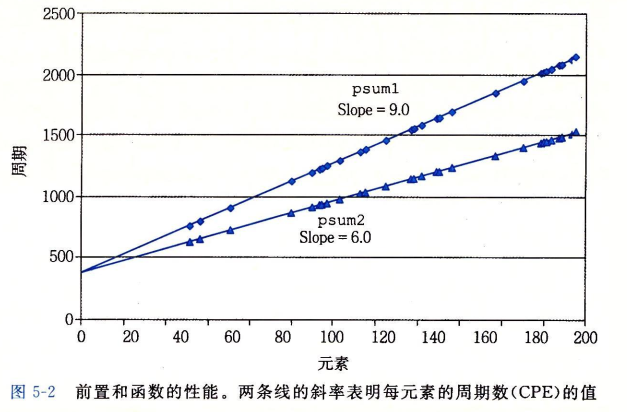

## 优化编译器的能力和局限性

```c
void test1(long *xp, long *yp) {
	*xp += *yp;
	*xp += *yp;
}
void test2(long *xp, long *yp) {
	*xp += 2 * *yp;
}
```

两个函数看似相同，但test2效率更高些，test2只需要3次内存引用（读\*xp，读\*yp，写）

\*xp)，而test1需要6次（2次读\*xp 2次读\*yp 2次写\*xp）

两个指针指向相同内存位置的情况称为**内存别名使用**，在**只执行安全的优化中，编译器必须假设不同的指针可能会指向内存中的同一位置**

## 表示程序性能

**引入度量标准：每元素的周期数（Cycles Per Element,CPE）**

处理器活动顺序由时钟控制，时钟提供了某个频率的规律信号，通常用千兆赫兹（GHz）表示，即十亿周期每秒

4GHz处理器指处理器时钟运行频率每秒$4*10^9$个周期





**斜率即为CPE，集中精力将CPE减小**