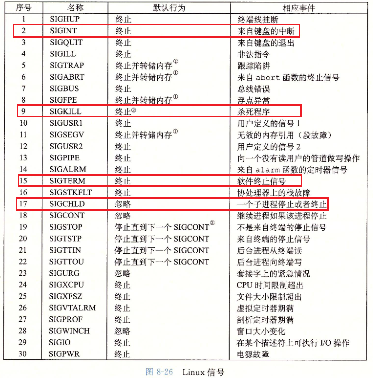

## 异常控制流

从CPU开始运行到结束，程序计数器假设有一个值序列a0,a1,a2,...,an-1

每个ak时某个相应指令Ik的地址，每次从ak到ak+1的过渡成为控制转移(control transfer)，这样的控制转移序列叫做处理器的**控制流**(control flow)

系统通过使控制流发生突变来对特殊情况做反应。一般而言，这些突变称为**异常控制流(Exceptional Control Flow,ECF)**

### 异常

异常时ECF的一种形式，一部分由硬件实现，一部分由OS实现。


当异常处理程序完成处理后，根据异常事件类型，发生一下三种情况之一：

1. 处理程序将控制返回给当前指令，即当前时间发生时正在执行的指令
2. 处理程序将控制返回给下一条指令
3. 处理程序终止被中断的程序

#### 异常处理

异常的每种类型都被分配了一个唯一的非负整数的异常号，系统启动时，OS分配和初始化一张称为**异常表**的跳转表


异常表起始地址放在一个叫做异常表基址寄存器的特殊CPU寄存器中


**异常处理程序运行在内核模式**，意味着对所有系统资源都有访问权限

#### 异常类别

四类：中断(interrupt)、陷阱(trap)、故障(fault)、终止(abort)


- 中断

  中断是异步发生的,其余是同步发生的，是来自处理器外部的I/O设备的信号的结果，硬件中断的异常处理程序通常称为中断处理程序

  处理程序返回时，将控制返回给下一条指令

  

  

- 陷阱

  陷阱时有意的异常，是执行一条指令的结果，陷阱处理程序将控制返回到下一条指令

  最重要用途是在用户程序和内核间提供一个像过程一样的接口，叫**系统调用**

  用户程序经常需要向内核请求服务，为了允许对这些内核服务的受控的访问，处理器提供一条特殊的`syscall n`指令，用户想请求服务n时，可执行该指令。**执行syscall会导致一个异常处理程序的陷阱**

  

- 故障

  故障由错误情况引起，可能被故障处理程序修正。发生时将控制转移给故障处理程序，若**能修正，则将控制返回给引起故障的指令，否则处理程序返回到内核中的abort例程，abort会终止引起故障的应用程序**

  

  > 一个经典示例就是**缺页异常**，当指令引用一个虚拟地址，而与该地址相对应的物理页面不在内存，因此必须从磁盘中去除，就会发生故障，缺页处理程序从磁盘中加载适当的页面，然后将控制返回给引起故障的指令，指令再次执行时，相应物理页已经在内存中，指令就可以正常运行下去

- 终止

  不可修复的致命错误导致的结果，通常是硬件错误。终止程序不将控制返回给应用程序，而将控制返回给abort例程，该例程终止这个应用程序

#### Linux/x86-64系统中的异常


- 故障和终止

  1. 除法错误
  2. 一般保护故障
  3. 缺页
  4. 机器检查

- 系统调用

  x86-64上通过syscall的陷阱指令来调用系统调用，所有Linux的系统调用参数都由通用寄存器来传递，而不是栈传递

  


### 进程

提供给应用程序的关键抽象：

- 一个独立的逻辑控制流
- 一个私有的地址空间

#### 逻辑控制流


一系列程序计数器(PC)的值得序列称为**逻辑控制流，也叫逻辑流**

进程轮流使用CPU，每个进程执行它的流的一部分，然后暂时挂起，轮到其他进程

#### 并发流

一个逻辑流的执行在时间上与另一个流重叠，称为**并发流**

多个流并发地执行一般称为**并发**

一个进程和其他进程轮流运行称为**多任务，也叫作时间分片**

一个进程执行它的控制流的一部分的每段时间称作**时间片**

#### 私有地址空间

进程为每个程序提供假象，好像它在独占使用系统地址空间，即**私有地址空间**

每个私有地址空间结构相同


#### 用户模式和内核模式

处理器必须提供一种机制，限制一个应用可以执行的指令以及它可以访问的地址空间范围

通常用某个控制寄存器中的一个**模式位（mode bit）**来提供该功能，寄存器描述了进程当前享有的特权，设置了模式位，进程运行在内核模式，内核模式中进程可执行指令集中的任何指令，并且可以访问系统任何内存位置，没有设置模式位，进程运行在用户模式，用户模式的进程不能执行特权指令

运行应用程序代码的进程初始在用户模式，从用户模式到内核模式唯一方法是通过中断、故障或陷入系统调用的等异常。异常发生时，控制传递到异常处理程序，处理器从用户模式转为内核模式

Linux提供一种机制，叫/proc文件系统，允许用户模式进程访问内核数据结构的内容。/proc文件系统将许多内核数据结构内容输出为一个用户程序可以读的文本文件的层级结构。例如使用/proc文件系统找出一般的系统属性，如CPU类型(/proc/cpuinfo)，或某个特殊进程使用的内存段(/proc/\<process-id>/maps)

#### 上下文切换

OS内核使用一种称为**上下文切换**的较高层形式的异常控制流来实现多任务，该机制建立在较低层的异常机制下

内核为每个进程维持一个**上下文(context)**，上下文即内核重新启动一个被抢占的进程所需的状态，例如页表、进程表、文件表等

内核选择一个新进程运行时，即内核调度了该进程，在内核调度了一个新进程运行后，就抢占当前进程，并使用上下文切换的机制来将控制转移到新进程

上下文切换：

- 保存当前进程上下文
- 恢复某个先前被抢占的进程被保存的上下文
- 将控制传递给新恢复的进程


内核代表用户执行系统调用，可能发生上下文切换

系统调用因为等待某事件而阻塞，则内核可让当前进程休眠，切换到另一进程

中断也可引发上下文切换


#### 系统调用错误处理

strerror函数返回一个文本串，描述和某个errno值相关联的错误

```c
void error_msg(char* msg) {
	fprintf(stderr,"%s:%s\n",msg,strerror(errno));
	exit(0);
}
```

使用错误处理包装函数，可进一步简化代码

```c
pid_t Fork() {
	pid_t pid;
    if ((pid = fork()) < 0) {
        error_msg("Fork error");
    }
    return pid;
}
```


### 进程控制

#### 获取进程ID

每个进程都有一个唯一正数进程ID(PID)

```c
#include <sys/types.h>
#include <unistd.h>
typedef int pid_t;
pid_t getpid();		// 当前进程PID
pid_t getppid();	// 当前进程父进程PID
```

#### 创建、终止进程

进程总处于三种状态中：

- 运行

  此时要么在CPU上执行，要么在等待被执行且最终会被内核调度

- 停止

  进程被挂起，且不会被调度。收到SIGSTOP SIGTSTP SIGTTIN SIGTTOU时，进程停止，并保持停止直到收到一个SIGCONT信号，此时进程再次运行

- 终止

  进程永远地停止。

  三种原因：

  1. 收到一个信号，该信号默认行为是终止进程

  2. 从主程序返回

  3. 调用exit函数

     ```c
     #include <stdlib.h>
     void exit(int stat);  		// 已stat退出状态来终止进程 
     ```

  

#### 回收子进程

**一个进程终止时，内核并不是将其立刻从系统中清除，直到被它的父进程回收。**

父进程回收已终止的子进程时，内核将子进程退出状态返回给父进程，然后抛弃已终止的进程，此时该进程就不存在了

**一个终止了但未被回收的进程称为僵死进程(zombie)**

如果一个父进程终止，内核会安排init进程成为它的孤儿进程的父进程，init进程PID为1，是系统启动时由内核创建的，不会终止

一个进程可通过调用waitpid函数来等待它的子进程终止或停止

```c
#include <sys/types.h>
#include <wait.h>
// 成功返回子进程PID  WNOHANG(不阻塞模式，不等待)则返回0 其他错误为-1
pid_t waitpid(pid_t pid, int *statusp, int options);
```

默认情况下(options==0)，waitpid挂起调用进程的执行，直到它的等待集合中的一个子进程终止。如果等待集合中一个进程在刚调用时就终止了，waitpid就立即返回。以上两张情况waitpid返回已终止的子进程PID

1. 判定等待集合的成员

   等待集合的成员由参数pid确定：

   - pid>0，等待集合就是一个单独子进程，进程ID==pid
   - pid==-1，等待集合就是由父进程所有子进程组成的

2. 修改默认行为

   可通过将options设置为常量WNOHANG、WUNTRACED和WCONTINUED的各种组合来修改默认行为

   

3. 检查已回收子进程的退出状态

   如果statusp参数非空，则waitpid就会在status中放上关于导致返回的子进程的状态信息，status时statusp指向的值。以下为status参数的几个宏：

   

4. 错误条件

   如果调用进程没有子进程，waitpid返回-1，并设置errno为ECHILD。如果waitpid被一个信号中断，返回-1，设置errno为EINTR

```c
#include <sys/types.h>
#include <wait.h>
// waitpid函数简化版，相当于waitpid(-1,&status,0)
pid_t wait(int *statusp);
```


#### 进程休眠

```c
#include <unistd.h>
unsigned int sleep(unsigned int secs);

int pause();	// 让调用函数休眠，知道该进程收到一个信号
```

#### 加载并运行程序

```c
#include <unistd.h>
int execve(const char *filename, const char *argv[], const char *envp[]);
```

execve加载并运行可执行目标文件filename，argv为参数列表，envp为环境变量列表，fork调用一次返回两次，**execve调用一次并从不返回**

execve加载filename后，调用启动代码，并将控制传递给新程序的主函数


> ##### fork和execve区别
>
> - fork函数在新的子进程中运行相同的程序，新的子进程时父进程的复制品
>
> - execve函数在当前进程上下文中加载并运行一个新的程序。会覆盖当前进程的地址空间，但并没有创建新的进程。新程序仍有相同PID，并继承了调用execve函数时以及打开的所有文件描述符


### 信号

信号通知进程系统中发生了一个某种类型的事件



#### 信号术语

- 发送信号

  - 两种原因：
    - 内核检测到一个系统事件，如除零错误或者子进程终止
    - 一个进程调用了kill函数，显式地要求内核发送一个信号给目的进程

- 接受信号

  目的进程被内核强迫以某种方式对信号的发送做出反应，它就接受了信号。进程可忽略、终止或执行一个信号处理程序(singal handler)的用户层函数捕获这个信号


一个发出但没有被接受的信号称为待处理信号，**任何时刻一种类型最多只会有一个待处理信号，如果一个进程有一个类型为k的待处理信号，那么任何接下来发送到这个进程的类型为k的信号都不会排队等待，而是被丢弃**

#### 发送信号

发送信号机制基于**进程组**的概念

1. 进程组

   每个进程都只属于一个进程组，由一个正整数进程组ID表示

   ```c
   #include <unistd.h>
   // 获取调用进程的进程组ID
   pid_t getpgrp();
   // 进程可以通过setpgid改变自己或其他进程的进程组
   // 将当前pid进程组改变为pgid，如果pid==0则使用当前进程PID pgid==0，就用pid指定进程PID作为进程组ID
   int setpgid(pid_t pid, pid_t pgid);	// 成功0 错误-1
   ```

2. 用`/bin/kill`程序发送信号

   ```bash
   > kill -9 pid
   ```

3. 键盘发送信号

   Unix shell使用作业(job)这个抽象概念表示为对一条命令行求值而创建的进程，任何时刻，至多一个前台作业和0或多个后台作业

   `ls | sort`创建两个进程组成的前台作业，两个进程通过Unix管道连接：一个运行ls，一个运行sort程序。shell为每个作业创建独立进程组。进程组ID通常取自作业中父进程的一个，如下图所示

   

4. 用kill函数发送信号

   ```c
   #include <sys/types.h>
   #include <signal.h>
   // 成功0 错误-1
   // pid == 0 发送信号sig给调用进程所在进程组的每个进程
   // pid < 0，发送信号sig给进程组|pid|中每个进程
   int kill(pid_t pid, int sig);
   ```

5. alarm函数发送信号

   ```c
   #include <unistd.h>
   // 安排内核在secs秒后发送一个SIGALRM信号给调用进程
   // 返回：前一次闹钟剩余秒数，若以前没有设定闹钟，则为0
   unsigned int alarm(unsigned int secs);
   ```


#### 接收信号

每个信号类型都有预定义默认行为，为下面一种：

- 进程终止
- 进程终止并转储内存
- 进程挂起直到被SIGCONT信号重启
- 进程忽略该信号

```c
#include <signal.h>
typedef void (*sighandler_t)(int);
sighandler_t signal(int signum, sighandler_t handler);
```

- handler是SIG_IGN，忽略该信号
- handler是SIG_DFL，类型为signum的信号恢复为默认行为
- 自己设计函数，该函数为信号处理程序，信号处理程序也可以被信号中断，如下图所示


#### 阻塞和解除阻塞信号

> 信号的阻塞就是通知系统内核暂时停止向进程发送指定的信号，而是由内核对进程接收到的相应信号进行缓存排队，直到进程解除对相应信号的阻塞为止。一旦进程解除对该信号的阻塞，则缓存的信号将被发送到相应的进程。
>
> 信号在几种情况下会进入阻塞状态。
>
> 1）系统自动阻塞：在信号的处理函数执行过程中，该信号将被阻塞，直到信号处理函数执行完毕，该阻塞将会解除。这种机制的作用主要是避免信号的嵌套。
>
> 2）通过sigaction实现人为阻塞：在使用sigaction安装信号时，如果设置了sa_mask阻塞信号集，则该信号集中的信号在信号处理函数执行期间将会阻塞。这种情况下**进行信号阻塞的主要原因是：一个信号处理函数在执行过程中，可能会有其他信号到来。此时，当前的信号处理函数就会被中断。而这往往是不希望发生的。此时，可以通过sigaction系统调用的信号阻塞掩码对相关信号进行阻塞。**通过这种方式阻塞的信号，在信号处理函数执行结束后就会解除。
>
> 3）通过sigprocmask实现人为阻塞：可以通过sigprocmask系统调用指定阻塞某个或者某几个信号。这种情况下进行信号阻塞的原因较多，一个典型的情况是：某个信号的处理函数与进程某段代码都要某个共享数据区进行读写。如果当进程正在读写共享数据区的过程中，一个信号过来，则进程的读写过程将被中断转而执行信号处理函数，而信号处理函数也要对该共享数据区进行读写，这样共享数据区就会发生混乱。这种情况下，需要在进程读写共享数据区前阻塞该信号，在读写完成后再解除该信号的阻塞。

Linux提供阻塞信号的隐式、显式机制

- 隐式阻塞机制

  内核默认阻塞任何当前处理程序正在处理信号类型的待处理的信号。例如上图，捕获s信号，运行处理程序S，如果发送另一信号s，直到处理程序S返回，s会变成待处理而没有被接收

- 显式阻塞机制，可使用sigpromask函数和其辅助函数，明确阻塞、解除阻塞选定的信号

  ```c
  #include <signal.h>
  // 成功0 失败-1
  // how 	SIG_BLOCK把set中信号添加到blocked中(blocked |= set)
  //		SIG_UNBLOCK从blocked中删除set中的信号(blocked = blocked & ~set)
  //      SIG_SETMASK blocked = set
  int sigprocmask(int how, const sigset_t *set, sigset_t *oldset);
  // 初始化set集合为空
  int sigemptyset(sigset_t *set);
  // 把每个信号都添加到set中
  int sigfillset(sigset_t *set);
  // signum添加到set
  int sigaddset(sigset_t *set, int signum);
  // signum删除
  int sigdelset(sigset_t *set, int signum);
  // 若signum是set成员则返回1，不是0，出错-1
  int sigismember(const sigset_t *set, int signum);
  ```

  

#### 编写信号处理程序

##### 安全的信号处理

- 处理程序尽可能简单

- 处理程序中只调用异步信号安全的函数

  唯一安全的输出函数是write

  

- 保存和恢复errno

  许多linux异步信号安全函数都会出错时设置errno，这样可能干扰主程序中依赖errno的部分。解决方法是把errno保存到一个局部变量中，处理程序返回前恢复它。注意只有在处理程序要返回时才必须这样，若处理程序调用_exit终止该程序，则不需要

- 阻塞所有信号，保护对共享全局数据结构的访问

  如果处理程序和主程序或其他处理程序共享一个全局数据结构，在访问该数据结构时，你的处理程序和主程序应暂时阻塞所有信号

- 用volatile声明全局变量，告诉编译器不要缓存该变量

- 用`sig_atomic_t`声明标志。保证该变量使用或赋值时都是原子性的

##### 正确的信号处理

如果一个存在一个未处理信号则表明**至少**有一个信号到达了


可以看到尽管发送了3个SIGCHLD信号给父进程，但只有2个信号被接收，有一个进程并未被接收，因为如果处理信号时其他信号到达，则会丢弃，因此**不可以用信号来对其他进程中发生的事件计数**


##### 可移植的信号处理

Unix信号处理缺陷在于不同系统有不同的信号处理语义

- signal函数语义各有不同，有的在捕获信号后会恢复到默认值是，导致每次调用必须显式地重新设置
- 系统调用可以被中断

为解决以上问题，使用sigaction函数

```c
#include <signal.h>
int sigaction(int signum, struct sigaction *act, struct sigaction *oldact);
```

```c
// 封装的signal函数
handler_t *Signal(int signum, handler_t *handler) {
	struct sigaction action, old_action;
	action.sa_handler = handler;
	sigemptyset(&action.sa_mask);
	action.sa_flags = SA_RESTART;
	if(sigaction(signum, &action, &old_action) < 0) 
		unix_error("Signal error");
	return old_action.sa_handler;
}
```


#### 同步流以避免讨厌的并发错误


#### 显式地等待信号

```c
#include <signal.h>
// 暂时用mask替换当前阻塞集合，挂起该进程，直到收到一个信号，其行为要么是运行handler，要么是终止进程。
// 终止进程，那么进程不从sigsuspend返回，而是直接终止该进程
// 运行handler则从sigsuspend中返回，恢复调用sigsuspend时原有的阻塞集合
int sigsuspend(const sigset_t *mask);
```

`sigsuspend`等价于如下的原子性版本


```c
#include <signal.h>
#include <sys/types.h>
#include <unistd.h>
#include <string.h>
#include <stdlib.h>
#include <errno.h>
#include <stdio.h>
void handler(int sig) {
  int old = errno;
  const char *str = "sig num is ";
  write(STDOUT_FILENO,str,strlen(str));
  errno = old;
}

int main() {
  sigset_t mask,prev;
  signal(SIGCHLD,handler);
  signal(SIGINT,handler);
  sigemptyset(&mask);
  sigaddset(&mask,SIGINT);
  sigaddset(&mask,SIGCHLD);
  sigprocmask(SIG_BLOCK, &mask, &prev); // 阻塞mask中的signum => SIGINT SIGCHLD，此时再次触发这两个信号不会反应，直到UNBLOCK
  if(fork() == 0)
    exit(0);
  int i = 0;
  while(i++ < 5) {
    printf("...\n");
    sleep(1);
  }
  sigprocmask(SIG_UNBLOCK, &prev, NULL); // UNBLOCK后会受到阻塞期间的信号，但每种最多一个
  while(1)
    sigsuspend(&prev); 	// 在prev的信号会阻塞，等待其余信号
  return 0;
}
```


### 非本地跳转

C语言提供了一种**用户级异常控制流形式**，称为**非本地跳转**，将控制从一个函数转移到另一个当前正在执行的函数中，而不需要经过正常调用-返回序列。

```c
#include <setjmp.h>
int setjmp(jmp_buf env);	// 返回0  longjmp返回非0
int sigsetjmp(sigjmp_buf env, int savesigs);

void longjmp(jmp_buf env, int retval);
void siglongjmp(sigjmp_buf env, int retval);	// 从不返回
```

