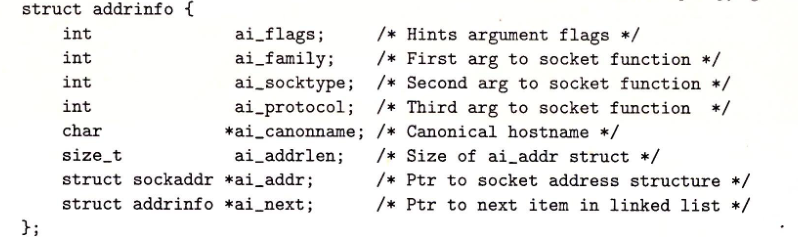
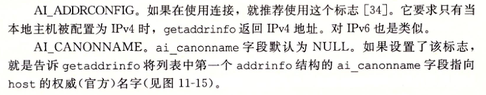
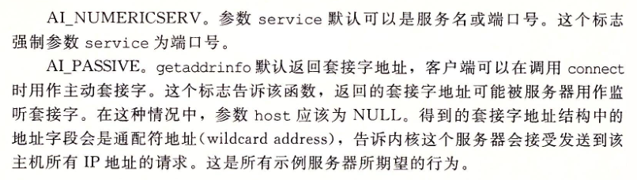

## 网络编程

### IP地址

```c
#include <arpa/inet.h>

uint32_t htonl(uint32_t hostlong);
uint16_t htons(uint16_t hostshort);

uint32_t ntohl(uint32_t netlong);
uint16_t ntohs(uint16_t netshort);

// 成功为1 src若为非法点分十进制地址则为0 出错-1
// 将一个点分十进制串src转换为一个二进制的网络字节序IP地址dst
int inet_pton(AF_INET, const char* src, void* dst);
// 成功返回指向点分十进制字符串的指针，若出错则为NULL
const char* inet_pton(AF_INET, const void* src, char* dst, socklen_t size);
```


### 主机和服务的转换

#### getaddrinfo函数

```c
#include <sys/types.h>
#include <sys/socket.h>
#include <netdb.h>
// 成功0 错误则为非0错误代码
/*
	给定host service，返回result，result指向addrinfo结构的链表，每个结构对应于host和service的套接字地址结构
	host可以使域名、也可以是数字地址（点分十进制IP） service可以使服务名（http），也可以是十进制端口号，二者其中之一可以为null，但必须有一个不为null
	可选参数hints提供对result更好的控制，要传递改参数，只能设置下列字段：
		ai_family ai_socktype ai_protocol ai_flags,其余字段必须为0
		ai_family设置为AF_INET限制为IPV4 AF_INET6限制为IPV6
		ai_flags是一个位掩码，具体如下图
*/
int getaddrinfo(const char *host, const char *service,
				const struct addrinfo *hints,
				struct addrinfo **result);
```





