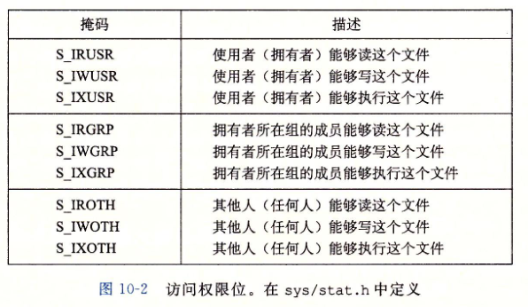
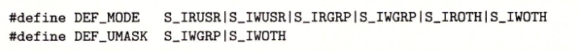

## 系统级I/O

### Unix I/O

linux文件就是一个m字节的序列，所有**IO设备都被看做文件**，**输入输出都当做文件的读和写来执行**，linux内核设计简单、低级的应用接口，称为Unix I/O

- 打开文件

  应用程序通过要求内核打开相应文件，宣告它想访问一个IO设备。**内核返回一个描述符**，后续所有操作都使用这个描述符

- shell为每个进程开始时打开三个文件，标准输入、输出、错误，在`unistd.h`文件中定义了`STDIN_FILENO`,`STDOUT_FILENO`,`STDERR_FILENO`

- 改变当前文件位置

  打开的文件，内核保持一个**文件位置k**，初始为0，是文件的偏移量。通过执行seek显式地将文件位置修改

- 读写文件

  读操作即从文件复制n个字节到内存，从当前文件位置k开始，增加到k+n。给定m大小的文件，若k>=m时执行读操作会触发end-of-file(EOF)

- 关闭文件

  完成对文件的访问，通知内核关闭，内核释放文件打开时创建的数据结构，并将描述符恢复到可用的描述符池中，**无论进程何种原因终止，内核都会关闭所有打开文件并释放内存**


### 文件

- 普通文件：文本文件和二进制文件，对内核而言二者无区别
- 目录：包含一组链接的文件，每个链接将一个文件名映射到文件上
- 套接字：与另一个进程进行跨网络通信的文件


### 打开关闭文件

```c
#include <sys/types.h>
#include <sys/stat.h>
#include <fcntl.h>
// 成功返回fd，失败-1
/*
	flags O_RDONLY O_WRONLY O_RDWR O_CREAT O_TRUNC(文件存在则截断) O_APPEND
	mode指定新文件的访问权限，如图10-2所示，每个进程有一个umask，通过调用umask来设置，进程通过带某个mode参数的open函数调用来创建新文件时，文件默认访问权限设置为mode & ~umask,下图给定mode umask默认值
	例：
	umask(DEF_UMASK);	// mask = DEF_UMASK 
	// DEF_MODE & ~DEF_UMASK 将其他用户写权限去除，文件拥有者有读写权限，其他用户都有读权限
	fd = open("foo.txt", O_CREAT | O_TRUNC | O_WRONLY, DEF_MODE);
*/
int open(char *filename, int flags, mode_t mode);

#include <unistd.h>
int close(int fd);
```






### 读和写文件

```
#include <unistd.h>
// 成功返回所读字节数，EOF则为0，出错-1
ssize_t read(int fd, void *buf, size_t n);
// 成功返回写的字节数，出错-1
ssize_t write(int fd, const void *buf, size_t n);
```

