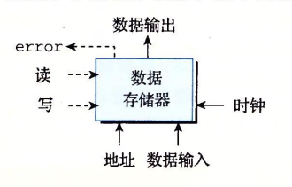
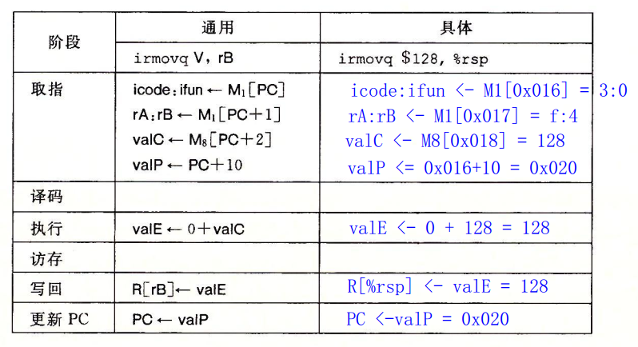
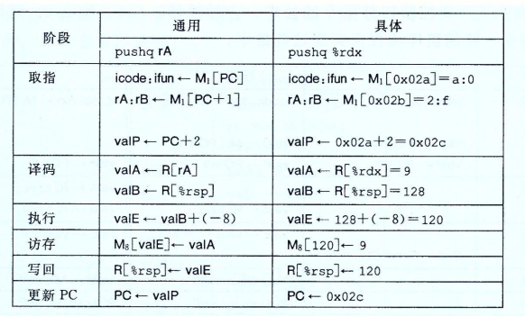
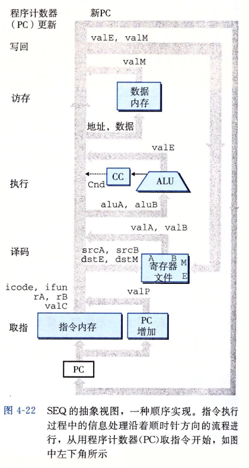

本章自定义一个Y86-64指令集

## Y86-64指令集体系结构

### 程序员可见的状态

每条指令都会读取或修改处理器状态的某些部分

设置15个寄存器


Y86-64用虚拟地址引用内存位置

### Y86-64指令

指令集基本是x86-64的子集

只有8字节数据(字word)


### 指令编码


15个寄存器对应范围0-0xE之间的寄存器标识符


例如用16进制表示指令`rmmovq %rsp,0x123456789abcd(%rdx)`字节编码

```asm
rmmovq	%rsp 	%rdx	小端 0x123456789abcd先填充为 0x000123456789abcd
40 		4		2 		cdab896745230100
```

30F30F00000000000000

#### RISC和CISC指令集

x86-64有时候称为CISC：复杂指令集计算机

RISC：精简指令集计算机


### Y86-64异常


### Y86-64程序


## 逻辑设计和硬件控制语言HCL

### 逻辑门


### 组合电路和HCL布尔表达式

多个逻辑门组合成一个网，构建成计算块，成为**组合电路**，如何构成有以下限制


```c
bool out = (s && a) || (!s && b);
```


###  字级的组合电路和HCL整数表达式

测试两个64位字是否相等。当且仅当A每一位都和B的相应位相等时，输出才为1


HCL中，多路复用函数用情况表达式来描述，通用格式如下

```
[
	select1 : expr1;
	select2 : expr2;
	.
	.
	.
	selectk : exprk;
]
```

每种情况i都有一个布尔表达式 $ select_i $ 和一个整数表达式$ expr_i $，前者表面什么时候选择此情况，后者指明得到的值

例如设计一个逻辑电路找A、B和C中最小值


### 集合关系

很多时候需要将一个信号与许多可能匹配的信号作比较

假设一个两位信号code中选择高位和低位来位下图的四路复用器s1和s0


```c
bool s1 = code == 2 || code == 3;
bool s2 = code == 1 || code == 3;
```

一种更简洁的方式是集合

```
bool s1 = code in {2, 3};
bool s0 = code in {1, 3};
```

### 存储器和时钟

组合电路本质上不存储任何信息，它们只是简单地响应输入信号

为了产生时序电路，我们必须引入按位存储信息的设备

**存储设备都是由同一个时钟控制的，时钟是一个周期性信号，决定什么时候把新值加载到设备中**

#### 两类存储器设备：

- 时钟寄存器（寄存器）：存储单个位或字。时钟信号控制寄存器加载输入值

- 随机访问存储器（内存）：存储多个字，用地址选择该读、写哪个字

  随机访问存储器例子包括

  - 处理器的虚拟内存系统
  - 寄存器文件


下图展示一个典型寄存器文件：


寄存器文件两个读端口A、B，一个写端口W，允许同时进行多个读和写操作

**读数据好像它是一个以地址为输入、数据为输出的组合逻辑块。srcA、srcB被设为某个寄存器ID时，一段延迟后，存储在相应寄存器的值就会出现在valA、valB上**

**向寄存器文件写入字是由时钟信号控制的，类似于将值加载到时钟寄存器。每次时钟上升时，输入valW的值会被写入输入dstW上的寄存器ID指示的程序寄存器**

**dstW设为特殊值0xF时，不会写入任何寄存器**

下图为一个随机访问存储器来存储程序数据：



读数据时，输入地址，若地址合法，write信号设置为0，经过一些延迟后，存储在那个地址上的数据会出现在输出data上；地址超出范围则会将error信号设置为1

写数据时，输入地址和数据data，write设置为1，则当我们控制时钟时，只要地址合法，则会更新内存中指定的位置；不合法error信号设置为1


## Y86-64的顺序实现

描述一个SEQ的处理器

每个时钟周期上，SEQ执行处理一条完整指令所需的所有步骤，不过需要一个很长的时钟周期时间

### 将处理组织成阶段

一条指令包括很多操作，但所有指令都遵循统一的序列，下列为各阶段内执行操作的简略描述

- 取指（fetch）

  从内存读取指令字节，地址为程序寄存器PC的值，从指令中抽取出指示符字节的两个四位部分，成为icode（指令代码）和ifun（指令功能）。它可能去除一个寄存器指示符字节，指明一个或两个寄存器操作数指示符rA和rB。它还可能去除一个四字节常数字valC。它按顺序方式计算当前指令的下一条指令的地址valP。即valP = PC + 已取出指令长度

- 译码（decode）

  从寄存器文件读入最多两个操作数，得到值valA和/或valB，通常读入指令rA和rB指明的寄存器，有些指令是读寄存器%rsp的

- 执行（execute）

  算数/逻辑单元（ALU)要么执行指令操作（根据ifun值），计算内存引用有效地址；要么增加、减少栈指针

- 访存（memory）

  将数据写入内存，或从内存读出数据。读出值为valM

- 写回（write back）

  最多可以写两个结果到寄存器文件

- 更新PC（PC update）

  将PC设置成下一条指令

处理器无限循环执行这些阶段，在Y86-64中，任何异常都会导致处理器停止，即执行halt指令或非法指令，或它试图读、写非法地址时

#### 下图给出相关指令所需的处理


### 图4-17例子


#### 跟踪subq（line 3）

(%rdx) = 9 (%rbx) = 23

M1表示访问一个字节	M8表示访问8个字节


#### 跟踪irmovq（line 4）



#### 跟踪rmmovq（line 5）


#### 跟踪pushq（line 6）



#### 跟踪popq（line 7）


#### 跟踪je（line 8）


Cnd为一个一位信号，如果标志为1，则PC修改为valC否则为valP，类似三目运算符


#### 跟踪call（line 9）


#### 跟踪ret（line 13）


### SEQ硬件结构



### SEQ的时序

SEQ的实现包括组合逻辑和两种存储器设备：时钟寄存器(程序计数器和条件码寄存器)，随机访问存储器(存储器文件、指令内存和数据内存)

其中**只需对两种存储器设备进行时序控制**

这些单元通过一个时钟信号来控制，每个时钟周期，程序计数器都会加载新的指令地址

只有执行整数运算指令，才会装载条件码寄存器

执行rmmovq、pushq或call指令，才会写数据内存

寄存器文件两个写端口允许每个时钟周期更新两个程序寄存器