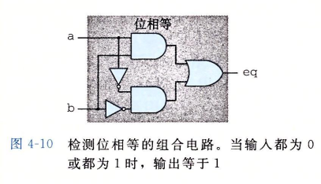

本章自定义一个Y86-64指令集

## Y86-64指令集体系结构

### 程序员可见的状态

每条指令都会读取或修改处理器状态的某些部分

设置15个寄存器


Y86-64用虚拟地址引用内存位置

### Y86-64指令

指令集基本是x86-64的子集

只有8字节数据(字word)


### 指令编码


15个寄存器对应范围0-0xE之间的寄存器标识符


例如用16进制表示指令`rmmovq %rsp,0x123456789abcd(%rdx)`字节编码

```asm
rmmovq	%rsp 	%rdx	小端 0x123456789abcd先填充为 0x000123456789abcd
40 		4		2 		cdab896745230100
```

30F30F00000000000000

#### RISC和CISC指令集

x86-64有时候称为CISC：复杂指令集计算机

RISC：精简指令集计算机


### Y86-64异常


### Y86-64程序


## 逻辑设计和硬件控制语言HCL

### 逻辑门


### 组合电路和HCL布尔表达式

多个逻辑门组合成一个网，构建成计算块，成为**组合电路**，如何构成有以下限制


```c
bool out = (s && a) || (!s && b);
```



###  字级的组合电路和HCL整数表达式

测试两个64位字是否相等。当且仅当A每一位都和B的相应位相等时，输出才为1


HCL中，多路复用函数用情况表达式来描述，通用格式如下

```
[
	select1 : expr1;
	select2 : expr2;
	.
	.
	.
	selectk : exprk;
]
```

每种情况i都有一个布尔表达式 $ select_i $ 和一个整数表达式$ expr_i $，前者表面什么时候选择此情况，后者指明得到的值

例如设计一个逻辑电路找A、B和C中最小值


### 集合关系

很多时候需要将一个信号与许多可能匹配的信号作比较

假设一个两位信号code中选择高位和低位来位下图的四路复用器s1和s0


```c
bool s1 = code == 2 || code == 3;
bool s2 = code == 1 || code == 3;
```

一种更简洁的方式是集合

```
bool s1 = code in {2, 3};
bool s0 = code in {1, 3};
```

### 存储器和时钟

