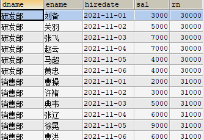
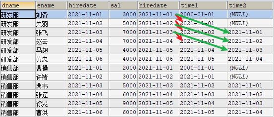

## MYSQL基本数据操作

## DDL：Data Definition Language(数据定义语言)

- ### 对数据库的常用操作

  

- ### 对表的常用操作

  

  ```mysql
  CREATE TABLE IF NOT EXISTS student(
      sid INT,
      NAME VARCHAR(20),
      gender VARCHAR(20),
      age INT,
      birth DATE,
      address VARCHAR(20),
      score DOUBLE
  )
  ```

  ##### 数据类型

  1. 数值类型

     

     #### `decimal(5,2)总共5位有效小数2位`

  2. 日期和时间类型

     

  3. 字符串类型

     

- ### 对表的常用操作

  

  #### 修改表

  
  
  ```mysql
  -- 添加表列
  ALTER TABLE student ADD `dept` VARCHAR(20);
  -- 修改列名
  ALTER TABLE student CHANGE dept department VARCHAR(20);
  -- 删除列
  ALTER TABLE student DROP department;
  -- 修改表名
  RENAME TABLE student TO stu;
  ```

## DML:Data Manipulation Language(数据操作语言)

- ### 数据插入

  

- ### 数据修改

  

- ### 数据删除

  

  ```mysql
  delete from stu where sid = 1;
  -- 删除表所有数据
  delete from stu;
  -- 清空表数据
  -- 可以理解为删除了表并创建了新表 和delete不同
  truncate table stu;
  truncate stu;
  ```

## DQL:基本查询


执行顺序：from->where->group by->count()->having->select->order by->limit

### 排序查询

```mysql
select 
字段1, 字段2 ...
from 表名
order by 字段1 [asc | desc], 字段名2[asc | desc]...
```

- #### 特点

  - asc升序 desc降序
  - order by用于子句中可以支持单个字段、多个字段，表达式，函数，别名
  - order by自居放在查询语句最后面。limit子句除外

### 聚合查询

- #### 聚合函数

  

```mysql
-- ------------
-- 聚合查询
-- 1 查询商品总数
SELECT COUNT(pid) FROM product;
SELECT COUNT(*) FROM product;
-- 2 查询价格大于5000的商品总条数
SELECT COUNT(*) FROM product WHERE price > 5000;
-- 3 查询分类为'c001'的所有商品总和
SELECT SUM(price) FROM product WHERE category_id='c001';
-- 4 查询商品最大、最小价格
SELECT MAX(price) FROM product;
SELECT MIN(price) FROM product;
SELECT MAX(price) max_price,MIN(price) min_price FROM product;
-- 5 查询分类为'c001'所有商品平均价格
SELECT AVG(price) FROM product WHERE category_id = 'c001';
```

- #### NULL值处理

  - 如果count参数为*，则统计所有记录的个数，而如果参数为某字段，则不统计含null值的个数
  - sum、avg、max和min忽略null值存在，avg和sum忽略它，仿佛这条记录不存在，例如四条记录 6 3 3 null 则avg为4

### 分组查询

```mysql
select 
字段1, 字段2 ...
from 表名
group by 分组字段
having 分组条件;


-- 分组查询
-- 1 统计各个分类商品的个数
SELECT category_id,COUNT(*) FROM product GROUP BY category_id;
-- 2 统计price和种类都相同的个数
SELECT category_id,COUNT(*) FROM product GROUP BY price,category_id;
-- 3 统计各个分类商品个数大于1的
SELECT category_id,COUNT(*) cnt 
FROM product 
GROUP BY category_id 
HAVING cnt > 1 
ORDER BY cnt DESC;
```


- 分组后统计结果筛选必须用having，不能用where
- where子句用来筛选from子句中指定的操作所产生的行
- group by子句用来分组where子句的输出
- having子句用来从分组的结果中筛选行

### 分页查询

```mysql
-- 方式1 显示前n条
select 字段1, 字段2 ... from 表名 limit n;
-- 方式2 分页显示
select 字段1, 字段2 ... from 表名 limit m,n;
-- m 整数，表示从第几条索引开始，计算方式 (当前页-1)*每页显示条数
-- n 整数，表示查询多少条数据

-- 分页查询
-- 从第4条开始，显示5条
SELECT * FROM product LIMIT 3,5;
-- 分页显示
SELECT * FROM product LIMIT 0,5; -- 第一页 （1-1）*5
SELECT * FROM product LIMIT 5,5; -- 第二页 （2-1）*5
```

### INSERT INTO SELECT语句

- 将一张表的数据导入到另一张表，可以使用INSERT INTO SELECT语句

```mysql
-- 要求table2必须存在
insert into table2(filed1,filed2,...) select val1, val2,... from table1;
-- 或者
insert into table2 select * from table1;


CREATE TABLE product2(
	pname VARCHAR(20),
	price DOUBLE
);

INSERT INTO product2(pname,price) SELECT pname,price FROM product;
SELECT * FROM product2;

CREATE TABLE product3(
	pname VARCHAR(20),
	price DOUBLE
);
INSERT INTO product3 SELECT * FROM product2;
SELECT * FROM product3;
```

### 正则表达式

```mysql
-- 正则表达式
-- ^ 在字符串开始处匹配
SELECT 'abc' REGEXP '^a'; -- 字符串是否以a开头
SELECT * FROM product WHERE pname REGEXP '^欧';

-- $ 在字符串末尾匹配
SELECT 'abc' REGEXP 'a$'; -- 0
SELECT 'abc' REGEXP 'c$'; -- 1
SELECT * FROM product WHERE pname REGEXP '给$';

-- . 匹配任意字符,可匹配除换行符之外的任意字符
SELECT 'abc' REGEXP '.b';  -- 1 匹配ab
SELECT 'abc' REGEXP '..c'; -- 1 匹配abc
SELECT 'abc' REGEXP 'a.';  -- 1 匹配ab

-- [...] 匹配括号内任意单个字符
SELECT 'abc' REGEXP '[xyz]';  -- 0
SELECT 'abc' REGEXP '[axyz]'; -- 1

-- [^...] ^在[]内为取反的意思，别的地方表示为开始处匹配
SELECT 'a' REGEXP '[^abc]'; -- 0 表示字符串是否有除abc外的其他
SELECT 'x' REGEXP '[^abc]'; -- 1
SELECT 'abc' REGEXP '[^a]'; -- 1

-- a* 匹配0个或多个a，包括空字符串。 
-- 可作为占位符使用，有没有指定字符都可以匹配到数据 
SELECT 'stab' REGEXP '.ta*b'; -- 1
SELECT 'stb' REGEXP '.ta*b';  -- 1 a出现0次或多次都可以 
SELECT '' REGEXP 'a*';        -- 1 空字符串也可以

-- a+ 匹配一个或多个a，不包括空字符串
SELECT 'stab' REGEXP '.ta+b'; -- 1
SELECT 'stb' REGEXP '.ta+b';  -- 0 a至少出现一次

-- a? 匹配0个或1个a
SELECT 'stb' REGEXP '.ta?b';   -- 1  
SELECT 'stab' REGEXP '.ta?b';  -- 1
SELECT 'staab' REGEXP '.ta?b'; -- 0 

-- a1|a2 匹配a1或a2
SELECT 'a' REGEXP 'a|b';	-- 1
SELECT 'b' REGEXP 'a|b'; 	-- 1
SELECT 'b' REGEXP '^(a|b)'; 	-- 1 表示以a或b开头
SELECT 'c' REGEXP '^(a|b)'; 	-- 0

-- a{m} 匹配m个a
SELECT 'auuuuc' REGEXP 'au{4}c';  -- 1
SELECT 'auuuuc' REGEXP 'au{3}c';  -- 0

-- a{m,} 匹配m个或更多个a
SELECT 'auuuuc' REGEXP 'au{3,}c'; -- 1
SELECT 'auuuuc' REGEXP 'au{4,}c'; -- 1
SELECT 'auuuuc' REGEXP 'au{5,}c'; -- 0

-- a{m,n} 匹配m到n个a 包含m n
SELECT 'auuuuc' REGEXP 'au{3,5}c';  -- 1
SELECT 'auuuuc' REGEXP 'au{4,5}c';  -- 1
SELECT 'auuuuc' REGEXP 'au{5,10}c'; -- 0

-- (abc) abc作为一个序列匹配，不用括号表示单个字符匹配
SELECT 'xababy' REGEXP 'x(abab)y'; -- 1
SELECT 'xababy' REGEXP 'x(ab)*y';  -- 1
SELECT 'xababy' REGEXP 'x(ab){1,2}y'; -- 1 ab出现1到2次
SELECT 'xababy' REGEXP 'x(ab){3,4}y'; -- 0
```


## MYSQL约束

概念：表中数据的限制条件

### 主键约束

#### 概念

- 是一个列或多个列的组合，其值能唯一地标识表中每一行，方便地尽快找到某一行
- 主键约束相当于唯一约束+非空约束的组合，**主键约束不允许重复，也不允许出现空值**
- 每个表最多一个
- 关键字：primary key
- 创建主键约束时，系统默认会在所在的列和列组合上建立对应的唯一索引

#### 操作

- 添加单列主键

  ```mysql
  -- 定义字段时指定主键
  create table 表明 (
  	...
  	<字段名> <数据类型> primary key
  	...
  );
  -- 定义字段后再指定主键
  create table 表明 (
  	...
      -- constraint可省略
  	[constraint <约束名>] primary key(字段名)
  );
  ```

- 添加多列主键(联合主键)

  - 主键由多个字段组成
  - 注意
    - 当主键由多个字段组成，不能直接在字段名后面声明主键约束
    - 主键中字段不完全相同即可
    - 一张表只有一个主键，联合主键也是一个主键

  ```mysql
  create table 表名(
  	...
  	primary key (字段1,字段2,...字段n)
  );
  ```

- 修改表结构添加主键

  ```mysql
  create table 表名(
  	...
  );
  alter table <表名> add primary key (字段1,...);
  ```

- 删除主键约束

  ```
  alter table <表名> drop primary key;
  ```

  

### 自增长约束

#### 概念

- 主键定义自增长后，主键值无需再输入，由数据库自动赋值
- 默认初始值为1，每增加一条新纪录加1
- 一个表只有一个字段使用auto_increment，且该字段必须有唯一索引
- auto_increment约束的字段必须具有NOT NULL属性
- auto_increment约束的字段只能是整数类型
- auto_increment最大值受数据类型约束，达到上限后失效
- delete和truncate删除后自增列的变化
  - delete后自动增长从断点开始
  - truncate后自动增长从默认值开始，永远从1开始，除非从新alter table修改

#### 操作

```mysql
create table 表名(
	id int primary key auto_increment,
	name varchar(20)
); 
-- 用NULL替代主键
insert into 表名 values(NULL,'oar');

-- 指定字段初始值
-- 1
create table 表名(
	id int primary key auto_increment,
	name varchar(20)
)auto_increment = 100;
-- 2 此方式不会改变已有数据
alter table 表名 auto_increment = 100;
```

### 非空约束

#### 概念

- 字段不能为空，如果添加数据时没有指定值则报错

#### 操作

```mysql
-- 添加非空约束 
-- 方式1
create table 表名(
	id int primary key auto_increment,
	name varchar(20) not null
)
-- 方式2
alter table 表名 modify 字段 类型 not null;
```

### 唯一性约束

#### 概念

- 指所有记录中字段的值不能重复出现

#### 操作

```mysql
-- 添加唯一约束
-- 方式1
create table 表名(
	id int primary key auto_increment,
	name varchar(20) not null
	phone_number varchar(20) unique -- 指定唯一约束
);
-- 方式2
alter table 表名 add constraint unique_pn unique(phone_number);

-- 删除唯一约束
alter table 表名 drop index unique_pn;
```

### 默认约束

#### 概念

- 用来指定某列的默认值

#### 操作

```mysql
create table emp3(
	id int primary key auto_increment,
	name varchar(20) not null
	phone_number varchar(20) unique -- 指定唯一约束
	address varchar(20) default 'beijing'
);
-- 要这样insert 否则按默认顺序赋值不会使用默认值
INSERT INTO emp3(id,NAME,phone_number) VALUES(NULL,'oar','100012');
-- 会明确address为NULL
INSERT INTO emp3 VALUES(NULL,'oar','100012',NULL);

-- 修改默认约束
alter table emp3 modify address varchar(20) default 'shanghai';
-- 删除默认约束
alter table emp3 modify address varchar(20) default null;
```

### 零填充约束

#### 概念

- 插入数据，当该字段值长度小于定义长度，会在该值前面补上相应的0

  

- zerofill默认为int(10)

- 当使用zerofill，默认自动加上unsigned属性

#### 操作

```mysql
create table emp4(
	id int zerofill,
	name varchar(20) not null
);

-- 删除
alter table emp4 modify id int;
```


### 外键约束

#### 概念

- 是表的一个特殊字段，经常与主键约束一起使用

- 对于两个具有关联关系的表而言，相关联字段中的主键所在的表就是主表，外键所在的表就是从表

  

#### 特点

- 定义一个外键时，必须遵守以下规则
  - 主表必须已存在于数据库，或是当前正在创建的表
  - 必须为主表定义主键
  - 主键不能包含空值，但允许外键出现空值。即外键的每个非空值出现在指定的主键中，这个外键的内容就是正确的
  - 在主表的表名后面指定列名或列名的组合。这个列或列的组合必须是主表的主键或候选键
  - 外键中列的数目必须和主表的主键中列数目相同
  - 外键中列的数据类型必须和主键中对应列的数据类型相同

#### 操作

```mysql
-- 方式1 创建表时设置外键约束
[constraint <外键名>] foreign key 字段名[,字段名2,...] references <主表名> 主键列1[,主键列2,...]

create database mydb3;
use mydb3;
-- 主表
create table if not exists dept (
	deptno varchar(20) primary key,
    name varchar(20)
);
-- 从表
create table if not exists emp(
	eid varchar(20) primary key,
    ename varchar(20),
    age int,
    dept_id varchar(20),
    constraint emp_fk foreign key (dept_id) references dept (deptno) -- 外键约束
);

-- 方式2 修改表时设置
alter table <数据表名> add constraint <外键名> foreign key (<列名>) references <主表名> (<列名>);

create table if not exists dept2 (
	deptno varchar(20) primary key,
    name varchar(20)
);
-- 从表
create table if not exists emp2(
	eid varchar(20) primary key,
    ename varchar(20),
    age int,
    dept_id varchar(20)
);
alter table emp2 add constraint dept_id_fk foreign key(dept_id) references dept2(deptno); 

-- 删除数据
-- 主表的数据被从表依赖时，不能删除，否则可以删除
-- 从表的数据可随便删除

-- 删除外键约束
alter table <表名> drop foreign key <外键约束名>;
alter table emp2 drop foreign key dept_id_fk;
```


## MYSQL多表操作

### 多表关系：

- 一对一关系

  

- 一对多、多对一关系

  

- 多对多关系

  


```mysql
USE mydb3;
-- 学生表
CREATE TABLE IF NOT EXISTS student(
	sid INT PRIMARY KEY AUTO_INCREMENT,
	NAME VARCHAR(20),
	age INT,
	gender VARCHAR(20)
);
-- 课程表
CREATE TABLE course (
	cid INT PRIMARY KEY AUTO_INCREMENT,
	cidname VARCHAR(20)
);
-- 分数表
CREATE TABLE score (
	sid INT,
	cid INT,
	score DOUBLE
);
-- 建立外键约束 2次
ALTER TABLE score ADD FOREIGN KEY(sid) REFERENCES student(sid);
ALTER TABLE score ADD FOREIGN KEY(cid) REFERENCES course(cid);
-- 添加数据
INSERT INTO student VALUES(1,'小龙女',18,'女'),(2,'阿紫',19,'女'),(3,'周芷若',19,'女');
INSERT INTO course VALUES(1,'语文'),(2,'数学'),(3,'英语');
INSERT INTO score VALUES(1,1,78),(1,2,75),(2,1,88),(2,3,90),(3,2,80),(3,3,65);
INSERT INTO score VALUES(4,1,79);

-- 修改和删除时，score表可随意删除，但两个主表不能
TRUNCATE student; -- Cannot truncate a table referenced in a foreign key constraint
TRUNCATE score; -- ok
```


### 多表联合查询

```mysql
USE mydb3;
CREATE TABLE IF NOT EXISTS dept3(
	deptno VARCHAR(20)PRIMARY KEY,
	NAME VARCHAR(20)
);
CREATE TABLE IF NOT EXISTS emp3(
	eid VARCHAR(20) PRIMARY KEY,
	ename VARCHAR(20),
	age INT,
	dept_id VARCHAR(20)
);

INSERT INTO dept3 VALUES ('1001','研发部'),
                         ('1002','销售部'),
				      	 ('1003','财务部'),
				         ('1004','人事部');
INSERT INTO emp3 VALUES ('1','乔峰',20,'1001'),
                        ('2','段誉',21,'1001'),
				        ('3','虚竹',23,'1001'),
				        ('4','阿紫',18,'1001'),
				        ('5','扫地僧',85,'1002'),
						('6','李秋水',33,'1002'),
						('7','鸠摩智',50,'1002'),
						('8','天山童姥',60,'1003'),
                        ('9','慕容博',58,'1003'),
                        ('10','丁春秋',71,'1005');
					
SELECT * FROM dept3;
SELECT * FROM emp3;
```

#### 交叉连接查询

- 一张表的每一行和另一张表的任意一行进行匹配
- A表m行，B表n行，则返回mn行数据
- 会产生很多冗余数据

```mysql
select * from t1,t2,t3...;
select * from dept3,emp3;
```

#### 内连接查询

查询多张表的交集

```mysql
-- 隐式内连接
select * from A,B where 条件;
-- 显式内连接
select * from A inner join B on 条件;


-- 查询每个部门所属员工
SELECT * FROM dept3 d,emp3 e WHERE d.`deptno` = e.`dept_id` ;
SELECT * FROM dept3 d INNER JOIN emp3 e ON d.`deptno` = e.`dept_id`;
-- 查询研发部门所属员工
SELECT * 
    FROM emp3 
    INNER JOIN dept3 ON dept3.`name` = '研发部' AND dept3.`deptno` = emp3.`dept_id`;

SELECT * 
    FROM emp3 e,dept3 d 
    where d.`name` = '研发部' AND d.`deptno` = e.`dept_id`;
-- 查询研发部门和销售部门所属员工
SELECT * 
    FROM dept3 d 
    INNER JOIN emp3 e ON d.`deptno` = e.`dept_id` AND (NAME = '研发部' OR NAME = '销售部');

SELECT * 
    FROM dept3 d 
    INNER JOIN emp3 e ON d.`deptno` = e.`dept_id` AND name in('研发部','销售部');
-- 查询每个部门员工数，并升序排序 
SELECT d.`name`,COUNT(*) AS cnt 
    FROM dept3 d 
    INNER JOIN emp3 e ON d.`deptno` = e.`dept_id`  
    GROUP BY d.`deptno` 
    ORDER BY cnt ASC;
-- 查询人数>=3的部门，按照人数降序排序
SELECT 
    d.`name`,COUNT(*) AS cnt 
    FROM dept3 d 
    INNER JOIN emp3 e ON d.`deptno` = e.`dept_id` 
    GROUP BY d.`deptno` 
    HAVING cnt >= 3  
    ORDER BY cnt DESC;
```


#### 外连接查询

分为左外连接、右外连接、满外连接


oarcle里有full join，但是mysql对full join支持的不好，可使用union

```mysql
-- 左外连接
select * from A left outer join B on 条件; -- outer 可省略
select * from A 
	left outer join B on 条件1
	left outer join C on 条件2
	left outer join D on 条件3;
-- 右外连接
select * from A right outer join B on 条件; -- outer 可省略
-- 满外连接
select * from A full outer join B on 条件;
```

```mysql
-- 外连接查询
-- 查询哪些部门有员工，哪些部门没有员工

SELECT * FROM dept3 LEFT OUTER JOIN emp3 ON dept3.`deptno`=emp3.`dept_id`;
-- 查询员工有对应的部门，哪些没有
SELECT * FROM dept3 RIGHT OUTER JOIN emp3 ON dept3.`deptno`=emp3.`dept_id`;

-- 使用union关键字实现左外连接和右外连接
-- full join可能报错
SELECT * FROM dept3 FULL JOIN emp3 ON dept3.`deptno`=emp3.`dept_id`;

SELECT * FROM dept3 LEFT OUTER JOIN emp3 ON dept3.`deptno`=emp3.`dept_id`
UNION
SELECT * FROM dept3 RIGHT OUTER JOIN emp3 ON dept3.`deptno`=emp3.`dept_id`;
-- union将两个select进行去重
-- 如果为union all则是把两表放一起不去重
```

#### 子查询

- 指在一个完整查询语句中，嵌套若干个不同功能的小查询，从而一起完成复杂查询，select嵌套的查询
- 特点
  - 单行单列：返回一个具体列的内容，可理解为一个单值数据
  - 单行多列：返回一行数据中多个列的内容
  - 多行单列：返回多行记录中同一列的内容，相当于给出一个操作范围
  - 多行多列：查询返回的结果是一张临时表

```mysql
-- 子查询
-- 查询年龄最大的员工信息，显示员工号、名字、年龄
-- 1 查询最大年龄
SELECT MAX(age) FROM emp3;
-- 2 每个员工年龄和最大年龄比较
SELECT * FROM emp3 WHERE age = (SELECT MAX(age) FROM emp3);

-- 查询年研发部和销售部的员工信息，包含员工号、员工名字
-- 方式1  关联查询
SELECT * FROM dept3 d JOIN emp3 e ON d.`deptno`=e.`dept_id` AND d.`name` IN ('研发部','销售部'); 
-- 方式2  子查询
-- 2.1 查询部门deptno
SELECT dept3.`deptno` FROM dept3 WHERE dept3.`name` IN ('研发部','销售部');
-- 2.2 查询哪个员工部门为1001或1002
SELECT * FROM emp3 WHERE emp3.`dept_id` IN (SELECT dept3.`deptno` FROM dept3 WHERE dept3.`name` IN ('研发部','销售部'));

-- 查询研发部20岁以下的员工信息
-- 方式1  关联查询
SELECT * FROM dept3 d JOIN emp3 e ON d.`deptno` = e.`dept_id` AND d.`name` = '研发部' AND e.age <20;
-- 方式2  子查询
-- 2.1 部门表中查询deptno
SELECT dept3.`deptno` FROM dept3 WHERE dept3.`name`='研发部';
-- 2.2 查询研发部20岁以下的员工信息
SELECT * 
    FROM emp3 
    WHERE emp3.`dept_id` = 
    (SELECT dept3.`deptno` FROM dept3 WHERE dept3.`name`='研发部') 
    AND emp3.age<20;

SELECT eid,age,ename,NAME 
    FROM (SELECT * FROM dept3 WHERE NAME = '研发部')t1 
    JOIN 
    (SELECT * FROM emp3 WHERE age < 20)t2
    ON t1.deptno = t2.dept_id;
```

- 关键字

  - ALL

    ```mysql
    select ... from ... where c > all(查询语句);
    -- 等价于
    select ... from ... where c > res1 and c > res2 and c > res3...;
    ```

    - 特点
      - 与子查询返回的所有值进行比较，都为true则返回true
      - 可与= > >= < <= <>结合使用

    ```mysql
    -- 查询年龄大于1003部门所有员工的
    select * from emp3 where age > all(select age from emp3 where dept_id = '1003');
    -- 查询不属于任何一个部门的员工信息
    select * from emp3 where dept_id <> all(select deptno from dept3);
    ```

  - ANY、SOME

    ```mysql
    select ... from ... where c > any(查询语句);
    -- 等价于
    select ... from ... where c > res1 or c > res2 or c > res3...;
    ```

    - 特点
      - 与子查询返回的任意值进行比较，为true则返回true
      - SOME和ANY一样，可看作别名

    ```mysql
    -- 查询年龄大于'1003'部门任意一个员工的员工信息
    SELECT * FROM emp3 WHERE age > ANY(SELECT age FROM emp3 WHERE dept_id = '1003') AND emp3.dept_id != '1003';
    ```

  - IN

    ```mysql
    select ... from ... where c in(查询语句);
    -- 等价于
    select ... from ... where c = res1 or c = res2 or c =res3 ...;
    ```

    - 特点
      - IN用于判断某个值是否在指定集合中
      - IN前加NOT可将条件取反

    ```mysql
    -- 查询研发部和销售部信息
    SELECT * 
        FROM emp3 
        WHERE emp3.dept_id 
        IN (
            SELECT dept3.`deptno` FROM dept3 WHERE dept3.`name` IN('研发部','销售部')
        );
    ```

  - EXISTS

    ```mysql
    select ... from ... where exists(查询语句);
    ```

    - 特点
      - 子查询如果有数据结果，有数据返回，则EXISTS()结果为true，执行外层查询
      - 子查询如果没有数据结果，没有任何数据返回，则EXISTS()结果为false，不执行外层查询
      - EXISTS()只返回true或false，不返回任何实际数据
      - EXISTS比IN运算效率高，实际开发，对于大量数据，推荐EXISTS

    ```mysql
    -- 查询公司是否有大于60岁员工，有则输出
    -- error
    select * from emp3 where exists(select * from emp3 where age > 60);
    -- ok
    SELECT * FROM emp3 e WHERE EXISTS(SELECT * FROM emp3 WHERE e.age > 60);
    
    -- 查询所有 有所属部门的员工信息
    SELECT * 
        FROM emp3 
        WHERE EXISTS(SELECT * FROM dept3 WHERE dept3.deptno = emp3.dept_id);
        
    SELECT * 
        FROM emp3 
        WHERE dept_id IN(SELECT deptno FROM dept3 WHERE dept3.deptno = emp3.dept_id);
    ```

#### 自关联查询

-   MYSQL又是在信息查询时需要对表自身进行关联查询，即一张表自己和自己关联。
- 关联时必须给表起别名

```mysql
select 字段列表 from t1 a, t2 b where 条件;
-- 或者
select 字段列表 from t1 a [left] join t2 b on 条件;
```


## MYSQL函数

### 聚合函数

- count sum min max avg 等

- group_concat() 首先根据group by指定的列进行分组，并用分隔符分隔，将同一个分组中值连接起来，返回一个字符串结果

  ```mysql
  group_concat([distinct] 字段名 [order by 排序字段 asc/desc] [separator '分隔符'])
  -- 分隔符默认为逗号
  -- 指定分隔符合并
  SELECT GROUP_CONCAT(ename ORDER BY sal DESC SEPARATOR ':') FROM emp;
  -- 指定排序方式和分隔符
  SELECT deptno,GROUP_CONCAT(ename) FROM emp GROUP BY deptno;
  ```

### 数学函数


### 字符串函数

```mysql
-- 1 获取字符串字符个数
SELECT CHAR_LENGTH('hello'); -- 5
SELECT CHAR_LENGTH('我的123'); -- 5
-- length返回字节数
SELECT LENGTH('hello'); -- 5
SELECT LENGTH('我的123'); -- 9

-- 2 字符串合并
SELECT CONCAT('hello','world');-- helloworld
SELECT CONCAT(ename,':',job)FROM emp;
-- 指定分隔符进行字符串合并
SELECT CONCAT_WS('-','hello','world'); -- hello-world

-- 3 返回字符串在列表中位置
SELECT FIELD('aaa','aaa','bbb','ccc'); -- 1
SELECT FIELD('bbb','aaa','bbb','ccc'); -- 2

-- 4 去除字符串两边空格
SELECT LTRIM('   aaaaaa');
SELECT RTRIM('aaaaaa   ');
SELECT TRIM('  aaaaaa  ');

-- 5 字符串截取
SELECT MID('helloworld',2,3); -- 第2个字符截取3个
SELECT SUBSTR('helloworld',3,2); -- 第3个字符截取2个
SELECT SUBSTRING('helloworld',3,2); -- 第3个字符截取2个

-- 6 获取字符串A在字符串中出现的位置
SELECT POSITION('abc' IN 'dsadasdaabcasdsad'); -- 9

-- 7 字符串替换
SELECT REPLACE('aaahelloaaa','aaa','bbb'); -- bbbhellobbb

-- 8 字符串翻转
SELECT REVERSE('hello');

-- 9 返回后几个字符
SELECT RIGHT('hello',3); -- llo

-- 10 字符串比较
SELECT STRCMP('hello','HELLO'); -- 0 s1 == s2
SELECT STRCMP('hello','iello'); -- -1 s1 < s2
SELECT STRCMP('hello','gello'); -- 1 s1 > s2

-- 11 大小写转换
SELECT UCASE('hello');
SELECT UPPER('hello');
SELECT LCASE('HELLO');
SELECT LOWER('HELLO');
```

### 日期函数

```mysql
-- 1 获取时间戳(ms)
SELECT UNIX_TIMESTAMP();

-- 2 日期字符串转换为毫秒值
SELECT UNIX_TIMESTAMP('2022-8-9 10:20:20');

-- 3 将时间戳毫秒转换为指定格式的日期
SELECT FROM_UNIXTIME(UNIX_TIMESTAMP(),'%Y-%m-%d %H:%i:%s');

-- 4 获取当前年月日
SELECT CURDATE();
SELECT CURRENT_DATE();

-- 5 获取当前时分秒
SELECT CURRENT_TIME();
SELECT CURTIME();

-- 6 获取年月日和时分秒
SELECT CURRENT_TIMESTAMP();

-- 7 从日期字符串中获取年月日
SELECT DATE(CURRENT_TIMESTAMP());

-- 8 获取日期间差值
SELECT DATEDIFF('2022-8-9','2018-10-20');

-- 9 获取时间差值(秒)
SELECT TIMEDIFF(CURTIME(),'10:00:00');

-- 10 日期格式化
SELECT DATE_FORMAT('2022-8-9 10:00:00','%Y-%m-%d %H:%i:%s');

-- 11 字符串转为日期
SELECT STR_TO_DATE('2022-8-9 10:00:00','%Y-%m-%d %H:%i:%s');

-- 12 日期进行加减法
SELECT DATE_ADD('2022-8-9 10:00:00',INTERVAL 2 QUARTER); -- 2023-02-9 10:00:00
SELECT DATE_SUB('2022-8-9 10:00:00',INTERVAL 2 DAY); -- 2022-08-07 10:00:00
SELECT DATE_SUB('2022-8-9 10:00:00',INTERVAL 2 WEEK);
SELECT DATE_SUB('2022-8-9 10:00:00',INTERVAL 2 MONTH);
SELECT DATE_SUB('2022-8-9 10:00:00',INTERVAL 2 HOUR);
SELECT DATE_SUB('2022-8-9 10:00:00',INTERVAL 2 MINUTE);
SELECT DATE_SUB('2022-8-9 10:00:00',INTERVAL 2 YEAR);
SELECT DATE_SUB('2022-8-9 10:00:00',INTERVAL 2 DAY_MINUTE); 
SELECT DATE_SUB('2022-8-9 10:00:00',INTERVAL 2 DAY_HOUR);
SELECT DATE_SUB('2022-8-9 10:00:00',INTERVAL 2 YEAR_MONTH);

-- 13 从日期获取小时
SELECT EXTRACT(HOUR FROM '2022-8-9 10:00:00');
SELECT EXTRACT(YEAR FROM '2022-8-9 10:00:00');      
SELECT EXTRACT(MONTH FROM '2022-8-9 10:00:00');      
      
-- 15 获取给定日期所在月最后一天
SELECT LAST_DAY('2022-8-9 10:00:00');

-- 16 获取指定年份和天数的日期
SELECT MAKEDATE('2022',53); -- 2022-02-22

-- 17 根据日期获取年月日 时分秒
SELECT YEAR('2022-8-9 10:00:00');
SELECT QUARTER('2022-8-9 10:00:00'); -- 第三季度

-- 18 根据日期获取信息
SELECT MONTHNAME('2022-8-9 10:00:00');
SELECT DAYNAME('2022-8-9 10:00:00');
SELECT DAYOFWEEK('2022-8-9 10:00:00'); -- 1为周日
SELECT DAYOFYEAR('2022-8-9 10:00:00');

SELECT WEEKDAY('2022-8-9 10:00:00'); -- 0星期一 1星期二
SELECT YEARWEEK('2022-8-9'); -- 第几周
SELECT NOW();
```

### 控制流函数

- if逻辑判断语句

  ```mysql
  SELECT IF(5>3,'>','<');
  
  SELECT *,IF(sal>=3000,'good','bad') judgeSal FROM emp;
  
  SELECT IFNULL(1,0); -- 1 
  SELECT IFNULL(NULL,0); -- 0
  SELECT *,IFNULL(comm,0) FROM emp;
  
  SELECT ISNULL(1); -- 0
  SELECT ISNULL(NULL); -- 1
  
  -- 比较两个字符串如果相同返回null否则返回第一个字符串
  SELECT NULLIF('12',12); -- null
  SELECT NULLIF('hello',13); -- hello
  ```

- case when语句

  ```mysql
  SELECT 
    CASE 5
      WHEN 1 THEN 'hello'
      WHEN 2 THEN 'oar'
      WHEN 5 THEN 'ok'
      ELSE
  	'其他'
    END AS info;
    
  SELECT 
    CASE
      WHEN 1<2 THEN 'hello' -- 正确则执行，跳过后面的
      WHEN 2<3 THEN 'oar'
      WHEN 5>1 THEN 'ok'
      ELSE
  	'其他'
    END AS info;
    
  SELECT *,
    CASE
      WHEN sal < 3000 THEN 'sal < 3000'
      WHEN (sal >= 3000&& sal <5000) THEN '3000 <= sal < 5000'
      WHEN (sal >=5000) THEN 'sal >=5000'
      ELSE 
  	'null'
    END AS salinfo
    FROM emp;
    
  SELECT *,
    CASE deptno
      WHEN 10 THEN 'deptno 10'
      WHEN 20 THEN 'deptno 20'
      WHEN 30 THEN 'deptno 30'
      WHEN 40 THEN 'deptno 40'
      ELSE 
  	'null'
    END AS salinfo
    FROM emp;
  ```

### 窗口函数（MYSQL8.0新增函数）

```mysql
window_function (expr) over (
	PARTITION BY ...
	ORDER BY ...
	frame_clause
);
```


#### 序号函数

```mysql
row_number()|rank()|dense_rank() over(
	PARTITION BY ...
	ORDER BY ...
);
```

```mysql
-- 准备工作
CREATE TABLE employee(
	dname VARCHAR(20),
	eid VARCHAR(20),
	ename VARCHAR(20),
	hiredate DATE,
	sal DOUBLE
);
INSERT INTO employee VALUES('研发部','1001','刘备','2021-11-01',3000);
INSERT INTO employee VALUES('研发部','1002','关羽','2021-11-02',5000);
INSERT INTO employee VALUES('研发部','1003','张飞','2021-11-03',7000);
INSERT INTO employee VALUES('研发部','1004','赵云','2021-11-04',7000);
INSERT INTO employee VALUES('研发部','1005','马超','2021-11-05',4000);
INSERT INTO employee VALUES('研发部','1006','黄忠','2021-11-06',4000);

INSERT INTO employee VALUES('销售部','1007','曹操','2021-11-01',2000);
INSERT INTO employee VALUES('销售部','1008','许褚','2021-11-02',3000);
INSERT INTO employee VALUES('销售部','1009','典韦','2021-11-03',5000);
INSERT INTO employee VALUES('销售部','1010','张辽','2021-11-04',6000);
INSERT INTO employee VALUES('销售部','1011','徐晃','2021-11-05',9000);
INSERT INTO employee VALUES('销售部','1012','曹洪','2021-11-06',6000);

SELECT * FROM employee;
```

```mysql
SELECT dname,ename,sal,
row_number() over(PARTITION BY dname ORDER BY sal DESC) AS rn1,
rank() over(PARTITION BY dname ORDER BY sal DESC) AS rn2,
dense_rank() over(PARTITION BY dname ORDER BY sal DESC) AS rn3
FROM employee;
```


```mysql
-- 求出每个部门薪资前三的员工  分组求TOP3
SELECT * FROM
(
SELECT dname,ename,sal,
dense_rank() over(PARTITION BY dname ORDER BY sal DESC) AS rn
FROM employee 
)t
WHERE t.rn <=3;
```


```mysql
-- 对所有员工排序不分组
-- 不加PARTITION BY表示全局排序
SELECT dname,ename,sal,
dense_rank() over(ORDER BY sal DESC) AS rn
FROM employee; 
```


#### 聚合函数

```mysql
SELECT dname,ename,hiredate,sal,
SUM(sal) over(PARTITION BY dname ORDER BY hiredate) AS rn
FROM employee;
-- 二者结果相同
-- ROWS BETWEEN unbounded preceding AND current ROW指从最初行到当前行
SELECT dname,ename,hiredate,sal,
SUM(sal) over(PARTITION BY dname ORDER BY hiredate ROWS BETWEEN unbounded preceding AND current ROW) AS rn
FROM employee;  
-- rn的每行数据都是当前行以上sal的sum总和

-- ROWS BETWEEN 3 preceding AND current ROW指从当前行加上前三行
SELECT dname,ename,hiredate,sal,
SUM(sal) over(PARTITION BY dname ORDER BY hiredate ROWS BETWEEN 3 preceding AND current ROW) AS rn
FROM employee;
-- ROWS BETWEEN 3 preceding AND 1 following指前三行和下一行
SELECT dname,ename,hiredate,sal,
SUM(sal) over(PARTITION BY dname ORDER BY hiredate ROWS BETWEEN 3 preceding AND 1 following) AS rn
FROM employee;
-- ROWS BETWEEN current ROW AND unbounded following指当前行到末尾
SELECT dname,ename,hiredate,sal,
SUM(sal) over(PARTITION BY dname ORDER BY hiredate ROWS BETWEEN current ROW AND unbounded following) AS rn
FROM employee;
```


```mysql
-- 没有order by默认把分组内所有数据进行sum
SELECT dname,ename,hiredate,sal,
SUM(sal) over(PARTITION BY dname) AS rn
FROM employee;  
```



#### 分布函数

- CUME_DIST

  ```
  /*
   0.25 = 小于等于当前行sal的个数/总行数  3 / 12
   0.16666666 = 组内小于等于当前行sal的个数/组内总行数 = 1 / 6 
  */
  
  SELECT dname,ename,hiredate,sal,
  cume_dist() over(ORDER BY sal) AS rn1, -- rn1每行
  cume_dist() over(PARTITION BY dname ORDER BY sal) AS rn2
  FROM employee;
  ```

  


- PERCENT_RANK

  每行按照公式(rank-1)/(rows-1)计算

  ```mysql
  SELECT dname,ename,hiredate,sal,
  rank() over(PARTITION BY dname ORDER BY sal DESC) AS rk,
  percent_rank() over(PARTITION BY dname ORDER BY sal DESC) AS pr
  FROM employee;
  /*
  第一行 (1-1)/(6-1)=0
  第三行 (3-1)/(6-1)=0.4
  */
  ```

  

#### 前后函数

返回位于当前行前n行(LAG(expr,n))或后n行(LEAD(expr,n))的expr值

```mysql
-- lag(hiredate,1,'2000-01-01')表示前一行如果为空则用'2000-01-01'作为默认值
-- lag(hiredate,2)则为前2行的值，没有则为null、
SELECT dname,ename,hiredate,sal,hiredate,
lag(hiredate,1,'2000-01-01') over(PARTITION BY dname ORDER BY hiredate) AS time1,
lag(hiredate,2) over(PARTITION BY dname ORDER BY hiredate) AS time2
FROM employee;
```



#### 头尾函数

返回第一个FIRST_VALUE(expr)或最后一个LAST_VALUE(expr)的expr值

```mysql
SELECT dname,ename,hiredate,sal,hiredate,
lag(hiredate,1,'2000-01-01') over(PARTITION BY dname ORDER BY hiredate) AS time1,
lag(hiredate,2) over(PARTITION BY dname ORDER BY hiredate) AS time2
FROM employee;
```


#### 其他函数

- NTH_VALUE(expr,n)

  返回窗口中第n个expr的值。expr可以是表达式，也可以是列名

  ```mysql
  -- 查询每个部门截至目前薪资排第二第三的员工信息
  SELECT dname,ename,hiredate,sal,
  nth_value(sal,2) over(PARTITION BY dname ORDER BY hiredate) AS SECOND,
  nth_value(sal,3) over(PARTITION BY dname ORDER BY hiredate) AS third
  FROM employee;
  ```

  

- NTILE(n)

  将分区中的有序数据分为n个等级，记录等级数

  ```mysql
  -- 根据入职日期将每组成员分为三组
  SELECT dname,ename,hiredate,sal,
  ntile(3) over(PARTITION BY dname ORDER BY hiredate) AS rn
  FROM employee;
  
  -- 取出每个部门的第一组员工
  SELECT * 
  FROM (
    SELECT dname,ename,hiredate,sal,
    ntile(3) over(PARTITION BY dname ORDER BY hiredate) AS rn
    FROM employee
  )t
  WHERE t.rn =1;
  ```

  


## MYSQL视图

- 介绍
  - 视图（view）是一个虚拟表，非真实存在，本质是根据SQL语句获取动态的数据集，并为其命名，用户使用时只需使用视图名称即可获取结果集，并可将其当作表使用
  - 数据库中只存放了视图的定义，并没有存放视图中的数据。这些数据存放在原来的表中
  - 使用视图查询数据时，数据库系统会从原来的表中取出对应数据。因此视图中的数据是依赖于原来的表中的数据的。一旦表中数据改变，显示在视图中的数据也会发生改变
- 作用
  - 简化代码，可把重复使用的查询封装成视图重复使用，同时可以使复杂的查询易于理解和使用
  - 安全原因，一张表很多数据不希望所有人看到，可使用视图，对不同用户，设定不同视图

```mysql
-- 准备
CREATE DATABASE mydb6_view; 
USE mydb6_view;
SET NAMES utf8mb4;
SET FOREIGN_KEY_CHECKS = 0;

-- ----------------------------
-- Table structure for dept
-- ----------------------------
DROP TABLE IF EXISTS `dept`;
CREATE TABLE `dept`  (
  `deptno` INT NOT NULL,
  `dname` VARCHAR(50) CHARACTER SET utf8 COLLATE utf8_general_ci NULL DEFAULT NULL,
  `loc` VARCHAR(50) CHARACTER SET utf8 COLLATE utf8_general_ci NULL DEFAULT NULL,
  PRIMARY KEY (`deptno`) USING BTREE
) ENGINE = INNODB CHARACTER SET = utf8 COLLATE = utf8_general_ci ROW_FORMAT = DYNAMIC;

-- ----------------------------
-- Records of dept
-- ----------------------------
INSERT INTO `dept` VALUES (10, '教研部', '北京');
INSERT INTO `dept` VALUES (20, '学工部', '上海');
INSERT INTO `dept` VALUES (30, '销售部', '广州');
INSERT INTO `dept` VALUES (40, '财务部', '武汉');

-- ----------------------------
-- Table structure for emp
-- ----------------------------
DROP TABLE IF EXISTS `emp`;
CREATE TABLE `emp`  (
  `empno` INT NOT NULL,
  `ename` VARCHAR(50) CHARACTER SET utf8 COLLATE utf8_general_ci NULL DEFAULT NULL,
  `job` VARCHAR(50) CHARACTER SET utf8 COLLATE utf8_general_ci NULL DEFAULT NULL,
  `mgr` INT NULL DEFAULT NULL,
  `hiredate` DATE NULL DEFAULT NULL,
  `sal` DECIMAL(7, 2) NULL DEFAULT NULL,
  `COMM` DECIMAL(7, 2) NULL DEFAULT NULL,
  `deptno` INT NULL DEFAULT NULL,
  PRIMARY KEY (`empno`) USING BTREE,
  INDEX `fk_emp`(`mgr`) USING BTREE,
  CONSTRAINT `fk_emp` FOREIGN KEY (`mgr`) REFERENCES `emp` (`empno`) ON DELETE RESTRICT ON UPDATE RESTRICT
) ENGINE = INNODB CHARACTER SET = utf8 COLLATE = utf8_general_ci ROW_FORMAT = DYNAMIC;
SELECT * FROM emp;
-- ----------------------------
-- Records of emp
-- ----------------------------
INSERT INTO `emp` VALUES (1001, '甘宁', '文员', 1013, '2000-12-17', 8000.00, NULL, 20);
INSERT INTO `emp` VALUES (1002, '黛绮丝', '销售员', 1006, '2001-02-20', 16000.00, 3000.00, 30);
INSERT INTO `emp` VALUES (1003, '殷天正', '销售员', 1006, '2001-02-22', 12500.00, 5000.00, 30);
INSERT INTO `emp` VALUES (1004, '刘备', '经理', 1009, '2001-04-02', 29750.00, NULL, 20);
INSERT INTO `emp` VALUES (1005, '谢逊', '销售员', 1006, '2001-09-28', 12500.00, 14000.00, 30);
INSERT INTO `emp` VALUES (1006, '关羽', '经理', 1009, '2001-05-01', 28500.00, NULL, 30);
INSERT INTO `emp` VALUES (1007, '张飞', '经理', 1009, '2001-09-01', 24500.00, NULL, 10);
INSERT INTO `emp` VALUES (1008, '诸葛亮', '分析师', 1004, '2007-04-19', 30000.00, NULL, 20);
INSERT INTO `emp` VALUES (1009, '曾阿牛', '董事长', NULL, '2001-11-17', 50000.00, NULL, 10);
INSERT INTO `emp` VALUES (1010, '韦一笑', '销售员', 1006, '2001-09-08', 15000.00, 0.00, 30);
INSERT INTO `emp` VALUES (1011, '周泰', '文员', 1008, '2007-05-23', 11000.00, NULL, 20);
INSERT INTO `emp` VALUES (1012, '程普', '文员', 1006, '2001-12-03', 9500.00, NULL, 30);
INSERT INTO `emp` VALUES (1013, '庞统', '分析师', 1004, '2001-12-03', 30000.00, NULL, 20);
INSERT INTO `emp` VALUES (1014, '黄盖', '文员', 1007, '2002-01-23', 13000.00, NULL, 10);

-- ----------------------------
-- Table structure for salgrade
-- ----------------------------
DROP TABLE IF EXISTS `salgrade`;
CREATE TABLE `salgrade`  (
  `grade` INT NOT NULL,
  `losal` INT NULL DEFAULT NULL,
  `hisal` INT NULL DEFAULT NULL,
  PRIMARY KEY (`grade`) USING BTREE
) ENGINE = INNODB CHARACTER SET = utf8 COLLATE = utf8_general_ci ROW_FORMAT = DYNAMIC;

-- ----------------------------
-- Records of salgrade
-- ----------------------------
INSERT INTO `salgrade` VALUES (1, 7000, 12000);
INSERT INTO `salgrade` VALUES (2, 12010, 14000);
INSERT INTO `salgrade` VALUES (3, 14010, 20000);
INSERT INTO `salgrade` VALUES (4, 20010, 30000);
INSERT INTO `salgrade` VALUES (5, 30010, 99990);

SET FOREIGN_KEY_CHECKS = 1;
SELECT * FROM emp;
SELECT * FROM salgrade;
```


### 视图的创建

```mysql
create [or replace] [algorithm = {undefined | merge | template}]
view view_name [(column_list)]
as select_statement
[with [cascaded | local] check option]
/*
	algorithm 可选项 表示视图选择的算法
	view_name 表示要创建的视图名称
	column_list 可选项 指定视图中各个属性的名词，默认情况下与select语句中的查询的属性相同
	select_statement 表示一个完整的查询语句，将查询记录导入视图中
	[with [cascaded | local] check option] 可选项 表示更新视图时要保证在该视图的权限范围之内
*/


-- 创建视图
CREATE OR REPLACE 
VIEW view1_emp
AS
SELECT ename,job FROM emp;

-- 查看表和视图
SHOW TABLES;
SHOW FULL TABLES;
SELECT * FROM view1_emp;
```

### 视图的修改

```mysql
alter view 视图名 as select语句

alter view view1_emp
as
select d.deptno,d.dname,d.loc,e.ename,e.sal from dept d,emp e where d.deptno = e.deptno;
```

### 视图的更新

- 某些视图是可以更新的，即可以使用update、delete等语句修改

- 对于可更新视图，视图中的行和基表中的行必须是一对一的关系，如果视图包含下述结构的任意一种，那么就不可更新

  

### 视图的删除、重命名

```
rename table view1_emp to myview1;

drop view if exists view_student;
```


## MYSQL存储过程

```mysql
-- 1 创建存储过程
/*
	delimiter 自定义结束符号
	create procedure 存储名([int,out,inout] 参数名 数据类型...)
	begin
		sql语句
	end 自定义结束符号
	delimiter;
*/
DELIMITER $$
CREATE PROCEDURE proc01()
BEGIN 
  SELECT empno,ename FROM emp;
END $$
DELIMITER;

-- 调用存储过程
CALL proc01();
```

### 变量定义

#### 局部变量

- 用户自定义，在begin/end块中有效

```mysql
-- 2 变量定义
/*
语法1：声明变量
	declare var_name type [default var_value];
语法2：
	select ... into var_name from table ... ; 
*/
DELIMITER $$
CREATE PROCEDURE proc02()
BEGIN
  DECLARE var_name01 VARCHAR(20) DEFAULT 'aaa'; -- 声明
  SET var_name01 = 'oar'; -- 赋值
  SELECT var_name01; -- 输出
END $$
DELIMITER;

CALL proc02();

DELIMITER $$
CREATE PROCEDURE proc03()
BEGIN
  DECLARE my_ename VARCHAR(50); -- 声明
  SELECT ename INTO my_ename FROM emp WHERE empno = 1001;
  SELECT my_ename; -- 输出
END $$
DELIMITER;

CALL proc03();
```

#### 用户变量

- 用户自定义，当前会话（连接）有效

```mysql
-- 用户变量
/*
语法：
	set @varname;
*/
DELIMITER $$
CREATE PROCEDURE proc04()
BEGIN
  SET @var_name01 = 'oar';
  SELECT @var_name01;
END $$
DELIMITER;

CALL proc04();
SELECT @var_name01; -- 外部也可以
```

#### 系统变量


```mysql
-- 系统变量

-- -------全局变量-------
-- 查看全局变量
SHOW GLOBAL VARIABLES;
-- 查看某全局变量
SELECT @@global.auto_increment_increment;
SELECT @@global.sort_buffer_size; -- 262144

-- 修改全局变量的值
SET GLOBAL sort_buffer_size = 262144;
SET @@global.sort_buffer_size = 40000;

-- -------会话变量-------
-- 查看会话变量
SHOW SESSION VARIABLES;
-- 查看某会话变量
SELECT @@session.auto_increment_increment;
SELECT @@session.sort_buffer_size; -- 262144

-- 修改会话变量的值
SET SESSION sort_buffer_size = 262144;
SET @@session.sort_buffer_size = 40000;
```

### 存储过程传参

#### in

表示传入的参数，可传入数值或变量，可内部更改，仅作用在函数范围内

```mysql
-- -- -------传入参数 in-------
-- 封装有参数的存储过程，传入员工编号，查找员工信息
DELIMITER $$
CREATE PROCEDURE proc05(IN param_empno INT)
BEGIN
  SELECT * FROM emp WHERE empno = param_empno;
END $$
DELIMITER;

CALL proc05(1001); 
-- 封装有参数的存储过程，通过传入部门名和薪资，查询指定部门，并且薪资大于指定值的员工信息
DELIMITER $$
CREATE PROCEDURE proc06(IN dname VARCHAR(50),IN sal DECIMAL(7,2))
BEGIN
  SELECT * FROM emp e,dept d WHERE d.dname = dname AND e.sal > sal;
END $$
DELIMITER;

CALL proc06('学工部',20000);
```

#### out

表示从存储内部传值给调用者

```mysql
-- -- -------传出参数 out-------
-- 封装有参数的存储过程，传入员工编号，返回员工名字
DELIMITER $$
CREATE PROCEDURE proc07(IN in_empno INT,OUT out_ename VARCHAR(50))
BEGIN
  SELECT ename INTO out_ename FROM emp WHERE empno = in_empno;
END $$
DELIMITER;

CALL proc07(1002,@oname);
SELECT @oname;

-- 封装有参数的存储过程，传入员工编号，返回员工名字和薪资
DELIMITER $$
CREATE PROCEDURE proc08(IN in_empno INT,OUT out_ename VARCHAR(50),OUT out_sal DECIMAL(7,2))
BEGIN
  SELECT ename,sal INTO out_ename,out_sal
    FROM emp 
    WHERE empno = in_empno;
END $$
DELIMITER;

CALL proc08(1003,@oname,@osal);
SELECT @oname,@osal;
```

#### inout

inout表示从外部传入的参数经修改后可返回的变量，既可以使用传入变量的值也可以修改传入变量的值

```mysql
-- -- -------inout-------
DELIMITER $$
CREATE PROCEDURE proc09(INOUT num INT)
BEGIN
  SET num = num * 10;
END $$
DELIMITER;
SET @inout_num = 10;
CALL proc09(@inout_num);
SELECT @inout_num;

-- 传入员工名，拼接部门号，传入薪资，求出年薪
DELIMITER $$
CREATE PROCEDURE proc10(INOUT inout_ename VARCHAR(50),INOUT inout_sal INT)
BEGIN
  SELECT CONCAT_WS('_',deptno,ename) INTO inout_ename FROM emp WHERE inout_ename = emp.ename;
  SET inout_sal = inout_sal * 12;
END $$
DELIMITER;

SET @inout_ename = '关羽';
SET @inout_sal = 3000;
CALL proc10(@inout_ename,@inout_sal);
SELECT @inout_ename,@inout_sal;
```


### 流程控制

#### 分支语句

```mysql
-- 语法
if search_condition_1 then statement_list_1
	[elseif search_condition_2 then statement_list_2]...
	[else statement_list_n]
end if;

-- if 
DELIMITER $$
CREATE PROCEDURE proc11_if(IN score INT)
BEGIN
  IF score < 60
    THEN SELECT '不及格';
  ELSEIF score >=60 AND score < 80
    THEN SELECT '及格';
  ELSE 
    SELECT '优秀';
  END IF;
END $$
DELIMITER;

CALL proc11_if(100);

-- case
DELIMITER $$
CREATE PROCEDURE proc12_case(IN pay_type INT)
BEGIN
  CASE pay_type
    WHEN 1 THEN SELECT '微信支付';
    WHEN 2 THEN SELECT '支付宝支付';
    WHEN 3 THEN SELECT '银行卡支付';
    ELSE SELECT '其他方式';
  END CASE;
    
END $$
DELIMITER;

CALL proc12_case(1);
CALL proc12_case(4);
```

#### 循环语句

```mysql
-- while
DROP TABLE user1;
CREATE TABLE user1(
	uid INT,
	username VARCHAR(50),
	PASSWORD VARCHAR(50)
);
DELIMITER $$
CREATE PROCEDURE proc14_while(IN cnt INT)
BEGIN
  DECLARE i INT DEFAULT 1;
  label:WHILE i <= cnt DO
	INSERT INTO user1 VALUES(i,CONCAT('user-',i),'123456');
	SET i = i + 1;
	IF i = 5 THEN
	  LEAVE label; -- 退出循环 break 
	  -- iterate label; -- continue
	END IF;
  END WHILE label;
END $$
DELIMITER;

CALL proc14_while(10);
TRUNCATE user1;
SELECT * FROM user1;

-- repeat
DELIMITER $$
CREATE PROCEDURE proc15_repeat(IN cnt INT)
BEGIN
  DECLARE i INT DEFAULT 1;
  label:REPEAT
	INSERT INTO user1 VALUES(i,CONCAT('user-',i),'123456');
	SET i = i + 1;
	UNTIL i > cnt
  END REPEAT label;
END $$
DELIMITER;

CALL proc15_repeat(10);

-- loop
DELIMITER $$
CREATE PROCEDURE proc15_loop(IN cnt INT)
BEGIN
  DECLARE i INT DEFAULT 1;
  label:LOOP
	INSERT INTO user1 VALUES(i,CONCAT('user-',i),'123456');
	SET i = i + 1;
	IF i > 10 THEN
	  LEAVE label;
	END IF;
  END LOOP label;
END $$
DELIMITER;

CALL proc15_loop(10);
```

### 游标

是用来存储查询结果集的数据类型，在存储过程和函数中可使用光标对结果集进行循环处理

```mysql
-- 声明语法
declare cursor_name cursor for select_statement;
-- 打开语法
open cursor_name;
-- 取值语法
fetch cursor_name into var_name [, var_name] ...
-- 关闭语法
close cursor_name;
```

```mysql
-- 输入一个部门名，查询该部门员工的编号、名字、薪资，将查询结果集添加游标
DELIMITER $$
CREATE PROCEDURE proc16_cursor(IN in_dname VARCHAR(50))
BEGIN
  -- 局部变量
  DECLARE var_empno INT;
  DECLARE var_ename VARCHAR(50);
  DECLARE var_sal INT;
  -- 声明游标
  DECLARE my_cursor CURSOR FOR
    SELECT empno,ename,sal
    FROM dept d,emp e
    WHERE d.deptno = e.deptno AND d.dname = in_dname;
  -- 打开游标
  OPEN my_cursor;
  -- 通过游标获取值
  label:LOOP
    FETCH my_cursor INTO var_empno,var_ename,var_sal;
    SELECT var_empno,var_ename,var_sal;
  END LOOP label;
  -- 关闭游标
  CLOSE my_cursor;
END $$;
DELIMITER;
CALL proc16_cursor('销售部');
```

#### 异常处理 handler句柄

语法中，变量声明、游标声明、handler声明必须按照先后顺序，否则创建存储过程出错

```mysql
DECLARE handler_action HANDLER 
	FOR condition_value [, condition_value]...
	statement;
handler_action {
	CONTINUE | EXIT | UNDO
}
condition_value {
	mysql_error_code |
	condition_name |
	SQLWARNING |
	NOT FOUND |
	SQLEXCEPTION
}
```


```mysql
-- 输入一个部门名，查询该部门员工的编号、名字、薪资，将查询结果集添加游标
DELIMITER $$
CREATE PROCEDURE proc17_cursorWithHandler(IN in_dname VARCHAR(50))
BEGIN
  -- 局部变量
  DECLARE var_empno INT;
  DECLARE var_ename VARCHAR(50);
  DECLARE var_sal INT;
  -- 定义标记值
  DECLARE flag INT DEFAULT 1;
  
  -- 声明游标
  DECLARE my_cursor CURSOR FOR
    SELECT empno,ename,sal
    FROM dept d,emp e
    WHERE d.deptno = e.deptno AND d.dname = in_dname;
  
  -- 定义句柄
  /*
    1 异常处理完之后程序该怎么执行
	continue 	继续
	exit 		终止程序
	undo 		不支持
    2 触发条件
    
      条件码 1329
      条件名
	SQLWARNING
	NOT FOUND
	SQLEXCEPTION
    3 异常触发后执行什么代码
      设置flag值
  */
  -- 到最后一行会触发代码1329
  DECLARE CONTINUE HANDLER FOR 1329 SET flag = 0;
  
  
  -- 打开游标
  OPEN my_cursor;
  -- 通过游标获取值
  label:LOOP
  	-- 到最后一行会触发1329
    FETCH my_cursor INTO var_empno,var_ename,var_sal;
    IF flag = 1 THEN 
      SELECT var_empno,var_ename,var_sal;
    ELSE 
      LEAVE label;
    END IF;
  END LOOP label;
  -- 关闭游标
  CLOSE my_cursor;
END $$;
DELIMITER;

CALL proc17_cursorWithHandler('销售部');
```


## MYSQL存储函数

```
create function funcname([param_name type[,...]])
returns type
[characteristic ...]
begin
	routine body
end;
```

```mysql
-- 准备工作
DROP DATABASE mydb_function;
CREATE DATABASE mydb_function;
USE mydb_function;
-- 允许创建函数权限信任
SET GLOBAL log_bin_trust_function_creators=TRUE;
SET NAMES utf8mb4;
SET FOREIGN_KEY_CHECKS = 0;

-- ----------------------------
-- Table structure for dept
-- ----------------------------
DROP TABLE IF EXISTS `dept`;
CREATE TABLE `dept`  (
  `deptno` INT NOT NULL,
  `dname` VARCHAR(50) CHARACTER SET utf8mb4 COLLATE utf8mb4_general_ci NULL DEFAULT NULL,
  `loc` VARCHAR(50) CHARACTER SET utf8mb4 COLLATE utf8mb4_general_ci NULL DEFAULT NULL,
  PRIMARY KEY (`deptno`) USING BTREE
) ENGINE = INNODB CHARACTER SET = utf8mb4 COLLATE = utf8mb4_general_ci ROW_FORMAT = DYNAMIC;

-- ----------------------------
-- Records of dept
-- ----------------------------
INSERT INTO `dept` VALUES (10, '教研部', '北京');
INSERT INTO `dept` VALUES (20, '学工部', '上海');
INSERT INTO `dept` VALUES (30, '销售部', '广州');
INSERT INTO `dept` VALUES (40, '财务部', '武汉');

-- ----------------------------
-- Table structure for emp
-- ----------------------------
DROP TABLE IF EXISTS `emp`;
CREATE TABLE `emp`  (
  `empno` INT NOT NULL,
  `ename` VARCHAR(50) CHARACTER SET utf8mb4 COLLATE utf8mb4_general_ci NULL DEFAULT NULL,
  `job` VARCHAR(50) CHARACTER SET utf8mb4 COLLATE utf8mb4_general_ci NULL DEFAULT NULL,
  `mgr` INT NULL DEFAULT NULL,
  `hiredate` DATE NULL DEFAULT NULL,
  `sal` DECIMAL(7, 2) NULL DEFAULT NULL,
  `COMM` DECIMAL(7, 2) NULL DEFAULT NULL,
  `deptno` INT NULL DEFAULT NULL,
  PRIMARY KEY (`empno`) USING BTREE,
  INDEX `fk_emp`(`mgr`) USING BTREE,
  CONSTRAINT `fk_emp` FOREIGN KEY (`mgr`) REFERENCES `emp` (`empno`) ON DELETE RESTRICT ON UPDATE RESTRICT
) ENGINE = INNODB CHARACTER SET = utf8mb4 COLLATE = utf8mb4_general_ci ROW_FORMAT = DYNAMIC;
TRUNCATE emp;
-- ----------------------------
-- Records of emp
-- ----------------------------
INSERT INTO `emp` VALUES (1001, '甘宁', '文员', 1013, '2000-12-17', 8000.00, NULL, 20);
INSERT INTO `emp` VALUES (1002, '黛绮丝', '销售员', 1006, '2001-02-20', 16000.00, 3000.00, 30);
INSERT INTO `emp` VALUES (1003, '殷天正', '销售员', 1006, '2001-02-22', 12500.00, 5000.00, 30);
INSERT INTO `emp` VALUES (1004, '刘备', '经理', 1009, '2001-04-02', 29750.00, NULL, 20);
INSERT INTO `emp` VALUES (1005, '谢逊', '销售员', 1006, '2001-09-28', 12500.00, 14000.00, 30);
INSERT INTO `emp` VALUES (1006, '关羽', '经理', 1009, '2001-05-01', 28500.00, NULL, 30);
INSERT INTO `emp` VALUES (1007, '张飞', '经理', 1009, '2001-09-01', 24500.00, NULL, 10);
INSERT INTO `emp` VALUES (1008, '诸葛亮', '分析师', 1004, '2007-04-19', 30000.00, NULL, 20);
INSERT INTO `emp` VALUES (1009, '曾阿牛', '董事长', NULL, '2001-11-17', 50000.00, NULL, 10);
INSERT INTO `emp` VALUES (1010, '韦一笑', '销售员', 1006, '2001-09-08', 15000.00, 0.00, 30);
INSERT INTO `emp` VALUES (1011, '周泰', '文员', 1008, '2007-05-23', 11000.00, NULL, 20);
INSERT INTO `emp` VALUES (1012, '程普', '文员', 1006, '2001-12-03', 9500.00, NULL, 30);
INSERT INTO `emp` VALUES (1013, '庞统', '分析师', 1004, '2001-12-03', 30000.00, NULL, 20);
INSERT INTO `emp` VALUES (1014, '黄盖', '文员', 1007, '2002-01-23', 13000.00, NULL, 10);

-- ----------------------------
-- Table structure for salgrade
-- ----------------------------
DROP TABLE IF EXISTS `salgrade`;
CREATE TABLE `salgrade`  (
  `grade` INT NOT NULL,
  `losal` INT NULL DEFAULT NULL,
  `hisal` INT NULL DEFAULT NULL,
  PRIMARY KEY (`grade`) USING BTREE
) ENGINE = INNODB CHARACTER SET = utf8mb4 COLLATE = utf8mb4_general_ci ROW_FORMAT = DYNAMIC;

-- ----------------------------
-- Records of salgrade
-- ----------------------------
INSERT INTO `salgrade` VALUES (1, 7000, 12000);
INSERT INTO `salgrade` VALUES (2, 12010, 14000);
INSERT INTO `salgrade` VALUES (3, 14010, 20000);
INSERT INTO `salgrade` VALUES (4, 20010, 30000);
INSERT INTO `salgrade` VALUES (5, 30010, 99990);

SET FOREIGN_KEY_CHECKS = 1;

DROP FUNCTION IF EXISTS myfunc1_emp;

DELIMITER $$
CREATE FUNCTION myfunc1_emp() RETURNS INT
BEGIN
  DECLARE cnt INT DEFAULT 0;
    SELECT COUNT(*) INTO cnt FROM emp;
  RETURN cnt;
END $$
DELIMITER;

SELECT myfunc1_emp();

-- 创建存储过程 有输入参数
DROP FUNCTION IF EXISTS myfunc2_emp;
DELIMITER $$
CREATE FUNCTION myfunc2_emp(in_empno INT) RETURNS VARCHAR(50)
BEGIN
  DECLARE outname VARCHAR(50) DEFAULT 'oar';
    SELECT ename INTO outname FROM emp WHERE in_empno=empno;
  RETURN outname;
END $$
DELIMITER;

SELECT myfunc2_emp(1001);
```

## MYSQL触发器

一种特殊的存储过程，但是无需调用，当对数据库表中的数据执行DML操作时会自动触发这个SQL片段的执行，无需手动调用

MYSQL中，只有执行insert、delete、update操作才能触发触发器的执行

```mysql
create trigger 触发器名 before|after 触发事件
on 表名 for each row
执行语句;

create trigger 触发器名 before|after 触发事件
on 表名 for each row
begin
	执行语句列表
end;
```

```mysql
CREATE DATABASE mydb_trigger;
USE mydb_trigger;

CREATE TABLE USER(
  uid INT PRIMARY KEY,
  username VARCHAR(50) NOT NULL,
  PASSWORD VARCHAR(50) NOT NULL
);

CREATE TABLE user_logs(
  id INT PRIMARY KEY AUTO_INCREMENT,
  TIME TIMESTAMP,
  log_text VARCHAR(255)
);

-- 当user表添加一行数据，会自动在user_logs表添加日志记录
CREATE TRIGGER trigger_test1 AFTER INSERT
ON `user` FOR EACH ROW
INSERT INTO user_logs VALUES(NULL,NOW(),'新用户增加');

INSERT INTO USER VALUES(1,'oar','123');
SELECT * FROM user_logs;
SELECT * FROM USER;

DELIMITER $$
CREATE TRIGGER trigger_test2 BEFORE UPDATE
ON `user` FOR EACH ROW
BEGIN
  INSERT INTO user_logs VALUES(NULL,NOW(),'有用户信息修改');
END $$
DELIMITER;
UPDATE `user` SET username='ooo' WHERE uid =1;
```

### NEW与OLD

MYSQL中定义了NEW与OLD，用来表示触发器的所在表中，触发了触发器的那一行数据，来引用触发器中发生变化的记录内容

- MYSQL触发器不能对本表进行insert、update、delete操作
- 尽量少用触发器，效率较低
- 触发器针对每一行，对增删改查佩服的表切记不要用，会非常消耗资源

| 触发器类型 | 触发器类型NEW与OLD的使用                           |
| ---------- | -------------------------------------------------- |
| INSERT型   | NEW表示将要或已经新增的数据                        |
| UPDATE型   | OLD表示修改之前的数据，NEW表示将要或已经修改的数据 |
| DELETE型   | OLD表示将要或已经删除的数据                        |

```mysql
-- insert
-- --NEW
CREATE TRIGGER trigger_test3 AFTER INSERT
ON `user` FOR EACH ROW
INSERT INTO user_logs VALUES(NULL,NOW(),CONCAT('新用户增加,信息为: user.uid=',NEW.uid,
					'&user.username',NEW.username,
					'&user.password',NEW.password));

INSERT INTO `user` VALUES(3,'rao','123');

-- update
-- --OLD
CREATE TRIGGER trigger_test4 AFTER UPDATE
ON `user` FOR EACH ROW
INSERT INTO user_logs VALUES(NULL,NOW(),CONCAT('before update: ',OLD.uid,
					'&user.username',OLD.username,
					'&user.password',OLD.password));
-- --NEW
CREATE TRIGGER trigger_test5 AFTER UPDATE
ON `user` FOR EACH ROW
INSERT INTO user_logs VALUES(NULL,NOW(),CONCAT('after update: ',NEW.uid,
					'&user.username',NEW.username,
					'&user.password',NEW.password));
UPDATE `user` SET username='333' WHERE uid =1;

SELECT * FROM user_logs;
SELECT * FROM USER;
-- delete
-- --OLD
CREATE TRIGGER trigger_test6 AFTER DELETE
ON `user` FOR EACH ROW
INSERT INTO user_logs VALUES(NULL,NOW(),CONCAT('delete: ',OLD.uid,
					'&user.username',OLD.username,
					'&user.password',OLD.password));
-- truncate 不会触发
TRUNCATE USER;
DELETE FROM USER WHERE uid =3;
```

```mysql
-- 展示触发器
SHOW TRIGGERS;
-- 删除触发器
DROP TRIGGER IF EXISTS trigger_test1;
```


## MYSQL索引

如果表查询的列有一个索引，MYSQL能快速到达一个位置去搜索数据文件，不必查所有数据，节省时间

- 优点
  - 加快数据查询速度
  - 使用分组和排序进行查询时，可显著减少查询时分组和排序的时间
  - 创建唯一索引，能保证数据库表的每一行数据唯一性
  - 在实现数据的完整性方面，可以加速表和表之间的连接
- 缺点
  - 创建、维护索引消耗时间，且随着数据量增加而增加
  - 索引占据磁盘空间
  - 对数据表的增删改查，索引也需要动态维护，降低维护速度
- 创建原则
  - 更新频繁的列不应设置索引
  - 数据量小的表不使用索引
  - 重复数据多的字段不应设为索引（一般>15%就不应该设索引）
  - 首先应考虑对where和order by设计的列上进行索引

#### 查看索引

```mysql
-- 查看数据库所有索引
SELECT * FROM mysql.`innodb_index_stats` a WHERE a.`database_name` = 'mydb5';
-- 查看表中所有索引
-- 1
SELECT * FROM mysql.`innodb_index_stats` a WHERE a.`database_name` = 'mydb5'
AND a.`table_name` LIKE '%student%';
-- 2
SHOW INDEX FROM student;
```

#### 删除索引

```mysql
drop index 索引名 on 表名;
alter table 表名 drop index 索引名;	

DROP INDEX index_gender ON student;
ALTER TABLE student DROP INDEX index_age;
```

### 索引分类

主要为hash索引和B+Tree索引

- 单列索引：一个索引只包含单个列，但一个表中可以有多个单列索引

  - 普通索引：MYSQL中基本索引类型，没什么限制，允许在定义索引的列中插入重复值和空值，纯粹为了查询数据更快一些

    ```mysql
    -- 方式1 建表时创建
    CREATE TABLE student(
    	sid INT PRIMARY KEY,
    	card_id VARCHAR(20),
    	NAME VARCHAR(20),
    	gender VARCHAR(20),
    	age INT,
    	birth DATE,
    	phone_num VARCHAR(20),
    	score DOUBLE,
    	INDEX index_name(NAME) -- 给name加索引
    );
    
    -- 方式2 直接创建
    CREATE INDEX index_gender ON student(gender);
    
    -- 方式3 修改表结构
    ALTER TABLE student ADD INDEX index_age(age);
    ```

  - 唯一索引：索引列的值必须唯一，但允许有空值。如果是组合索引，则列值的组合必须唯一

    ```mysql
    -- 方式1 建表时创建
    CREATE TABLE student2(
    	sid INT PRIMARY KEY,
    	card_id VARCHAR(20),
    	NAME VARCHAR(20),
    	gender VARCHAR(20),
    	age INT,
    	birth DATE,
    	phone_num VARCHAR(20),
    	score DOUBLE,
    	UNIQUE index_card_id(card_id) -- 给name加索引
    );
    -- 方式2 直接创建
    CREATE UNIQUE INDEX index_card_id ON student2(card_id);
    
    -- 方式3 修改表结构
    ALTER TABLE student2 ADD UNIQUE index_phone_num(phone_num);
    ```

  - 主键索引：每张表一般都有，创建表时，MYSQL会自动在主键列建立一个索引，具有唯一性且不允许为NULL，是一种特殊的唯一索引

  - 

- 组合索引（复合索引）：指在建立索引时使用多个字段，同样可以建立为普通索引或唯一索引，**复合索引使用复合最左原则（下图）**

  ```mysql
  create index indexname on table_name(column1(length),column2(length));
  create unique index indexname on table_name(column1(length),column2(length));
  ```

  

- 全文索引

  - 关键字fulltext

  - 主要用来查找文本中的关键字，而不是直接与索引中的值相比较，更像是一个搜索引擎，基于相似度搜素，而不是简单的where匹配

  - 用like+%就可以实现模糊匹配了，为什么还需要全文索引？

    因为like+%在较少时候是合适的，对于大量文本数据检索，全文索引比其快得多，但可能存在精度问题

  - 只有char varchar text及其系列才能建立全文索引

  - 数据量较大时，先建表添加数据，在create index创建fulltext索引，要比先建表建立fulltext然后添加数据的速度快得多

  - 测试或使用全文索引，先检查是否支持全文索引

  - MYSQL全文索引有两个变量，最小搜索长度和最大搜素长度，即一个词语使用全文索引搜索，这个词语长度必须在这个区间内

  

  ```mysql
  CREATE TABLE t_article(
  	id INT PRIMARY KEY AUTO_INCREMENT,
  	title VARCHAR(255),
  	content VARCHAR(1000),
  	writing_date DATE
  );
  
  INSERT INTO t_article VALUES(NULL,"yesterday once more","when i was young,i listen to the radio","2021-10-01");
  INSERT INTO t_article VALUES(NULL,"right here waiting","ocean parts,day after day","2021-10-02");
  INSERT INTO t_article VALUES(NULL,"my heart will go on","every night in my dreams","2021-10-03");
  INSERT INTO t_article VALUES(NULL,"everything i do","elook into my eyes","2021-10-04");
  INSERT INTO t_article VALUES(NULL,"called to say i love you","say love you no new year's day","2021-10-05");
  INSERT INTO t_article VALUES(NULL,"nothing gonna change","if i had to live my life","2021-10-06");
  INSERT INTO t_article VALUES(NULL,"everybody","we're gonna bring the","2021-10-07");
  INSERT INTO t_article VALUES(NULL,"everybody","we're gonna bring the you you","2021-10-08");
  INSERT INTO t_article VALUES(NULL,"everybody","we're gonna you the","2021-10-09");
  
  -- 修改表结构添加全文索引
  ALTER TABLE t_article ADD FULLTEXT index_content(content);
  
  -- 添加全文索引
  CREATE FULLTEXT INDEX index_content ON t_article(content);
  SHOW INDEX FROM t_article;
  
  SELECT * FROM t_article;
  -- 使用全文使用
  -- 'yo'没结果 因为SHOW VARIABLES LIKE '%ft%'的innodb_ft_min_token_size为3
  SELECT * FROM t_article WHERE MATCH(content) AGAINST('yo'); 
  SELECT * FROM t_article WHERE MATCH(content) AGAINST('you'); -- 有结果
  SELECT * FROM t_article WHERE content LIKE '%you%';
  SHOW VARIABLES LIKE '%ft%';
  ```

- 空间索引

  - 5.7以后支持了空间索引

  - 是对空间数据类型的字段建立的索引

  - 分为四种：GEOMETRY POINT LINESTRING POLYGON

    

  - MYSQL使用SPATIAL关键字进行扩展

  - 创建空间索引的列，必须将其声明为NOT NULL

  ```mysql
  CREATE TABLE shop_info(
  	id INT PRIMARY KEY AUTO_INCREMENT COMMENT 'id',
  	shop_name VARCHAR(64) NOT NULL COMMENT '名称',
  	geom_point GEOMETRY NOT NULL COMMENT '经纬度',
  	SPATIAL KEY geom_index(geom_point)
  );
  ```

### 索引原理

- 索引的结构组织要尽量减少查找过程中磁盘IO的存取次数

#### 相关算法

- hash

  - 优点：通过字段值计算hash值，定位数据非常快
  - 缺点：不能进行范围查找，因为散列表的值是无序的，无法进行大小比较

- 二叉树

  - 左子树<根节点<右子树

- 平衡二叉树

  - 左右子树深度差不超过1
  - 左右子树都是平衡二叉树
  - 缺点：
    - 插入操作需要旋转
    - 树高度越高，效率越慢
    - 支持范围查询，但回旋查询效率较低

- BTREE树

  - B-TREE

  - B+TREE

    MyISAM引擎使用其作为索引结构，叶节点的data域存放数据记录的地址

    InnoDB的叶节点data域存放的是数据，比MyISAM效率高一些，但占硬盘内存


## MYSQL引擎


## MYSQL事务

- 只有InnoDB存储引擎才支持事务
- 事务处理可以用来维护数据库的完整性，保证成批的SQL语句要么全部执行，要么全部不执行
- 事务用来管理DDL DML DCL操作，如insert update delete语句，默认是自动提交的

### 事务特性

- 原子性

  事务是一个不可分割的整体，事务只有完成全部操作或全部不完成两种情况

- 一致性

  系统从一个正确的状态，迁移到另一个正确的状态

- 隔离性

  每个事务的对象对其他事务的操作对象互相分离，事务提交前对其他事务不可见

- 持久性

  事务一旦提交，则其结果是永久性的

### 事务操作

- 开启事务
  - 任何一条DML语句(insert、update、delete)执行，标志事务的开始
  - 命令：BEGIN或START TRANSACTION
- 提交事务
  - 成功的结束，将所有的DML语句操作历史记录和底层硬盘数据同步
  - 命令：COMMIT
- 回滚事务
  - 失败的结束，将所有DML语句操作历史记录清空
  - 命令：ROLLBACK

所有SQL操作都有事务，只是MYSQL自动帮我们完成，每执行一条语句MYSQL就自动帮我们提交事务，若想手动控制事务，则必须关闭MYSQL的事务自动提交

在MYSQL中直接用SET来改变MYSQL的自动提交模式

```mysql
set autocommit = 0; -- 禁止
set autocommit = 1;	-- 开启


CREATE TABLE account(
	id INT PRIMARY KEY,
	NAME VARCHAR(20),
	money DOUBLE
);

INSERT INTO account VALUES(1,'oar',500);
INSERT INTO account VALUES(2,'rao',500);
TRUNCATE account;
-- 设置MYSQL事务为手动提交
SELECT @@autocommit;
SET autocommit = 0;
-- 开启事务
BEGIN;
UPDATE account SET money = money - 200 WHERE id = 1;
UPDATE account SET money = money + 200 WHERE id = 2;
-- 提交事务,提交后不可回滚
COMMIT;
-- 回滚事务
ROLLBACK;
-- select中显示的不是存储的，而是最新的
SELECT * FROM account;

SET autocommit = 1;
```

### 事务的隔离级别

如果一个事务正在操作的数据被其他事务修改或删除，最后执行结果可能无法到达预期，因此要隔离

#### 隔离级别

- 读未提交(READ UNCOMMITED)

  一个事务可以读取另一个未提交事务的数据，最低级别，任何情况都无法保证，会造成**脏读**（A事务读取到B事务没有提交的数据）

- 读提交(READ COMMITED)

  一个事务要等另一个事务提交后才能读取数据，可避免脏读，会造成**不可重复读**（A事务没有提交事务期间，读取到B事务操作数据是不同的）

- 可重复读(REPEATABLE READ)（**默认级别**）

  在开始读取数据时，不再允许修改操作，可避免脏读，不可重复读的发生，但会造成**幻读**（A事务提交前和提交后看到数据不一样）

- 序列化(SERIALIZABLE)

  最高的事务隔离级别，可避免以上问题，但效率低下

| 事务隔离级别              | 脏读 | 不可重复读 | 幻读 |
| ------------------------- | ---- | ---------- | ---- |
| 读未提交(READ UNCOMMITED) | 是   | 是         | 是   |
| 读提交(READ COMMITED)     | 否   | 是         | 是   |
| 可重复读(REPEATABLE READ) | 否   | 否         | 是   |
| 序列化(SERIALIZABLE)      | 否   | 否         | 否   |

#### 隔离级别操作

```mysql
-- 查看隔离级别
SHOW VARIABLES LIKE '%isolation%';

-- 设置隔离级别

SET SESSION TRANSACTION ISOLATION LEVEL READ UNCOMMITTED;

SET SESSION TRANSACTION ISOLATION LEVEL READ COMMITTED;

SET SESSION TRANSACTION ISOLATION LEVEL REPEATABLE READ;

SET SESSION TRANSACTION ISOLATION LEVEL SERIALIZABLE;
```


## MYSQL锁机制

### 分类

- 从对数据操作的粒度分
  - 表锁：操作时 ，锁定整个表
    - 偏向MyISAM，开销小，加锁快，不会死锁，锁定粒度最大，发生锁冲突概率最高，并发度最低
    - 适合查询为主，少量按索引条件更新数据的应用，如web应用
  - 行锁：操作时，会锁定当前操作行
    - 偏向InnoDB，开销大，加锁慢，会死锁，锁定粒度最小，发生锁冲突概率最低，并发度最高
    - 适合有大量按索引条件并发更新少量不同数据，同时又有并发查询的应用，如一些在线事务系统
- 从对数据操作的类型分
  - 读锁（共享锁）：针对同一份数据，多个读操作可同时进行而不会互相影响
  - 写锁（排它锁）：当前操作没有完成之前，会阻断其他写锁和读锁


| 存储引擎 | 表级锁 | 行级锁 |
| -------- | ------ | ------ |
| MyISAM   | 支持   | 不支持 |
| InnoDB   | 支持   | 支持   |
| MEMORY   | 支持   | 不支持 |
| BDB      | 支持   | 不支持 |

### MyISAM表锁

MyISAM指向查询语句select前，会自动给设计的所有表加读锁，在执行更新操作update insert delete前，会自动给涉及的表加写锁，过程并不需要用户干预，因此用户一般不需要直接用LOCK TABLE命令给MyISAM表显式加锁

**加读锁后只能读这一张表**

**加写锁，则其他事务无法读写**

```mysql
-- 加读锁
LOCK TABLE table_name READ;
LOCK TABLE table_name WRITE;
```

### InnoDB行锁

**共享锁：读锁（S）**，多个事务对于统一数据可以**共享一把锁**，都能访问到数据，但**只能读不能写**

**排他锁：写锁（X）**，**不能与其他锁并存**，一个事务获取了一个数据行的排它锁，其他事务就不能获得该行的其他锁，包括S和X，**可以对数据进行读取、修改**

对于update insert delete语句，InnoDB会自动给涉及数据加排它锁

对于普通select语句，InnoDB不会加锁

```mysql
-- 显式加锁
-- 共享锁S
SELECT * FROM table_name WHERE ... LOCK IN SHARE MODE;
-- 排它锁X
SELECT * FROM table_name WHERE ... FOR UPDATE;
```


## MYSQL日志

分类

- 错误日志

  - mysqld启动、停止时，以及服务器运行过程中出现严重错误时的相关信息，默认是开启的

  ```mysql
  -- 查看日志位置指令
  SHOW VARIABLES LIKE 'log_error%';
  ```

  

- 二进制日志

  - 记录了所有DDL和DML语句，但不包括查询语句

  - 8.0默认开启，低版本需要通过配置文件开启

    ```bash
    $ sudo emacs /etc/mysql/mysql.conf.d/mysqld.cnf
    
    [mysqld]
    ...
    # 指定一个集群内的 MySQL 服务器 ID，如果做数据库集群那么必须全局唯一，一般来说不推荐 指定 server_id 等于 1。
    server-id				= 1
    log_bin                 = /var/log/mysql/mysql-bin.log
    max_binlog_size   		= 100M
    # 对哪些db进行记录
    binlog_do_db            = include_database_name
    # 对哪些db进行忽略
    #binlog_ignore_db        = include_database_name
    # 格式
    binlog_format           = STATEMENT
    ...
    
    $ systemctl restart mysql
    ```

  - 格式

    - STATEMENT

      在日志文件中记录的都是SQL语句，对每条数据进行修改的SQL都会记录在日志文件中，通过MYSQL提供的mysqlbinlog工具，可以清晰的查看到每条语句的文本。主从复制时，从库会将日志解析为原文本，并在库中从新执行

    - ROW

      在日志文件中记录每一行的数据变更，而不是SQL语句。如执行`update tb_book set status = '1';`，如果STATEMENT格式，则记录SQL语句；ROW则对全表进行更新，就是每一行记录都会发生更新，ROW格式的文件会记录每一行的数据变更

    - MIXED

      混合了STATEMENT和ROW两种格式 

    ```mysql
    -- 查看是否开启成功
    SHOW GLOBAL VARIABLES LIKE 'log_bin';
    -- 查看格式
    SHOW VARIABLES LIKE 'binlog_format';
    -- 查看binlog
    SHOW BINLOG EVENTS;
    -- 查看指定binlog
    SHOW BINLOG EVENTS IN 'mysql-bin.000003';
    
    ```

  - **注意**

    - 不要直接rm -rf mysql-bin.0*文件，否则会导致无法开启mysql

    - 无法开启的原因是开启mysql前会检查同路径下的mysql-bin.index文件，mysql-bin.index文件中记录了binlog文件名，没有则会报错导致无法启动

    - 若rm -rf了binlog，则需要打开同路径下的 mysql-bin.index，将其中的已删除的文件名删除，则可正常启动

    - 推荐删除方法PURGE BINARY LOGS

      ```mysql
      -- 删除mysql-bin.000004以前的binlog日志
      PURGE BINARY LOGS TO 'mysql-bin.000004';
      ```

- 查询日志

  - 记录了客户端所有操作语句，而二进制日志不包含查询数据的语句

  - ```bash
    -- 查看相关信息
    SHOW VARIABLES LIKE 'general_log%';
    
    [mysqld]
    ...
    general_log_file        = /var/log/mysql/mysql.log
    general_log             = 1
    ...
    ```

- 慢查询日志

  - 记录了所有执行时间超过参数long_query_time设置值并且扫描记录数不小于min_examined_row_limit的所有SQL语句的日志。long_query_time默认10s，最小为0，精度可到微秒

    ```bash
    -- 查看相关信息
    SHOW VARIABLES LIKE 'slow_query_log%';
    SHOW VARIABLES LIKE 'long_query_time';
    
    [mysqld]
    ...
    slow_query_log         = 1
    slow_query_log_file    = /var/log/mysql/mysql-slow.log
    long_query_time 	   = 10
    ...
    ```


## MYSQL优化

### 分类

- 设计上优化
- 查询上优化
- 索引上优化
- 存储上优化

### 查看SQL执行频率

```mysql
-- 查看当前会话SQL执行类型的统计信息
SHOW SESSION STATUS LIKE 'Com_______';
-- 查看全局(自从上次MYSQL服务器启动至今)执行类型的统计信息
SHOW GLOBAL STATUS LIKE 'Com_______';
-- 查看针对InnoDB引擎的统计信息
SHOW STATUS LIKE 'Innodb_rows_%';
```

### 定位低效率执行SQL

- 慢查询日志

  ```mysql
  -- 查看慢日志配置信息
  SHOW VARIABLES LIKE '%slow_query_log%';
  -- 开启慢日志查询
  SET GLOBAL slow_query_log = 1;
  -- 查看慢日志记录SQL的最低阈值时间
  -- 如果SQL执行时间 >= 10s 则会记录到慢日志
  SHOW VARIABLES LIKE '%long_query_time%';
  SELECT SLEEP(12);
  -- 修改慢日志记录SQL的最低阈值时间
  SET GLOBAL long_query_time = 5;
  ```

- show processlist

  

### explain分析执行计划

```mysql
-- 准备工作
CREATE DATABASE mydb_optimize;
USE mydb_optimize;

SET NAMES utf8mb4;
SET FOREIGN_KEY_CHECKS = 0;

-- ----------------------------
-- Table structure for privilege
-- ----------------------------
DROP TABLE IF EXISTS `privilege`;
CREATE TABLE `privilege`  (
  `pid` INT NOT NULL AUTO_INCREMENT,
  `pname` VARCHAR(30) CHARACTER SET utf8mb4 COLLATE utf8mb4_general_ci NULL DEFAULT NULL,
  PRIMARY KEY (`pid`) USING BTREE
) ENGINE = INNODB AUTO_INCREMENT = 4 CHARACTER SET = utf8mb4 COLLATE = utf8mb4_general_ci ROW_FORMAT = DYNAMIC;

-- ----------------------------
-- Records of privilege
-- ----------------------------
INSERT INTO `privilege` VALUES (1, '玩跑车');
INSERT INTO `privilege` VALUES (2, '挖煤');
INSERT INTO `privilege` VALUES (3, '敲代码');

-- ----------------------------
-- Table structure for role
-- ----------------------------
DROP TABLE IF EXISTS `role`;
CREATE TABLE `role`  (
  `rid` INT NOT NULL AUTO_INCREMENT,
  `rname` VARCHAR(20) CHARACTER SET utf8mb4 COLLATE utf8mb4_general_ci NULL DEFAULT NULL,
  PRIMARY KEY (`rid`) USING BTREE
) ENGINE = INNODB AUTO_INCREMENT = 4 CHARACTER SET = utf8mb4 COLLATE = utf8mb4_general_ci ROW_FORMAT = DYNAMIC;

-- ----------------------------
-- Records of role
-- ----------------------------
INSERT INTO `role` VALUES (1, '女神');
INSERT INTO `role` VALUES (2, '屌丝');
INSERT INTO `role` VALUES (3, '老板');

-- ----------------------------
-- Table structure for role_privilege
-- ----------------------------
DROP TABLE IF EXISTS `role_privilege`;
CREATE TABLE `role_privilege`  (
  `rid` INT NULL DEFAULT NULL,
  `pid` INT NULL DEFAULT NULL,
  INDEX `rid`(`rid`) USING BTREE,
  INDEX `pid`(`pid`) USING BTREE,
  CONSTRAINT `role_privilege_ibfk_1` FOREIGN KEY (`rid`) REFERENCES `role` (`rid`) ON DELETE RESTRICT ON UPDATE RESTRICT,
  CONSTRAINT `role_privilege_ibfk_2` FOREIGN KEY (`pid`) REFERENCES `privilege` (`pid`) ON DELETE RESTRICT ON UPDATE RESTRICT
) ENGINE = INNODB CHARACTER SET = utf8mb4 COLLATE = utf8mb4_general_ci ROW_FORMAT = DYNAMIC;

-- ----------------------------
-- Records of role_privilege
-- ----------------------------
INSERT INTO `role_privilege` VALUES (1, 1);
INSERT INTO `role_privilege` VALUES (1, 3);
INSERT INTO `role_privilege` VALUES (2, 2);

-- ----------------------------
-- Table structure for user
-- ----------------------------
DROP TABLE IF EXISTS `user`;
CREATE TABLE `user`  (
  `uid` INT NOT NULL AUTO_INCREMENT,
  `uname` VARCHAR(20) CHARACTER SET utf8mb4 COLLATE utf8mb4_general_ci NULL DEFAULT NULL,
  PRIMARY KEY (`uid`) USING BTREE
) ENGINE = INNODB AUTO_INCREMENT = 4 CHARACTER SET = utf8mb4 COLLATE = utf8mb4_general_ci ROW_FORMAT = DYNAMIC;

-- ----------------------------
-- Records of user
-- ----------------------------
INSERT INTO `user` VALUES (1, '小巧');
INSERT INTO `user` VALUES (2, '张飞');
INSERT INTO `user` VALUES (3, '貂蝉');

-- ----------------------------
-- Table structure for user_role
-- ----------------------------
DROP TABLE IF EXISTS `user_role`;
CREATE TABLE `user_role`  (
  `uid` INT NULL DEFAULT NULL,
  `rid` INT NULL DEFAULT NULL,
  INDEX `uid`(`uid`) USING BTREE,
  INDEX `rid`(`rid`) USING BTREE,
  CONSTRAINT `user_role_ibfk_1` FOREIGN KEY (`uid`) REFERENCES `user` (`uid`) ON DELETE RESTRICT ON UPDATE RESTRICT,
  CONSTRAINT `user_role_ibfk_2` FOREIGN KEY (`rid`) REFERENCES `role` (`rid`) ON DELETE RESTRICT ON UPDATE RESTRICT
) ENGINE = INNODB CHARACTER SET = utf8mb4 COLLATE = utf8mb4_general_ci ROW_FORMAT = DYNAMIC;

-- ----------------------------
-- Records of user_role
-- ----------------------------
INSERT INTO `user_role` VALUES (1, 1);
INSERT INTO `user_role` VALUES (1, 2);
INSERT INTO `user_role` VALUES (2, 2);
INSERT INTO `user_role` VALUES (3, 3);

SET FOREIGN_KEY_CHECKS = 1;
```

```mysql
EXPLAIN SELECT * FROM USER WHERE uid = 1;
```


#### 字段

- ####  id

```mysql
-- 1 id相同表示加载表顺序是从上到下的
EXPLAIN SELECT * FROM USER u,user_role ur,role r WHERE u.uid = ur.uid AND ur.uid = r.rid;
```


```mysql
-- 2 id 不同值越大，优先级越高，越先被执行
EXPLAIN SELECT * FROM role WHERE rid = (SELECT rid FROM user_role WHERE uid = (SELECT uid FROM USER WHERE uname = '张飞'));
```


```mysql
-- 3 id有相同，有不同。id相同可认为是一组的，从上向下执行；所有组中，id越大越先执行
EXPLAIN SELECT * FROM role r, (SELECT * FROM user_role ur WHERE ur.uid =(SELECT uid FROM USER WHERE uname = '张飞'))t WHERE r.rid = t.rid;
```


- #### select_type


- #### type

  **最好结果从上到下**

  

  ```mysql
  
  USE mydb_optimize;
  -- NULL 不访问任何列表、索引，直接返回结果
  EXPLAIN SELECT NOW();
  EXPLAIN SELECT 1;
  
  -- system
  -- 查询系统表，表示直接从内存读取数据，不会从磁盘读取，但5.7以上版本不再显示system，直接显示all
  EXPLAIN SELECT * FROM mysql.`tables_priv`;
  
  -- const
  -- 有索引显示const，没索引为all
  EXPLAIN SELECT * FROM `user` WHERE uid = 2;
  EXPLAIN SELECT * FROM `user` WHERE uname = '张飞';
  -- 添加主键或唯一索引为const
  CREATE UNIQUE INDEX index_uname ON `user`(uname);
  DROP INDEX index_uname ON `user`;
  -- 添加普通索引则为ref
  CREATE INDEX index_uname ON `user`(uname);
  
  
  -- eq_ref 左表有主键，而且左表每行和右表每一行刚好匹配，且不重复
  CREATE TABLE user2(
    id INT,
    NAME VARCHAR(20)
  );
  INSERT INTO user2 VALUES(1,'oar'),(2,'rao'),(3,'ooo');
  CREATE TABLE user2_ex(
    id INT,
    age INT
  );
  INSERT INTO user2_ex VALUES(1,20),(2,22),(3,24);
  -- 没有主键前为all
  EXPLAIN SELECT * FROM user2 a,user2_ex b WHERE a.`id` = b.`id`;
  -- 给table user2添加主键索引 5.7.39不会改变为eq_ref,8.0可以
  -- 如果量表不是一一对应，有重复数据，则不会变为eq_ref，还是all
  ALTER TABLE user2 ADD PRIMARY KEY(id);
  
  
  -- ref 左表普通索引，和右表配置时可能匹配多行
  -- 删除user2主键
  ALTER TABLE user2 DROP PRIMARY KEY;
  ALTER TABLE user2 DROP INDEX index_id;
  -- 给user2添加普通索引
  CREATE INDEX index_id ON user2(id);
  EXPLAIN SELECT * FROM user2 a,user2_ex b WHERE a.`id` = b.`id`;
  
  
  -- range 范围查询
  EXPLAIN SELECT * FROM user2 WHERE id > 2;
  
  
  -- index 把索引列全部数据都扫描
  EXPLAIN SELECT id FROM user2;
  
  -- all id上无索引
  EXPLAIN SELECT `name` FROM user2;
  ```

  

- table：显示访问表的名称，可能是简称

- rows：扫描行的数量

- key

  - possible_keys：显示可能应用在这张表的索引，一个或多个

  - key：实际使用的索引，若为NULL则没有索引

  - key_len：表示索引中使用的字节数，该值为索引字段最大可能长度，在不损失精度的前提下，越短越好

    | 列类型                         | KEY_LEN            | 备注                                                         |
    | ------------------------------ | ------------------ | :----------------------------------------------------------- |
    | id int                         | key_len = 4+1 = 5  | 允许NULL则+1byte                                             |
    | id int not null                | key_len = 4        | 不允许为NULL                                                 |
    | user char(30) utf8             | key_len = 30*3+1   | 允许为NULL                                                   |
    | user varchar(30) not null utf8 | key_len = 30*3+2   | 动态列类型+2byte                                             |
    | user varchar(30) utf8          | key_len = 30*3+2+1 | 动态列类型+2byte,允许NULL+1byte                              |
    | detail text(10) utf8           | key_len = 30*3+2+1 | TEXT列截取部分，被视为动态列类型，+2byte，且允许为NULL+1byte |

- extra：其他额外的执行计划，在该列展示

  

### SHOW PROFILE

```mysql
-- 查看当前mysql是否支持profile
SELECT @@have_profiling;
-- 如果不支持则需设置打开
SET profiling = 1;

-- 执行SQL
SHOW DATABASES;
USE mydb_optimize;
SHOW TABLES;
SELECT COUNT(*) FROM `user`;
```

```mysql
SHOW PROFILES;
```


```mysql
-- show profile for query query_id 可查看该SQL执行过程中每个线程的状态和消耗的时间
-- 查询query_id为33的信息
SHOW PROFILE FOR QUERY 33;
```


```mysql
-- 还可进一步查看all、cpu、block io、context switch、page faults等明细类型
SHOW PROFILE cpu FOR QUERY 33;
```


### TRACE分析优化器执行计划

MYSQL5.6提供了对SQL的跟踪trace，通过trace文件能够进一步了解为什么优化器选择A而不是B计划

```mysql
-- 打开trace，设置格式为JSON，并设置trace最大能够使用的内存大小，避免解析过程中因为默认内存过小而不能够完整展示
USE mydb_optimize;
SET optimizer_trace = "enabled=on",end_markers_in_json=ON;
SET optimizer_trace_max_mem_size=1000000;

SELECT * FROM USER WHERE uid < 2;

SELECT * FROM information_schema.`OPTIMIZER_TRACE` \G;
```


### 索引优化

```mysql
-- 数据准备
CREATE TABLE tb_seller (
  sellerid VARCHAR(100),
  NAME VARCHAR(100),
  nickname VARCHAR(50),
  PASSWORD VARCHAR(60),
  STATUS VARCHAR(1),
  address VARCHAR(100),
  createtime DATETIME,
  PRIMARY KEY(sellerid)
)ENGINE=INNODB DEFAULT CHARSET=utf8mb4;
TRUNCATE tb_seller;
INSERT INTO tb_seller VALUES('alibaba','阿里巴巴','阿里小店','e10adc3949ba59abbe56e057f20f883e','1','北京市','2088-01-01 12:00:00');

INSERT INTO tb_seller VALUES('baidu','百度科技有限公司','百度小店','e10adc3949ba59abbe56e057f20f883e','1','北京市','2088-01-01 12:00:00');
INSERT INTO tb_seller VALUES('huawei','华为科技有限公司','华为小店','e10adc3949ba59abbe56e057f20f883e','0','北京市','2088-01-01 12:00:00');
INSERT INTO tb_seller VALUES('itcast','传智播客教育科技有限公司','传智播客','e10adc3949ba59abbe56e057f20f883e','1','北京市','2088-01-01 12:00:00');
INSERT INTO tb_seller VALUES('itheima','黑马程序员','黑马程序员','e10adc3949ba59abbe56e057f20f883e','0','北京市','2088-01-01 12:00:00');

INSERT INTO tb_seller VALUES('kuoji','罗技科技有限公司','罗技小店','e10adc3949ba59abbe56e057f20f883e','1','北京市','2088-01-01 12:00:00');
INSERT INTO tb_seller VALUES('oppo','OPPO科技有限公司','OPPO官方旗舰店','e10adc3949ba59abbe56e057f20f883e','0','北京市','2088-01-01 12:00:00');
INSERT INTO tb_seller VALUES('ourpalm','掌趣科技股份有限公司','掌趣小店','e10adc3949ba59abbe56e057f20f883e','1','北京市','2088-01-01 12:00:00');
INSERT INTO tb_seller VALUES('qiandu','千度科技','千度小店','e10adc3949ba59abbe56e057f20f883e','2','北京市','2088-01-01 12:00:00');

INSERT INTO tb_seller VALUES('sina','新浪科技有限公司','新浪小店','e10adc3949ba59abbe56e057f20f883e','1','北京市','2088-01-01 12:00:00');
INSERT INTO tb_seller VALUES('xiaomi','小米科技','小米官方旗舰店','e10adc3949ba59abbe56e057f20f883e','1','西安市','2088-01-01 12:00:00');
INSERT INTO tb_seller VALUES('yijia','宜家家居','宜家家居旗舰店','e10adc3949ba59abbe56e057f20f883e','1','北京市','2088-01-01 12:00:00');

SELECT * FROM tb_seller;

CREATE INDEX idx_seller_name_sta_addr ON tb_seller(NAME,STATUS,address);
CREATE INDEX idx_seller_sellerid ON tb_seller(sellerid);
CREATE INDEX idx_seller_passwd ON tb_seller(PASSWORD);
```

#### 避免索引失效应用	全值匹配

```mysql
-- 全值匹配
-- 和字段匹配成功即可，和顺序无关
EXPLAIN SELECT * FROM tb_seller WHERE NAME = '小米科技' AND STATUS = '1' AND address = '北京市';
-- 二者一样
EXPLAIN SELECT * FROM tb_seller WHERE address = '北京市' AND NAME = '小米科技' AND STATUS = '1';
```

#### 避免索引失效应用	最左前缀法则

以下情况，索引生效，执行效率高

```mysql
-- 如果索引了多列，要遵守最左前缀法则。指查询从最左前列开始，并且不跳过索引中的列
EXPLAIN SELECT * FROM tb_seller WHERE NAME = '小米科技'; -- 符合
EXPLAIN SELECT * FROM tb_seller WHERE STATUS = '1' AND NAME = '小米科技'; -- 符合，内部会做优化
EXPLAIN SELECT * FROM tb_seller WHERE STATUS = '1'; -- 不符合最左法则
-- 如果跳过了某一列，则只有最左索引生效
EXPLAIN SELECT * FROM tb_seller WHERE NAME = '小米科技' AND address = '北京市';
EXPLAIN SELECT * FROM tb_seller WHERE address = '北京市' AND NAME = '小米科技' ;
```

#### 避免索引失效应用	其他匹配原则

以下情况，索引生效，执行效率高

```mysql
-- 1	范围查询右边的列，不能使用索引
-- 根据前面的两个字段name status 查询是通过索引的，但最后一个address没用到索引
EXPLAIN SELECT * FROM tb_seller WHERE NAME = '小米科技' AND STATUS > '1' AND address = '北京市'; -- key_len=410而不是813

-- 不要在索引列上进行运算操作，索引将失效
EXPLAIN SELECT * FROM tb_seller WHERE SUBSTRING(NAME,3,2) = '科技';

-- 字符串不加单引号，造成索引失效
EXPLAIN SELECT * FROM tb_seller WHERE NAME = '小米科技' AND STATUS > 1; -- 403
/*
  Extra:
	using index : 使用覆盖索引的时候就会出现
	using where : 在查找使用使用的情况下会出现，但需要回去查询表中所需数据
	using index condition : 查找使用了索引，但需要回表查询
	using indx ; using where :  查找使用了索引，但需要的数据都在索引列可找到，因此不需要回表中查询
*/

-- 2	or
-- 用or分割开的条件，涉及的索引都不会用到
EXPLAIN SELECT * FROM tb_seller WHERE NAME = '黑马程序员' OR createtime = '2088-01-01 12:00:00';
EXPLAIN SELECT * FROM tb_seller WHERE NAME = '黑马程序员' OR address = '上海市';
EXPLAIN SELECT * FROM tb_seller WHERE sellerid = '小米科技' OR PASSWORD = 'e10adc3949ba59abbe56e057f20f883e';

-- 3	%
-- 以%开头的like模糊查询，索引失效
EXPLAIN SELECT * FROM tb_seller WHERE NAME LIKE '科技%'; -- 用索引
EXPLAIN SELECT * FROM tb_seller WHERE NAME LIKE '%科技'; -- 不用索引
EXPLAIN SELECT * FROM tb_seller WHERE NAME LIKE '%科技%'; -- 不用索引
-- 不用select * 可以使用索引，但必须在索引列中
EXPLAIN SELECT createtime FROM tb_seller WHERE NAME LIKE '%科技%'; -- 不用索引
EXPLAIN SELECT NAME,STATUS,address FROM tb_seller WHERE NAME LIKE '%科技%'; -- 用索引


-- 4	如果mysql评估使用索引比全表更慢，则不用索引
-- 由数据本身的特点决定
CREATE INDEX idx_addr ON tb_seller(address);
EXPLAIN SELECT * FROM tb_seller WHERE address = '北京市'; -- 不用索引，因为重复的太多
EXPLAIN SELECT * FROM tb_seller WHERE address = '西安市'; -- 用索引，因为重复的少

-- 5	is null	is not null 有时有效，有时索引失效
CREATE INDEX idx_nick ON tb_seller(nickname);
EXPLAIN SELECT * FROM tb_seller WHERE nickname IS NULL; -- 索引有效，因为null太少
EXPLAIN SELECT * FROM tb_seller WHERE nickname IS NOT NULL; -- 索引无效

-- 6	in走索引，not in索引失效
EXPLAIN SELECT * FROM tb_seller WHERE nickname IN ('阿里小店','百度小店'); -- 索引有效
EXPLAIN SELECT * FROM tb_seller WHERE nickname NOT IN ('阿里小店','百度小店'); -- 索引无效

-- 主键索引in、not in都使用索引(5.7.39 not in不用索引，8.0都用)
EXPLAIN SELECT * FROM tb_seller WHERE sellerid IN ('alibaba','baidu'); -- 索引有效
EXPLAIN SELECT * FROM tb_seller WHERE sellerid NOT IN ('alibaba','baidu'); -- 索引有效


-- 7	单列索引和复合索引，尽量使用复合索引
-- 如果一张表有多个索引，即使where中使用了多个索引，只有一个最优索引生效
-- 下句只用了主键
EXPLAIN SELECT sellerid,address,PASSWORD FROM tb_seller WHERE sellerid = 'baidu' AND address = '北京市' AND PASSWORD = 'e10adc3949ba59abbe56e057f20f883e';
```


### SQL优化

#### 尽量保持主键有序，加载速度快

```mysql
CREATE TABLE tb_user(
  id INT NOT NULL AUTO_INCREMENT,
  username VARCHAR(45) NOT NULL,
  PASSWORD VARCHAR(96) NOT NULL,
  NAME VARCHAR(45) NOT NULL,
  birthday DATETIME DEFAULT NULL,
  sex CHAR(1) DEFAULT NULL,
  email VARCHAR(45) DEFAULT NULL,
  phone VARCHAR(45) DEFAULT NULL,
  qq VARCHAR(32) DEFAULT NULL,
  STATUS VARCHAR(32) NOT NULL COMMENT '用户现状',
  create_time DATETIME NOT NULL,
  update_time DATETIME DEFAULT NULL,
  PRIMARY KEY (id),
  UNIQUE KEY unique_user_username(username)
);
```

加载文件sql1.log sql2.log中的数据到该表中,sql1.log主键有序，sql2.log主键无序

```mysql
-- 加载sql1.log sql2.log大文件

-- 1 首先检查全局系统变量 'local_infile'的状态
SHOW GLOBAL VARIABLES LIKE 'local_infile';

-- 2 如果为OFF则修改为ON
SET GLOBAL local_infile= 1;

-- 3 加载数据
-- sql1.log 主键有序
LOAD DATA LOCAL INFILE 'D:\\sql1.log' INTO TABLE tb_user FIELDS TERMINATED BY ',' LINES TERMINATED BY '\n';
-- sql2.log 主键无序	
LOAD DATA LOCAL INFILE 'D:\\sql2.log' INTO TABLE tb_user FIELDS TERMINATED BY ',' LINES TERMINATED BY '\n';
```

#### 关闭唯一性校验

导入数据前执行`SET UNIQUE_CHECKS = 0`关闭唯一性校验，导入结束后执行`SET UNIQUE_CHECKS = 1`恢复唯一性校验，可以提高导入的效率

```mysql
SHOW VARIABLES LIKE 'UNIQUE_CHECKS';
SET UNIQUE_CHECKS = 0;
LOAD DATA LOCAL FILE 'D:\\sql2.log' INTO TABLE tb_user FIELDS TERMINATED BY ',' LINES TERMINATED BY '\n';
SET UNIQUE_CHECKS = 1;
```

#### 优化insert语句

```mysql
-- 如果需要插入多行，尽量使用多个值表insert语句，效率更高
insert into tb_test values(...);
insert into tb_test values(...);
insert into tb_test values(...);
-- 优化后
insert into tb_test values(...),(...),(...);

-- 在事务中进行数据插入
begin;
insert into tb_test values(...);
insert into tb_test values(...);
insert into tb_test values(...);
commit;

-- 数据有序插入
insert into tb_test values(4,'oar1');
insert into tb_test values(1,'oar2');
insert into tb_test values(3,'oar3');
insert into tb_test values(5,'oar4');
insert into tb_test values(2,'oar5');
-- 优化后
insert into tb_test values(1,'oar2');
insert into tb_test values(2,'oar5');
insert into tb_test values(3,'oar3');
insert into tb_test values(4,'oar1');
insert into tb_test values(5,'oar4');
```

#### 优化order by语句


#### 优化子查询

有些情况下，子查询可以被更高效的JOIN替代


#### 优化limit查询

```mysql
-- 1 在索引上完成排序分页操作，最后根据主键关联回原表查询其他内容
-- 执行耗时   : 0.001 sec
SELECT * FROM tb_user LIMIT 0,10;	
-- 执行耗时   : 2.233 sec ，因为前900000条查询记录已被丢弃
SELECT * FROM tb_user LIMIT 900000,10; 	
-- 执行耗时   : 1.912 sec
SELECT * FROM tb_user a,(SELECT id FROM tb_user ORDER BY id LIMIT 900000,10)b WHERE a.id = b.id;

-- 2 适用于主键自增的表，把limit查询转换为某个位置的查询
-- 执行耗时   : 0.002 sec
SELECT * FROM tb_user WHERE id > 900000 LIMIT 10;
```

