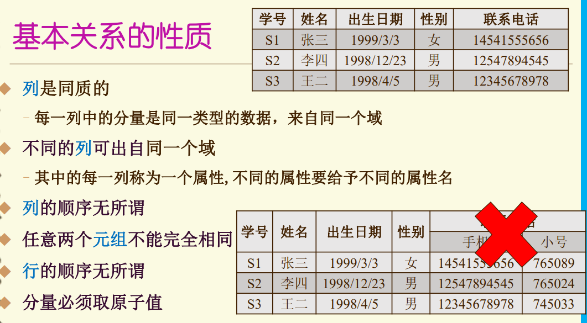

逻辑独立性通过外模式/逻辑模式映像保证

物理独立性通过逻辑模式/内模式映像保证

### 数据模型三要素

- 数据结构	描述静态特性
- 数据操作    描述动态特性
- 数据的约束条件	是一组完整性规则的集合

### 数据模型分类

- 关系模型
- 半结构化数据模型
  - 网状模型
  - 层次模型
  - XML
  - JSON

### 关系模型

- #### 关系数据结构

  - 相关概念

    - 域

      

    - 笛卡尔积

      

    - 关系

      

      

      - 三类关系
        - 基本关系（基本表或基表）

          实际存在的表，是实际存储数据的逻辑表示

          

        - 查询表

          查询结果对应的表

        - 视图

          由基本表或其他视图表导出的表，是虚表，不对应实际存储的数据

      - 码

      

    - 关系模式

      关系模式是对关系的描述

      **关系模式是型，关系是值**

      

      

    - 关系数据库

      在给定的应用领域中，所有实体及实体之间联系的关系的集合构成一个关系数据库

      

      **关系数据库模式**是关系数据库的型，是对关系数据库的描述

      

- #### 关系操作

  - 常用关系操作

    查询、插入、删除、修改

  - 关系操作特点

    集合操作方式

  - 关系数据语言种类

    

  - 关系数据语言特点

    高度非过程化语言

    可嵌入高级语言中使用
  
- #### 完整性约束

  指对关系的某种约束条件

  - 三类

    - 实体完整性

      - 主码不能为空
      - 主属性不能取空值

    - 参照完整性

      - 外码(Foreign Key)

        如果一个关系R中的一个属性F对应另一关系S的主码K，那么F在关系R中称为外码

        外码取值必须为：

        1. 空值
        2. 被参照表中某个元组的主码值

    - 用户定义完整性

      - 用户定义的完整性是针对某一具体关系数据库的约束条件， 反映某一具体应用所涉及的数据必须满足的语义要求
      -  关系模型应提供定义和检验这类完整性的机制，以便用统一 的系统的方法处理它们，而不要由应用程序承担这一功能

### 关系代数

- #### 投影

  

  

- #### 选择

  

  

  

- #### 连接

  

  ##### 自然连接

​	是在公共属性上进行的等值连接

​	两个关系中必须有公共属性，结果中把重复属性列去除

​	自然连接还需要取消重复列，所以是同时从行和列的角度进行运算	

- #### 重命名

  

  

#### 练习

