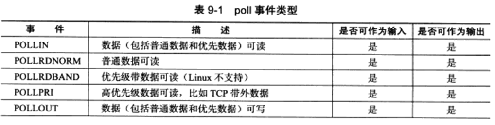

# poll系统调用

```c
#include <poll.h>
typedef unsigned long int nfds_t;
int poll(struct pollfd* fds,nfds_t nfds,int timeout);
//fds pollfd数组
//nfds 数组长度
//timeout -1时永远阻塞	0时立即返回	>0单位毫秒
//返回值同select >0 有事件 =0超时 <0 error
struct pollfd{
    int fd;				//文件描述符
    short events;		//注册事件
    short revents;		//实际发生的事，由内核填充
};
```

#### 事件类型



