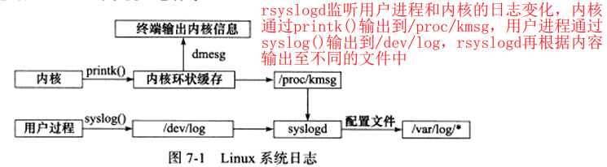
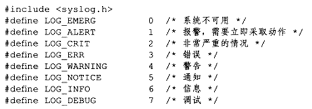
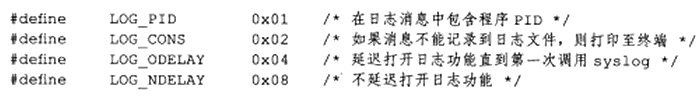

## 1	日志

### 1.1	linux系统日志

- #### linux提供一个守护进程来处理系统日志——syslogd，现在大多linux系统都使用升级版——rsyslogd

- #### rsyslogd守护进程既能接收用户进程输出的日志，又能接收内核日志

- #### 用户进程调用syslog函数生成系统日志

- #### 内核通过printk等函数打印至内核的环状缓存（ring buffer）中。缓存内容直接映射到/proc/kmsg，rsyslogd通过读取该文件来获取内核日志

- #### 默认情况下内核消息保存至/var/log/kern.log



### 1.2	syslog函数

```cpp
#include <syslog.h>
//priority参数是所谓的设施值与日志级别的按位或
void syslog(int priority,const char* message,...);
```



```cpp
#include <syslog.h>
/*用于修改sysylog默认输出方式*/

//ident指定的字符串被添加到日志消息的日期和时间后，通常设置为程序名字
//logopt对后续syslog调用的行为进行配置，可按下图值按位或
//facility可用来修改默认的设施值
void openlog(const char* ident,int logopt,int facility);
```



```cpp
#include <syslog.h>
//设置syslog日志掩码
//maskpri指定日志掩码值
//返回之前的日志掩码值
int setlogmask(int maskpri);

//关闭日志功能
void closelog();
```


## 2	用户信息

### 2.1	UID、EUID、GID和EGID

- #### UID(真实用户ID)、EUID(有效用户ID)、GID(真实组ID)和EGID(有效组ID)

- #### 一个进程拥有两个用户ID：UID、EUID，后者是为了方便资源访问，它使得运行程序的用户拥有该程序有效用户的权限

  例如su程序，任何用户都可使用它修改自己账号信息，修改密码时会访问/etc/passwd文件，而这个文件需要root权限，su程序所有者是root，并且它被设置了set-user-id标志，该标志表示任何普通用户启动的su程序，其有效用户都是该程序所有者root，因此任何使用su程序的用户都可访问/etc/passwd文件

```c
#include <sys/types.h>
#include <unistd.h>
uid_t getuid();
uid_t geteuid();
gid_t getgid();
gid_t getegid();
int setuid(uid_t uid);
int seteuid(uid_t uid);
int setgid(gid_t gid);
int setegid(gid_t gid);
```


```c
#include <stdio.h>
#include <unistd.h>

int main(int argc,char **argv)
{
  uid_t uid = getuid();
  uid_t euid = geteuid();
  printf("uid is %d,effective userid is %d\n",uid,euid);
  return 0;
}
/****************************/
sudo chown root:root ./a.out //修改目标文件所有者为root
//+s 在文件执行时把进程的属主或组ID置为该文件的文件属主
sudo chmod +s ./a.out 	//设置目标文件的set-user-id标志
./a.out
uid is 1000,effective userid is 0
//uid是启动程序的用户ID，EUID则是root（文件所有者）的ID
```

### 2.2切换用户

#### 下例为将root身份启动的进程切换为一个以普通用户身份进行

```c
static bool switch_to_user(uid_t uid,gid_t gid){
    //先确保目标用户不是root
    if((uid == 0) && (gid == 0))
        return false;
    //确保当前用户是合法用户：root或目标用户
    gid_t curgid = getgid();
	uid_t curuid = getuid();
    //如果既不是root也不是参数的目标用户，返回false
    if(((curgid != 0) || (curuid != 0)) && ((curgid != gid) || (curuid != uid)))
        return false;
    //如果不是root，则已是目标用户
    if(curuid != 0)
        return true;
    if((setgid(gid) < 0) || (setuid(uid) < 0))
        return false;
    return true;
}
```

