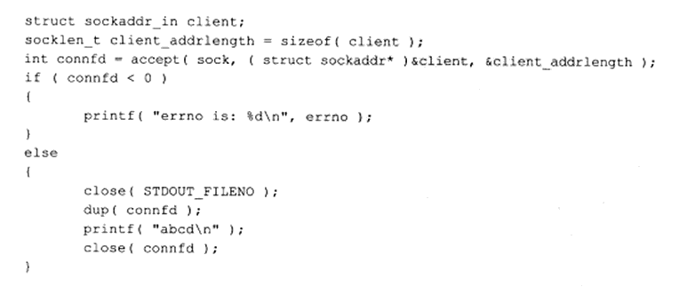
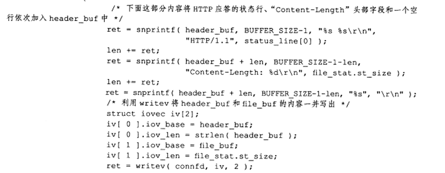
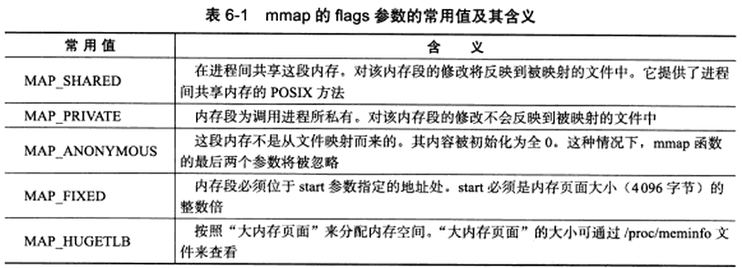
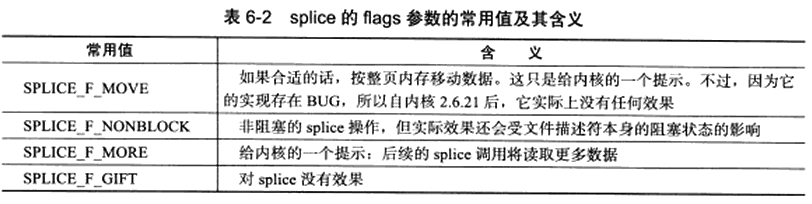
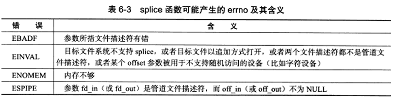
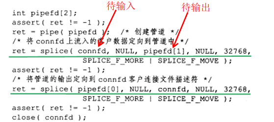
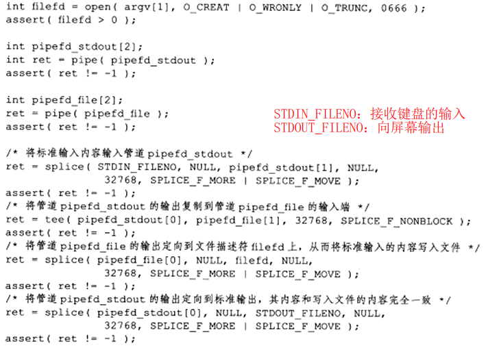
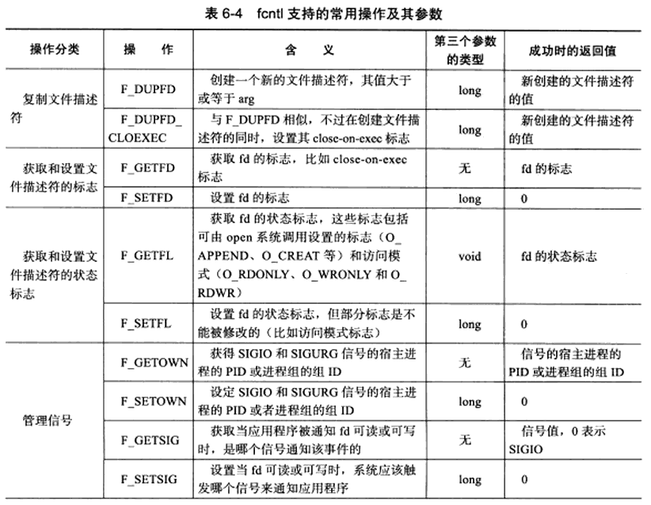
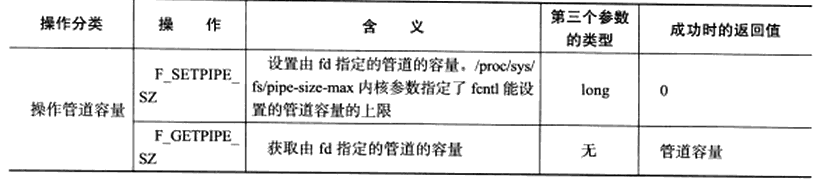

## 1	pipe

```c
#include <unistd.h>
//成功返回0	失败-1设置errno
//fd[1]写入数据，fd[0]读出数据
int pipe(int fd[2]);

#include <sys/types.h>
#include <sys/socket.h>
//简单地创建双向管道，双方都可以写入都读出
//前三个参数与socket函数完全相同
socketpair(int domain,int type,int protocol,int fd[2]);
```

- ##### 要实现双向双向数据传输，应该使用两个管道

- ##### 管道容量默认65536字节，可使用fnctl修改容量

- ##### 默认情况这对文件描述符都是阻塞的，read读取空管道则阻塞直到管道有数据可读，write写入满管道则阻塞到可写，如果设置为非阻塞，read和write有不同的行为，具体看[高性能服务器程序框架](.\高性能服务器程序框架.md)


## 2	dup和dup2

```c
#include <unistd.h>
//创建一个新的文件描述符，该新文件描述符和原有文件描述符fd指向相同的文件、管道或网络连接
//新文件描述符总是取系统当前可用的最小整数值
int dup(int fd);
/*dup2和dup的区别就是可以用newfd参数指定新描述符的数值，如果newfd已经打开，则先将其关闭。如果newfd等于oldfd，则dup2返回newfd, 而不关闭它。dup2函数返回的新文件描述符同样与参数oldfd共享同一文件表项。*/
int dup2(int oldfd,int newfd);
```



#### 	**上图为CGI基本原理，关闭了STDOUT_FILENO，值为1，然后dup复制了一个connfd指向相同的文件描述符，由于返回值为最小的，所以返回1，因此printf输出的内容原本是标准输出的内容，则会直接发送给connfd的客户连接socket上**


## 3	readv和writev

```c
#include <sys/uio.h>
//vec是iovec结构数组
//count是vec数组长度

//成功返回读出|写入fd的字节数
ssize_t readv(int fd,const struct iovec* vec,int count);
ssize_t writev(int fd,const struct iovec* vec,int count);
```

****

**file_buf为客户端申请读取的文件内容**


## 4	sendfile

- #### sendfile在两个文件描述符间直接传递数据（完全在内核中），从而避免缓冲区和用户缓冲区之间的数据拷贝，效率高，零拷贝

```c
#include <sys/sendfile.h>
//in为待读出的fd	out为待写入的fd
//offset指从哪个位置开始传输，NULL从头开始
//成功返回传输的字节数	失败-1设置errno
//infd必须是一个支持类似mmap函数的文件描述符，即它必须指向真实的文件，不能是socket和管道
//outfd必须是一个socket
ssize_t sendfile(int out_fd,int in_fd,off_t* offset,size_t count);
```

#### 例子：

```c
int filefd = open(filename,O_RDONLY);
struct stat stat_buf;
fstat(filefd,&stat_buf);
int connfd = accept(soc, (struct sockaddr*)&client,&client_len);
//filefd向客户端连接的connfd传输文件
sendfile(connfd,filefd,NULL,stat_buf.st_size);
```


## 5	mmap和munmap

```c
#include <sys/mman.h>
//申请内存空间，可将这段空间作为进程间通信的共享内存
//start为用户指定的某个地址作为起始，NULL则系统自动分配
//length内存段长度
/*prot内存访问权限 按位或
	PROT_READ	内存段可读
	PROT_WRITE	内存段可写
	PROT_EXEC	内存段可执行
	PROT_NONE	内存段不能被访问
*/
//flags控制内存段内容被修改后程序的行为，如下图
//fd为文件描述符	一般通过open系统调用获得

//成功返回内存地址指针 失败返回MAP_FAILED（(void*)-1）并设置errno
void* mmap(void* start,size_t length,int prot,int flags,int fd,off_t offset);

//释放mmap创建的内存
//成功0	失败-1设置errno
int munmap(void* start,size_t length);
```




## 6	splice

- #### 用于两个文件描述符之间移动数据，零拷贝操作

- #### fd_in、fd_out至少一个是管道文件描述符

```c
#include <fcntl.h>
//fdin待输入数据文件描述符，若fdin为管道文件描述符，则off_in必须为NULL，如果不是，则off_in表示为从输入数据流何处开始读取
//fdout输出数据文件描述符
//len指定移动数据长度
//flags控制数据如何移动，如下图

//成功返回移动字节的数量	失败-1设置errno，可能产生的errno如下图
ssize_t splice(int fd_in,loff_t* off_in,int fd_out,loff_t* off_out,size_t len,unsigned int flags);
```





#### 例子：

****

##### **splice将客户端内容读到pipe[1]，再从pipe[0]中读到客户端，实现了简单高效的回射服务**


## 7	tee

- #### 在两个管道文件描述符之间复制数据，零拷贝

- #### 函数类似splice，只是两个fd都必须是管道文件描述符

```c
#include <fcntl.h>
ssize_t tee(int fd_in,int fd_out,size_t len,unsigned int flags);
```

#### 例子：同时输出数据到终端和文件




## 8	fcntl

```c
#include <fcntl.h>
//cmd指定执行何种类型的操作
int fcntl(int fd,int cmd,...);
```





#### 例子：将文件描述符设置为非阻塞

```c
int setnonblocking(int fd){
    int oldopt = fcntl(fd,F_GETFL);//旧文件描述符状态
    int newopt = oldopt | O_NONBLOCK;//设置非阻塞标志
    fcntl(fd,F_SETFL,newopt);
    return oldopt;		//返回旧阻塞状态，以便以后恢复状态
}
```