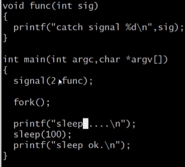
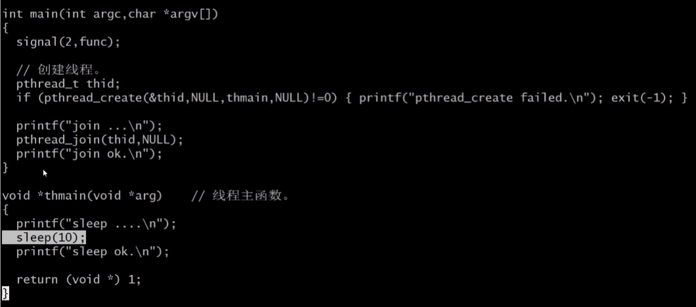
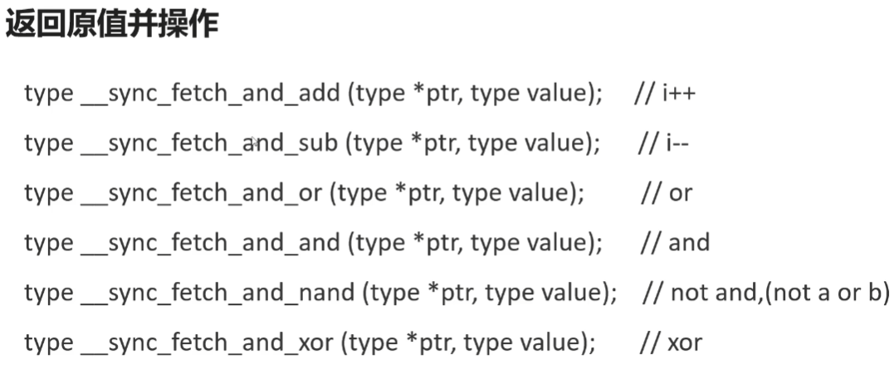

进程与线程区别

- 多进程程序，子进程core dump不影响其他进程
- 多线程程序，子线程core dump影响整个进程

线程非正常终止

- 如果主线程退出，全部线程强行终止
- 在子线程调用exit将终止整个进程
- 缺省行为是终止程序的信号将导致整个进程终止

线程终止的三种方法

- 线程可以简单地从线程函数中返回，返回值是线程的退出码
- 线程可以被同一进程中的其他线程调用pthread_cancel
- 线程函数中，调用pthread_exit退出

## create

```c
int pthread_create(pthread_t *t,pthread_attr_t t,void\*(void* func),void* arg);
```

## join

```c
 int pthread_join(pthread_t thread, void **retval);
/*
描述：
pthread_join()函数，以阻塞的方式等待thread指定的线程结束。
当函数返回时，被等待线程的资源被收回。
如果线程已经结束，那么该函数会立即返回。并且thread指定的线程必须是joinable的。

参数：
thread: 线程标识符，即线程ID，标识唯一线程。
retval: 用户定义的指针，用来存储被等待线程的返回值
*/
```

## 线程资源的回收

- 线程的分离

  - 线程有非分离（joinable）和分离两种状态

    线程缺省状态是非分离的，或称为可连接的

    非分离状态线程终止，不会释放线程全部资源

  - 方式

    - 把线程属性设置为分离，线程结束后，由系统回收资源

    - 调用pthread_detach分离线程

      ```c
      //可以在主线程调用pthread_detach()
      int pthread_detach(pthread_t t);
      //也可以在子线程种调用
      {
      pthread_detach(pthread_self());
      }
      ```

    - 创建线程前，调用pthread_attr_setdetachstate设置线程属性

      ```c
      pthread_attr_t attr;//声明线程属性的结构体
      pthread_attr_init(&attr);
      //设置线程属性
      pthread_attr_setdetachstate(&attr,PTHREAD_CREATE_DETACHED);
      ```

## 线程清理函数

- 线程终止时，可以调用线程清理函数释放资源
- 清理函数入栈：pthread_cleanup_push();
- 清理函数出栈：pthread_cleanup_pop();
- 二者必须成对出现
- 线程终止(return、pthread_exit、pthread_cancel)、语句块结束，清理函数将被执行

```c
void cleanup(void* arg){
	...
}
void* threadfunc(void* arg){
    pthread_cleanup_push(cleanup,NULL);//清理函数入栈
    ...
    pthread_cleanup_pop(1);//清理函数出栈，如果参数为0则表示只出栈不执行
}
```

## 线程的取消

- 在运行过程中，可以调用`pthread_cancel()`取消

- 线程被取消后，返回状态时`PTHREAD_CANCEL==-1`

- 设置线程的取消状态`pthread_setcancelstate();`

  ```c
  pthread_setcancelstate(int state,int *oldstate);
  /*
  两种state
  PTHREAD_CANCEL_ENABLE 缺省
  PTHREAD_CANCEL_DISABLE
  */
  ```

- 设置线程取消方式`pthread_setcanceltype()`

  ```c
  pthread_setcanceltype(int type,int *oldtype);
  //子线程内部默认为DEFERRED
  pthread_setcanceltype(PTHREAD_CANCEL_DEFERRED,NULL);
  /*
  两种type 仅当cancel状态为PTHREAD_CANCEL_ENABLE有效
  PTHREAD_CANCEL_DEFERRED	缺省	表示受到信号后继续运行至下一个取消点再退出
  PTHREAD_CANCEL_ASYNCHRONOUS   表示受到信号后立即取消
  */
  
  //man 7 pthreads查找取消点的函数
  ```

- 设置线程取消点`pthread_testcancel(void)`

  可以在线程函数内部设置取消点从而取消线程运行

## 线程和信号

- 多进程程序中，外部向进程发送信号会中断系统调用

  

  当外部触发信号2时，会导致中断系统调用sleep()，导致printf后直接退出

- 多线程程序中，外部向进程发送信号不会中断系统调用

  

  当外部触发信号2时，不会导致中断系统调用sleep()，会继续sleep然后退出

- 多线程程序中，信号的处理是所有线程共享的

  以最后被执行的signal为准

- 进程中的信号可以送达单个线程，会中断系统调用

  ```c
  #include <signal.h>
  pthread_kill(pthread_t thread,int sig);
  ```

- 如果某线程因为信号而终止，整个进程将终止

## 线程安全

- #### 多个线程访问资源可能产生冲突

- #### 三个概念

  - 原子性：
    - 一个操作(可能包含多个子操作)，要么全部执行，要么全部不执行
    - CPU执行指令：读取指令、读取内存、执行指令、写回内存
    - i++    1）内存中读取i   2）i+1   3）结果写回内存
  - 可见性
    - 当多个线程并发访问共享变量时，一个线程对共享变量的修改，其他线程能立刻看到
    - CPU有高速缓存。每个线程读取共享变量，会将该变量从内存加载到CPU缓存中，修改该变量后，CPU会立即更新缓存，但不一定立即将它写回内存。此时其他线程访问该变量，从内存读到的是旧数据，而不一定是更新后的数据
  - 顺序性
    - 程序执行的顺序按照代码的先后顺序执行
    - CPU可能会对代码进行优化，CPU不保证完全按照代码顺序执行，但会保证结果和其相同

- #### 如何解决线程安全

  - volatile关键字

    - 让CPU每次从内存读取变量值，保证变量的内存可见性
    - 禁止代码重排序
    - 不是原子的

  - 原子操作

    - 本质是总线锁，硬件级别的锁

    - 三条汇编指令：xadd、cmpxchg或xchg

    - 

      保证了内部操作是原子的

    - C++11原子操作

      ```cpp
      std::atomic<int> val;
      ```

  - 线程同步(锁)

## 线程同步

- 互斥锁

  - 加锁和解锁，确保同一时间只有一个线程访问
  - 如果某线程持有锁，其他线程形成等待队列

  ```c
  pthread_mutex_t mutex;
  pthread_mutex_init(&mutex);
  pthread_destroy(&mutex);
  {
  	pthread_mutex_lock(&mutex);
  	...
  	pthread_mutex_unlock(&mutex);
  }
  //尝试lock，不等待
  pthread_trylock(&mutex);
  ```

  - 属性

    - PTHREAD_MUTEX_TIMED_NP缺省

      普通锁，一个线程加锁，其余线程形成等待队列，解锁后按优先级获得

    - PTHREAD_MUTEX_RECURSIVE_NP嵌套锁

      允许同一个线程对同一个锁获得多次，并通过多次解锁，如果是不同线程请求，则解锁后重新竞争

    - PTHREAD_MUTEX_ADAPTIVE_NP适应锁

      解锁后，请求锁的线程重新竞争

- 自旋锁

  - 

  ```c
  pthread_spinlock_t mutex;
  pthread_spinlock_init(&mutex,PTHREAD_PROCESS_SHARED);
  //PTHREAD_PROCESS_SHARED表示多进程内可以共享
  //PTHREAD_PROCESS_PRIVATE表示只在初始化自旋锁的进程内的线程才可共享
  pthread_spinlock_destroy(&mutex);
  {
  	pthread_spinlock_lock(&mutex);
  	...
  	pthread_spinlock_unlock(&mutex);
  }
  //尝试lock，不等待
  pthread_spinlock_trylock(&mutex);
  ```

- 读写锁

  - 读写锁允许更高的并发性
  - 三种状态
    - 读模式加锁
    - 写模式加锁
    - 不加锁
  - 特点
    - **只要没有线程持有写锁，任意线程都可成功申请读锁**
    - **只有在不加锁状态时，才能成功申请写锁**
    - 读写锁适合于读次数远大于写次数的情况
    - linux优先考虑读锁，这可能导致写入线程饥饿

  ```c
  pthread_rwlock_t mutex;
  pthread_rwlock_init(pthread_rwlock_t*,pthread_rwattr_t *);
  pthread_rwlock_destroy(pthread_rwlock_t*);
  pthread_rwlock_t rwlock = PTHREAD_RWLOCK_INITIALIZER;
  
  pthread_rwlock_rdlock(pthread_rwlock_t*);//申请读锁
  pthread_rwlock_tryrdlock(pthread_rwlock_t*);//尝试申请读锁，不阻塞
  
  pthread_rwlock_wrlock(pthread_rwlock_t*);//申请写锁
  pthread_rwlock_trywrlock();//尝试申请写锁，不阻塞
  pthread_rwlock_timedwrlock();//申请写锁，带超时机制
  
  pthread_rwlock_unlock(pthread_rwlock_t*);
  pthread_rwlockattr_getpshared();//获取读写锁属性
  pthread_rwlockattr_setpshared();//设置读写锁属性
  //PTHREAD_PROCESS_SHARED表示多进程内可以共享
  //PTHREAD_PROCESS_PRIVATE表示只在初始化自旋锁的进程内的线程才可共享
  ```

- 条件变量

  - 与互斥锁一起使用
  - 实现生产者消费者模型
  - 实现通知功能

  ```c
  pthread_cond_t cond;
  pthread_cond_init();
  pthread_cond_destroy();
  pthread_cond_t cond = PTHREAD_COND_INITIALIZER;
  pthread_cond_wait(pthread_cond_t*,pthread_mutex_t*);//等待被唤醒
  pthread_cond_timedwait();//等待被唤醒，带超时机制
  pthread_cond_signal(pthread_cond_t*);//唤醒一个等待中的线程
  pthread_cond_broadcast(pthread_cond_t*);//唤醒全部等待的线程
  
  pthread_condattr_getpshared();//获取共享属性
  pthread_condattr_setpshared();//设置共享属性
  pthread_condattr_getclock();//获取时钟属性
  pthread_condattr_setclock();//设置时钟属性
  ```

- （匿名）信号量

  - 一个整数计数器，数值用于表示空闲资源的数量
  - 申请资源，信号量减少；释放资源，信号量增加

  ```c
  sem_t sem;
  int sem_init(sem_t *sem,int pshared,unsigned int value);
  int sem_destroy(sem_t *sem);
  int sem_wait(sem_t *);//P操作
  int sem_trywait(sem_t *);//P操作,不阻塞
  int sem_timedwait(sem_t *sem, const struct timespec *abs_timeout);//P操作,带超时机制
  int sem_post(sem_t *);//V操作
  int sem_getvalue();
  ```

  

- 生产者消费者模型

  `pthread_cond_wait(&cond,&mutex);`

  - 互斥锁解锁
  - 阻塞，等待条件
  - 条件触发+互斥锁加锁(原子操作)

  **在pthread_cond_wait时执行pthread_cancel后，要在线程清理函数中先解锁与条件变量绑定的锁，保证pthread_cond_wait可以返回到调用线程**