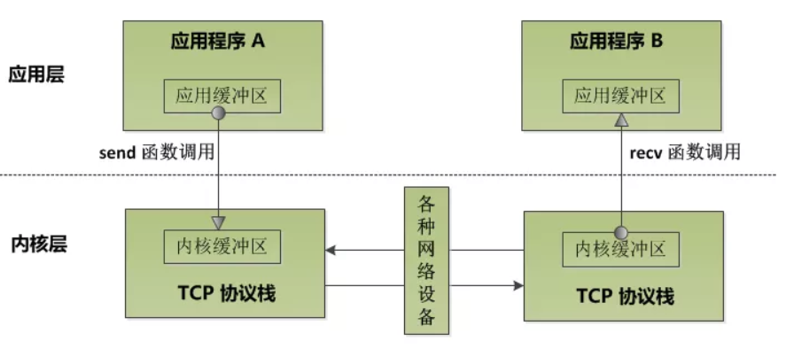
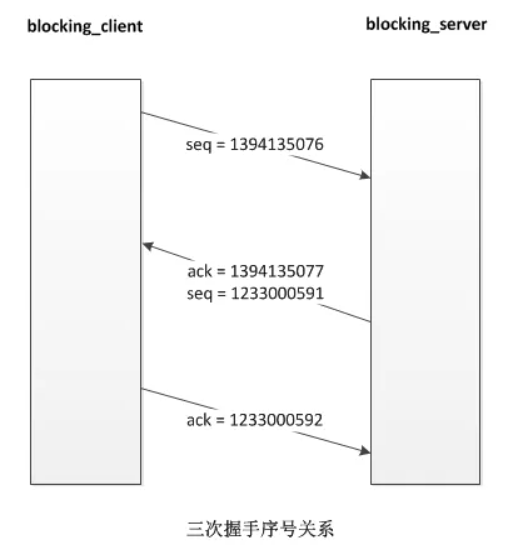
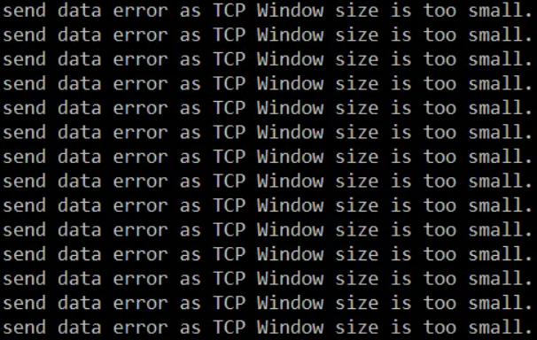
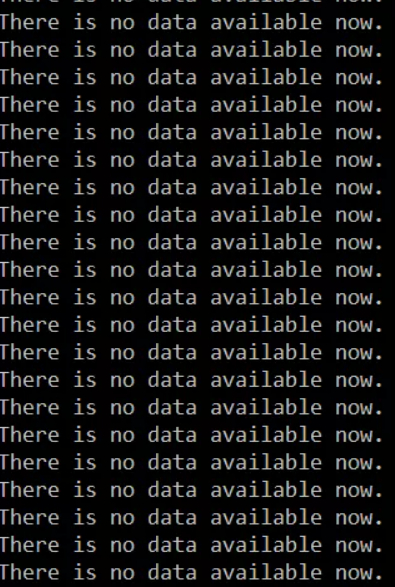

# socket 的阻塞模式和非阻塞模式

对 socket 在阻塞和非阻塞模式下的各个函数的行为差别深入的理解是掌握网络编程的基本要求之一，是重点也是难点。

阻塞和非阻塞模式下，我们常讨论的具有不同行为表现的 socket 函数一般有如下几个，见下表：

- connect
- accept
- send (Linux 平台上对 socket 进行操作时也包括 **write** 函数，下文中对 send 函数的讨论也适用于 **write** 函数)
- recv (Linux 平台上对 socket 进行操作时也包括 **read** 函数，下文中对 recv 函数的讨论也适用于 **read** 函数)

限于文章篇幅，本文只讨论 send 和recv函数，connect 和 accept 函数我们将在该系列的后面文章中讨论。在正式讨论之前，我们先解释一下阻塞模式和非阻塞模式的概念。所谓**阻塞模式**，**就当某个函数“执行成功的条件”当前不能满足时，该函数会阻塞当前执行线程，程序执行流在超时时间到达或“执行成功的条件”满足后恢复继续执行**。而**非阻塞模式**恰恰相反，即使某个函数的“执行成功的条件”不当前不能满足，该函数也不会阻塞当前执行线程，而是立即返回，继续运行执行程序流。如果读者不太明白这两个定义也没关系，后面我们会以具体的示例来讲解这两种模式的区别。

## 如何将 socket 设置成非阻塞模式

无论是 Windows 还是 Linux 平台，**默认创建的 socket 都是阻塞模式的**。

在 Linux 平台上，我们可以使用 **fcntl() 函数**或 **ioctl() 函数**给创建的 socket 增加 **O_NONBLOCK** 标志来将 socket 设置成非阻塞模式。示例代码如下：

```c
int oldSocketFlag = fcntl(sockfd, F_GETFL, 0);
int newSocketFlag = oldSocketFlag | O_NONBLOCK;
fcntl(sockfd, F_SETFL,  newSocketFlag);
```

**ioctl() 函数** 与 **fcntl()** 函数使用方式基本一致，这里就不再给出示例代码了。

当然，Linux 下的 **socket()** 创建函数也可以直接在创建时将 socket 设置为非阻塞模式，**socket()** 函数的签名如下：

```c
int socket(int domain, int type, int protocol);
```

给 **type** 参数增加一个 **SOCK_NONBLOCK** 标志即可，例如：

```c
int s = socket(AF_INET, SOCK_STREAM | SOCK_NONBLOCK, IPPROTO_TCP);
```

不仅如此，Linux 系统下利用 accept() 函数返回的代表与客户端通信的 socket 也提供了一个扩展函数 **accept4()**，直接将 accept 函数返回的 socket 设置成非阻塞的。

```c
int accept(int sockfd, struct sockaddr *addr, socklen_t *addrlen); 
int accept4(int sockfd, struct sockaddr *addr, socklen_t *addrlen, int flags);
```

只要将 **accept4()** 函数最后一个参数 **flags** 设置成 **SOCK_NONBLOCK** 即可。也就是说以下代码是等价的：

```c
socklen_t addrlen = sizeof(clientaddr);
int clientfd = accept4(listenfd, &clientaddr, &addrlen, SOCK_NONBLOCK);
socklen_t addrlen = sizeof(clientaddr);
int clientfd = accept(listenfd, &clientaddr, &addrlen);
if (clientfd != -1)
{
    int oldSocketFlag = fcntl(clientfd, F_GETFL, 0);
    int newSocketFlag = oldSocketFlag | O_NONBLOCK;
    fcntl(clientfd, F_SETFL,  newSocketFlag);
}
```

在 Windows 平台上，可以调用 **ioctlsocket() 函数** 将 socket 设置成非阻塞模式，**ioctlsocket()** 签名如下：

```
int ioctlsocket(SOCKET s, long cmd, u_long *argp);
```

将 **cmd** 参数设置为 **FIONBIO**，**argp** *设置为 **0** 即可将 socket 设置成阻塞模式，而将* **argp** 设置成非 **0** 即可设置成非阻塞模式。示例如下：

```c
//将 socket 设置成非阻塞模式
u_long argp = 1;
ioctlsocket(s, FIONBIO, &argp);

//将 socket 设置成阻塞模式
u_long argp = 0;
ioctlsocket(s, FIONBIO, &argp);
```

Windows 平台需要注意一个地方，如果对一个 socket 调用了 **WSAAsyncSelect()** 或 **WSAEventSelect()** 函数后，再调用 **ioctlsocket()** 函数将该 socket 设置为非阻塞模式会失败，你必须先调用 **WSAAsyncSelect()** 通过将 **lEvent** 参数为 **0** 或调用 **WSAEventSelect()** 通过设置 **lNetworkEvents** 参数为 **0** 来清除已经设置的 socket 相关标志位，再次调用 **ioctlsocket()** 将该 socket 设置成阻塞模式才会成功。因为调用 **WSAAsyncSelect()** 或**WSAEventSelect()** 函数会自动将 socket 设置成非阻塞模式。MSDN 上原文（https://docs.microsoft.com/en-us/windows/desktop/api/winsock/nf-winsock-ioctlsocket）如下：

```
The WSAAsyncSelect and WSAEventSelect functions automatically set a socket to nonblocking mode. If WSAAsyncSelect or WSAEventSelect has been issued on a socket, then any attempt to use ioctlsocket to set the socket back to blocking mode will fail with WSAEINVAL.

To set the socket back to blocking mode, an application must first disable WSAAsyncSelect by calling WSAAsyncSelect with the lEvent parameter equal to zero, or disable WSAEventSelect by calling WSAEventSelect with the lNetworkEvents parameter equal to zero.
```

关于 **WSAAsyncSelect()** 和 **WSAEventSelect()** 这两个函数，后文中会详细讲解。

> 注意事项：无论是 Linux 的 fcntl 函数，还是 Windows 的 ioctlsocket，建议读者在实际编码中判断一下函数返回值以确定是否调用成功。

**send 和 recv 函数在阻塞和非阻塞模式下的行为**

send 和 recv 函数其实名不符实。

send 函数本质上并不是往网络上发送数据，而是将应用层发送缓冲区的数据拷贝到内核缓冲区（下文为了叙述方便，我们以“网卡缓冲区”代指）中去，至于什么时候数据会从网卡缓冲区中真正地发到网络中去要根据 TCP/IP 协议栈的行为来确定，这种行为涉及到一个叫 nagel 算法和 TCP_NODELAY 的 socket 选项，我们将在《**nagle算法与 TCP_NODELAY**》章节详细介绍。

recv 函数本质上也并不是从网络上收取数据，而只是将内核缓冲区中的数据拷贝到应用程序的缓冲区中，当然拷贝完成以后会将内核缓冲区中该部分数据移除。

可以用下面一张图来描述上述事实：



通过上图我们知道，不同的程序进行网络通信时，发送的一方会将内核缓冲区的数据通过网络传输给接收方的内核缓冲区。在应用程序 A 与 应用程序 B 建立了 TCP 连接之后，假设应用程序 A 不断调用 send 函数，这样数据会不断拷贝至对应的内核缓冲区中，如果 B 那一端一直不调用 recv 函数，那么 B 的内核缓冲区被填满以后，A 的内核缓冲区也会被填满，此时 A 继续调用 send 函数会是什么结果呢？ 具体的结果取决于该 socket 是否是阻塞模式。我们这里先给出结论：

- 当 socket 是阻塞模式的，继续调用 send/recv 函数会导致程序阻塞在 send/recv 调用处。
- 当 socket 是非阻塞模式，继续调用 send/recv 函数，send/recv 函数不会阻塞程序执行流，而是会立即出错返回，我们会得到一个相关的错误码，Linux 平台上该错误码为 EWOULDBLOCK 或 EAGAIN（这两个错误码值相同），Windows 平台上错误码为 WSAEWOULDBLOCK。

我们实际来编写一下代码来验证一下以上说的两种情况。

## socket 阻塞模式下的 send 行为

服务端代码（blocking_server.cpp）如下：

```cpp
/**
 * 验证阻塞模式下send函数的行为，server端
 */
#include <sys/types.h> 
#include <sys/socket.h>
#include <arpa/inet.h>
#include <unistd.h>
#include <iostream>
#include <string.h>

int main(int argc, char* argv[])
{
    //1.创建一个侦听socket
    int listenfd = socket(AF_INET, SOCK_STREAM, 0);
    if (listenfd == -1)
    {
        std::cout << "create listen socket error." << std::endl;
        return -1;
    }

    //2.初始化服务器地址
    struct sockaddr_in bindaddr;
    bindaddr.sin_family = AF_INET;
    bindaddr.sin_addr.s_addr = htonl(INADDR_ANY);
    bindaddr.sin_port = htons(3000);
    if (bind(listenfd, (struct sockaddr *)&bindaddr, sizeof(bindaddr)) == -1)
    {
        std::cout << "bind listen socket error." << std::endl;
        close(listenfd);
        return -1;
    }

    //3.启动侦听
    if (listen(listenfd, SOMAXCONN) == -1)
    {
        std::cout << "listen error." << std::endl;
        close(listenfd);
        return -1;
    }

    while (true)
    {
        struct sockaddr_in clientaddr;
        socklen_t clientaddrlen = sizeof(clientaddr);
        //4. 接受客户端连接
        int clientfd = accept(listenfd, (struct sockaddr *)&clientaddr, &clientaddrlen);
        if (clientfd != -1)
        {             
            //只接受连接，不调用recv收取任何数据
            std:: cout << "accept a client connection." << std::endl;
        }
    }

    //7.关闭侦听socket
    close(listenfd);

    return 0;
}
```

客户端代码（blocking_client.cpp）如下：

```cpp
/**
 * 验证阻塞模式下send函数的行为，client端
 */
#include <sys/types.h> 
#include <sys/socket.h>
#include <arpa/inet.h>
#include <unistd.h>
#include <iostream>
#include <string.h>

#define SERVER_ADDRESS "127.0.0.1"
#define SERVER_PORT     3000
#define SEND_DATA       "helloworld"

int main(int argc, char* argv[])
{
    //1.创建一个socket
    int clientfd = socket(AF_INET, SOCK_STREAM, 0);
    if (clientfd == -1)
    {
        std::cout << "create client socket error." << std::endl;
        close(clientfd);
        return -1;
    }

    //2.连接服务器
    struct sockaddr_in serveraddr;
    serveraddr.sin_family = AF_INET;
    serveraddr.sin_addr.s_addr = inet_addr(SERVER_ADDRESS);
    serveraddr.sin_port = htons(SERVER_PORT);
    if (connect(clientfd, (struct sockaddr *)&serveraddr, sizeof(serveraddr)) == -1)
    {
        std::cout << "connect socket error." << std::endl;
        return -1;
    }

    //3. 不断向服务器发送数据，或者出错退出
    int count = 0;
    while (true)
    {
        int ret = send(clientfd, SEND_DATA, strlen(SEND_DATA), 0);
        if (ret != strlen(SEND_DATA))
        {
            std::cout << "send data error." << std::endl;
            break;
        } 
        else
        {
            count ++;
            std::cout << "send data successfully, count = " << count << std::endl;
        }
    }

    //5. 关闭socket
    close(clientfd);

    return 0;
}
```

在 shell 中分别编译这两个 cpp 文件得到两个可执行程序 **blocking_server** 和 **blocking_client**：

```bash
g++ -g -o blocking_server blocking_server.cpp
g++ -g -o blocking_client blocking_client.cpp
```

我们先启动 **blocking_server**，然后用 gdb 启动 **blocking_client**，输入 **run** 命令让 **blocking_client**跑起来，**blocking_client** 会不断地向 **blocking_server** 发送"**helloworld**"字符串，每次 send 成功后，会将计数器 **count** 的值打印出来，计数器会不断增加，程序运行一段时间后，计数器 **count** 值不再增加且程序不再有输出。操作过程及输出结果如下：

**blocking_server** 端：

```
[root@localhost testsocket]# ./blocking_server 
accept a client connection.
[root@localhost testsocket]# gdb blocking_client
GNU gdb (GDB) Red Hat Enterprise Linux 7.6.1-100.el7_4.1
Copyright (C) 2013 Free Software Foundation, Inc.
License GPLv3+: GNU GPL version 3 or later <http://gnu.org/licenses/gpl.html>
This is free software: you are free to change and redistribute it.
There is NO WARRANTY, to the extent permitted by law.  Type "show copying"
and "show warranty" for details.
This GDB was configured as "x86_64-redhat-linux-gnu".
For bug reporting instructions, please see:
<http://www.gnu.org/software/gdb/bugs/>...
Reading symbols from /root/testsocket/blocking_client...done.
(gdb) run
//输出结果太多，省略部分...
send data successfully, count = 355384
send data successfully, count = 355385
send data successfully, count = 355386
send data successfully, count = 355387
send data successfully, count = 355388
send data successfully, count = 355389
send data successfully, count = 355390
```

此时程序不再有输出，说明我们的程序应该“卡在”某个地方，继续按 **Ctrl + C** 让 gdb 中断下来，输入 **bt** 命令查看此时的调用堆栈，我们发现我们的程序确实阻塞在 **send** 函数调用处：

```
^C
Program received signal SIGINT, Interrupt.
0x00007ffff72f130d in send () from /lib64/libc.so.6
(gdb) bt
#0  0x00007ffff72f130d in send () from /lib64/libc.so.6
#1  0x0000000000400b46 in main (argc=1, argv=0x7fffffffe598) at blocking_client.cpp:41
(gdb) 
```

上面的示例验证了如果一端一直发数据，而对端应用层一直不取数据（或收取数据的速度慢于发送速度），则很快两端的内核缓冲区很快就会被填满，导致发送端调用 send 函数被阻塞。这里说的“**内核缓冲区**” 其实有个专门的名字，即 TCP 窗口。也就是说 socket 阻塞模式下， send 函数在 TCP 窗口太小时的行为是阻塞当前程序执行流（即阻塞 send 函数所在的线程的执行）。

说点题外话，上面的例子，我们每次发送一个“**helloworld**”（10个字节），一共发了 355390 次（每次测试的结果略有不同），我们可以粗略地算出 TCP 窗口的大小大约等于 1.7 M左右 （10 * 355390 / 2）。

让我们再深入一点，我们利用 Linux tcpdump 工具来动态看一下这种情形下 TCP 窗口大小的动态变化。需要注意的是，Linux 下使用 tcpdump 这个命令需要有 root 权限。

我们开启三个 shell 窗口，在第一个窗口先启动 **blocking_server** 进程，在第二个窗口用 tcpdump 抓经过 TCP 端口 3000 上的数据包：

```
[root@localhost testsocket]# tcpdump -i any -nn -S 'tcp port 3000'    
tcpdump: verbose output suppressed, use -v or -vv for full protocol decode
listening on any, link-type LINUX_SLL (Linux cooked), capture size 262144 bytes
```

接着在第三个 shell 窗口，启动 **blocking_client**。当 **blocking_client** 进程不再输出时，我们抓包的结果如下：

```
[root@localhost testsocket]# tcpdump -i any -nn -S 'tcp port 3000' 
tcpdump: verbose output suppressed, use -v or -vv for full protocol decode
listening on any, link-type LINUX_SLL (Linux cooked), capture size 262144 bytes
11:52:35.907381 IP 127.0.0.1.40846 > 127.0.0.1.3000: Flags [S], seq 1394135076, win 43690, options [mss 65495,sackOK,TS val 78907688 ecr 0,nop,wscale 7], length 0
20:32:21.261484 IP 127.0.0.1.3000 > 127.0.0.1.40846: Flags [S.], seq 1233000591, ack 1394135077, win 43690, options [mss 65495,sackOK,TS val 78907688 ecr 78907688,nop,wscale 7], length 0
11:52:35.907441 IP 127.0.0.1.40846 > 127.0.0.1.3000: Flags [.], ack 1233000592, win 342, options [nop,nop,TS val 78907688 ecr 78907688], length 0
11:52:35.907615 IP 127.0.0.1.40846 > 127.0.0.1.3000: Flags [P.], seq 1394135077:1394135087, ack 1233000592, win 342, options [nop,nop,TS val 78907688 ecr 78907688], length 10
11:52:35.907626 IP 127.0.0.1.3000 > 127.0.0.1.40846: Flags [.], ack 1394135087, win 342, options [nop,nop,TS val 78907688 ecr 78907688], length 0
11:52:35.907785 IP 127.0.0.1.40846 > 127.0.0.1.3000: Flags [P.], seq 1394135087:1394135097, ack 1233000592, win 342, options [nop,nop,TS val 78907688 ecr 78907688], length 10
11:52:35.907793 IP 127.0.0.1.3000 > 127.0.0.1.40846: Flags [.], ack 1394135097, win 342, options [nop,nop,TS val 78907688 ecr 78907688], length 0
11:52:35.907809 IP 127.0.0.1.40846 > 127.0.0.1.3000: Flags [P.], seq 1394135097:1394135107, ack 1233000592, win 342, options [nop,nop,TS val 78907688 ecr 78907688], length 10
11:52:35.907814 IP 127.0.0.1.3000 > 127.0.0.1.40846: Flags [.], ack 1394135107, win 342, options [nop,nop,TS val 78907688 ecr 78907688], length 0
...内容太长， 部分省略...
11:52:40.075794 IP 127.0.0.1.3000 > 127.0.0.1.40846: Flags [.], ack 1395013717, win 374, options [nop,nop,TS val 78911856 ecr 78911816], length 0
11:52:40.075829 IP 127.0.0.1.40846 > 127.0.0.1.3000: Flags [P.], seq 1395013717:1395030517, ack 1233000592, win 342, options [nop,nop,TS val 78911856 ecr 78911856], length 16800
11:52:40.115847 IP 127.0.0.1.3000 > 127.0.0.1.40846: Flags [.], ack 1395030517, win 305, options [nop,nop,TS val 78911896 ecr 78911856], length 0
11:52:40.115866 IP 127.0.0.1.40846 > 127.0.0.1.3000: Flags [P.], seq 1395030517:1395047317, ack 1233000592, win 342, options [nop,nop,TS val 78911896 ecr 78911896], length 16800
11:52:40.155703 IP 127.0.0.1.3000 > 127.0.0.1.40846: Flags [.], ack 1395047317, win 174, options [nop,nop,TS val 78911936 ecr 78911896], length 0
11:52:40.155752 IP 127.0.0.1.40846 > 127.0.0.1.3000: Flags [P.], seq 1395047317:1395064117, ack 1233000592, win 342, options [nop,nop,TS val 78911936 ecr 78911936], length 16800
11:52:40.195132 IP 127.0.0.1.3000 > 127.0.0.1.40846: Flags [.], ack 1395064117, win 43, options [nop,nop,TS val 78911976 ecr 78911936], length 0
11:52:40.435748 IP 127.0.0.1.40846 > 127.0.0.1.3000: Flags [P.], seq 1395064117:1395069621, ack 1233000592, win 342, options [nop,nop,TS val 78912216 ecr 78911976], length 5504
11:52:40.435782 IP 127.0.0.1.3000 > 127.0.0.1.40846: Flags [.], ack 1395069621, win 0, options [nop,nop,TS val 78912216 ecr 78912216], length 0
11:52:40.670661 IP 127.0.0.1.40846 > 127.0.0.1.3000: Flags [.], ack 1233000592, win 342, options [nop,nop,TS val 78912451 ecr 78912216], length 0
11:52:40.670674 IP 127.0.0.1.3000 > 127.0.0.1.40846: Flags [.], ack 1395069621, win 0, options [nop,nop,TS val 78912451 ecr 78912216], length 0
11:52:41.141703 IP 127.0.0.1.40846 > 127.0.0.1.3000: Flags [.], ack 1233000592, win 342, options [nop,nop,TS val 78912922 ecr 78912451], length 0
11:52:42.083643 IP 127.0.0.1.40846 > 127.0.0.1.3000: Flags [.], ack 1233000592, win 342, options [nop,nop,TS val 78913864 ecr 78912451], length 0
11:52:42.083655 IP 127.0.0.1.3000 > 127.0.0.1.40846: Flags [.], ack 1395069621, win 0, options [nop,nop,TS val 78913864 ecr 78912216], length 0
11:52:43.967506 IP 127.0.0.1.40846 > 127.0.0.1.3000: Flags [.], ack 1233000592, win 342, options [nop,nop,TS val 78915748 ecr 78913864], length 0
11:52:43.967532 IP 127.0.0.1.3000 > 127.0.0.1.40846: Flags [.], ack 1395069621, win 0, options [nop,nop,TS val 78915748 ecr 78912216], length 0
11:52:47.739259 IP 127.0.0.1.40846 > 127.0.0.1.3000: Flags [.], ack 1233000592, win 342, options [nop,nop,TS val 78919520 ecr 78915748], length 0
11:52:47.739274 IP 127.0.0.1.3000 > 127.0.0.1.40846: Flags [.], ack 1395069621, win 0, options [nop,nop,TS val 78919520 ecr 78912216], length 0
11:52:55.275863 IP 127.0.0.1.40846 > 127.0.0.1.3000: Flags [.], ack 1233000592, win 342, options [nop,nop,TS val 78927056 ecr 78919520], length 0
11:52:55.275931 IP 127.0.0.1.3000 > 127.0.0.1.40846: Flags [.], ack 1395069621, win 0, options [nop,nop,TS val 78927056 ecr 78912216], length 0
```

抓取到的前三个数据包是 **blocking_client** 与 **blocking_server** 建立三次握手的过程。

```
11:52:35.907381 IP 127.0.0.1.40846 > 127.0.0.1.3000: Flags [S], seq 1394135076, win 43690, options [mss 65495,sackOK,TS val 78907688 ecr 0,nop,wscale 7], length 0
20:32:21.261484 IP 127.0.0.1.3000 > 127.0.0.1.40846: Flags [S.], seq 1233000591, ack 1394135077, win 43690, options [mss 65495,sackOK,TS val 78907688 ecr 78907688,nop,wscale 7], length 0
11:52:35.907441 IP 127.0.0.1.40846 > 127.0.0.1.3000: Flags [.], ack 1233000592, win 342, options [nop,nop,TS val 78907688 ecr 78907688], length 0
```

示意图如下：



当每次 **blocking_client** 给 **blocking_server** 发数据以后，**blocking_server** 会应答 **blocking_server**，在每次应答的数据包中会带上自己的当前可用 TCP 窗口大小（看上文中结果从 **127.0.0.1.3000 > 127.0.0.1.40846**方向的数据包的 **win** 字段大小变化），由于 TCP 流量控制和拥塞控制机制的存在，**blocking_server** 端的 TCP 窗口大小短期内会慢慢增加，后面随着接收缓冲区中数据积压越来越多， TCP 窗口会慢慢变小，最终变为 0。

另外，细心的读者如果实际去做一下这个实验会发现一个现象，即当 tcpdump 已经显示对端的 TCP 窗口是 0 时， **blocking_client** 仍然可以继续发送一段时间的数据，此时的数据已经不是在发往对端，而是逐渐填满到本端的内核发送缓冲区中去了，这也验证了 send 函数实际上是往内核缓冲区中拷贝数据这一行为。

## socket 非阻塞模式下的 send 行为

我们再来验证一下非阻塞 socket 的 send 行为，**server** 端的代码不变，我们将 **blocking_client.cpp** 中 socket 设置成非阻塞的，修改后的代码如下：

```cpp
/**
 * 验证非阻塞模式下send函数的行为，client端，nonblocking_client.cpp
 * zhangyl 2018.12.17
 */
#include <sys/types.h> 
#include <sys/socket.h>
#include <arpa/inet.h>
#include <unistd.h>
#include <iostream>
#include <string.h>
#include <stdio.h>
#include <fcntl.h>
#include <errno.h>

#define SERVER_ADDRESS "127.0.0.1"
#define SERVER_PORT     3000
#define SEND_DATA       "helloworld"

int main(int argc, char* argv[])
{
    //1.创建一个socket
    int clientfd = socket(AF_INET, SOCK_STREAM, 0);
    if (clientfd == -1)
    {
        std::cout << "create client socket error." << std::endl;
        return -1;
    }

    //2.连接服务器
    struct sockaddr_in serveraddr;
    serveraddr.sin_family = AF_INET;
    serveraddr.sin_addr.s_addr = inet_addr(SERVER_ADDRESS);
    serveraddr.sin_port = htons(SERVER_PORT);
    if (connect(clientfd, (struct sockaddr *)&serveraddr, sizeof(serveraddr)) == -1)
    {
        std::cout << "connect socket error." << std::endl;
        close(clientfd);
        return -1;
    }

    //连接成功以后，我们再将 clientfd 设置成非阻塞模式，
    //不能在创建时就设置，这样会影响到 connect 函数的行为
    int oldSocketFlag = fcntl(clientfd, F_GETFL, 0);
    int newSocketFlag = oldSocketFlag | O_NONBLOCK;
    if (fcntl(clientfd, F_SETFL,  newSocketFlag) == -1)
    {
        close(clientfd);
        std::cout << "set socket to nonblock error." << std::endl;
        return -1;
    }

    //3. 不断向服务器发送数据，或者出错退出
    int count = 0;
    while (true)
    {
        int ret = send(clientfd, SEND_DATA, strlen(SEND_DATA), 0);
        if (ret == -1) 
        {
            //非阻塞模式下send函数由于TCP窗口太小发不出去数据，错误码是EWOULDBLOCK
            if (errno == EWOULDBLOCK)
            {
                std::cout << "send data error as TCP Window size is too small." << std::endl;
                continue;
            } 
            else if (errno == EINTR)
            {
                //如果被信号中断，我们继续重试
                std::cout << "sending data interrupted by signal." << std::endl;
                continue;
            } 
            else 
            {
                std::cout << "send data error." << std::endl;
                break;
            }
        }
        if (ret == 0)
        {
            //对端关闭了连接，我们也关闭
            std::cout << "send data error." << std::endl;
            close(clientfd);
            break;
        } 
        else
        {
            count ++;
            std::cout << "send data successfully, count = " << count << std::endl;
        }
    }

    //5. 关闭socket
    close(clientfd);

    return 0;
}
```

编译 **nonblocking_client.cpp** 得到可执行程序 **nonblocking_client**：

```bash
 g++ -g -o nonblocking_client nonblocking_client.cpp 
```

运行 **nonblocking_client**，运行一段时间后，由于对端和本端的 TCP 窗口已满，数据发不出去了，但是 send 函数不会阻塞，而是立即返回，返回值是 **-1**（Windows 系统上 返回 SOCKET_ERROR，这个宏的值也是 **-1**），此时得到错误码是 **EWOULDBLOCK**。执行结果如下：



## socket 阻塞模式下的 recv 行为 

在了解了 send 函数的行为，我们再来看一下阻塞模式下的 recv 函数行为。服务器端代码不需要修改，我们修改一下客户端代码，如果服务器端不给客户端发数据，此时客户端调用 recv 函数执行流会阻塞在 recv 函数调用处。继续修改一下客户端代码：

```cpp
/**
 * 验证阻塞模式下recv函数的行为，client端，blocking_client_recv.cpp
 */
#include <sys/types.h> 
#include <sys/socket.h>
#include <arpa/inet.h>
#include <unistd.h>
#include <iostream>
#include <string.h>

#define SERVER_ADDRESS "127.0.0.1"
#define SERVER_PORT     3000
#define SEND_DATA       "helloworld"

int main(int argc, char* argv[])
{
    //1.创建一个socket
    int clientfd = socket(AF_INET, SOCK_STREAM, 0);
    if (clientfd == -1)
    {
        std::cout << "create client socket error." << std::endl;
        return -1;
    }

    //2.连接服务器
    struct sockaddr_in serveraddr;
    serveraddr.sin_family = AF_INET;
    serveraddr.sin_addr.s_addr = inet_addr(SERVER_ADDRESS);
    serveraddr.sin_port = htons(SERVER_PORT);
    if (connect(clientfd, (struct sockaddr *)&serveraddr, sizeof(serveraddr)) == -1)
    {
        std::cout << "connect socket error." << std::endl;
        close(clientfd);
        return -1;
    }

    //直接调用recv函数，程序会阻塞在recv函数调用处
    char recvbuf[32] = {0};
    int ret = recv(clientfd, recvbuf, 32, 0);
    if (ret > 0) 
    {
        std::cout << "recv successfully." << std::endl;
    } 
    else 
    {
        std::cout << "recv data error." << std::endl;
    }

    //5. 关闭socket
    close(clientfd);

    return 0;
}
```

编译 **blocking_client_recv.cpp** 并使用启动，我们发现程序既没有打印 recv 调用成功的信息也没有调用失败的信息，将程序中断下来，使用 **bt** 命令查看此时的调用堆栈，发现程序确实阻塞在 recv 函数调用处。

```bash
[root@localhost testsocket]# g++ -g -o blocking_client_recv blocking_client_recv.cpp 
[root@localhost testsocket]# gdb blocking_client_recv
Reading symbols from /root/testsocket/blocking_client_recv...done.
(gdb) r
Starting program: /root/testsocket/blocking_client_recv 
^C
Program received signal SIGINT, Interrupt.
0x00007ffff72f119d in recv () from /lib64/libc.so.6
Missing separate debuginfos, use: debuginfo-install glibc-2.17-196.el7_4.2.x86_64 libgcc-4.8.5-16.el7_4.2.x86_64 libstdc++-4.8.5-16.el7_4.2.x86_64
(gdb) bt
#0  0x00007ffff72f119d in recv () from /lib64/libc.so.6
#1  0x0000000000400b18 in main (argc=1, argv=0x7fffffffe588) at blocking_client_recv.cpp:40
```

## socket 非阻塞模式下的 recv 行为

非阻塞模式下如果当前无数据可读，recv 函数将立即返回，返回值为 **-1**，错误码为 **EWOULDBLOCK**。将客户端代码修成一下：

```cpp
/**
 * 验证阻塞模式下recv函数的行为，client端，blocking_client_recv.cpp
 */
#include <sys/types.h> 
#include <sys/socket.h>
#include <arpa/inet.h>
#include <unistd.h>
#include <iostream>
#include <string.h>
#include <stdio.h>
#include <fcntl.h>
#include <errno.h>

#define SERVER_ADDRESS "127.0.0.1"
#define SERVER_PORT     3000
#define SEND_DATA       "helloworld"

int main(int argc, char* argv[])
{
    //1.创建一个socket
    int clientfd = socket(AF_INET, SOCK_STREAM, 0);
    if (clientfd == -1)
    {
        std::cout << "create client socket error." << std::endl;
        return -1;
    }

    //2.连接服务器
    struct sockaddr_in serveraddr;
    serveraddr.sin_family = AF_INET;
    serveraddr.sin_addr.s_addr = inet_addr(SERVER_ADDRESS);
    serveraddr.sin_port = htons(SERVER_PORT);
    if (connect(clientfd, (struct sockaddr *)&serveraddr, sizeof(serveraddr)) == -1)
    {
        std::cout << "connect socket error." << std::endl;
        close(clientfd);
        return -1;
    }

    //连接成功以后，我们再将 clientfd 设置成非阻塞模式，
    //不能在创建时就设置，这样会影响到 connect 函数的行为
    int oldSocketFlag = fcntl(clientfd, F_GETFL, 0);
    int newSocketFlag = oldSocketFlag | O_NONBLOCK;
    if (fcntl(clientfd, F_SETFL,  newSocketFlag) == -1)
    {
        close(clientfd);
        std::cout << "set socket to nonblock error." << std::endl;
        return -1;
    }

    //直接调用recv函数，程序会阻塞在recv函数调用处
    while (true)
    {
        char recvbuf[32] = {0};
        int ret = recv(clientfd, recvbuf, 32, 0);
        if (ret > 0) 
        {
            //收到了数据
            std::cout << "recv successfully." << std::endl;
        } 
        else if (ret == 0)
        {
            //对端关闭了连接
            std::cout << "peer close the socket." << std::endl; 
            break;
        } 
        else if (ret == -1) 
        {
            if (errno == EWOULDBLOCK)
            {
                std::cout << "There is no data available now." << std::endl;
            } 
            else if (errno == EINTR) 
            {
                //如果被信号中断了，则继续重试recv函数
                std::cout << "recv data interrupted by signal." << std::endl;               
            } else
            {
                //真的出错了
                break;
            }
        }
    }

    //5. 关闭socket
    close(clientfd);

    return 0;
}
```

执行结果与我们预期的一模一样， recv 函数在无数据可读的情况下并不会阻塞情绪，所以程序会一直有“**There is no data available now.**”相关的输出。

