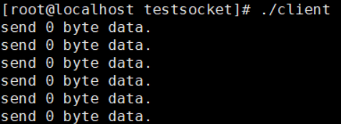
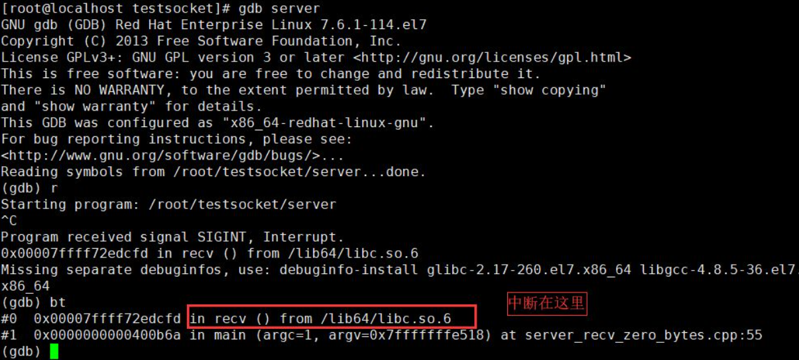

## 非阻塞模式下 send 和 recv 函数的返回值

我们来总结一下 **send** 和 **recv** 函数的各种返回值意义：

|   返回值 n    |                          返回值含义                          |
| :-----------: | :----------------------------------------------------------: |
|    大于 0     |                      成功发送 n 个字节                       |
|       0       |                         对端关闭连接                         |
| 小于 0（ -1） | 出错或者被信号中断或者对端 TCP 窗口太小数据发不出去（send）或者当前网卡缓冲区已无数据可收（recv） |

我们来逐一介绍下这三种情况：

- ### **返回值大于 0**

  对于 **send** 和 **recv** 函数返回值大于 **0**，表示发送或接收多少字节，需要注意的是，在这种情形下，我们一定要判断下 send 函数的返回值是不是我们期望发送的缓冲区长度，而不是简单判断其返回值大于 0。举个例子：

  ```c
  int n = send(socket, buf, buf_length, 0)；
  if (n > 0)
  {
    printf("send data successfully\n");
  }
  ```

  很多新手会写出上述代码，虽然返回值 n 大于 0，但是实际情形下，由于对端的 TCP 窗口可能因为缺少一部分字节就满了，所以**返回值 n 的值可能在 (0, buf_length] 之间，当 0 < n < buf_length 时，虽然此时 send 函数是调用成功了，但是业务上并不算正确，因为有部分数据并没发出去**。你可能在一次测试中测不出 n 不等于 buf_length 的情况，但是不代表实际中不存在。所以，建议要么认为返回值 n 等于 buf_length 才认为正确，要么**在一个循环中调用 send 函数，如果数据一次性发不完，记录偏移量，下一次从偏移量处接着发，直到全部发送完为止**。
  
  ```c
  int n = send(socket, buf, buf_length, 0)；
  if (n == buf_length)
  {
    printf("send data successfully\n");
  }
  ```
  
  ```c
  //推荐的方式二：在一个循环里面根据偏移量发送数据
  bool SendData(const char* buf , int buf_length)
  {
      //已发送的字节数目
       int sent_bytes = 0;
       int ret = 0;
       while (true)
       {
           ret = send(m_hSocket, buf + sent_bytes, buf_length - sent_bytes, 0);
          if (nRet == -1)
          {
              if (errno == EWOULDBLOCK)
              {
                  //严谨的做法，这里如果发不出去，应该缓存尚未发出去的数据，后面介绍
                  break;
              }             
              else if (errno == EINTR)
                  continue;
              else
                  return false;
          }
          else if (nRet == 0)
          {
              return false;
          }
  
          sent_bytes += ret;
          if (sent_bytes == buf_length)
              break;
  
          //稍稍降低 CPU 的使用率
          usleep(1);
       }
       return true;
  }
  ```
  
  

- ### **返回值等于 0**

  通常情况下，如果 **send** 或者 **recv** 函数返回 **0**，我们就认为对端关闭了连接，我们这端也关闭连接即可，这是实际开发时最常见的处理逻辑。

  但是，现在还有一种情形就是，假设调用 **send** 函数传递的数据长度就是 0 呢？**send** 函数会是什么行为？对端会 **recv** 到一个 0 字节的数据吗？需要强调的是，**在实际开发中，你不应该让你的程序有任何机会去 send 0 字节的数据，这是一种不好的做法。** 这里仅仅用于实验性讨论，我们来通过一个例子，来看下 **send** 一个长度为 **0** 的数据，**send** 函数的返回值是什么？对端会 **recv** 到 **0** 字节的数据吗？

  **server** 端代码：

```c
 1  /**
 2   * 验证recv函数接受0字节的行为，server端，server_recv_zero_bytes.cpp
 3   */
 4   
 5  #include <sys/types.h> 
 6  #include <sys/socket.h>
 7  #include <arpa/inet.h>
 8  #include <unistd.h>
 9  #include <iostream>
10  #include <string.h>
11  #include <vector>
12
13  int main(int argc, char* argv[])
14  {
15      //1.创建一个侦听socket
16      int listenfd = socket(AF_INET, SOCK_STREAM, 0);
17      if (listenfd == -1)
18      {
19          std::cout << "create listen socket error." << std::endl;
20          return -1;
21      }
22
23      //2.初始化服务器地址
24      struct sockaddr_in bindaddr;
25      bindaddr.sin_family = AF_INET;
26      bindaddr.sin_addr.s_addr = htonl(INADDR_ANY);
27      bindaddr.sin_port = htons(3000);
28      if (bind(listenfd, (struct sockaddr *)&bindaddr, sizeof(bindaddr)) == -1)
29      {
30          std::cout << "bind listen socket error." << std::endl;
31          close(listenfd);
32          return -1;
33      }
34
35      //3.启动侦听
36      if (listen(listenfd, SOMAXCONN) == -1)
37      {
38          std::cout << "listen error." << std::endl;
39          close(listenfd);
40          return -1;
41      }
42
43      int clientfd;
44
45      struct sockaddr_in clientaddr;
46      socklen_t clientaddrlen = sizeof(clientaddr);
47      //4. 接受客户端连接
48      clientfd = accept(listenfd, (struct sockaddr *)&clientaddr, &clientaddrlen);
49      if (clientfd != -1)
50      {           
51          while (true)
52          {
53              char recvBuf[32] = {0};
54              //5. 从客户端接受数据,客户端没有数据来的时候会在recv函数处阻塞
55              int ret = recv(clientfd, recvBuf, 32, 0);
56              if (ret > 0) 
57              {
58                  std::cout << "recv data from client, data: " << recvBuf << std::endl;               
59              } 
60              else if (ret == 0)
61              {
62                  std::cout << "recv 0 byte data." << std::endl;
63                  continue;
64              } 
65              else
66              {
67                  //出错
68                  std::cout << "recv data error." << std::endl;
69                  break;
70              }
71          }               
72      }
73
74
75      //关闭客户端socket
76      close(clientfd);
77      //7.关闭侦听socket
78      close(listenfd);
79
80      return 0;
81  }
```

上述代码侦听端口号是 **3000**，代码 **55** 行调用了 **recv** 函数，如果客户端一直没有数据，程序会阻塞在这里。

**client** 端代码：

```c
 1/**
 2 * 验证非阻塞模式下send函数发送0字节的行为，client端，nonblocking_client_send_zero_bytes.cpp
 3 */
 4 
 5#include <sys/types.h> 
 6#include <sys/socket.h>
 7#include <arpa/inet.h>
 8#include <unistd.h>
 9#include <iostream>
10#include <string.h>
11#include <stdio.h>
12#include <fcntl.h>
13#include <errno.h>
14
15#define SERVER_ADDRESS "127.0.0.1"
16#define SERVER_PORT     3000
17#define SEND_DATA       ""
18
19int main(int argc, char* argv[])
20{
21    //1.创建一个socket
22    int clientfd = socket(AF_INET, SOCK_STREAM, 0);
23    if (clientfd == -1)
24    {
25        std::cout << "create client socket error." << std::endl;
26        return -1;
27    }
28
29    //2.连接服务器
30    struct sockaddr_in serveraddr;
31    serveraddr.sin_family = AF_INET;
32    serveraddr.sin_addr.s_addr = inet_addr(SERVER_ADDRESS);
33    serveraddr.sin_port = htons(SERVER_PORT);
34    if (connect(clientfd, (struct sockaddr *)&serveraddr, sizeof(serveraddr)) == -1)
35    {
36        std::cout << "connect socket error." << std::endl;
37        close(clientfd);
38        return -1;
39    }
40
41    //连接成功以后，我们再将 clientfd 设置成非阻塞模式，
42    //不能在创建时就设置，这样会影响到 connect 函数的行为
43    int oldSocketFlag = fcntl(clientfd, F_GETFL, 0);
44    int newSocketFlag = oldSocketFlag | O_NONBLOCK;
45    if (fcntl(clientfd, F_SETFL,  newSocketFlag) == -1)
46    {
47        close(clientfd);
48        std::cout << "set socket to nonblock error." << std::endl;
49        return -1;
50    }
51
52    //3. 不断向服务器发送数据，或者出错退出
53    int count = 0;
54    while (true)
55    {
56        //发送 0 字节的数据
57        int ret = send(clientfd, SEND_DATA, 0, 0);
58        if (ret == -1) 
59        {
60            //非阻塞模式下send函数由于TCP窗口太小发不出去数据，错误码是EWOULDBLOCK
61            if (errno == EWOULDBLOCK)
62            {
63                std::cout << "send data error as TCP Window size is too small." << std::endl;
64                continue;
65            } 
66            else if (errno == EINTR)
67            {
68                //如果被信号中断，我们继续重试
69                std::cout << "sending data interrupted by signal." << std::endl;
70                continue;
71            } 
72            else 
73            {
74                std::cout << "send data error." << std::endl;
75                break;
76            }
77        }
78        else if (ret == 0)
79        {
80            //send 0字节
81            std::cout << "send 0 byte data." << std::endl;
82        } 
83        else
84        {
85            ++count;
86            std::cout << "send data successfully, count = " << count << std::endl;
87        }
88
89        //每三秒发一次
90        sleep(3);
91    }
92
93    //5. 关闭socket
94    close(clientfd);
95
96    return 0;
97}
```

**client** 端连接服务器成功以后，每隔 3 秒调用 **send** 一次发送一个 0 字节的数据。除了先启动 **server** 以外，我们使用 tcpdump 抓一下经过端口 **3000** 上的数据包，使用如下命令：

```
1tcpdump -i any 'tcp port 3000'
```

然后启动 **client** ，我们看下结果：



客户端确实是每隔 3 秒 **send** 一次数据。此时我们使用 **lsof -i -Pn** 命令查看连接状态，也是正常的：


然后，tcpdump 抓包结果输出中，除了连接时的三次握手数据包，再也无其他数据包，也就是说，**send 函数发送 0 字节数据，client 的协议栈并不会把这些数据发出去。**

```bash
[root@localhost ~]# tcpdump -i any 'tcp port 3000'
tcpdump: verbose output suppressed, use -v or -vv for full protocol decode
listening on any, link-type LINUX_SLL (Linux cooked), capture size 262144 bytes
417:37:03.028449 IP localhost.48820 > localhost.hbci: Flags [S], seq 1632283330, win 3690, options [mss 65495,sackOK,TS val 201295556 ecr 0,nop,wscale 7], length 0
17:37:03.028479 IP localhost.hbci > localhost.48820: Flags [S.], seq 3669336158, ack 1632283331, win 43690, options [mss 65495,sackOK,TS val 201295556 ecr 201295556,nop,wscale 7], length 0
17:37:03.028488 IP localhost.48820 > localhost.hbci: Flags [.], ack 1, win 342, options [nop,nop,TS val 201295556 ecr 201295556], length 0
```

因此，**server** 端也会一直没有输出，如果你用的是 gdb 启动 **server**，此时中断下来会发现，**server** 端由于没有数据会一直阻塞在 **recv** 函数调用处（**55** 行）。



上述示例再次验证了，**send** 一个 0 字节的数据没有任何意思，希望读者在实际开发时，避免写出这样的代码。