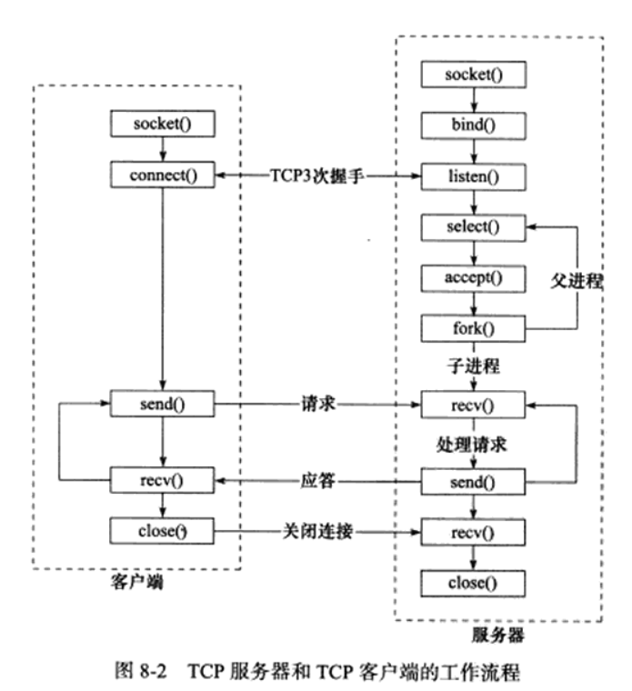
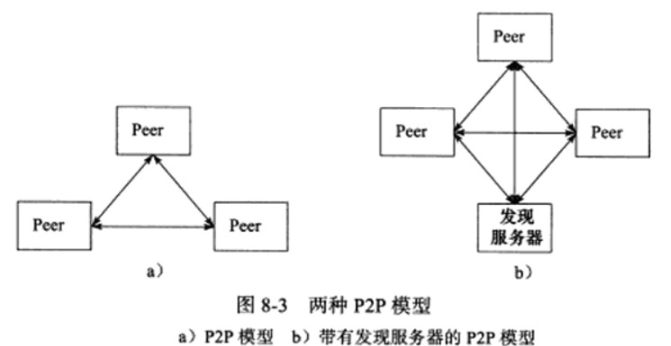
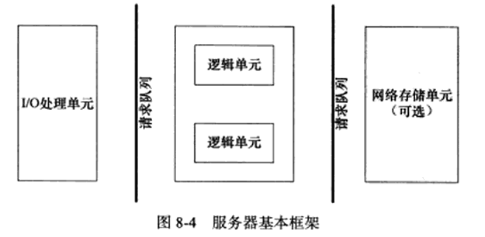
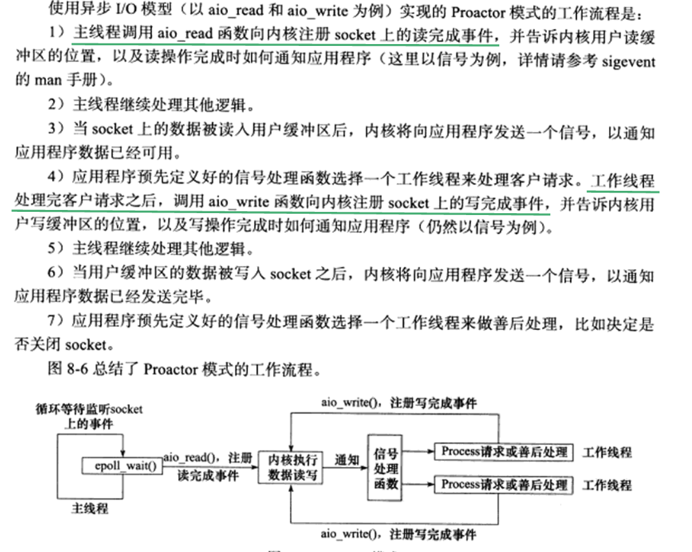
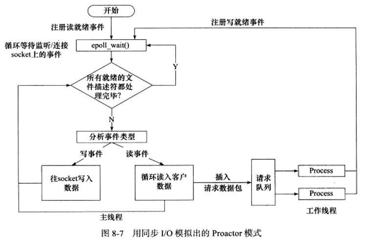
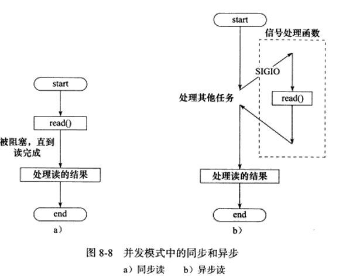
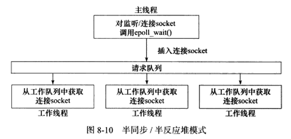
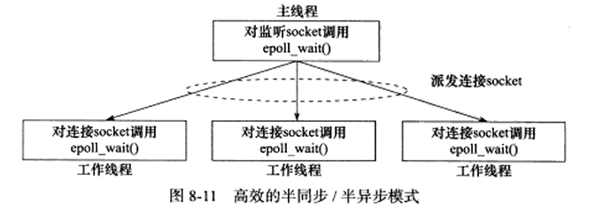
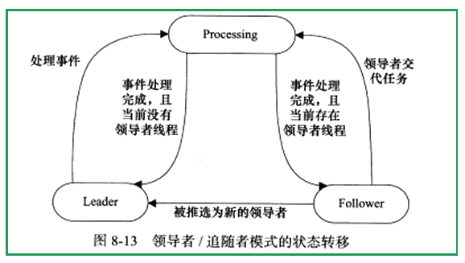

## 1	服务器模型

### 1.1	C/S模型

所有客户都通过访问服务器来获取所需资源，服务器启动后，创建监听socket，bind端口后调用listen函数等待客户连接。客户端通过connect函数向服务器发起连接。服务器需要使用某种I/O模型来监听这一事件。比较适合资源相对集中的场景。

### 1.2	P2P模型

每台主机都可提供服务，既是服务端又是客户端

## 2	服务器程序框架

|     模块     |       单个服务器程序       |          服务器机群          |
| :----------: | :------------------------: | :--------------------------: |
| I/O处理单元  | 处理客户连接，读写网络数据 | 作为接入服务器，实现负载均衡 |
|   逻辑单元   |       业务进程或线程       |          逻辑服务器          |
| 网络存储单元 |   本地数据库、文件或缓存   |         数据库服务器         |
|   请求队列   |    各单元之间的通信方式    |  各服务器之间的永久TCP连接   |

## 3	I/O模型

#### socket创建默认是阻塞的

阻塞和非阻塞的概念能应用于所有文件描述符

#### 针对阻塞I/O执行的系统调用可能因为无法立即完成而被操作系统挂起，直到等待的事件发生

#### 非阻塞的I/O执行的系统调用总是立即返回，无论有无发生，因此通常要和其他I/O机制一起使用，比如I/O复用和SIGIO信号

#### I/O复用函数主要有select poll epoll_wait，注意I/O复用函数本身是阻塞的，它们能提高程序效率的原因在于它们具有同时监听多个I/O事件的能力

|  I/O模型  | 读写操作和阻塞阶段                                           |
| :-------: | :----------------------------------------------------------- |
|  阻塞I/O  | 程序阻塞于读写函数                                           |
|  I/O复用  | 程序阻塞于I/O复用系统调用，但可同时监听多个I/O事件。对I/O本身的读写操作是非阻塞的 |
| SIGIO信号 | 信号触发读写就绪事件，用户程序执行读写操作。程序没有阻塞阶段 |
|  异步I/O  | 内核执行读写操作并触发读写完成事件。程序没有阻塞阶段         |

## 4	两种高效的事件处理模式

### 4.1	Reactor模式

[Reactor模式](.\Reactor模式.md)

### 4.2	Procactor模式

将所有I/O操作都交给主线程和内核处理，工作线程仅负责业务逻辑

### 4.3	模拟Procactor模式

使用同步I/O模型（epoll_wait为例）的工作流程如下：

​	1、主线程往epoll内核事件表中注册socket上的读就绪事件

​	2、主线程调用epoll_wait等待socket上有数据可读

​	3、当socket上有数据可读，epoll_wait通知主线程。主线程从socket循环读取数据，直到没有数据可读，将读到的数据封装成一个请求对象并插入请求队列

​	4、睡眠在请求队列的某个工作线程被唤醒，其获得请求对象并处理客户请求，然后往epoll内核事件表中注册socket上的写就绪事件

​	5、主线程调用epoll_wait等待socket可写

​	6、当socket可写时，epoll_wait通知主线程。主线程往socket上写入服务器处理客户请求的结果

## 5	两种高效的并发模式

服务器主要有两种并发编程模式：半同步/半异步模式和领导者/追随者模式

并发模式中的**同步指程序完全按照代码顺序执行**

**异步指程序的执行需要系统事件的驱动**，例如信号、中断等。

### 半同步/半异步模式

按同步方式运行的线程称为同步线程，异步方式运行称为异步线程，异步线程执行效率高，因此我们应该同时使用同步线程和异步线程，即半同步/半异步模式

同步线程处理客户逻辑（工作线程），异步线程处理I/O事件（主线程）

###### 半同步/半反应堆模式缺点：

- 主线程和工作线程共享请求队列。主线程向请求队列添加任务或工作线程从中取出任务，都需要请求队列加锁保护，白白耗费cpu时间

- 每个工作线程在同一时间只能处理一个客户请求。如果客户数量较多，而工作线程较少，则请求队列中将堆积很多任务对象，客户端响应速度越来越慢。如果通过增加工作线程来解决这一问题，则工作线程切换也将耗费大量cpu时间

上图的主线程只管监听socket，连接由工作线程来管理，较为高效。

### 领导者/追随者模式

多个工作线程轮流监听、分发并处理事件，任意时间仅有一个领导者线程负责监听I/O事件

