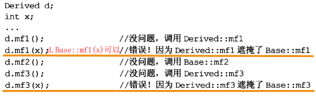
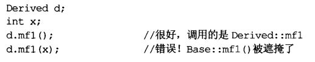

# 条款31	将文件间的编译依存关系降至最低

- 支持”编译依存最小化”的一般构想是：相依于**声明式**，不要相依于定义式。基于此构想的两个手段是**Handle classes**和**Interface classes**
- **编译依存最小化的设计策略**：
  1、如果使用object references或object pointers可以完成任务，就不要用objects
  2、如果能够，以class声明式替换class定义式
  3、为声明式和定义式提供不同的头文件

```cpp
//Person.h
#include <string>
#include "date.h"
#include "address.h"
class　Person{
public:

public:
    Person(const std::string& name,const Date& birthday,const Address& addr);
    string Name() const;
    string Birthday() const;
    string Address() const;
private:
	std::string theName;
	Date theBirthdate;
	Address theAddress;
}
```

正常情况下，在Person上面会有

```cpp
#include <string>
#include "date.h"
#include "address.h"
```

但这样并不好，**这样一来便在person定义文件和其含入文件中形成了一种编译依存关系，如果头文件改变，或这些头文件依赖的其他头文件有改变，那么每个含有 person class的文件就要重新编译**

可以根据条款13使用shared_ptr

```cpp
// PersonImpl.h
#include <string>
#include "MyAddress.h"
#include "MyDate.h"
using namespace std;

class PersonImpl                //充当一个接口类，成员函数和Person相同，供
                                //Person类通过指针调用
{
public:
    string Name() const
    {
        return Name;
   }
   ...                          //其余成员函数定义

private:
    string Name;                //放置了所需的外来类对象
    MyAddress Address;
    MyDate Birthday;
};
```

```cpp
//Person.h 改进
//现实中让头文件尽可能自我满足
#include <string>
class PersonImpl;
class Date;
class Address;
//使用pimpl idiom的class，往往称为Handle class
class　Person{
public:
    Person(const std::string& name,const Date& birthday,const Address& addr);
    string Name() const;
    string Birthday() const;
    string Address() const;
private:
	//通过提供的PersonImp接口类指针替换实现Person，起到了隔离的作用
	std::tr1::shared_ptr<PersonImpl> pImpl;
}
```

这样设计，Person的客户就完全与date address以及person的实现细节分离了。那些classes的任何实现修改都不需要Person客户端重新编译

```cpp
// Person.cpp
#include "Person.h"                     //正在实现Person类
#include "PersonImpl.h"                 //使用PersonImp接口类实现Person
                                        //类，必须使用其成员函数，所以要
                                        //include接口类头文件
Person::Person(const std::string& name,const Date& birthday,const Address& addr):pImpl(new PersonImpl(name,birthday,addr))
{ }
string Person::Name() const
{
    return pImpl->Name();
}
...                                      //其余函数实现
```

**总之，此时任何接口类头文件产生的变化只会导致接口类头文件的变化而重新编译，以及Person实现文件由于include了接口类的头文件也要重新编译；而Person类头文件由于只使用了类的声明式，所以并不会重新编译，因此所有使用Person类的对象的文件也都不需要重新编译了，这样就大大降低了文件之间的编译依存关系**

具体扩展内容看[C++中前置声明和头文件包含](<https://blog.csdn.net/EmSoftEn/article/details/50374232?ops_request_misc=%257B%2522request%255Fid%2522%253A%2522165522059216782390534855%2522%252C%2522scm%2522%253A%252220140713.130102334.pc%255Fall.%2522%257D&request_id=165522059216782390534855&biz_id=0&spm=1018.2226.3001.4187>)

------

**另外，用Interface Classes也可以降低编译的依赖，实现方法大致是父类只提供虚方法，而将实现放置在子类中，再通过父类提供的一个特别的静态函数，生成子类对象，通过父类指针来进行操作；从而子类头文件的改动也不会导致使用该类的文件重新编译，因为用的是父类指针，客户include的是只是父类头文件，该静态方法实现如下:**

```cpp
class Person{
public:
    ...
	static std::tr1::shared_ptr<Person> create(const std::string& name,       
                                               const Date& birthday, 
                                               const Address& addr)
      
	...
};
```

```cpp
//客户使用方法
std::string name;
Date date;
Address addr;
std::tr1::shared_ptr<Person> p(Person::create(name,date,addr));

std::cout<<p->name()<<std::endl;

```

```cpp
class RealPerson{
public:
	RealPerson(const std::string& name,const Date& birthday, 
               const Address& addr) 		     
               :theName(name),theBirthdate(date),theAddress(addr);
	virtual ~RealPerson(){}
	std::string name() const;
	std::string birthDate() const;
	std::string address() const;
private:
	std::string theName;
	Date theBirthdate;
	Address theAddress; 
};
```

```cpp
//类似工厂模式
std::tr1::shared_ptr<Person> Person::Create(const std::string& name,                    
                                            const Date& birthday, 
                                            const Address& addr)
{
    return std::tr1::shared_ptr<Person>(new RealPerson(name, birthday, addr));
}
```

# 条款32	确定你的public继承塑模处is-a关系

- **public inheritance（公开继承）意味着“is- a”关系。适用于base class的每件事一定也要适用于derived class，因为每个derived 对象也都是一个base class**

# 条款33	避免遮掩继承而来的名称

```cpp
class base{
private:
	int x;
public:
	virtual void mf1() = 0;
	virtual void mf2();
	void mf3();
	...
};
class derived:public base{
public:
	virtual void mf1();
	void mf4();
	...
};

void derived::mf4(){
    ...
    mf2();
    ...
}
```

编译器看到mf4中调用mf2，做法是**查找各作用域**

**首先看local作用域（mf4函数内部），没找到mf2，查找外围作用域（derived作用域），还是没找到，再向外围查找base，找到mf2，停止查找，如果还没有，就去含有base class的namespace查找，最后再去global作用域**

```cpp
class base{
private:
	int x;
public:
	virtual void mf1() = 0;
	virtual void mf1(int);
	virtual void mf2();
	void mf3();
	void mf3(double);
	...
};
class derived:public base{
public:
	virtual void mf1();
	void mf3();
	void mf4();
	...
};
```

**base class的所有名为mf1和mf3的函数都被derived class内的mf1和mf3函数遮掩掉了**

**即使有不同参数类型、virtual和non-virtual也会被覆盖**



#### **解决方法：using声明式**

```
class derived:public base{
public:
	using base::mf1;//让base class内名为mf1和mf3的所有东西
	using base::mf3;//都在derived作用域内可见
	virtual void mf1();
	void mf3();
	void mf4();
	...
};
```


**问题：加入derived想唯一继承的mf1是那个无参数版本，using就不太好，因为using会让所有同名函数可见，因此需要不同的技术，即一个简单的转交函数**

```
class derived:public base{
public:
	virtual void mf1(){	//转交函数
		base::mf1();	//暗自成为inline 条款30
	}
	...
};
```



# 条款34	区分接口继承和实现继承

- **public继承下，derived class总是继承base class的接口**

- **pure virtual**函数使derived class只继承函数接口
- **impure virtual**函数使derived class继承函数接口和缺省实现
- **non-virtual**函数使derived class继承函数的接口和一份强制性实现

