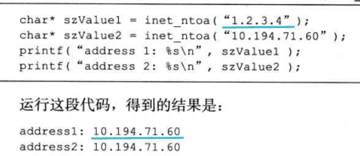

## 1 	主机字节序(little)和网络字节序(big)

- ### 大端  高低低高（高位字节存储在低地址，低位字节存储在高地址）

- ### 小段  高高低低

  ```cpp
  #include <stdio.h>
  void judge_bigend_littleend3()
  {
      union
      {
          int i;
          char c;
      }un;
      un.i = 1;
  	//小端 低位放在低地址上，看上去别扭
      if (un.c == 1)
          printf("小端\n");
      else
          printf("大端\n");
  }
  int main(){
  	judge_bigend_littleend3();
  	return 0;
  }
  ```

  **linux提供4个函数来完成二者的转换**

  ```c
  unsigned long int htonl(unsigned long int hostlong);//host to network long
  unsigned long int htons(unsigned long int hostshort);
  unsigned long int ntohl(unsigned long int netlong);
  unsigned long int ntohs(unsigned short int netshort);
  ```

  

## 2	通用socket地址

- ## sockaddr

  ```c
  #include<bits/socket.h>
  struct sockaddr{
  	sa_family_t sa_family;//地址族
  	char sa_data[14];//用于存放socket地址值
  };
  ```

  

  

  由上图可知，sa_data无法完全容纳多数协议族的地址值，因此定义了新的socket地址结构体

  ```c
  struct sockaddr_storage{
  	sa_family_t sa_family;
  	unsigned long int __ss_align;//内存对齐
  	char __ss_padding[128-sizeof(__ss_align)];
  };
  ```


## 3	专用socket地址

- ### TCP/IP协议族有sockaddr_in和sockaddr_in6两个专用结构体，分别用于IPV4/6

  ```c
  struct sockaddr_in{
  	sa_family_t sin_family;		//地址族:AF_INET
  	u_int16_t sin_port;			//端口号	网络字节序
  	struct in_addr sin_addr;	//IPV4地址
  };
  struct in_addr{
   	u_int32_t s_addr;  
  };
  
  struct sockaddr_in6{
      sa_family_t sin_family;		//地址族:AF_INET6
      u_int16_t sin6_port;		//端口号	网络字节序
      u_int32_t sin6_flowinfo;	//流信息	应设置为0
      struct in6_addr sin6_addr;	//IPV6地址结构体
      u_int32_t sin6_scope_id;	//scope ID
  };
  struct in6_addr{
      unsigned char sa_addr[16];
  };
  ```


## 4	IP地址转换函数

```c
#include <arpa/inet.h>
//将用点分十进制字符串表示的IPV4地址转换为用网络字节序整数表示的IPV4地址
//失败返回INADDR_NONE
in_addr_t inet_addr(const char* strptr);
//功能同inet_addr,但将结果存储于参数inp的地址
//成功1 失败0
int inet_aton(const char* cp,struct in_addr* inp);
//将网络字节序整数表示的IPV4地址转换为字符串，但char*返回的是固定内存地址，因此不可重入
char* inet_ntoa(struct in_addr in);
```



```c
//字符串转换成网络字节序整数表示的地址，结果存储于dst
int inet_pton(int af,const char* src,void* dst);
//与上相反转换
//成功返回地址，失败返回NULL并设置errno
const char* inet_ntop(int af,const void* src,char* dst,socklen_t cnt);
```

