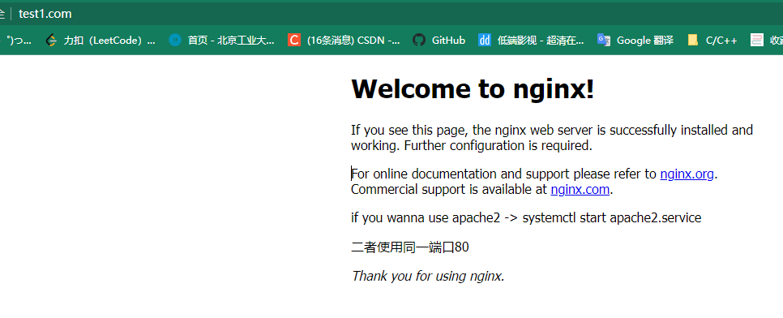
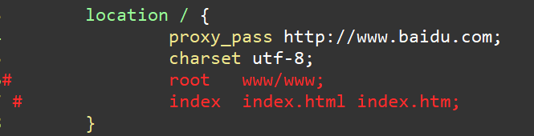
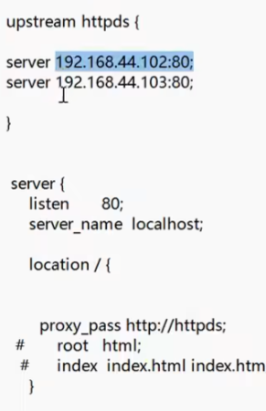

## 安装

#### 1	下载nginx开源版tar包

`https://nginx.org/en/download.html`

#### 2	编译安装

```bash
╭─oarrrr@oarrrr ~
╰─$ tar zxvf nginx-1.22.0.tar.gz

╭─oarrrr@oarrrr ~
╰─$ cd nginx-1.22.0/

╭─oarrrr@oarrrr ~/nginx-1.22.0
╰─$ ./configure

╭─oarrrr@oarrrr ~/nginx-1.22.0
╰─$ sudo make && make install

╭─oarrrr@oarrrr ~/nginx-1.22.0
╰─$ cd /usr/local/nginx/

```

#### 3	ubutun设置自启动nginx

```bash
# 自己编译则需要手动写入nginx.service文件
╭─oarrrr@oarrrr /lib/systemd/system
╰─$ sudo emacs nginx.service

# nginx.service 文件内容
[Unit]
Description=nginx - web server
After=network.target remote-fs.target nss-lookup.target

[Service]
Type=forking
PIDFile=/usr/local/nginx/logs/nginx.pid
ExecStartPre=/usr/local/nginx/sbin/nginx -t -c /usr/local/nginx/conf/nginx.conf
ExecStart=/usr/local/nginx/sbin/nginx -c /usr/local/nginx/conf/nginx.conf
ExecReload=/usr/local/nginx/sbin/nginx -s reload
ExecStop=/usr/local/nginx/sbin/nginx -s stop
ExecQuit=/usr/local/nginx/sbin/nginx -s quit
PrivateTmp=true

[Install]
WantedBy=multi-user.target

╭─oarrrr@oarrrr /lib/systemd/system
╰─$ systemctl daemon-reload  # 更新加载

╭─oarrrr@oarrrr /lib/systemd/system
╰─$ systemctl start nginx.service

╭─oarrrr@oarrrr /lib/systemd/system
╰─$ systemctl enable nginx.service # 开机自启动
```


## 基础操作

```
nginx			# 启动
nginx -s reload	# 重新加载conf文件
nginx -s stop	# 直接关闭
nginx -s quit 	# 处理完请求再关闭
```


## 文件结构

```bash
# tree /usr/local/nginx
# nginx文件结构
nginx
├── client_body_temp
├── conf	# 配置文件
│   ├── fastcgi.conf
│   ├── fastcgi.conf.default
│   ├── fastcgi_params
│   ├── fastcgi_params.default
│   ├── koi-utf
│   ├── koi-win
│   ├── mime.types
│   ├── mime.types.default
│   ├── nginx.conf
│   ├── nginx.conf.default
│   ├── scgi_params
│   ├── scgi_params.default
│   ├── uwsgi_params
│   ├── uwsgi_params.default
│   └── win-utf
├── fastcgi_temp
├── html	# html文件
│   ├── 50x.html
│   └── index.html
├── logs	# log文件
│   ├── access.log
│   ├── error.log
│   └── nginx.pid
├── proxy_temp
├── sbin	# 启动文件
│   ├── nginx
│   └── nginx.old
├── scgi_temp
└── uwsgi_temp
```


## 基础配置

```nginx
# 默认为1 表示开启一个业务进程
worker_processes  1; 

# 事件驱动模块
events {
    # 每个业务进程可以开启的连接数
    worker_connections  1024;
}


http {
    # 包含同路径的mime.types文件，文件里包含了一些mime类型
    include       mime.types;
    # 默认mime类型
    default_type  application/octet-stream;

    # sendfile on会将文件直接传送给网络端口，若off则先由nginx读取对应文件，再发送给网络端口
    sendfile        on;

    # 超时事件
    keepalive_timeout  65;

    # 主机，一个server代表一个主机，每个server之间互不干扰
    server {
        # 监听端口号
        listen       80;
        server_name  localhost; # 域名 主机名
	charset utf-8;


        # uri
        # 用户访问 /时，会将目录指向root目录下的html目录
        location / {
		charset utf-8;
		# 相对路径 ./html
		# 如果没有/则默认为nginx文件夹下的路径
        # /www 则默认为根目录下开始的路径
		root   html;
		# 访问当前路径下生效 默认页 http://localhost/index.html
           index  index.html index.htm;
        }
        # 服务器内部错误时会转向到 50x.html页面 # http://localhost/50x.html
        error_page   500 502 503 504  /50x.html;
        location = /50x.html {
            root   html;
        }

    } # server
    
    server {
        # 监听端口号
        listen       8080;
        server_name  localhost;
	charset utf-8;


        location / {
		charset utf-8;
		root   html;
            	index  index.html index.htm;
        }
      
        error_page   500 502 503 504  /50x.html;
        location = /50x.html {
            root   html;
        }

    } # server

} # http
```


## 基本使用

### hosts文件解析域名

win10 hosts文件位于`C:\Windows\System32\drivers\etc`

```
# 域名解析
192.168.0.13 test1.com
```



反向代理到外网



负载均衡基本配置

配置为外网地址则可能产生strict-origin-when-cross-origin问题

