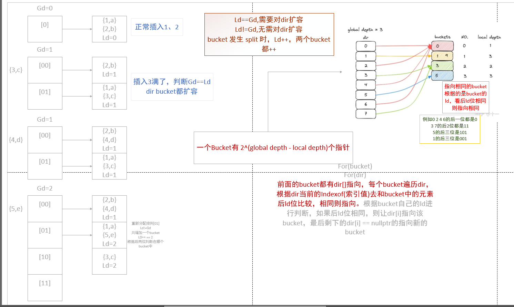

## 可扩展hash表



```cc
namespace bustub {

// ~~这里一定得写成global_depth_ = 1,否则，前面插入的数，经过哈希运算之后，只能为0，这个是不对的~~
// 这里也可以就写成0，hash之后的dir下标全为0也无所谓，到时候retribution的时候会重新分配的
template <typename K, typename V>
ExtendibleHashTable<K, V>::ExtendibleHashTable(size_t bucket_size)
    : global_depth_(0), bucket_size_(bucket_size), num_buckets_(1) {
  dir_.push_back(std::make_shared<Bucket>(bucket_size));
}

template <typename K, typename V>
auto ExtendibleHashTable<K, V>::IsBitsEqual(size_t a, size_t b, size_t bits) -> bool {
  return (((1 << bits) - 1) & a) == (((1 << bits) - 1) & b);
  // size_t mask = 1;
  // for (size_t i = 0; i < bits; i++) {
  //   if ((a & mask) != (b & mask)) {
  //     return false;
  //   }
  //   mask <<= 1;
  // }
  // return true;
}

template <typename K, typename V>
auto ExtendibleHashTable<K, V>::IndexOf(const K &key) const -> size_t {
  int mask = (1 << global_depth_) - 1;
  return hash_(key) & mask;
}

template <typename K, typename V>
auto ExtendibleHashTable<K, V>::GetGlobalDepth() const -> int {
  std::scoped_lock<std::mutex> lock(latch_);
  return GetGlobalDepthInternal();
}

template <typename K, typename V>
auto ExtendibleHashTable<K, V>::GetGlobalDepthInternal() const -> int {
  return global_depth_;
}

template <typename K, typename V>
auto ExtendibleHashTable<K, V>::GetLocalDepth(int dir_index) const -> int {
  std::scoped_lock<std::mutex> lock(latch_);
  return GetLocalDepthInternal(dir_index);
}

template <typename K, typename V>
auto ExtendibleHashTable<K, V>::GetLocalDepthInternal(int dir_index) const -> int {
  return dir_[dir_index]->GetDepth();
}

template <typename K, typename V>
auto ExtendibleHashTable<K, V>::GetNumBuckets() const -> int {
  std::scoped_lock<std::mutex> lock(latch_);
  return GetNumBucketsInternal();
}

template <typename K, typename V>
auto ExtendibleHashTable<K, V>::GetNumBucketsInternal() const -> int {
  return num_buckets_;
}

template <typename K, typename V>
auto ExtendibleHashTable<K, V>::Find(const K &key, V &value) -> bool {
  std::lock_guard<std::mutex> lock(latch_);
  auto index = IndexOf(key);
  return dir_[index]->Find(key, value);
}

template <typename K, typename V>
auto ExtendibleHashTable<K, V>::Remove(const K &key) -> bool {
  std::lock_guard<std::mutex> lock(latch_);
  return dir_[IndexOf(key)]->Remove(key);
}

template <typename K, typename V>
void ExtendibleHashTable<K, V>::Insert(const K &key, const V &value) {
  std::lock_guard<std::mutex> lock(latch_);
  while (!dir_[IndexOf(key)]->Insert(key, value)) {
    RedistributeBucket(dir_[IndexOf(key)]);
  }
}
/**
 * 这里只会重新分配一次，如果没有分配好，那么再次调用即可, 或者是这个函数写一个递归
 * @tparam K
 * @tparam V
 * @param bucket
 */
template <typename K, typename V>
auto ExtendibleHashTable<K, V>::RedistributeBucket(std::shared_ptr<Bucket> bucket) -> void {
  if (bucket->GetDepth() >= global_depth_) {  // 如果和全局深度相同的话，那么就需要将全局的dir数组给扩容
    // dir_.resize(2 * dir_.size());  // 这个是真的会增加数组的大小的，而reserve只是增加数组的capacity而不是size
    // bug原因：dir_.insert(dir_.end(), dir_.begin(), dir_.end()); 这样发现没有成功复制，尽管扩容了
    auto temp_list = dir_;
    dir_.insert(dir_.end(), temp_list.begin(), temp_list.end());
    global_depth_++;
  }
  bucket->IncrementDepth();
  size_t origin_index = 0;
  // 最开始的index
  for (size_t i = 0; i < dir_.size(); i++) {
    if (dir_[i] == bucket) {
      origin_index = i;
      break;
    }
  }
  auto new_bucket = std::make_shared<ExtendibleHashTable<K, V>::Bucket>(bucket_size_, bucket->GetDepth());
  num_buckets_++;
  for (size_t i = 0; i < dir_.size(); i++) {
    // 如果原来指向bucket的dir_[i]后ld位不相同，则指向new_bucket
    if (dir_[i] == bucket && !IsBitsEqual(i, origin_index, bucket->GetDepth())) {
      dir_[i] = new_bucket;
    }
  }
  auto list = bucket->GetItems();
  for (const auto &item : list) {
    if (dir_[IndexOf(item.first)] != bucket) {  // 按照新的映射关系去重新计算以前的bucket中的元素是不是应该还在这儿
      bucket->Remove(item.first);
      new_bucket->Insert(item.first, item.second);
    }
  }
}

//===--------------------------------------------------------------------===//
// Bucket
//===--------------------------------------------------------------------===//
template <typename K, typename V>
ExtendibleHashTable<K, V>::Bucket::Bucket(size_t array_size, int depth) : size_(array_size), depth_(depth) {}

template <typename K, typename V>
auto ExtendibleHashTable<K, V>::Bucket::Find(const K &key, V &value) -> bool {
  bool ret = true;
  if (const auto &iter =
          std::find_if(list_.begin(), list_.end(), [&](const std::pair<K, V> &p) { return p.first == key; });
      iter == list_.end()) {
    ret = false;
  } else {
    value = iter->second;
    ret = true;
  }
  return ret;
}

template <typename K, typename V>
auto ExtendibleHashTable<K, V>::Bucket::Remove(const K &key) -> bool {
  if (const auto &kv = Find(key); kv != list_.end()) {
    list_.remove(*kv);
    return true;
  }
  return false;
}

template <typename K, typename V>
auto ExtendibleHashTable<K, V>::Bucket::Insert(const K &key, const V &value) -> bool {
  if (IsFull()) {
    return false;
  }
  if (const auto &kv = Find(key); kv != list_.end()) {
    (*kv).second = value;
  } else {
    list_.emplace_back(key, value);
  }
  return true;
}

template <typename K, typename V>
auto ExtendibleHashTable<K, V>::Bucket::Find(const K &key) -> typename std::list<std::pair<K, V>>::iterator {
  return std::find_if(list_.begin(), list_.end(), [&](const std::pair<K, V> &p) { return p.first == key; });
}

template class ExtendibleHashTable<page_id_t, Page *>;
template class ExtendibleHashTable<Page *, std::list<Page *>::iterator>;
template class ExtendibleHashTable<int, int>;
// test purpose
template class ExtendibleHashTable<int, std::string>;
template class ExtendibleHashTable<int, std::list<int>::iterator>;

}  // namespace bustub
```

