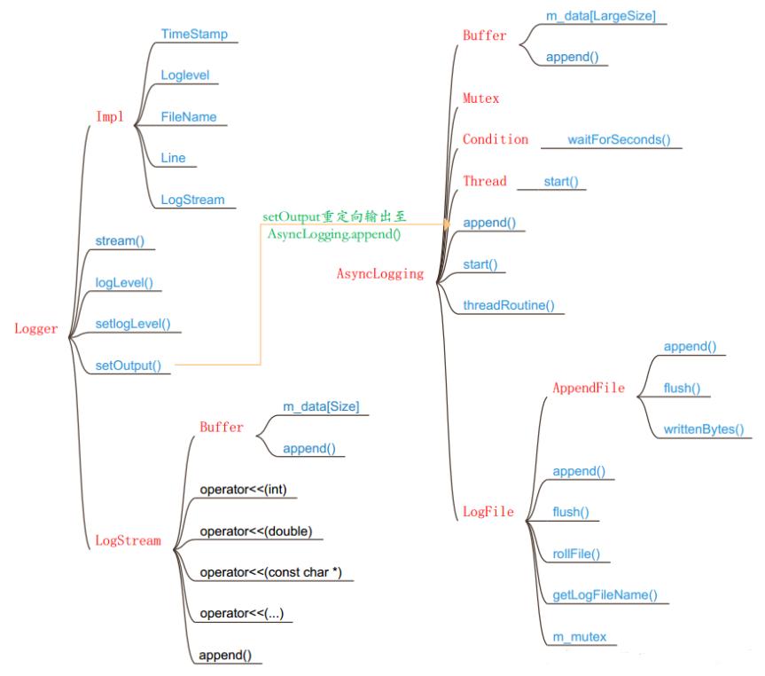

## FileUtil

#### ReadSmallFile

```cc
#include "muduo/base/noncopyable.h"
#include "muduo/base/StringPiece.h"
#include <sys/types.h>  // for off_t

namespace FileUtil
{

// read small file < 64KB
class ReadSmallFile : noncopyable
{
 public:
  ReadSmallFile(StringArg filename);
  ~ReadSmallFile();

  // return errno
  template<typename String>
  int readToString(int maxSize,
                   String* content,
                   int64_t* fileSize,
                   int64_t* modifyTime,
                   int64_t* createTime);

  /// Read at maxium kBufferSize into buf_
  // return errno
  int readToBuffer(int* size);

  const char* buffer() const { return buf_; }

  static const int kBufferSize = 64*1024;

 private:
  int fd_;
  int err_;
  char buf_[kBufferSize];
};

// read the file content, returns errno if error happens.
template<typename String>
int readFile(StringArg filename,
             int maxSize,
             String* content,
             int64_t* fileSize = NULL,
             int64_t* modifyTime = NULL,
             int64_t* createTime = NULL)
{
  ReadSmallFile file(filename);
  return file.readToString(maxSize, content, fileSize, modifyTime, createTime);
}

FileUtil::ReadSmallFile::ReadSmallFile(StringArg filename)
  : fd_(::open(filename.c_str(), O_RDONLY | O_CLOEXEC)),
    err_(0)
{
  buf_[0] = '\0';
  if (fd_ < 0)
  {
    err_ = errno;
  }
}

FileUtil::ReadSmallFile::~ReadSmallFile()
{
  if (fd_ >= 0)
  {
    ::close(fd_); // FIXME: check EINTR
  }
}

// return errno
template<typename String>
int FileUtil::ReadSmallFile::readToString(int maxSize,
                                          String* content,
                                          int64_t* fileSize,
                                          int64_t* modifyTime,
                                          int64_t* createTime)
{
  static_assert(sizeof(off_t) == 8, "_FILE_OFFSET_BITS = 64");
  assert(content != NULL);
  int err = err_;
  if (fd_ >= 0)
  {
    content->clear();

    if (fileSize)
    {
      struct stat statbuf;
      if (::fstat(fd_, &statbuf) == 0)
      {
        if (S_ISREG(statbuf.st_mode))
        {
          *fileSize = statbuf.st_size;
          content->reserve(static_cast<int>(std::min(implicit_cast<int64_t>(maxSize), *fileSize)));
        }
        else if (S_ISDIR(statbuf.st_mode))
        {
          err = EISDIR;
        }
        if (modifyTime)
        {
          *modifyTime = statbuf.st_mtime;
        }
        if (createTime)
        {
          *createTime = statbuf.st_ctime;
        }
      }
      else
      {
        err = errno;
      }
    }

    while (content->size() < implicit_cast<size_t>(maxSize))
    {
      size_t toRead = std::min(implicit_cast<size_t>(maxSize) - content->size(), sizeof(buf_));
      ssize_t n = ::read(fd_, buf_, toRead);
      if (n > 0)
      {
        content->append(buf_, n);
      }
      else
      {
        if (n < 0)
        {
          err = errno;
        }
        break;
      }
    }
  }
  return err;
}

int FileUtil::ReadSmallFile::readToBuffer(int* size)
{
  int err = err_;
  if (fd_ >= 0)
  {
    ssize_t n = ::pread(fd_, buf_, sizeof(buf_)-1, 0);
    if (n >= 0)
    {
      if (size)
      {
        *size = static_cast<int>(n);
      }
      buf_[n] = '\0';
    }
    else
    {
      err = errno;
    }
  }
  return err;
}
    
    
}
```

#### AppendFile

```cc
// not thread safe
class AppendFile : noncopyable
{
 public:
  explicit AppendFile(StringArg filename);

  ~AppendFile();
	
  void append(const char* logline, size_t len);

  void flush();

  off_t writtenBytes() const { return writtenBytes_; }

 private:

  size_t write(const char* logline, size_t len);

  FILE* fp_;
  char buffer_[64*1024];
  off_t writtenBytes_;
};

FileUtil::AppendFile::AppendFile(StringArg filename)
  : fp_(::fopen(filename.c_str(), "ae")),  // 'e' for O_CLOEXEC
    writtenBytes_(0)
{
  assert(fp_);
  // 调用setbuffer()可用来设置文件流的缓冲区
  ::setbuffer(fp_, buffer_, sizeof buffer_);
  // posix_fadvise POSIX_FADV_DONTNEED ?
}

FileUtil::AppendFile::~AppendFile()
{
  ::fclose(fp_);
}

void FileUtil::AppendFile::append(const char* logline, const size_t len)
{
  size_t written = 0;

  while (written != len)
  {
    size_t remain = len - written;
    size_t n = write(logline + written, remain);
    if (n != remain)
    {
      int err = ferror(fp_);
      if (err)
      {
        fprintf(stderr, "AppendFile::append() failed %s\n", strerror_tl(err));
        break;
      }
    }
    written += n;
  }

  writtenBytes_ += written;
}

void FileUtil::AppendFile::flush()
{
  ::fflush(fp_);
}

size_t FileUtil::AppendFile::write(const char* logline, size_t len)
{
  // #undef fwrite_unlocked
  return ::fwrite_unlocked(logline, 1, len, fp_);
}
```

## LogFile

- 每天一篇日志(`const static int kRollPerSeconds_ = 60*60*24;`)，换日志调用`LogFile::rollFile()`

- 每次调用`LogFile::append_unlocked`检查：
  - `file_->writtenBytes() > rollSize_` -->`LogFile::rollFile()`
  - 当前时间和`startOfPeriod_`不是同一天 -->`LogFile::rollFile()`
  - `now - lastFlush_ > flushInterval_` -->`LogFile::rollFile()`


```cc
class LogFile : noncopyable
{
 public:
  LogFile(const string& basename,
          off_t rollSize,
          bool threadSafe = true,
          int flushInterval = 3,
          int checkEveryN = 1024);
  ~LogFile();

  void append(const char* logline, int len);
  void flush();
  bool rollFile();

 private:
  void append_unlocked(const char* logline, int len);

  static string getLogFileName(const string& basename, time_t* now);

  const string basename_;
  const off_t rollSize_;
  const int flushInterval_;
  const int checkEveryN_;

  int count_;

  std::unique_ptr<MutexLock> mutex_;
  time_t startOfPeriod_;
  time_t lastRoll_;
  time_t lastFlush_;
  std::unique_ptr<FileUtil::AppendFile> file_;

  const static int kRollPerSeconds_ = 60*60*24;
};

LogFile::LogFile(const string& basename,
                 off_t rollSize, // 自定义rollsize大小
                 bool threadSafe,
                 int flushInterval,//LogFile::flush()调用间隔
                 int checkEveryN)
  : basename_(basename),
    rollSize_(rollSize),
    flushInterval_(flushInterval),
    checkEveryN_(checkEveryN),
    count_(0),
    mutex_(threadSafe ? new MutexLock : NULL),//需要线程安全则new MutexLock
    startOfPeriod_(0),
    lastRoll_(0),
    lastFlush_(0)
{
  //确保basename没有'/'，保证basename只是当下路径的文件
  assert(basename.find('/') == string::npos);
  //更新为新文件
  rollFile();
}

LogFile::~LogFile() = default;

void LogFile::append(const char* logline, int len)
{
  //需要线程安全则调用MutexLockGuard
  if (mutex_)
  {
    MutexLockGuard lock(*mutex_);
    append_unlocked(logline, len);
  }
  else
  {
    append_unlocked(logline, len);
  }
}

void LogFile::flush()
{
  if (mutex_)
  {
    MutexLockGuard lock(*mutex_);
    file_->flush();
  }
  else
  {
    file_->flush();
  }
}

void LogFile::append_unlocked(const char* logline, int len)
{
  // FileUtil::AppendFile::append -> FileUtil::AppendFile::write -> ::fwrite_unlocked
  file_->append(logline, len);
  // 如果AppendFile已写入的字节 > 自己定义的rollSize_,则调用rollFile
  if (file_->writtenBytes() > rollSize_)
  {
    rollFile();
  }
  else
  {
    ++count_;
    // 如果count >= checkEveryN_ 则执行检查并修改相应成员变量
    if (count_ >= checkEveryN_)
    {
      count_ = 0;
      time_t now = ::time(NULL);
      time_t thisPeriod_ = now / kRollPerSeconds_ * kRollPerSeconds_; // 如果此时是当天的中午，则thisPeriod_也会回到这天的开始，即startOfPeriod_
      // 如果!=则表明不是同一天，调用rollFile
      if (thisPeriod_ != startOfPeriod_)
      {
        rollFile();
      }
      //如果now距离上一次调用flush时间超过了所要求的间隔时间，则调用LogFile::flush()
      else if (now - lastFlush_ > flushInterval_)
      {
        lastFlush_ = now;
        file_->flush();
      }
    }
  }
}

bool LogFile::rollFile()
{
  time_t now = 0;
  // 获取日志名
  string filename = getLogFileName(basename_, &now);
  time_t start = now / kRollPerSeconds_ * kRollPerSeconds_;
  // 如果now比lastroll更晚，则将相应参数替换并重新reset指针
  if (now > lastRoll_)
  {
    lastRoll_ = now;
    lastFlush_ = now;
    startOfPeriod_ = start;
    file_.reset(new FileUtil::AppendFile(filename));
    return true;
  }
  return false;
}

// filename 格式: basename+%Y%m%d-%H%M%S+ProcessInfo::hostname()+ProcessInfo::pid().log
// 更新now的时间
string LogFile::getLogFileName(const string& basename, time_t* now)
{
  string filename;
  filename.reserve(basename.size() + 64);
  filename = basename;

  char timebuf[32];
  struct tm tm;
  *now = time(NULL);
  // gmtime_r() 函数将日历时间timep转换为用UTC时间表示的时间
  // Beijing UTC+8
  // localtime_r() 函数将日历时间timep转换为用户指定的时区的时间
  gmtime_r(now, &tm); // FIXME: localtime_r ?
  strftime(timebuf, sizeof timebuf, ".%Y%m%d-%H%M%S.", &tm);
  filename += timebuf;

  filename += ProcessInfo::hostname();

  char pidbuf[32];
  snprintf(pidbuf, sizeof pidbuf, ".%d", ProcessInfo::pid());
  filename += pidbuf;

  filename += ".log";
  
  return filename;
}
```

## FixedBuffer

内部一块`char buf[SIZE]`

```cc
const int kSmallBuffer = 4000;
const int kLargeBuffer = 4000*1000;

template<int SIZE>
class FixedBuffer : noncopyable
{
 public:
  FixedBuffer()
    : cur_(data_)
  {
    setCookie(cookieStart);
  }

  ~FixedBuffer()
  {
    setCookie(cookieEnd);
  }

  void append(const char* /*restrict*/ buf, size_t len)
  {
    // FIXME: append partially
    if (implicit_cast<size_t>(avail()) > len)
    {
      memcpy(cur_, buf, len);
      cur_ += len;
    }
  }

  const char* data() const { return data_; }
  int length() const { return static_cast<int>(cur_ - data_); }

  // write to data_ directly
  char* current() { return cur_; }
  int avail() const { return static_cast<int>(end() - cur_); }
  void add(size_t len) { cur_ += len; }

  void reset() { cur_ = data_; }
  void bzero() { memZero(data_, sizeof data_); }

  // for used by GDB
  const char* debugString();
  void setCookie(void (*cookie)()) { cookie_ = cookie; }
  // for used by unit test
  string toString() const { return string(data_, length()); }
  StringPiece toStringPiece() const { return StringPiece(data_, length()); }

 private:
  const char* end() const { return data_ + sizeof data_; }
  // Must be outline function for cookies.
  static void cookieStart();
  static void cookieEnd();

  void (*cookie_)();
  char data_[SIZE];
  char* cur_;
};

template<int SIZE>
const char* FixedBuffer<SIZE>::debugString()
{
  *cur_ = '\0';
  return data_;
}

template<int SIZE>
void FixedBuffer<SIZE>::cookieStart()
{
}

template<int SIZE>
void FixedBuffer<SIZE>::cookieEnd()
{
}
```


## AsyncLogging

```cc
class AsyncLogging : noncopyable
{
 public:

  AsyncLogging(const string& basename,
               off_t rollSize,
               int flushInterval = 3);

  ~AsyncLogging()
  {
    if (running_)
    {
      stop();
    }
  }

  void append(const char* logline, int len);

  void start()
  {
    running_ = true;
    thread_.start();
    latch_.wait();
  }

  void stop() NO_THREAD_SAFETY_ANALYSIS
  {
    running_ = false;
    cond_.notify();
    thread_.join();
  }

 private:

  void threadFunc();
  // LogStream.h
  typedef muduo::detail::FixedBuffer<muduo::detail::kLargeBuffer> Buffer;	
  typedef std::vector<std::unique_ptr<Buffer>> BufferVector;
  typedef BufferVector::value_type BufferPtr;

  const int flushInterval_;
  std::atomic<bool> running_;
  const string basename_;
  const off_t rollSize_;
  muduo::Thread thread_;
  muduo::CountDownLatch latch_;
  muduo::MutexLock mutex_;
  muduo::Condition cond_ GUARDED_BY(mutex_);
  // 两块buffer一块append一块用于备用更换
  BufferPtr currentBuffer_ GUARDED_BY(mutex_);
  BufferPtr nextBuffer_ GUARDED_BY(mutex_);
  BufferVector buffers_ GUARDED_BY(mutex_);
};

AsyncLogging::AsyncLogging(const string& basename,
                           off_t rollSize,
                           int flushInterval)
  : flushInterval_(flushInterval),
    running_(false),
    basename_(basename),
    rollSize_(rollSize),
    thread_(std::bind(&AsyncLogging::threadFunc, this), "Logging"),
    latch_(1),
    mutex_(),
    cond_(mutex_),
    currentBuffer_(new Buffer),
    nextBuffer_(new Buffer),
    buffers_()
{
  currentBuffer_->bzero();
  nextBuffer_->bzero();
  buffers_.reserve(16);
}

/*
  typedef muduo::detail::FixedBuffer<muduo::detail::kLargeBuffer> Buffer;
  typedef std::vector<std::unique_ptr<Buffer>> BufferVector;
  typedef BufferVector::value_type BufferPtr;
  其中缓冲区默认都为FixedBuffer<4000*1000>，其内部有一个char data_[4000*1000]的缓冲区
  通过currentBuffer(unique_ptr)调用FixedBuffer::append,append底层调用memcpy向缓冲区填充数据
*/
void AsyncLogging::append(const char* logline, int len)
{
  muduo::MutexLockGuard lock(mutex_);
  // currentBuffer_能够写入当前的logline，则直接append
  if (currentBuffer_->avail() > len)
  {
    currentBuffer_->append(logline, len);
  }
  else
  {
    // 不够写则将currentBuffer_放入指针vector中
    buffers_.push_back(std::move(currentBuffer_));
    // 有nextBuffer_则移动赋值给currentBuffer_
    if (nextBuffer_)
    {
      currentBuffer_ = std::move(nextBuffer_);
    }
    else
    {
      currentBuffer_.reset(new Buffer); // Rarely happens
    }
    currentBuffer_->append(logline, len);
    cond_.notify();
  }
}
/*
    buffers_对应threadFunc内部的buffersToWrite，二者每次循环进行swap，buffersToWrite负责写到Logfile中
    currentBuffer_、nextBuffer_对应newBuffer1、newBuffer2，当前二者被移动push_back由后二者swap替代上
    threadFunc内部主要就是进行buffer buffervector的更换和写入logfile，并从中获取
*/
void AsyncLogging::threadFunc()
{
  assert(running_ == true);
  latch_.countDown();
  LogFile output(basename_, rollSize_, false);
  // 两块备用buffer，缓冲区写满后用其替代
  BufferPtr newBuffer1(new Buffer);
  BufferPtr newBuffer2(new Buffer);
  newBuffer1->bzero();
  newBuffer2->bzero();
  // 存放buffer unique_ptr的vector，用于和buffers_交换
  BufferVector buffersToWrite;
  buffersToWrite.reserve(16);
  while (running_)
  {
    // 每轮都要确定buffer为空且buffervector空
    assert(newBuffer1 && newBuffer1->length() == 0);
    assert(newBuffer2 && newBuffer2->length() == 0);
    assert(buffersToWrite.empty());

    {
      muduo::MutexLockGuard lock(mutex_);
      if (buffers_.empty())  // unusual usage!
      {
        //有时间的等待，过了时间若没有也继续
        cond_.waitForSeconds(flushInterval_);
      }
      //缓冲区放入vector中
      buffers_.push_back(std::move(currentBuffer_));
      //替换新缓冲区
      currentBuffer_ = std::move(newBuffer1);
      //swap内部只是交换指针
      buffersToWrite.swap(buffers_);
      //如果nextbuffer也用了，则替换
      if (!nextBuffer_)
      {
        nextBuffer_ = std::move(newBuffer2);
      }
    }

    assert(!buffersToWrite.empty());
    //如果vector中要写的buffer超过25个，则只留前两个，剩余的丢弃
    if (buffersToWrite.size() > 25)
    {
      char buf[256];
      snprintf(buf, sizeof buf, "Dropped log messages at %s, %zd larger buffers\n",
               Timestamp::now().toFormattedString().c_str(),
               buffersToWrite.size()-2);
      fputs(buf, stderr);
      output.append(buf, static_cast<int>(strlen(buf)));
      buffersToWrite.erase(buffersToWrite.begin()+2, buffersToWrite.end());
    }
    //遍历并append
    for (const auto& buffer : buffersToWrite)
    {
      // FIXME: use unbuffered stdio FILE ? or use ::writev ?
      output.append(buffer->data(), buffer->length());
    }
    
    if (buffersToWrite.size() > 2)
    {
      // drop non-bzero-ed buffers, avoid trashing
      buffersToWrite.resize(2);
    }
    //如果newBuffer1和newBuffer2被currentBuffer_和nextBuffer_进行swap了，则从buffersToWrite取一块新的，并将其pop_back
    if (!newBuffer1)
    {
      assert(!buffersToWrite.empty());
      newBuffer1 = std::move(buffersToWrite.back());
      buffersToWrite.pop_back();
      newBuffer1->reset();
    }
    
    if (!newBuffer2)
    {
      assert(!buffersToWrite.empty());
      newBuffer2 = std::move(buffersToWrite.back());
      buffersToWrite.pop_back();
      newBuffer2->reset();
    }
    
    buffersToWrite.clear();
    output.flush();
  } //end while
  
  //Logfile::flush -> AppendFile::flush -> fflush()
  output.flush();
}
```


## LogStream 

```cc
class LogStream : noncopyable
{
  typedef LogStream self;
 public:
  typedef detail::FixedBuffer<detail::kSmallBuffer> Buffer;

  self& operator<<(bool v)
  {
    buffer_.append(v ? "1" : "0", 1);
    return *this;
  }

  self& operator<<(short);
  self& operator<<(unsigned short);
  self& operator<<(int);
  self& operator<<(unsigned int);
  self& operator<<(long);
  self& operator<<(unsigned long);
  self& operator<<(long long);
  self& operator<<(unsigned long long);

  self& operator<<(const void*);

  self& operator<<(float v)
  {
    *this << static_cast<double>(v);
    return *this;
  }
  self& operator<<(double);
  // self& operator<<(long double);

  self& operator<<(char v)
  {
    buffer_.append(&v, 1);
    return *this;
  }

  // self& operator<<(signed char);
  // self& operator<<(unsigned char);

  self& operator<<(const char* str)
  {
    if (str)
    {
      buffer_.append(str, strlen(str));
    }
    else
    {
      buffer_.append("(null)", 6);
    }
    return *this;
  }

  self& operator<<(const unsigned char* str)
  {
    return operator<<(reinterpret_cast<const char*>(str));
  }

  self& operator<<(const string& v)
  {
    buffer_.append(v.c_str(), v.size());
    return *this;
  }

  self& operator<<(const StringPiece& v)
  {
    buffer_.append(v.data(), v.size());
    return *this;
  }

  self& operator<<(const Buffer& v)
  {
    *this << v.toStringPiece();
    return *this;
  }

  void append(const char* data, int len) { buffer_.append(data, len); }
  const Buffer& buffer() const { return buffer_; }
  void resetBuffer() { buffer_.reset(); }

 private:
  void staticCheck();

  template<typename T>
  void formatInteger(T);

  Buffer buffer_;

  static const int kMaxNumericSize = 48;
};
```


## Logging

#### Logger

```cc
class Logger
{
 public:
  enum LogLevel
  {
    TRACE,
    DEBUG,
    INFO,
    WARN,
    ERROR,
    FATAL,
    NUM_LOG_LEVELS,
  };

  // compile time calculation of basename of source file
  class SourceFile
  {
   public:
    template<int N>
    SourceFile(const char (&arr)[N])
      : data_(arr),
        size_(N-1)
    {
      const char* slash = strrchr(data_, '/'); // builtin function
      if (slash)
      {
        data_ = slash + 1;
        size_ -= static_cast<int>(data_ - arr);
      }
    }

    explicit SourceFile(const char* filename)
      : data_(filename)
    {
      const char* slash = strrchr(filename, '/');
      if (slash)
      {
        data_ = slash + 1;
      }
      size_ = static_cast<int>(strlen(data_));
    }

    const char* data_;
    int size_;
  };

  Logger(SourceFile file, int line);
  Logger(SourceFile file, int line, LogLevel level);
  Logger(SourceFile file, int line, LogLevel level, const char* func);
  Logger(SourceFile file, int line, bool toAbort);
  ~Logger();

  LogStream& stream() { return impl_.stream_; }

  static LogLevel logLevel();
  static void setLogLevel(LogLevel level);

  typedef void (*OutputFunc)(const char* msg, int len);
  typedef void (*FlushFunc)();
  static void setOutput(OutputFunc);
  static void setFlush(FlushFunc);
  static void setTimeZone(const TimeZone& tz);

 private:

class Impl
{
 public:
  typedef Logger::LogLevel LogLevel;
  Impl(LogLevel level, int old_errno, const SourceFile& file, int line);
  void formatTime();
  void finish();

  Timestamp time_;
  LogStream stream_;
  LogLevel level_;
  int line_;
  SourceFile basename_;
};

  Impl impl_;

};

#define LOG_TRACE if (muduo::Logger::logLevel() <= muduo::Logger::TRACE) \
  muduo::Logger(__FILE__, __LINE__, muduo::Logger::TRACE, __func__).stream()
#define LOG_DEBUG if (muduo::Logger::logLevel() <= muduo::Logger::DEBUG) \
  muduo::Logger(__FILE__, __LINE__, muduo::Logger::DEBUG, __func__).stream()
#define LOG_INFO if (muduo::Logger::logLevel() <= muduo::Logger::INFO) \
  muduo::Logger(__FILE__, __LINE__).stream()
#define LOG_WARN muduo::Logger(__FILE__, __LINE__, muduo::Logger::WARN).stream()
#define LOG_ERROR muduo::Logger(__FILE__, __LINE__, muduo::Logger::ERROR).stream()
#define LOG_FATAL muduo::Logger(__FILE__, __LINE__, muduo::Logger::FATAL).stream()
#define LOG_SYSERR muduo::Logger(__FILE__, __LINE__, false).stream()
#define LOG_SYSFATAL muduo::Logger(__FILE__, __LINE__, true).stream()


// ========================
__thread char t_errnobuf[512];
__thread char t_time[64];
__thread time_t t_lastSecond;

void defaultOutput(const char* msg, int len)
{
  size_t n = fwrite(msg, 1, len, stdout);
  //FIXME check n
  (void)n;
}

void defaultFlush()
{
  fflush(stdout);
}

Logger::OutputFunc g_output = defaultOutput;
Logger::FlushFunc g_flush = defaultFlush;
TimeZone g_logTimeZone;

Logger::Impl::Impl(LogLevel level, int savedErrno, const SourceFile& file, int line)
  : time_(Timestamp::now()),
    stream_(),
    level_(level),
    line_(line),
    basename_(file)
{
  formatTime();
  CurrentThread::tid();
  stream_ << T(CurrentThread::tidString(), CurrentThread::tidStringLength());
  stream_ << T(LogLevelName[level], 6);
  if (savedErrno != 0)
  {
    stream_ << strerror_tl(savedErrno) << " (errno=" << savedErrno << ") ";
  }
}

void Logger::Impl::formatTime()
{
  int64_t microSecondsSinceEpoch = time_.microSecondsSinceEpoch();
  time_t seconds = static_cast<time_t>(microSecondsSinceEpoch / Timestamp::kMicroSecondsPerSecond);
  int microseconds = static_cast<int>(microSecondsSinceEpoch % Timestamp::kMicroSecondsPerSecond);
  if (seconds != t_lastSecond)
  {
    t_lastSecond = seconds;
    struct tm tm_time;
    if (g_logTimeZone.valid())
    {
      tm_time = g_logTimeZone.toLocalTime(seconds);
    }
    else
    {
      ::gmtime_r(&seconds, &tm_time); // FIXME TimeZone::fromUtcTime
    }

    int len = snprintf(t_time, sizeof(t_time), "%4d%02d%02d %02d:%02d:%02d",
        tm_time.tm_year + 1900, tm_time.tm_mon + 1, tm_time.tm_mday,
        tm_time.tm_hour, tm_time.tm_min, tm_time.tm_sec);
    assert(len == 17); (void)len;
  }

  if (g_logTimeZone.valid())
  {
    Fmt us(".%06d ", microseconds);
    assert(us.length() == 8);
    stream_ << T(t_time, 17) << T(us.data(), 8);
  }
  else
  {
    Fmt us(".%06dZ ", microseconds);
    assert(us.length() == 9);
    stream_ << T(t_time, 17) << T(us.data(), 9);
  }
}

void Logger::Impl::finish()
{
  stream_ << " - " << basename_ << ':' << line_ << '\n';
}

Logger::Logger(SourceFile file, int line)
  : impl_(INFO, 0, file, line)
{
}

Logger::Logger(SourceFile file, int line, LogLevel level, const char* func)
  : impl_(level, 0, file, line)
{
  impl_.stream_ << func << ' ';
}

Logger::Logger(SourceFile file, int line, LogLevel level)
  : impl_(level, 0, file, line)
{
}

Logger::Logger(SourceFile file, int line, bool toAbort)
  : impl_(toAbort?FATAL:ERROR, errno, file, line)
{
}

Logger::~Logger()
{
  impl_.finish();
  const LogStream::Buffer& buf(stream().buffer());
  g_output(buf.data(), buf.length());
  if (impl_.level_ == FATAL)
  {
    g_flush();
    abort();
  }
}
```

