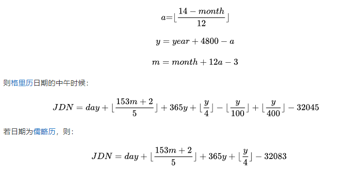

## Timestamp

Timestamp继承了copyable和boost的equality_comparable\<T\>以及less_than_comparable\<T\>

用于获得当前或指定时间的时间戳

```cc
// 要派生自less_than_comparable 要求派生类T必须具有具有以下语义
bool operator<(const T&,const T&); 

// 要派生自equality_comparable 要求派生类T必须具有具有以下语义
bool operator==(const T&,const T&);


```

### Timestamp.h

```cc
class Timestamp : public muduo::copyable,
                  public boost::equality_comparable<Timestamp>,
                  public boost::less_than_comparable<Timestamp>
{
 public:

  Timestamp();
  explicit Timestamp(int64_t microSecondsSinceEpochArg);
  
  void swap(Timestamp& that);
  string toString() const;
  string toFormattedString(bool showMicroseconds = true) const;
  bool valid() const ;
  int64_t microSecondsSinceEpoch() const;
  time_t secondsSinceEpoch() const;
  static Timestamp now();
  static Timestamp invalid();
  static Timestamp fromUnixTime(time_t t);
  static Timestamp fromUnixTime(time_t t, int microseconds);
  static const int kMicroSecondsPerSecond = 1000 * 1000;// 1s = 1000 * 1000 μs
 private:
  int64_t microSecondsSinceEpoch_;	// 微秒
};

inline bool operator<(Timestamp lhs, Timestamp rhs)
{
  return lhs.microSecondsSinceEpoch() < rhs.microSecondsSinceEpoch();
}

inline bool operator==(Timestamp lhs, Timestamp rhs)
{
  return lhs.microSecondsSinceEpoch() == rhs.microSecondsSinceEpoch();
}

inline double timeDifference(Timestamp high, Timestamp low)
{
  int64_t diff = high.microSecondsSinceEpoch() - low.microSecondsSinceEpoch();
  return static_cast<double>(diff) / Timestamp::kMicroSecondsPerSecond;
}


inline Timestamp addTime(Timestamp timestamp, double seconds)
{
  int64_t delta = static_cast<int64_t>(seconds * Timestamp::kMicroSecondsPerSecond);
  return Timestamp(timestamp.microSecondsSinceEpoch() + delta);
}
```

### Timestamp.cc

```cc
// ctor
Timestamp()
    : microSecondsSinceEpoch_(0) {}

explicit Timestamp(int64_t microSecondsSinceEpochArg)
    : microSecondsSinceEpoch_(microSecondsSinceEpochArg) {}
//
void swap(Timestamp &that)
{
    std::swap(microSecondsSinceEpoch_, that.microSecondsSinceEpoch_);
}

string Timestamp::toString() const
{
    char buf[32] = {0};
    int64_t seconds = microSecondsSinceEpoch_ / kMicroSecondsPerSecond;
    int64_t microseconds = microSecondsSinceEpoch_ % kMicroSecondsPerSecond;
    snprintf(buf, sizeof(buf), "%" PRId64 ".%06" PRId64 "", seconds, microseconds);
    return buf;
}

string Timestamp::toFormattedString(bool showMicroseconds /*= true*/) const
{
    char buf[64] = {0};
    time_t seconds = static_cast<time_t>(microSecondsSinceEpoch_ / kMicroSecondsPerSecond);
    struct tm tm_time;
    // struct tm *gmtime_r(const time_t *timep, struct tm *result);
    gmtime_r(&seconds, &tm_time);

    if (showMicroseconds)
    {
        int microseconds = static_cast<int>(microSecondsSinceEpoch_ % kMicroSecondsPerSecond);
        //tm.year记录从1900年开始的年数
        snprintf(buf, sizeof(buf), "%4d%02d%02d %02d:%02d:%02d.%06d",
                 tm_time.tm_year + 1900, tm_time.tm_mon + 1, tm_time.tm_mday,
                 tm_time.tm_hour, tm_time.tm_min, tm_time.tm_sec,
                 microseconds);
    }
    else
    {
        snprintf(buf, sizeof(buf), "%4d%02d%02d %02d:%02d:%02d",
                 tm_time.tm_year + 1900, tm_time.tm_mon + 1, tm_time.tm_mday,
                 tm_time.tm_hour, tm_time.tm_min, tm_time.tm_sec);
    }
    return buf;
}

bool Timestamp::valid() const
{
    return microSecondsSinceEpoch_ > 0;
}

int64_t Timestamp::microSecondsSinceEpoch() const
{
    return microSecondsSinceEpoch_;
}

time_t Timestamp::secondsSinceEpoch() const
{
    return static_cast<time_t>(microSecondsSinceEpoch_ / kMicroSecondsPerSecond);
}

Timestamp Timestamp::now()
{
    /*
        struct timeval{
            long int tv_sec; // 秒数
            long int tv_usec; // 微秒数
        }
    */
    struct timeval tv;
    // #include <sys/time.h>
    gettimeofday(&tv, NULL);
    int64_t seconds = tv.tv_sec;
    return Timestamp(seconds * kMicroSecondsPerSecond + tv.tv_usec);
}

Timestamp Timestamp::invalid()
{
    return Timestamp();
}

Timestamp Timestamp::fromUnixTime(time_t t)
{
    return fromUnixTime(t, 0);
}

Timestamp fromUnixTime(time_t t, int microseconds)
{
    return Timestamp(static_cast<int64_t>(t) * kMicroSecondsPerSecond + microseconds);
}
```


## Timezone

时区，根据构造函数输入的路径名去寻找时区文件，通过`readTimeZoneFile`读取文件到TimeZone::Data中，也包含了时间的转换等函数

```cc
struct Transition
{
  time_t gmttime;
  time_t localtime;
  int localtimeIdx;

  Transition(time_t t, time_t l, int localIdx)
    : gmttime(t), localtime(l), localtimeIdx(localIdx)
  { }

};
struct Localtime
{
  time_t gmtOffset;
  bool isDst;
  int arrbIdx;

  Localtime(time_t offset, bool dst, int arrb)
    : gmtOffset(offset), isDst(dst), arrbIdx(arrb)
  { }
};
struct TimeZone::Data
{
  vector<detail::Transition> transitions;
  vector<detail::Localtime> localtimes;
  vector<string> names;
  string abbreviation;
};
```


```cc
class TimeZone : public muduo::copyable
{
 public:
  explicit TimeZone(const char* zonefile);
  TimeZone(int eastOfUtc, const char* tzname);  // a fixed timezone
  TimeZone() = default;  // an invalid timezone

  bool valid() const
  {
    return static_cast<bool>(data_);
  }

  struct tm toLocalTime(time_t secondsSinceEpoch) const;
  time_t fromLocalTime(const struct tm&) const;

  // gmtime(3)
  static struct tm toUtcTime(time_t secondsSinceEpoch, bool yday = false);
  // timegm(3)
  static time_t fromUtcTime(const struct tm&);
  // year in [1900..2500], month in [1..12], day in [1..31]
  static time_t fromUtcTime(int year, int month, int day,
                            int hour, int minute, int seconds);

  struct Data;

 private:
  std::shared_ptr<Data> data_;
};
```


## Date

julianDayNumber_为儒略日数JDN，是从格林威治标准时间的中午开始，包含一个整天的时间，回溯至儒略历的公元前4713年1月1日中午12点，计算公式如下




```cc
//======================Date.cc======================
//计算公元日期
int getJulianDayNumber(int year, int month, int day)
{
  (void) require_32_bit_integer_at_least; // no warning please
  int a = (14 - month) / 12;
  int y = year + 4800 - a;
  int m = month + 12 * a - 3;
  return day + (153*m + 2) / 5 + y*365 + y/4 - y/100 + y/400 - 32045;
}
```


```cc
class Date : public muduo::copyable {
 public:

  struct YearMonthDay
  {
    int year; // [1900..2500]
    int month;  // [1..12]
    int day;  // [1..31]
  };

  static const int kDaysPerWeek = 7;
  static const int kJulianDayOf1970_01_01; // 2440588

  Date()
    : julianDayNumber_(0)
  {}

  Date(int year, int month, int day);

  explicit Date(int julianDayNum)
    : julianDayNumber_(julianDayNum)
  {}

  explicit Date(const struct tm&);

  void swap(Date& that)
  {
    std::swap(julianDayNumber_, that.julianDayNumber_);
  }

  bool valid() const { return julianDayNumber_ > 0; }

  string toIsoString() const;

  struct YearMonthDay yearMonthDay() const;

  int year() const
  {
    return yearMonthDay().year;
  }

  int month() const
  {
    return yearMonthDay().month;
  }

  int day() const
  {
    return yearMonthDay().day;
  }

  // [0, 1, ..., 6] => [Sunday, Monday, ..., Saturday ]
  int weekDay() const
  {
    return (julianDayNumber_+1) % kDaysPerWeek;
  }

  int julianDayNumber() const { return julianDayNumber_; }

 private:
  int julianDayNumber_;
};

```

```cc
//======================Date.cc======================
// 儒略历数转换为公历
struct Date::YearMonthDay getYearMonthDay(int julianDayNumber)
{
  int a = julianDayNumber + 32044;
  int b = (4 * a + 3) / 146097;
  int c = a - ((b * 146097) / 4);
  int d = (4 * c + 3) / 1461;
  int e = c - ((1461 * d) / 4);
  int m = (5 * e + 2) / 153;
  Date::YearMonthDay ymd;
  ymd.day = e - ((153 * m + 2) / 5) + 1;
  ymd.month = m + 3 - 12 * (m / 10);
  ymd.year = b * 100 + d - 4800 + (m / 10);
  return ymd;
}

string Date::toIsoString() const
{
  char buf[32];
  YearMonthDay ymd(yearMonthDay());
  snprintf(buf, sizeof buf, "%4d-%02d-%02d", ymd.year, ymd.month, ymd.day);
  return buf;
}

Date::YearMonthDay Date::yearMonthDay() const
{
  return getYearMonthDay(julianDayNumber_);
}
```


