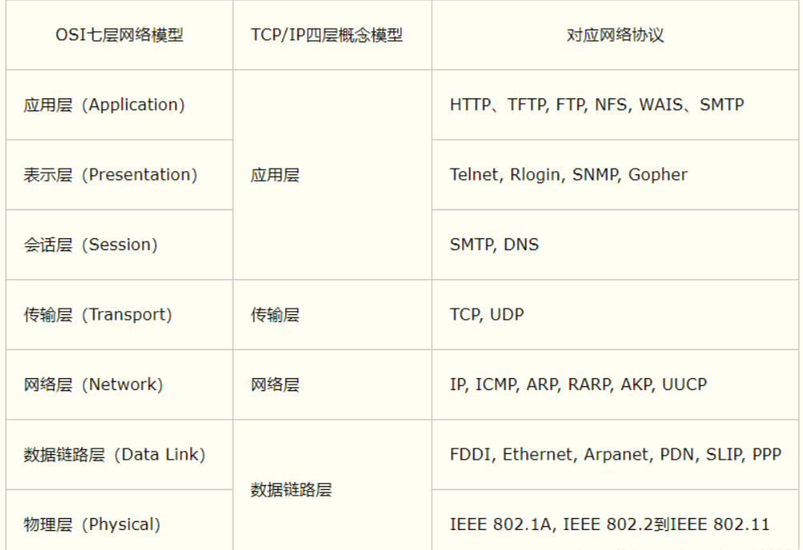

s

## TCP/IP五层模型

​	应用层，定义是应用进程间通信和交互的规则。运输层，负责给两个计算机进程的通信提供传输服务。网络层，任务是负责为网络上不同的主机提供通信服务。数据链路层，将网络层交下来的数据报组装成帧。物理层，最底层的数据传输，以比特流的形式进行。

- 物理层

  物理层上**数据的单位是Bit比特**，数据的传输都是通过0（或1）比特流来实现的，而0（或1）比特流与电压的高低有关。物理层中比特流的传输不再加控制信息，需要注意的是比特流应从首部开始传送。

- 数据链路层

  数据链路层简称链路层。两个节点传输数据时，链路层将网络层交下来的数据报组装成帧，在**链路上传送帧**。每一帧都包括数据和控制信息（同步信息、地址信息、差错控制等）

- 网络层

  网络层的任务是负责为网络上不同的主机提供通信服务。在发送数据时，网络层将运输层产生的报文段或者用户数据报封装成分组或者包（packet）进行传送。由于网络层使用IP协议，所以分组或包（packet）也叫**IP数据报，简称数据报**。网络层还需要寻找合适的路由路线，让源主机运输层发送下来的数据报能通过路由器找到目的主机。

  协议：ICMP、IGMP、IP（IPv4、IPv6）、ARP、RARP

- 传输层

  运输层的任务是负责向两个计算机中进程之间的通信提供一种通用的数据传输服务，应用层通过运输层可以传输报文。通用是指不会针对特定的应用层协议进行详细的划分，多种应用层协议公用同一个运输层服务，所以运输层有复用的功能。当然也有分发的功能，指将接受到的信息分别交付到应用层不同的进程中。 

  协议：UDP、TCP 

- 应用层

  应用层是体系结构中的最高层，定义了应用进程间通信和交互的规则。本层任务就是通过**应用进程间的信息数据流通完成特定的网络应用**（软件、Web应用等）。因为不同的应用程序都需要不同的应用层协议，所以应用层协议较多，如万维网应用的HTTP协议、电子邮件的SMTP协议、文件传送的DTP协议等。请将**应用层交互的数据称为报文**，以免产生概念的混淆。 

  协议：HTTP、HTTPS、FTP、TFTP、SMTP等

## OSI七层

1. 物理层

   物理层上数据的单位是Bit比特

2. 数据链路层

   建立相邻节点的逻辑连接，进行逻辑地址寻址、差错校验等。 

3. 网络层

   主要进行逻辑地址的查询。

4. 传输层

   对两台主机进程也就是应用层提供数据传输服务。定义了传输数据的进程端口号，负责数据包的排序、差错检验和流量控制等

5. 会话层

   对当前主机进程和目标主机进程会话的建立、管理和终止行为。

6. 表示层

   对从应用层获取到的数据报文数据进行格式处理、安全处理和压缩处理。 格式：JPEG、ASCll、加密格式等

7. 应用层

   应用层是体系结构中的最高层，是应用进程间通信和交互的规则，进程指计算机中运行的程序。也是用户与应用程序之间的一个接口，操作程序（软件，Web应用），进而触发更下层的服务。 协议：HTTP、HTTPS、FTP、TFTP、SMTP等