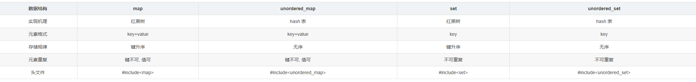
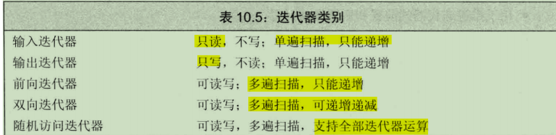
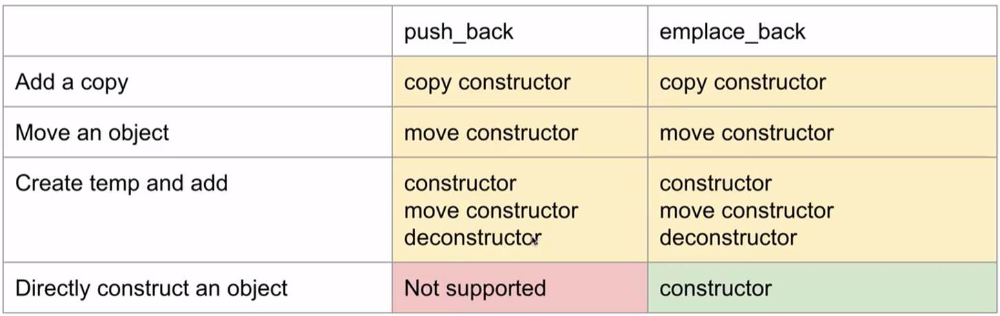
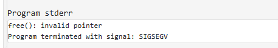

# 基础语法

## 1、 在main执行之前和之后执行的代码可能是什么？

**main函数执行之前**，主要就是初始化系统相关资源：

+ 设置栈指针
+ 初始化静态`static`变量和`global`全局变量，即`.data`段的内容
+ 将未初始化部分的全局变量赋初值：数值型`short`，`int`，`long`等为`0`，`bool`为`FALSE`，指针为`NULL`等等，即`.bss`段的内容     
+ 全局对象初始化，在`main`之前调用构造函数，这是可能会执行前的一些代码
+ 将main函数的参数`argc`，`argv`等传递给`main`函数，然后才真正运行`main`函数
+ `__attribute__((constructor))`

**main函数执行之后**：  

+ 全局对象的析构函数会在main函数之后执行； 
+ 可以用 **`atexit`** 注册一个函数，它会在main 之后执行;
+ `__attribute__((destructor))`

>update1:https://github.com/forthespada/InterviewGuide/issues/2 ,由`stanleyguo0207`提出 - 2021.03.22


## 2、 结构体内存对齐

- 未特殊声明，按结构体最大成员对齐

结构体字节对齐的细节和具体编译器实现相关，但一般而言满足三个准则：

   1) 结构体变量的首地址能够被其最宽基本类型成员的大小所整除；

   2) 结构体**每个成员相对结构体首地址的偏移量(offset)都是当前成员大小的整数倍**，如有需要编译器会在成员之间加上填充字节(internal adding)；

   3) **结构体的总大小为结构体最宽基本类型成员大小的整数倍**，如有需要编译器会在最末一个成员之后加上填充字节{trailing padding}。

#### 方式

- ##### gcc可以使用`__attribute__((packed))`用于实现**单字节对齐**

  ```cc
  __attribute__((packed))
  struct MyStruct {
      // ...
  };
  
  struct MyStruct {
      // ...
  } __attribute__((packed));
  
  typedef struct __attribute__((packed)) {
      // ...
  } MyStruct;
  
  ```

- ##### 使用`pragma pack(n)`

  ```cc
  #pragma pack(1) // 设置为单字节对齐
  
  struct MyStruct {
      char c;
      int i;
      double d;
  };
  
  #pragma pack() // 恢复默认对齐方式
  
  int main() {
      std::cout << sizeof(MyStruct) << std::endl; // 输出结果为13，因为单字节对齐后，结构体的大小为char(1字节) + int(4字节) + double(8字节) = 13字节
      return 0;
  }
  ```

- ##### c++11 两个关键字 alignas alignof

  - alignof计算类型对齐方式
  - alignas指定对齐方式

  ```cc
  // alignas 生效的情况
  
  struct Info {
    uint8_t a;
    uint16_t b;
    uint8_t c;
  };
  
  std::cout << sizeof(Info) << std::endl;   // 6  2 + 2 + 2
  std::cout << alignof(Info) << std::endl;  // 2
  // 内存对齐调整为4个字节。所以sizeof(Info2)的值变为了8
  struct alignas(4) Info2 {
    uint8_t a;
    uint16_t b;
    uint8_t c;
  };
  
  std::cout << sizeof(Info2) << std::endl;   // 8  4 + 4
  std::cout << alignof(Info2) << std::endl;  // 4
  ```

  

  ```cc
  // alignas 失效的情况
  
  struct Info {
    uint8_t a;
    uint32_t b;
    uint8_t c;
  };
  
  std::cout << sizeof(Info) << std::endl;   // 12  4 + 4 + 4
  std::cout << alignof(Info) << std::endl;  // 4
  
  struct alignas(2) Info2 {
    uint8_t a;
    uint32_t b;
    uint8_t c;
  };
  
  std::cout << sizeof(Info2) << std::endl;   // 12  4 + 4 + 4
  std::cout << alignof(Info2) << std::endl;  // 4
  ```

  ### 注：

  **单字节对齐使用`alignas`是无效的**。应该使用`#pragma pack(push,1)`或者使用`__attribute__((packed))`

  ```
  #if defined(__GNUC__) || defined(__GNUG__)
    #define ONEBYTE_ALIGN __attribute__((packed))
  #elif defined(_MSC_VER)
    #define ONEBYTE_ALIGN
    #pragma pack(push,1)
  #endif
  
  struct Info {
    uint8_t a;
    uint32_t b;
    uint8_t c;
  } ONEBYTE_ALIGN;
  
  #if defined(__GNUC__) || defined(__GNUG__)
    #undef ONEBYTE_ALIGN
  #elif defined(_MSC_VER)
    #pragma pack(pop)
    #undef ONEBYTE_ALIGN
  #endif
  
  std::cout << sizeof(Info) << std::endl;   // 6 1 + 4 + 1
  std::cout << alignof(Info) << std::endl;  // 6
  ```

  **确定结构体中每个元素大小**可以通过下面这种方法,alignas无法处理这种情况:

  ```cc
  #if defined(__GNUC__) || defined(__GNUG__)
    #define ONEBYTE_ALIGN __attribute__((packed))
  #elif defined(_MSC_VER)
    #define ONEBYTE_ALIGN
    #pragma pack(push,1)
  #endif
  
  /**
  * 
  * 0 1   3     6   8 9            15
  * +-+---+-----+---+-+-------------+
  * | |   |     |   | |             |
  * |a| b |  c  | d |e|     pad     |
  * | |   |     |   | |             |
  * +-+---+-----+---+-+-------------+
  *
  */
  struct Info {
    uint16_t a : 1;
    uint16_t b : 2;
    uint16_t c : 3;
    uint16_t d : 2;
    uint16_t e : 1;
    uint16_t pad : 7;
  } ONEBYTE_ALIGN;
  
  #if defined(__GNUC__) || defined(__GNUG__)
    #undef ONEBYTE_ALIGN
  #elif defined(_MSC_VER)
    #pragma pack(pop)
    #undef ONEBYTE_ALIGN
  #endif
  
  std::cout << sizeof(Info) << std::endl;   // 2
  std::cout << alignof(Info) << std::endl;  // 1
  ```

  

​		

## 3、指针和引用的区别

- 指针是一个变量，存储的是一个地址，引用跟原来的变量实质上是同一个东西，是原变量的别名
- 指针可以有多级，引用只有一级
- 指针可以为空，引用不能为NULL且在定义时必须初始化
- 指针在初始化后可以改变指向，而引用在初始化之后不可再改变
- sizeof指针得到的是本指针的大小，sizeof引用得到的是引用所指向变量的大小
- 当把指针作为参数进行传递时，也是将实参的一个拷贝传递给形参，两者指向的地址相同，但不是同一个变量，在函数中改变这个变量的指向不影响实参，而引用却可以。
- 引用本质是一个指针（指针常量），同样会占4字节内存；指针是具体变量，需要占用存储空间（，具体情况还要具体分析）。
- 引用在声明时必须初始化为另一变量，一旦出现必须为typename refname &varname形式；指针声明和定义可以分开，可以先只声明指针变量而不初始化，等用到时再指向具体变量。
- 引用一旦初始化之后就不可以再改变（变量可以被引用为多次，但引用只能作为一个变量引用）；指针变量可以重新指向别的变量。
- 不存在指向空值的引用，必须有具体实体；但是存在指向空值的指针。

参考代码：

```cc
void test(int *p)
{
　　int a=1;
　　p=&a;
　　cout<<p<<" "<<*p<<endl;
}

int main(void)
{
    int *p=NULL;
    test(p);
    if(p==NULL)
    cout<<"指针p为NULL"<<endl;
    return 0;
}
//运行结果为：
//0x22ff44 1
//指针p为NULL


void testPTR(int* p) {
	int a = 12;
	p = &a;

}

void testREFF(int& p) {
	int a = 12;
	p = a;

}
void main()
{
	int a = 10;
	int* b = &a;
	testPTR(b);//改变指针指向，但是没改变指针的所指的内容
	cout << a << endl;// 10
	cout << *b << endl;// 10

	a = 10;
	testREFF(a);
	cout << a << endl;//12
}
```

编译器看来, int a = 10; int &amp;b = a; 等价于 int * const b = &amp;a; 而 b = 20; 等价于 *b = 20; 自动转换为指针和自动解引用. 

## 4、在传递函数参数时，什么时候该使用指针，什么时候该使用引用呢？

* 需要**返回函数内局部变量的内存的时候用指针**。使用指针传参需要开辟内存，用完要记得释放指针，不然会内存泄漏。而**返回局部变量的引用无意义**
* 对栈空间大小比较敏感（比如递归）的时候使用引用。使用**引用传递不需要创建临时变量，开销要更小**

* **类对象作为参数传递的时候使用引用**，这是C++类对象传递的标准方式

## 5、堆和栈的区别

- 申请方式不同。

  - 栈由系统自动分配。

- 堆是自己申请和释放的。

- 申请大小限制不同。

  - 栈顶和栈底是之前预设好的，栈是向栈底扩展，大小固定，可以通过ulimit -a查看，由ulimit -s修改。

  - **堆向高地址扩展**，是不连续的内存区域，大小可以灵活调整。

- 申请效率不同。

  - 栈由系统分配，速度快，无碎片。
  - 堆由手动分配，速度慢，有碎片。

  

 栈空间默认是4M, 堆区一般是 1G - 4G 

|                  | 堆                                                           | 栈                                                           |
| :--------------- | :----------------------------------------------------------- | :----------------------------------------------------------- |
| **管理方式**     | 堆中资源由程序员控制（容易产生memory leak）                  | 栈资源由编译器自动管理，无需手工控制                         |
| **内存管理机制** | 系统有一个记录空闲内存地址的链表，当系统收到程序申请时，遍历该链表，寻找第一个空间大于申请空间的堆结点，删    除空闲结点链表中的该结点，并将该结点空间分配给程序（大多数系统会在这块内存空间首地址记录本次分配的大小，这样delete才能正确释放本内存空间，另外系统会将多余的部分重新放入空闲链表中） | 只要栈的剩余空间大于所申请空间，系统为程序提供内存，否则报异常提示栈溢出。（这一块理解一下链表和队列的区别，不连续空间和连续空间的区别，应该就比较好理解这两种机制的区别了） |
| **空间大小**     | 堆是不连续的内存区域（因为系统是用链表来存储空闲内存地址，自然不是连续的），堆大小受限于计算机系统中有效的虚拟内存（32bit  系统理论上是4G），所以堆的空间比较灵活，比较大 | 栈是一块连续的内存区域，大小是操作系统预定好的，windows下栈大小是2M（也有是1M，在  编译时确定，VC中可设置） |
| **碎片问题**     | 对于堆，频繁的new/delete会造成大量碎片，使程序效率降低内部碎片：剩余空间无法使用  外部碎片：已分配、释放的内存间存在不连续的空闲空间，无法使用 | 对于栈，它是有点类似于数据结构上的一个先进后出的栈，进出一一对应，不会产生碎片。（看到这里我突然明白了为什么面试官在问我堆和栈的区别之前先问了我栈和队列的区别） |
| **生长方向**     | 堆向上，向高地址方向增长。                                   | 栈向下，向低地址方向增长。                                   |
| **分配方式**     | 堆都是动态分配（没有静态分配的堆）                           | 栈有静态分配和动态分配，静态分配由编译器完成（如局部变量分配），动态分配由alloca函数分配，但栈的动态分配的资源由编译器进行释放，无需程序员实现。 |
| **分配效率**     | 堆由C/C++函数库提供，机制很复杂。所以堆的效率比栈低很多。    | 栈是其系统提供的数据结构，计算机在底层对栈提供支持，分配专门  寄存器存放栈地址，栈操作有专门指令。 |

## 6、堆快还是栈快？

毫无疑问是**栈快一点**。

因为操作系统会在底层对栈提供支持，会**分配专门的寄存器存放栈的地址**，栈的入栈出栈操作也十分简单，并且有专门的指令执行，所以栈的效率比较高也比较快。

而堆的操作是由C/C++函数库提供的，在分配堆内存的时候需要一定的算法寻找合适大小的内存。并且**获取堆的内容需要两次访问，第一次访问指针，第二次根据指针保存的地址访问内存，因此堆比较慢**。

## 7、区别以下指针类型？

```cpp
int *p[10] // 10个int*
int (*p)[10] // 一个int*指针指向一个长度10的int数组
int *p(int) // 函数声明
int (*p)(int) // 函数指针
```

## 8、new / delete 与 malloc / free的异同

**相同点**

- 都可用于内存的动态申请和释放

**不同点**

- 前者是C++运算符，后者是C/C++语言标准库函数
- new自动计算要分配的空间大小，malloc需要手工计算
- new是类型安全的，malloc不是。例如：

```cpp
int *p = new float[2]; //编译错误
int *p = (int*)malloc(2 * sizeof(double));//编译无错误
```

*  new调用名为**operator new**的标准库函数分配足够空间并调用相关对象的构造函数，delete对指针所指对象运行适当的析构函数；然后通过调用名为**operator delete**的标准库函数释放该对象所用内存。后者均没有相关调用
*  后者需要库文件支持，前者不用
*  new是封装了malloc，直接free不会报错，但是这只是释放内存，而不会析构对象 
*  在对非基本数据类型的对象使用的时候，对象创建的时候还需要执行构造函数，销毁的时候要执行析构函数。而malloc/free是库函数，是已经编译的代码，所以不能把构造函数和析构函数的功能强加给malloc/free，所以new/delete是必不可少的。


#### placement new

```cc
char *buf=new char[sizeof(Complex)*3];
//（buf） 括号内部即为operator new参数
Complex* pc=new(buf)Complex(1,2);
...
delete [] buf;
//====================
//Complex* pc=new(buf)Complex(1,2);
//编译器转变为如下
Complex* pc;
try{
	void* mem=operator new(sizeof(Complex),buf);
	pc=static_cast<Complex*>(mem);
	pc->Complex::Complex(1,2);
}catch(std::bad_alloc){

}
void* operator new(size_t size,void* p){
	return p;
}
```

## 9、被free回收的内存是立即返还给操作系统吗？

不是的，被free回收的内存会**首先被ptmalloc使用双链表保存起来，当用户下一次申请内存的时候，会尝试从这些内存中寻找合适的返回**。这样就**避免了频繁的系统调用**，占用过多的系统资源。同时ptmalloc也会尝试对小块内存进行合并，避免过多的内存碎片。

## 10、宏定义和函数有何区别？

- 宏在预处理阶段完成替换，之后被替换的文本参与编译，相当于直接插入了代码，运行时不存在函数调用，执行起来更快；函数调用在运行时需要跳转到具体调用函数。
- 宏定义属于在结构中插入代码，没有返回值；函数调用具有返回值。
- 宏定义参数没有类型，不进行类型检查；函数参数具有类型，需要检查类型。
- 宏定义不要在最后加分号。

## 11、宏定义和typedef区别？

- 宏主要用于定义常量及书写复杂的内容；typedef主要用于定义类型别名。
- 宏替换发生在编译阶段之前，属于文本插入替换；typedef是编译的一部分。
- 宏不检查类型；typedef会检查数据类型。
- 宏不是语句，不在在最后加分号；typedef是语句，要加分号标识结束。
- 注意对指针的操作，typedef char * p_char和#define p_char char *区别巨大。#define创建的宏定义没有创建新的类型。

## 12、C++和Python的区别

- c++是静态类型语言 python是动态类型语言
- C\+\+中需要事先定义变量的类型，而Python不需要

## 13、C++和C语言的区别

- namespace等关键字
- C++中的try/catch/throw异常处理机制取代了标准C中的setjmp()和longjmp()函数。
- new和delete是对内存分配的运算符，取代了C中的malloc和free。
- 重载、运算符重载等
- 引用

## 14、C++中struct和class的区别

**相同点**

- 两者都拥有成员函数、公有和私有部分
- 任何可以使用class完成的工作，同样可以使用struct完成

**不同点**

- struct默认是public，class则默认是private

- class默认是private继承， 而struct默认是public继承

  


**引申**：C++和C的struct区别

- C语言中：struct是用户自定义数据类型（UDT）；C++中struct是抽象数据类型（ADT），支持成员函数的定义，（C++中的struct能继承，能实现多态）

- C中struct是没有权限的设置的，且struct中只能是一些变量的集合体，可以封装数据却不可以隐藏数据，而且成员**不可以是函数**
- C++中，struct增加了访问权限，且可以和类一样有成员函数，成员默认访问说明符为public（为了与C兼容）

- struct作为类的一种特例是用来自定义数据结构的。一个结构标记声明后，在C中必须在结构标记前加上struct，才能做结构类型名（除：typedef struct class{};）;C++中结构体标记（结构体名）可以直接作为结构体类型名使用，此外结构体struct在C++中被当作类的一种特例

## 15、define宏定义和const的区别

**编译阶段**

- define是在编译的**预处理**阶段起作用，而const是在编译、运行的时候起作用

**安全性**

- define只做替换，不做类型检查和计算，也不求解，容易产生错误，一般最好加上一个大括号包含住全部的内容，要不然很容易出错
- const常量有数据类型，编译器可以对其进行类型安全检查

**内存占用**

- define只是将宏名称进行替换，在内存中会产生多分相同的备份。const在程序运行中只有一份备份，且可以执行常量折叠，能将复杂的的表达式计算出结果放入常量表

- 宏替换发生在**编译阶段之前**，属于文本插入替换；const作用发生于**编译过程中**。

- 宏不检查类型；const会检查数据类型。

- 宏定义的数据没有分配内存空间，只是插入替换掉；const定义的变量只是值不能改变，但要分配内存空间。

## 16、C++中const和static的作用

**static**

- 不考虑类的情况
  - 隐藏。所有不加static的全局变量和函数具有全局可见性，可以在其他文件中使用，加了之后只能在该文件所在的编译模块中使用
  - 默认初始化为0，包括未初始化的全局静态变量与局部静态变量，都存在全局未初始化区
  - 静态变量在函数内定义，始终存在，且只进行一次初始化，具有记忆性，其作用范围与局部变量相同，函数退出后仍然存在，但不能使用
- 考虑类的情况
  - static成员变量：只与类关联，不与类的对象关联。定义时要分配空间，不能在类声明中初始化，必须在类定义体外部初始化，初始化时不需要标示为static；可以被非static成员函数任意访问。
  - static成员函数：不具有this指针，无法访问类对象的非static成员变量和非static成员函数；**不能被声明为const、虚函数和volatile**；可以被非static成员函数任意访问

**const**

- 不考虑类的情况

  - **const常量在定义时必须初始化**，之后无法更改

  - **const形参可以接收const和非const类型的实参**，例如// i 可以是 int 型或者 const int 型void fun(const int& i){	//...}
- 考虑类的情况

  - const成员变量：不能在类定义外部初始化，只能通过构造函数初始化列表进行初始化，并且必须有构造函数；不同类对其const数据成员的值可以不同，所以不能在类中声明时初始化
  - const成员函数：**const对象不可以调用非const成员函数**；非const对象都可以调用；**不可以改变非mutable（用该关键字声明的变量可以在const成员函数中被修改）数据的值**

补充一点const相关：const修饰变量是也与static有一样的隐藏作用。只能在该文件中使用，其他文件不可以引用声明使用。
因此在头文件中声明const变量是没问题的，因为即使被多个文件包含，链接性都是内部的，不会出现符号冲突。

## 17、顶层const

- #### **顶层const：指针本身是常量**

- #### **底层const：指针所指对象是常量**

**指针类型左底右顶**

```cpp
int i = 0;
int *const p1 = &i;			//不能改变p1，顶层
const int ci = 42;			//不能改变ci，顶层
const int *p2 = &ci;		//不能改变ci，允许改变p2，底层
const int *const p3 = p2;	//左底右顶
const int &r = ci;			//用于声明引用的const都是底层
```

1. #### 执行**对象拷贝操作，顶层const不受什么影响**

   ```cpp
   i = ci;	//ok  ci是顶层const，对此操作无影响
   p2 = p3;//ok  p2和p3指向的对象类型相同，p3顶层const部分不影响
   ```

2. #### **底层const的限制不能忽视，拷入和拷出的对象必须具有相同的底层资格，或者两个对象数据类型必须能够转换（一般来说，非const可以转换为const）**

   ```cpp
   int *p = p3;		//error p3包含底层const，p没有
   p2 = p3;			//ok	p2 p3底层const相同，顶层不影响
   p2 = &i;			//ok	int* 能转化为const int*
   int &i = ci;		//error	普通int&不能绑定到const int，否则i可以修改ci值
   const int &r2 = i;	//ok 	const int可以绑定到普通int上
   ```

   #### **技巧：去看自己定义的新变量，如果能通过操作新的变量从而影响被引用的值时，则被影响的值不能是const**

   ​		**例如int i =100;const int &r2=i;则r2的改变不会影响i，就没问题**

   ​		**而const int ii =100; int& rii=ii;若编译成功，则可以通过rii去修改i的值，而ii不允许修改，则error**

## 18、数组名和指针（这里为指向数组首元素的指针）区别？

- 二者均可通过增减偏移量来访问数组中的元素。

- 数组名不是真正意义上的指针，可以理解为常指针，所以数组名没有自增、自减等操作。

- **当数组名当做形参传递给调用函数后，就失去了原有特性，退化成一般指针，多了自增、自减操作，但sizeof运算符不能再得到原数组的大小了。**

## 19、final和override关键字

**override**

当在父类中使用了虚函数时候，你可能需要在某个子类中对这个虚函数进行重写，以下方法都可以：

```cpp
class A
{
    virtual void foo();
}
class B : public A
{
    void foo(); //OK
    virtual void foo(); // OK
    void foo() override; //OK
}
```

如果不使用override，当你手一抖，将**foo()**写成了**f00()**会怎么样呢？结果是编译器并不会报错，因为它并不知道你的目的是重写虚函数，而是把它当成了新的函数。如果这个虚函数很重要的话，那就会对整个程序不利。所以，override的作用就出来了，它指定了子类的这个虚函数是重写的父类的，如果你名字不小心打错了的话，编译器是不会编译通过的：

```cpp
class A
{
    virtual void foo();
};
class B : public A
{
    virtual void f00(); //OK，这个函数是B新增的，不是继承的
    virtual void f0o() override; //Error, 加了override之后，这个函数一定是继承自A的，A找不到就报错
};
```


**final**

当不希望某个类被继承，或不希望某个虚函数被重写，可以在类名和虚函数后添加final关键字，添加final关键字后被继承或重写，编译器会报错。例子如下：

```cpp
class Base
{
    virtual void foo();
};
 
class A : public Base
{
    void foo() final; // foo 被override并且是最后一个override，在其子类中不可以重写
};

class B final : A // 指明B是不可以被继承的
{
    void foo() override; // Error: 在A中已经被final了
};
 
class C : B // Error: B is final
{
};
```

<p id = "拷贝初始化和直接初始化"></p>

## 20、extern"C"的用法

为了能够**正确的在C++代码中调用C语言**的代码：在程序中加上extern "C"后，相当于**告诉编译器这部分代码是C语言写的，因此要按照C语言进行编译**，而不是C++；

哪些情况下使用extern "C"：

（1）C++代码中调用C语言代码；

（2）在C++中的头文件中使用；

（3）在多个人协同开发时，可能有人擅长C语言，而有人擅长C++；

举个例子，C++中调用C代码：

```cpp
#ifndef __MY_HANDLE_H__
#define __MY_HANDLE_H__

extern "C"{
    typedef unsigned int result_t;
    typedef void* my_handle_t;
    
    my_handle_t create_handle(const char* name);
    result_t operate_on_handle(my_handle_t handle);
    void close_handle(my_handle_t handle);
}
```

综上，总结出使用方法**，在C语言的头文件中，对其外部函数只能指定为extern类型，C语言中不支持extern "C"声明，在.c文件中包含了extern "C"时会出现编译语法错误。**所以使用extern "C"全部都放在于cpp程序相关文件或其头文件中。

总结出如下形式：

（1）C++调用C函数：

```cpp
//xx.h
extern int add(...)

//xx.c
int add(){
    
}

//xx.cpp
extern "C" {
    #include "xx.h"
}
```

（2）C调用C++函数

```cpp
//xx.h
extern "C"{
    int add();
}
//xx.cpp
int add(){    
}
//xx.c
extern int add();
```

<p id = "野指针和悬空指针"></p>

## 21、野指针和悬空指针

  都是是指向无效内存区域(这里的无效指的是"不安全不可控")的指针，访问行为将会导致未定义行为。

  + 野指针  
    野指针，指的是**没有被初始化过的指针**

    ```cpp
    int main(void) { 
        
        int* p;     // 未初始化
        std::cout<< *p << std::endl; // 未初始化就被使用
        
        return 0;
    }
    ```

    因此，为了防止出错，对于指针初始化时都是赋值为 `nullptr`，这样在使用时编译器就不会直接报错，产生非法内存访问。

  + 悬空指针    
    悬空指针，指针最初**指向的内存已经被释放了的一种指针。**

    ```cpp
    int main(void) { 
      int * p = nullptr;
      int* p2 = new int;
      
      p = p2;
    
      delete p2;
    }
    ```

此时 p和p2就是悬空指针，指向的内存已经被释放。继续使用这两个指针，行为不可预料。需要设置为`p=p2=nullptr`。此时再使用，编译器会直接保错。
避免野指针比较简单，但悬空指针比较麻烦。c++引入了智能指针，C++智能指针的本质就是避免悬空指针的产生。


**产生原因及解决办法：**

野指针：指针变量未及时初始化 => 定义指针变量及时初始化，要么置空。

悬空指针：指针free或delete之后没有及时置空 => 释放操作后立即置空。

## 22、浅拷贝和深拷贝的区别

**浅拷贝**

浅拷贝只是拷贝一个指针，并没有新开辟一个地址，拷贝的指针和原来的指针指向同一块地址，如果原来的指针所指向的资源释放了，那么再释放浅拷贝的指针的资源就会出现错误。

**深拷贝**

深拷贝不仅拷贝值，还开辟出一块新的空间用来存放新的值，即使原先的对象被析构掉，释放内存了也不会影响到深拷贝得到的值。在自己实现拷贝赋值的时候，如果有指针变量的话是需要自己实现深拷贝的。

## 23、inline内联函数和宏定义的区别

- 在使用时，宏只做简单字符串替换（编译前）。而内联函数可以进行参数类型检查（编译时），且具有返回值。
- **内联函数在编译时直接将函数代码嵌入到目标代码中，省去函数调用的开销来提高执行效率**，并且进行参数类型检查，具有返回值，**可以实现重载**。
- 宏定义时要注意书写（参数要括起来）否则容易出现歧义，内联函数不会产生歧义
- 内联函数有类型检测、语法判断等功能，而宏没有

## 24、如何用代码判断大小端存储？

大端存储：字数据的高字节存储在低地址中

小端存储：字数据的低字节存储在低地址中

**方式一：使用强制类型转换**-这种法子不错

```cpp
#include <iostream>
using namespace std;
int main()
{
    int a = 0x1234;
    //由于int和char的长度不同，借助int型转换成char型，只会留下低地址的部分
    char c = (char)(a);
    if (c == 0x12)
        cout << "big endian" << endl;
    else if(c == 0x34)
        cout << "little endian" << endl;
}
```

**方式二：巧用union联合体**

```cpp
#include <iostream>
using namespace std;
//union联合体的重叠式存储，endian联合体占用内存的空间为每个成员字节长度的最大值
union endian
{
    int a;
    char ch;
};
int main()
{
    endian value;
    value.a = 0x1234;
    //a和ch共用4字节的内存空间
    if (value.ch == 0x12)
        cout << "big endian"<<endl;
    else if (value.ch == 0x34)
        cout << "little endian"<<endl;
}
```

## 25、volatile、mutable和explicit关键字的用法

(1)**volatile**

volatile 关键字是一种类型修饰符，**用它声明的类型变量表示可以被某些编译器未知的因素更改**，比如：操作系统、硬件或者其它线程等。遇到这个关键字声明的变量，编译器对访问该变量的代码就不再进行优化，从而可以提供对特殊地址的稳定访问。

 当要求使用 volatile 声明的变量的值的时候，**系统总是重新从它所在的内存读取数据**，即使它前面的指令刚刚从该处读取过数据。


**volatile定义变量的值是易变的，每次用到这个变量的值的时候都要去重新读取这个变量的值，而不是读寄存器内的备份。多线程中被几个任务共享的变量需要定义为volatile类型。**


**volatile 指针**

volatile 指针和 const 修饰词类似，const 有常量指针和指针常量的说法，volatile 也有相应的概念

修饰由指针指向的对象、数据是 const 或 volatile 的：

```cpp
const char* cpch;volatile char* vpch;
```

指针自身的值——一个代表地址的整数变量，是 const 或 volatile 的：

```cpp
char* const pchc;char* volatile pchv;
```

 注意：

- 可以把一个非volatile int赋给volatile int，但是不能把非volatile对象赋给一个volatile对象。
- 除了基本类型外，对用户定义类型也可以用volatile类型进行修饰。
- C++中一个有volatile标识符的类只能访问它接口的子集，一个由类的实现者控制的子集。用户只能用const_cast来获得对类型接口的完全访问。此外，volatile向const一样会从类传递到它的成员。

**多线程下的volatile**   

有些变量是用volatile关键字声明的。当两个线程都要用到某一个变量且该变量的值会被改变时，应该用volatile声明，**该关键字的作用是防止优化编译器把变量从内存装入CPU寄存器中。**

如果变量被装入寄存器，那么两个线程有可能一个使用内存中的变量，一个使用寄存器中的变量，这会造成程序的错误执行。

volatile的意思是让编译器每次操作该变量时一定要从内存中真正取出，而不是使用已经存在寄存器中的值。

（2）**mutable**

mutable的中文意思是“可变的，易变的”，跟constant（既C++中的const）是反义词。在C++中，mutable也是为了突破const的限制而设置的。被mutable修饰的变量，将永远处于可变的状态，即使在一个const函数中。我们知道，如果类的成员函数不会改变对象的状态，那么这个成员函数一般会声明成const的。但是，有些时候，我们需要**在const函数里面修改一些跟类状态无关的数据成员，那么这个函数就应该被mutable来修饰，并且放在函数后后面关键字位置**。

样例一

~~~cpp
class person
{
    int m_A;
    mutable int m_B;//特殊变量 在常函数里值也可以被修改
public:
    void add() const//在函数里不可修改this指针指向的值 常量指针
    {
        m_A = 10;//错误  不可修改值，this已经被修饰为常量指针
        m_B = 20;//正确
    }
};
~~~

样例二

~~~cpp
class person
{
public:
    int m_A;
    mutable int m_B;//特殊变量 在常函数里值也可以被修改
};

int main()
{
    const person p = person();//修饰常对象 不可修改类成员的值
    p.m_A = 10;//错误，被修饰了指针常量
    p.m_B = 200;//正确，特殊变量，修饰了mutable
}
~~~


（3）**explicit**

explicit关键字用来修饰类的构造函数，被修饰的构造函数的类，不能发生相应的隐式类型转换，只能以**显式的方式进行类型转换**，注意以下几点：

- explicit 关键字只能用于类内部的构造函数声明上
- 被explicit修饰的构造函数的类，不能发生相应的隐式类型转换


## 26、public，protected和private访问和继承权限/public/protected/private的区别？

一、访问权限

| 访问权限  | 外部 | 派生类 | 内部 |
| --------- | ---- | :----- | ---- |
| public    | ✔    | ✔      | ✔    |
| protected | ❌    | ✔      | ✔    |
| private   | ❌    | ❌      | ✔    |

访问权限范围关系：

public > protected > private

二、继承权限

1. 派生类继承自基类的成员权限有四种状态：public、protected、private、不可见，排序为 public > protected > private
2. 派生类对基类成员的访问权限取决于两点：一、继承方式；二、基类成员在基类中的访问权限
3. 基类成员在派生类中的访问权限不得高于继承方式中指定的权限，高于继承方式中指定的权限则下降为继承权限，低于继承权限则不调整，**基类 private 成员在任何继承方式下都是不可见的**。例如：

- public 继承 + private 成员 => 不可见 
- public 继承 +  protected 成员 => protected
- protected 继承 + public 成员 => protected
- private 继承 + protected 成员 => private
- private 继承 + public 成员 => private

## 27、什么情况下会调用拷贝构造函数

- 用类的一个实例化对象去初始化另一个对象的时候
- 函数的参数是类的对象时（非引用传递）
- 函数的返回值是函数体内局部对象的类的对象时 ,此时虽然发生（Named return Value优化）NRV优化，但是由于返回方式是值传递，所以会在返回值的地方调用拷贝构造函数

## 28、C++中有几种类型的new

在C++中，new有三种典型的使用方法：plain new，nothrow new和placement new

（1）**plain new**

言下之意就是普通的new，就是我们常用的new，在C++中定义如下：

```cpp
void* operator new(std::size_t) throw(std::bad_alloc);
void operator delete(void *) throw();
```

因此**plain new**在空间分配失败的情况下，抛出异常**std::bad_alloc**而不是返回NULL，因此通过判断返回值是否为NULL是徒劳的，举个例子：

```cpp
#include <iostream>
#include <string>
using namespace std;
int main()
{
	try
	{
		char *p = new char[10e11];
		delete p;
	}
	catch (const std::bad_alloc &ex)
	{
		cout << ex.what() << endl;
	}
	return 0;
}
//执行结果：bad allocation
```

（2）**nothrow new**

nothrow new在空间**分配失败的情况下是不抛出异常，而是返回NULL**，定义如下：

```cpp
void * operator new(std::size_t,const std::nothrow_t&) throw();
void operator delete(void*) throw();
```

举个例子：

```cpp
#include <iostream>
#include <string>
using namespace std;

int main()
{
	char *p = new(nothrow) char[10e11];
	if (p == NULL) 
	{
		cout << "alloc failed" << endl;
	}
	delete p;
	return 0;
}
//运行结果：alloc failed
```

（3）**placement new**

这种new允许在一块已经分配成功的内存上重新构造对象或对象数组。placement new不用担心内存分配失败，因为它根本**不分配内存**，它做的**唯一一件事情就是调用对象的构造函数**。定义如下：

```cpp
void* operator new(size_t,void*);
void operator delete(void*,void*);
```

使用placement new需要注意两点：

- palcement new的主要用途就是反复使用一块较大的动态分配的内存来构造不同类型的对象或者他们的数组

- placement new构造起来的对象数组，要显式的调用他们的析构函数来销毁（析构函数并不释放对象的内存），千万不要使用delete，这是因为placement new构造起来的对象或数组大小并不一定等于原来分配的内存大小，使用delete会造成内存泄漏或者之后释放内存时出现运行时错误。

举个例子：

```cpp
#include <iostream>
#include <string>
using namespace std;
class ADT{
	int i;
	int j;
public:
	ADT(){
		i = 10;
		j = 100;
		cout << "ADT construct i=" << i << "j="<<j <<endl;
	}
	~ADT(){
		cout << "ADT destruct" << endl;
	}
};
int main()
{
	char *p = new(nothrow) char[sizeof ADT + 1];
	if (p == NULL) {
		cout << "alloc failed" << endl;
	}
	ADT *q = new(p) ADT;  //placement new:不必担心失败，只要p所指对象的的空间足够ADT创建即可
	//delete q;//错误!不能在此处调用delete q;
	q->ADT::~ADT();//显示调用析构函数
	delete[] p;
	return 0;
}
//输出结果：
//ADT construct i=10j=100
//ADT destruct
```

## 29、C++的异常处理的方法

在程序执行过程中，由于程序员的疏忽或是系统资源紧张等因素都有可能导致异常，任何程序都无法保证绝对的稳定，常见的异常有：

- 数组下标越界
- 除法计算时除数为0
- 动态分配空间时空间不足
- ...

如果不及时对这些异常进行处理，程序多数情况下都会崩溃。

**（1）try、throw和catch关键字**

C++中的异常处理机制主要使用**try**、**throw**和**catch**三个关键字，其在程序中的用法如下：

```cpp
#include <iostream>
using namespace std;
int main()
{
    double m = 1, n = 0;
    try {
        cout << "before dividing." << endl;
        if (n == 0)
            throw - 1;  //抛出int型异常
        else if (m == 0)
            throw - 1.0;  //拋出 double 型异常
        else
            cout << m / n << endl;
        cout << "after dividing." << endl;
    }
    catch (double d) {
        cout << "catch (double)" << d << endl;
    }
    catch (...) {
        cout << "catch (...)" << endl;
    }
    cout << "finished" << endl;
    return 0;
}
//运行结果
//before dividing.
//catch (...)
//finished
```

代码中，对两个数进行除法计算，其中除数为0。可以看到以上三个关键字，程序的执行流程是先执行try包裹的语句块，如果执行过程中没有异常发生，则不会进入任何catch包裹的语句块，如果发生异常，则使用throw进行异常抛出，再由catch进行捕获，throw可以抛出各种数据类型的信息，代码中使用的是数字，也可以自定义异常class。**catch根据throw抛出的数据类型进行精确捕获（不会出现类型转换），如果匹配不到就直接报错，可以使用catch(...)的方式捕获任何异常（不推荐）。**当然，如果catch了异常，当前函数如果不进行处理，或者已经处理了想通知上一层的调用者，可以在catch里面再throw异常。

**（2）函数的异常声明列表**

有时候，程序员在定义函数的时候知道函数可能发生的异常，可以在函数声明和定义时，指出所能抛出异常的列表，写法如下：

```C++
int fun() throw(int,double,A,B,C){...};
```

这种写法表名函数可能会抛出int,double型或者A、B、C三种类型的异常，如果throw中为空，表明不会抛出任何异常，如果没有throw则可能抛出任何异常

**（3）C++标准异常类  exception**

C++ 标准库中有一些类代表异常，这些类都是从 exception 类派生而来的，如下图所示


- bad_typeid：使用typeid运算符，如果其操作数是一个多态类的指针，而该指针的值为 NULL，则会拋出此异常，例如：

```cpp
#include <iostream>
#include <typeinfo>
using namespace std;

class A{
public:
  virtual ~A();
};
 
using namespace std;
int main() {
	A* a = NULL;
	try {
  		cout << typeid(*a).name() << endl; // Error condition
  	}
	catch (bad_typeid){
  		cout << "Object is NULL" << endl;
  	}
    return 0;
}
//运行结果：bject is NULL
```

- bad_cast：在用 dynamic_cast 进行从多态基类对象（或引用）到派生类的引用的强制类型转换时，如果转换是不安全的，则会拋出此异常
- bad_alloc：在用 new 运算符进行动态内存分配时，如果没有足够的内存，则会引发此异常
- out_of_range:用 vector 或 string的at 成员函数根据下标访问元素时，如果下标越界，则会拋出此异常

## 30、static的用法和作用？

1.先来介绍它的第一条也是最重要的一条：**隐藏**。（static函数，static变量均可）

当同**时编译多个文件时，所有未加static前缀的全局变量和函数都具有全局可见性**。

2.static的第二个作用是保持**变量内容的持久**。（static变量中的记忆功能和全局生存期）**存储在静态数据区的变量会在程序刚开始运行时就完成初始化，也是唯一的一次初始化**。共有两种变量存储在静态存储区：全局变量和static变量，只不过和全局变量比起来，static可以控制变量的可见范围，说到底static还是用来隐藏的。

3.static的第三个作用是**默认初始化为0**（static变量）

其实全局变量也具备这一属性，因为全局变量也存储在静态数据区。在静态数据区，内存中所有的字节默认值都是0x00，某些时候这一特点可以减少程序员的工作量。

4.static的第四个作用：C++中的类成员声明static

1)  函数体内static变量的作用范围为该函数体，不同于auto变量，该变量的内存只被分配一次，因此其值在下次调用时仍维持上次的值； 

2)  在模块内的static全局变量可以被模块内所有函数访问，但不能被模块外其它函数访问；  

3)  在模块内的static函数只可被这一模块内的其它函数调用，这个函数的使用范围被限制在声明它的模块内；  

4)  在类中的static成员变量属于整个类所拥有，对类的所有对象只有一份拷贝；  

5)  在类中的static成员函数属于整个类所拥有，这个函数不接收this指针，因而只能访问类的static成员变量。

类内：

6)  **static类对象必须要在类外进行初始化**，static修饰的变量先于对象存在，所以static修饰的变量要在类外初始化；

7)  由于static修饰的类成员属于类，不属于对象，因此**static类成员函数是没有this指针的**，this指针是指向本对象的指针。正因为没有this指针，所以**static类成员函数不能访问非static的类成员，只能访问 static修饰的类成员**；

8)  **static成员函数不能被virtual修饰**，static成员不属于任何对象或实例，所以加上virtual没有任何实际意义；静态成员函数没有this指针，虚函数的实现是为每一个对象分配一个vptr指针，而vptr是通过this指针调用的，所以不能为virtual；虚函数的调用关系，this->vptr->ctable->virtual function

<p id = "指针和const的用法"></p>

## 31、指针和const的用法

1)  当const修饰指针时，由于const的位置不同，它的修饰对象会有所不同。

2)  int \*const p2中const修饰p2的值,所以理解为p2的值不可以改变，即p2只能指向固定的一个变量地址，但可以通过*p2读写这个变量的值。顶层指针表示指针本身是一个常量

3)  int const \*p1或者const int \*p1两种情况中const修饰\*p1，所以理解为\*p1的值不可以改变，即不可以给*p1赋值改变p1指向变量的值，但可以通过给p赋值不同的地址改变这个指针指向。

底层指针表示指针所指向的变量是一个常量。

## 32、形参与实参的区别？

1)  形参变量只有在被调用时才分配内存单元，在调用结束时， 即刻释放所分配的内存单元。因此，**形参只有在函数内部有效**。 函数调用结束返回主调函数后则不能再使用该形参变量。

2)  实参可以是常量、变量、表达式、函数等， 无论实参是何种类型的量，在进行函数调用时，它们都必须具有确定的值， 以便把这些值传送给形参。 因此应预先用赋值，输入等办法使实参获得确定值，会产生一个临时变量。

3)  **实参和形参在数量上，类型上，顺序上应严格一致， 否则会发生“类型不匹配”的错误。**

4)  函数调用中发生的数据传送是单向的。 即**只能把实参的值传送给形参**，而不能把形参的值反向地传送给实参。 因此在函数调用过程中，形参的值发生改变，而实参中的值不会变化。

5)  当**形参和实参不是指针类型时，在该函数运行时，形参和实参是不同的变量（值传递）**，他们在内存中位于不同的位置，形参将实参的内容复制一份，在该函数运行结束的时候形参被释放，而实参内容不会改变。

## 33、静态变量什么时候初始化

1)  初始化只有一次，但是可以多次赋值，在主程序之前，编译器已经为其分配好了内存。

2)  静态局部变量和全局变量一样，数据都存放在全局区域，所以在主程序之前，编译器已经为其分配好了内存，但在C和C++中静态局部变量的初始化节点又有点不太一样。在**C中，初始化发生在代码执行之前，编译阶段分配好内存之后，就会进行初始化**，所以我们看到在C语言中无法使用变量对静态局部变量进行初始化，在程序运行结束，变量所处的全局内存会被全部回收。

3)  而在C++中，初始化时在执行相关代码时才会进行初始化，主要是由于C++引入对象后，要进行初始化必须执行相应构造函数和析构函数，在构造函数或析构函数中经常会需要进行某些程序中需要进行的特定操作，并非简单地分配内存。所以**C++标准定为全局或静态对象是有首次用到时才会进行构造**，并通过atexit()来管理。在程序结束，按照构造顺序反方向进行逐个析构。所以在C++中是可以使用变量对静态局部变量进行初始化的。

## 34、const关键字的作用有哪些?

1)  常量无法修改值  

2)  常量指针 指针常量

3)  函数声明中，const修饰形参，表明在函数内部不能改变其值；  

4)  类成员函数，若指定其为const类型（尾部加const），则表明其是一个常函数，不能修改类的成员变量，类的const对象只能访问类的常成员函数；  

5)  对于类的成员函数，有时候必须指定其返回值为const类型，以使得其返回值不为“左值”。

6)  const成员函数可以访问非const对象的非const数据成员、const数据成员，也可以访问const对象内的所有数据成员；

7)  非const成员函数可以访问非const对象的非const数据成员、const数据成员，但不可以访问const对象的任意数据成员；（如果能访问，万一修改则会导致错误）

8)  一个没有明确声明为const的成员函数被看作是将要修改对象中数据成员的函数，而且编译器不允许它为一个const对象所调用。因此**const对象只能调用const成员函数**。

9)  const_cast

10) const类型变量必须定义的时候进行初始化，因此也导致如果类的成员变量有const类型的变量，那么该变量必须在类的初始化列表中进行初始化；

11) 对于函数值传递的情况，因为参数传递是通过复制实参创建一个临时变量传递进函数的，函数内只能改变临时变量，但无法改变实参。则这个时候无论加不加const对实参不会产生任何影响。但是在引用或指针传递函数调用中，因为传进去的是一个引用或指针，这样函数内部可以改变引用或指针所指向的变量，这时const 才是实实在在地保护了实参所指向的变量。因为在编译阶段编译器对调用函数的选择是根据实参进行的，所以，只有引用传递和指针传递可以用是否加const来重载。一个拥有顶层const的形参无法和另一个没有顶层const的形参区分开来。

## 35、从汇编层去解释一下引用

~~~cpp
9:      int x = 1;

00401048  mov     dword ptr [ebp-4],1

10:     int &b = x;

0040104F   lea     eax,[ebp-4]

00401052  mov     dword ptr [ebp-8],eax
~~~

x的地址为ebp-4，b的地址为ebp-8，因为栈内的变量内存是从高往低进行分配的，所以b的地址比x的低。

lea eax,[ebp-4] 这条语句将x的地址ebp-4放入eax寄存器

mov dword ptr [ebp-8],eax 这条语句将eax的值放入b的地址

ebp-8中上面两条汇编的作用即：将x的地址存入变量b中，这不和将某个变量的地址存入指针变量是一样的吗？所以从**汇编层次来看，的确引用是通过指针来实现的**。

## 36、new和malloc的区别

1、 new/delete是C++关键字，需要编译器支持。malloc/free是库函数，需要头文件支持；

2、 使用new操作符申请内存分配时无须指定内存块的大小，而malloc则需要显式地指出所需内存的尺寸。

3、 new操作符内存分配成功时，返回的是对象类型的指针，类型严格与对象匹配，无须进行类型转换，故new是符合类型安全性的操作符。而malloc内存分配成功则是返回void * ，需要通过强制类型转换将void*指针转换成我们需要的类型。

4、 new内存分配失败时，会抛出bac_alloc异常。malloc分配内存失败时返回NULL。

5、 **new会先调用operator new函数，申请足够的内存（通常底层使用malloc实现）。然后调用类型的构造函数，初始化成员变量，最后返回自定义类型指针**。delete先调用析构函数，然后调用operator delete函数释放内存（通常底层使用free实现）。malloc/free是库函数，只能动态的申请和释放内存，无法强制要求其做自定义类型对象构造和析构工作。

## 37、delete p、delete [] p、allocator都有什么作用？

1、 动态数组管理new一个数组时，[]中必须是一个整数，但是不一定是常量整数，普通数组必须是一个常量整数；

2、 new动态数组返回的并不是数组类型，而是一个元素类型的指针；

3、 delete[]时，数组中的元素按**逆序**进行**销毁**；

4、 new在内存分配上面有一些局限性，new的机制是将内存分配和对象构造组合在一起，同样的，delete也是将对象析构和内存释放组合在一起的。**allocator将这两部分分开进行，allocator申请一部分内存，不进行初始化对象，只有当需要的时候才进行初始化操作**。

## 38、new和delete的实现原理， delete是如何知道释放内存的大小的？

1、 new简单类型直接调用operator new分配内存；

而对于复杂结构，先调用operator new分配内存，然后在分配的内存上调用构造函数；

对于简单类型，new[]计算好大小后调用operator new；

对于复杂数据结构，new[]先调用operator new[]分配内存，然后在p的前四个字节写入数组大小n，然后调用n次构造函数，针对**复杂类型，new[]会额外存储数组大小**；

①   new表达式调用一个名为operator new[]函数，分配一块足够大的、原始的、未命名的内存空间；

②   编译器运行相应的构造函数以构造这些对象，并为其传入初始值；

③   对象被分配了空间并构造完成，返回一个指向该对象的指针。

2、 delete简单数据类型默认只是调用free函数；复杂数据类型先调用析构函数再调用operator delete；针对简单类型，delete和delete[]等同。假设指针p指向new[]分配的内存。因为要4字节存储数组大小，实际分配的内存地址为[p-4]，系统记录的也是这个地址。delete[]实际释放的就是p-4指向的内存。而delete会直接释放p指向的内存，这个内存根本没有被系统记录，所以会崩溃。

3、 需要在 new [] 一个对象数组时，需要保存数组的维度，C++ 的做法是在**分配数组空间时多分配了 4 个字节的大小，专门保存数组的大小**，在 **delete [] 时就可以取出这个保存的数，就知道了需要调用析构函数多少次了**。

## 39、malloc、realloc、calloc的区别

1)   malloc函数

~~~cpp
void* malloc(unsigned int num_size);
int *p = malloc(20*sizeof(int));申请20个int类型的空间；
~~~

2)   calloc函数

~~~cpp
void* calloc(size_t n,size_t size);
int *p = calloc(20, sizeof(int));
~~~

省去了人为空间计算；malloc申请的空间的值是随机初始化的，calloc申请的空间的值是初始化为0的；

3)   realloc函数

~~~cpp
void realloc(void *p, size_t new_size);
~~~

给动态分配的空间分配额外的空间，用于扩充容量。

## 40、malloc与free的实现原理？

1、 在标准C库中，提供了malloc/free函数分配释放内存，这两个函数底层是由brk、mmap、，munmap这些系统调用实现的;

2、 brk是将「堆顶」指针向高地址移动，获得新的内存空间,mmap是在进程的虚拟地址空间中（堆和栈中间，称为文件映射区域的地方）找一块空闲的虚拟内存。这两种方式分配的都是虚拟内存，没有分配物理内存。在第一次访问已分配的虚拟地址空间的时候，发生缺页中断，操作系统负责分配物理内存，然后建立虚拟内存和物理内存之间的映射关系；

3、 malloc小于128k的内存，使用brk分配内存，将「堆顶」指针往高地址推；malloc大于128k的内存，使用mmap分配内存，在堆和栈之间找一块空闲内存分配；brk分配的内存需要等到高地址内存释放以后才能释放，而mmap分配的内存可以单独释放。当最高地址空间的空闲内存超过128K（可由M_TRIM_THRESHOLD选项调节）时，执行内存紧缩操作（trim）。在上一个步骤free的时候，发现最高地址空闲内存超过128K，于是内存紧缩。

4、 malloc是从堆里面申请内存，也就是说函数返回的指针是指向堆里面的一块内存。操作系统中有一个记录空闲内存地址的链表。当操作系统收到程序的申请时，就会遍历该链表，然后就寻找第一个空间大于所申请空间的堆结点，然后就将该结点从空闲结点链表中删除，并将该结点的空间分配给程序。

## 41、类成员初始化方式？构造函数的执行顺序 ？为什么用成员初始化列表会快一些？

1)  **赋值初始化**，通过在函数体内进行赋值初始化；**列表初始化**，在冒号后使用初始化列表进行初始化。

这两种方式的主要区别在于：

对于在函数体中初始化,是在所有的数据成员被分配内存空间后才进行的。

**在构造函数体内进行赋值的话，等于是一次默认构造加一次赋值，而初始化列表只做一次赋值操作。**

**列表初始化是给数据成员分配内存空间时就进行初始化**,就是说分配一个数据成员只要冒号后有此数据成员的赋值表达式(此表达式必须是括号赋值表达式),那么分配了内存空间后在进入函数体之前给数据成员赋值，就是说初始化这个数据成员此时函数体还未执行。 

2)  一个派生类构造函数的执行顺序如下：

①   虚拟基类的构造函数（多个虚拟基类则按照继承的顺序执行构造函数）。

②   基类的构造函数（多个普通基类也按照继承的顺序执行构造函数）。

③   类类型的成员对象的构造函数（按照成员对象在类中的定义顺序）

④   派生类自己的构造函数。

3)  方法一是在构造函数当中做赋值的操作，而方法二是做纯粹的初始化操作。我们都知道，C++的赋值操作是会产生临时对象的。临时对象的出现会降低程序的效率。

## 42、有哪些情况必须用到成员列表初始化？作用是什么？

1)  必须使用成员初始化的四种情况

①    当初始化一个**引用成员**时；

②    当初始化一个**常量成员**时；

③    当调用一个基类的构造函数，而它拥有一组参数时；

④    当调用一个成员类的构造函数，而它拥有一组参数时；

2)  成员初始化列表做了什么

①    编译器会一一操作初始化列表，以适当的顺序在构造函数之内安插初始化操作，并且在任何显示用户代码之前；

②    list中的项目顺序是由类中的成员声明顺序决定的，不是由初始化列表的顺序决定的；

## 42、内存泄露，如何检测与避免

**内存泄露**

一般我们常说的内存泄漏是指**堆内存的泄漏**。堆内存是指程序从堆中分配的，大小任意的(内存块的大小可以在程序运行期决定)内存块，使用完后必须显式释放的内存。应用程序般使用malloc,、realloc、 new等函数从堆中分配到块内存，使用完后，程序必须负责相应的调用free或delete释放该内存块，否则，这块内存就不能被再次使用，我们就说这块内存泄漏了

**避免内存泄露的几种方式**

- 计数法：使用new或者malloc时，让该数+1，delete或free时，该数-1，程序执行完打印这个计数，如果不为0则表示存在内存泄露
- 一定要将基类的析构函数声明为**虚函数**
- 对象数组的释放一定要用**delete []**
- 有new就有delete，有malloc就有free，保证它们一定成对出现

**检测工具**

- Linux下可以使用**Valgrind工具**
- Windows下可以使用**CRT库**

## 43、四种强制转换reinterpret_cast/const_cast/static_cast /dynamic_cast

**reinterpret_cast**

reinterpret_cast\<type-id> (expression)

type-id 必须是一个指针、引用、算术类型、函数指针或者成员指针。它可以用于类型之间进行强制转换。

**const_cast**

const_cast<type_id> (expression)

该运算符用来修改类型的const或volatile属性。除了const 或volatile修饰之外， type_id和expression的类型是一样的。用法如下：

- 常量指针被转化成非常量的指针，并且仍然指向原来的对象

- 常量引用被转换成非常量的引用，并且仍然指向原来的对象

- const_cast一般用于修改底指针。如const char *p形式

**static_cast**

static_cast < type-id > (expression)

该运算符把expression转换为type-id类型，但没有运行时类型检查来保证转换的安全性。它主要有如下几种用法：

- 用于类层次结构中基类（父类）和派生类（子类）之间指针或引用引用的转换

  - 进行上行转换（把派生类的指针或引用转换成基类表示）是安全的

  - 进行下行转换（把基类指针或引用转换成派生类表示）时，由于没有动态类型检查，所以是不安全的

- 用于基本数据类型之间的转换，如把int转换成char，把int转换成enum。这种转换的安全性也要开发人员来保证。

- 把空指针转换成目标类型的空指针

- 把任何类型的表达式转换成void类型

注意：static_cast不能转换掉expression的const、volatile、或者__unaligned属性。

**dynamic_cast**

有类型检查，基类向派生类转换比较安全，但是派生类向基类转换则不太安全

dynamic_cast \<type-id> (expression)

该运算符把expression转换成type-id类型的对象。type-id 必须是类的指针、类的引用或者void*

如果 type-id 是类指针类型，那么expression也必须是一个指针，如果 type-id 是一个引用，那么 expression 也必须是一个引用

dynamic_cast运算符可以在执行期决定真正的类型，也就是说expression必须是多态类型。如果下行转换是安全的（也就说，如果基类指针或者引用确实指向一个派生类对象）这个运算符会传回适当转型过的指针。如果 如果下行转换不安全，这个运算符会传回空指针（也就是说，基类指针或者引用没有指向一个派生类对象）

dynamic_cast主要用于类层次间的上行转换和下行转换，还可以用于类之间的交叉转换

在类层次间进行上行转换时，dynamic_cast和static_cast的效果是一样的

在进行下行转换时，**dynamic_cast具有类型检查的功能，安全转换否则返回nullptr**，比static_cast更安全

举个例子：

```cpp
#include <bits/stdc++.h>
using namespace std;

class Base
{
public:
	Base() :b(1) {}
	virtual void fun() {};
	int b;
};

class Son : public Base
{
public:
	Son() :d(2) {}
	int d;
};

int main()
{
	int n = 97;

	//reinterpret_cast
	int *p = &n;
	//以下两者效果相同
	char *c = reinterpret_cast<char*> (p); 
	char *c2 =  (char*)(p);
	cout << "reinterpret_cast输出："<< *c2 << endl;
	//const_cast
	const int *p2 = &n;
	int *p3 = const_cast<int*>(p2);
	*p3 = 100;
	cout << "const_cast输出：" << *p3 << endl;
	
	Base* b1 = new Son;
	Base* b2 = new Base;

	//static_cast
	Son* s1 = static_cast<Son*>(b1); //同类型转换
	Son* s2 = static_cast<Son*>(b2); //下行转换，不安全
	cout << "static_cast输出："<< endl;
	cout << s1->d << endl;
	cout << s2->d << endl; //下行转换，原先父对象没有d成员，输出垃圾值

	//dynamic_cast
	Son* s3 = dynamic_cast<Son*>(b1); //同类型转换
	Son* s4 = dynamic_cast<Son*>(b2); //下行转换，安全
	cout << "dynamic_cast输出：" << endl;
	cout << s3->d << endl;
	if(s4 == nullptr)
		cout << "s4指针为nullptr" << endl;
	else
		cout << s4->d << endl;
	
	
	return 0;
}
//输出结果
//reinterpret_cast输出：a
//const_cast输出：100
//static_cast输出：
//2
//-33686019
//dynamic_cast输出：
//2
//s4指针为nullptr
```

从输出结果可以看出，在进行下行转换时，dynamic_cast安全的，如果下行转换不安全的话其会返回空指针，这样在进行操作的时候可以预先判断。而使用static_cast下行转换存在不安全的情况也可以转换成功，但是直接使用转换后的对象进行操作容易造成错误。

## 44、C++函数调用的压栈过程

从代码入手，解释这个过程：

```cpp
#include <iostream>
using namespace std;

int f(int n) 
{
	cout << n << endl;
	return n;
}

void func(int param1, int param2)
{
	int var1 = param1;
	int var2 = param2;
	printf("var1=%d,var2=%d", f(var1), f(var2));//如果将printf换为cout进行输出，输出结果则刚好相反
}

int main(int argc, char* argv[])
{
	func(1, 2);
	return 0;
}
//输出结果
//2
//1
//var1=1,var2=2
```

当函数从入口函数main函数开始执行时，编译器会将我们操作系统的运行状态，main函数的返回地址、main的参数、mian函数中的变量、进行依次压栈；

当main函数开始调用func()函数时，编译器此时会**将main函数的运行状态进行压栈，再将func()函数的返回地址、func()函数的参数从右到左、func()定义变量依次压栈**；

当func()调用f()的时候，编译器此时会将func()函数的运行状态进行压栈，再将的返回地址、f()函数的参数从右到左、f()定义变量依次压栈

`printf`函数中，调用`f(var1)`和`f(var2)`。由于参数是从右到左压入栈中，所以先调用`f(var2)`，输出2，然后调用`f(var1)`，输出1，最后打印整个字符串，将栈中的变量依次弹出，最后主函数返回。

### 过程

函数的调用过程：

1）从栈空间分配存储空间

2）从实参的存储空间复制值到形参栈空间

3）进行运算

形参在函数未调用之前都是没有分配存储空间的，在函数调用结束之后，形参弹出栈空间，清除形参空间。

数组作为参数的函数调用方式是地址传递，形参和实参都指向相同的内存空间，调用完成后，形参指针被销毁，但是所指向的内存空间依然存在，不能也不会被销毁。

当函数有多个返回值的时候，不能用普通的 return 的方式实现，需要通过传回地址的形式进行，即地址/指针传递。

## 45、C++中将临时变量作为返回值时的处理过程

首先需要明白一件事情，临时变量，在函数调用过程中是被压到程序进程的栈中的，当**函数退出时，临时变量出栈，即临时变量已经被销毁**，临时变量占用的内存空间没有被清空，但是可以被分配给其他变量，所以有可能在函数退出时，该内存已经被修改了，对于临时变量来说已经是没有意义的值了

**C语言里规定：16bit程序中，返回值保存在ax寄存器中，32bit程序中，返回值保持在eax寄存器中，如果是64bit返回值，edx寄存器保存高32bit，eax寄存器保存低32bit**

由此可见，**函数调用结束后，返回值被临时存储到寄存器中**，并没有放到堆或栈中，也就是说与内存没有关系了。当退出函数的时候，临时变量可能被销毁，但是返回值却被放到寄存器中与临时变量的生命周期没有关系

如果我们需要返回值，一般使用赋值语句就可以了。

<p id = "如何获得结构成员相对于结构开头的字节偏移量"></p>

## 46、如何获得结构成员相对于结构开头的字节偏移量

使用<stddef.h>头文件中的，offsetof宏。

举个例子：

```cpp
#include <iostream>
#include <stddef.h>
using namespace std;

struct  S
{
	int x;
	char y;
	int z;
	double a;
};
int main()
{
	cout << offsetof(S, x) << endl; // 0
	cout << offsetof(S, y) << endl; // 4
	cout << offsetof(S, z) << endl; // 8
	cout << offsetof(S, a) << endl; // 12
	return 0;
}

```


在Visual Studio 2019 + Win10 下的输出情况如下

```cpp
cout << offsetof(S, x) << endl; // 0
cout << offsetof(S, y) << endl; // 4
cout << offsetof(S, z) << endl; // 8
cout << offsetof(S, a) << endl; // 16 这里是 16的位置，因为 double是8字节，需要找一个8的倍数对齐，
```


当然了，如果加上  #pragma pack(4) 指定4字节对齐方式就可以了。

```cpp
#pragma pack(4)
struct  S
{
	int x;
	char y;
	int z;
	double a;
};
void test02()
{
cout << offsetof(S, x) << endl; // 0
cout << offsetof(S, y) << endl; // 4
cout << offsetof(S, z) << endl; // 8
cout << offsetof(S, a) << endl; // 12
｝
```

S结构体中各个数据成员的内存空间划分如下所示，需要注意内存对齐


<p id = "静态类型和动态类型，静态绑定和动态绑定的介绍"></p>

## 47、静态类型和动态类型，静态绑定和动态绑定的介绍

- 静态类型：对象在声明时采用的类型，在编译期既已确定；
- 动态类型：通常是指一个指针或引用目前所指对象的类型，是在运行期决定的；
  - **左静右动**
- 静态绑定：绑定的是静态类型，所对应的函数或属性依赖于对象的静态类型，发生在编译期；
- 动态绑定：绑定的是动态类型，所对应的函数或属性依赖于对象的动态类型，发生在运行期；

从上面的定义也可以看出，非虚函数一般都是静态绑定，而虚函数都是动态绑定（如此才可实现多态性）。
举个例子：

```cpp
#include <iostream>
using namespace std;

class A
{
public:
	void func() { std::cout << "A::func()\n"; }
};
class B : public A
{
public:
	void func() { std::cout << "B::func()\n"; }
};
class C : public A
{
public:
	void func() { std::cout << "C::func()\n"; }
};
int main()
{
	C* pc = new C(); //pc的静态类型是它声明的类型C*，动态类型也是C*；
	B* pb = new B(); //pb的静态类型和动态类型也都是B*；
	A* pa = pc;      //pa的静态类型是它声明的类型A*，动态类型是pa所指向的对象pc的类型C*；
	pa = pb;         //pa的动态类型可以更改，现在它的动态类型是B*，但其静态类型仍是声明时候的A*；
	C *pnull = NULL; //pnull的静态类型是它声明的类型C*,没有动态类型，因为它指向了NULL；
    
    pa->func();      //A::func() pa的静态类型永远都是A*，不管其指向的是哪个子类，都是直接调用A::func()；
	pc->func();      //C::func() pc的动、静态类型都是C*，因此调用C::func()；
	pnull->func();   //C::func() 不用奇怪为什么空指针也可以调用函数，因为这在编译期就确定了，和指针空不空没关系；
	return 0;
}
```

**如果将A类添加virtual**，则运行结果是：

```cpp
pa->func();      //B::func() 因为有了virtual虚函数特性，pa的动态类型指向B*，因此先在B中查找，找到后直接调用；
pc->func();      //C::func() pc的动、静态类型都是C*，因此也是先在C中查找；
pnull->func();   //空指针异常，因为是func是virtual函数，因此对func的调用只能等到运行期才能确定，然后才发现pnull是空指针；
```

在上面的例子中，

- 如果基类A中的func**不是virtual函数**，那么**不论pa、pb、pc指向哪个子类对象，对func的调用都是在定义pa、pb、pc时的静态类型决定**，**早已在编译期确定了**。

- 同样的空指针也能够直接调用no-virtual函数而不报错（这也说明一定要做空指针检查啊！），因此**静态绑定不能实现多态**；

- 如果func是虚函数，那所有的调用都要等到运行时根据其指向对象的类型才能确定，比起静态绑定自然是要有性能损失的，但是却能实现多态特性；

 **本文代码里都是针对指针的情况来分析的，但是对于引用的情况同样适用。**

至此总结一下静态绑定和动态绑定的区别：

- 静态绑定发生在编译期，动态绑定发生在运行期；

- 对象的动态类型可以更改，但是静态类型无法更改；

- 要想实现动态，必须使用动态绑定；

- 在继承体系中只有虚函数使用的是动态绑定，其他的全部是静态绑定；

 **建议：**

**绝对不要重新定义继承而来的非虚(non-virtual)函数**（《Effective C++ 第三版》条款36），因为这样导致函数调用由对象声明时的静态类型确定了，而和对象本身脱离了关系，没有多态，也这将给程序留下不可预知的隐患和莫名其妙的BUG；另外，在动态绑定也即在virtual函数中，要注意默认参数的使用。当缺省参数和virtual函数一起使用的时候一定要谨慎，不然出了问题怕是很难排查。
看下面的代码：

```cpp
#include <iostream>
using namespace std;

class E
{
public:
	virtual void func(int i = 0)
	{
		std::cout << "E::func()\t" << i << "\n";
	}
};
class F : public E
{
public:
	virtual void func(int i = 1)
	{
		std::cout << "F::func()\t" << i << "\n";
	}
};

void test2()
{
	F* pf = new F();
	E* pe = pf;
	pf->func(); //F::func() 1  正常，就该如此；
	pe->func(); //F::func() 0  哇哦，这是什么情况，调用了子类的函数，却使用了基类中参数的默认值！
}
int main()
{
	test2();
	return 0;
}
```

<p id = "引用是否能实现动态绑定，为什么可以实现"></p>

## 48、指针加减计算？

指针加减本质是对其所指地址的移动，移动的步长跟指针的类型是有关系的，因此在涉及到指针加减运算需要十分小心，加多或者减多都会导致指针指向一块未知的内存地址，如果再进行操作就会很危险。

举个例子：

```cpp
#include <iostream>
using namespace std;

int main()
{
	int *a, *b, c;
	a = (int*)0x500;
	b = (int*)0x520;
	c = b - a;
	printf("%d\n", c); // 8
	a += 0x020;
	c = b - a;
	printf("%d\n", c); // -24
	return 0;
}
```

首先变量a和b都是以16进制的形式初始化，将它们转成10进制分别是1280（5\*16^2=1280）和1312（5\*16^2+2*16=1312)， 那么它们的差值为32，也就是说a和b所指向的地址之间间隔32个位，但是考虑到是int类型占4位，所以c的值为32/4=8

a自增16进制0x20之后，其实际地址变为1280 + 2\*16\*4 = 1408，（因为一个int占4位，所以要乘4），这样它们的差值就变成了1312 - 1280 = -96，所以c的值就变成了-96/4 = -24

遇到指针的计算，**需要明确的是指针每移动一位，它实际跨越的内存间隔是指针类型的长度，建议都转成10进制计算，计算结果除以类型长度取得结果**

## 49、 怎样判断两个浮点数是否相等？

对两个浮点数判断大小和是否相等**不能直接用==来判断**，会出错！明明相等的两个数比较反而是不相等！对于两个浮点数比较**只能通过相减并与预先设定的精度比较，记得要取绝对值**！浮点数与0的比较也应该注意。与浮点数的表示方式有关。

## 50、方法调用的原理（栈，汇编）

1)  机器用栈来传递过程参数、存储返回信息、保存寄存器用于以后恢复，以及本地存储。而为单个过程分配的那部分栈称为帧栈；帧栈可以认为是程序栈的一段，它有两个端点，一个标识起始地址，一个标识着结束地址，两个指针结束地址指针esp，开始地址指针ebp;

2)  由一系列**栈帧构成**，这些栈帧对应一个过程，而且**每一个栈指针+4的位置存储函数返回地址**；每一个栈帧都建立在调用者的下方，当被调用者执行完毕时，这一段栈帧会被释放。由于栈帧是向地址递减的方向延伸，因此如果我们将栈指针减去一定的值，就相当于给栈帧分配了一定空间的内存。如果将栈指针加上一定的值，也就是向上移动，那么就相当于压缩了栈帧的长度，也就是说内存被释放了。

3)  过程实现

①   备份原来的帧指针，调整当前的栈帧指针到栈指针位置；

②   建立起来的栈帧就是为被调用者准备的，当被调用者使用栈帧时，需要给临时变量分配预留内存；

③   使用建立好的栈帧，比如读取和写入，一般使用mov，push以及pop指令等等。

④   恢复被调用者寄存器当中的值，这一过程其实是从栈帧中将备份的值再恢复到寄存器，不过此时这些值可能已经不在栈顶了

⑤   恢复被调用者寄存器当中的值，这一过程其实是从栈帧中将备份的值再恢复到寄存器，不过此时这些值可能已经不在栈顶了。

⑥   释放被调用者的栈帧，释放就意味着将栈指针加大，而具体的做法一般是直接将栈指针指向帧指针，因此会采用类似下面的汇编代码处理。

⑦   恢复调用者的栈帧，恢复其实就是调整栈帧两端，使得当前栈帧的区域又回到了原始的位置。

⑧   弹出返回地址，跳出当前过程，继续执行调用者的代码。

4)  过程调用和返回指令

①   call指令

②   leave指令

③   ret指令

## 51、C++中的指针参数传递和引用参数传递有什么区别？底层原理你知道吗？

**1)** **指针参数传递本质上是值传递**，它所传递的是一个地址值。

值传递过程中，被调函数的形式参数作为被调函数的局部变量处理，会在栈中开辟内存空间以存放由主调函数传递进来的实参值，从而形成了实参的一个副本（替身）。

**值传递的特点是，被调函数对形式参数的任何操作都是作为局部变量进行的，不会影响主调函数的实参变量的值（形参指针变了，实参指针不会变）**。

**2)** 引用参数传递过程中，被调函数的形式参数也作为局部变量在栈中开辟了内存空间，但是这时存放的是由主调函数放进来的实参变量的地址。

被调函数对形参（本体）的任何操作都被处理成间接寻址，即通过栈中存放的地址访问主调函数中的实参变量（根据别名找到主调函数中的本体）。

因此，被调函数对形参的任何操作都会影响主调函数中的实参变量。

**3)** 引用传递和指针传递是不同的，虽然他们都是在被调函数栈空间上的一个局部变量，但是任何**对于引用参数的处理都会通过一个间接寻址的方式操作到主调函数中的相关变量**。

而对于**指针传递的参数，如果改变被调函数中的指针地址，它将应用不到主调函数的相关变量**。如果想通过指针参数传递来改变主调函数中的相关变量（地址），那就得使用指向指针的指针或者指针引用。

**4)** 从编译的角度来讲，程序在编译时分别将指针和引用添加到符号表上，符号表中记录的是变量名及变量所对应地址。

指针变量在符号表上对应的地址值为指针变量的地址值，而引用在符号表上对应的地址值为引用对象的地址值（与实参名字不同，地址相同）。

符号表生成之后就不会再改，因此指针可以改变其指向的对象（指针变量中的值可以改），而引用对象则不能修改。

## 52、类如何实现只能静态分配和只能动态分配

1)  前者是**把new、delete运算符重载为private属性**。后者是**把构造、析构函数设为protected属性，再用子类来动态创建**

2)  建立类的对象有两种方式：

①   静态建立，静态建立一个类对象，就是由编译器为对象在栈空间中分配内存；

②   动态建立，A *p = new A();动态建立一个类对象，就是使用new运算符为对象在堆空间中分配内存。这个过程分为两步，第一步执行operator new()函数，在堆中搜索一块内存并进行分配；第二步调用类构造函数构造对象；

3)  只有使用new运算符，对象才会被建立在堆上，因此只要限制new运算符就可以实现类对象只能建立在栈上，可以将new运算符设为私有。

## 53、如果想将某个类用作基类，为什么该类必须定义而非声明？

**派生类中包含并且可以使用它从基类继承而来的成员**，为了使用这些成员，派生类必须知道他们是什么。

## 54、知道C++中的组合吗？它与继承相比有什么优缺点吗？

**一：继承**

继承是Is a 的关系，继承的优点是**子类可以重写父类的方法来方便地实现对父类的扩展**。

继承的缺点有以下几点：

①：**父类的内部细节对子类是可见的**。

②：**子类从父类继承的方法在编译时就确定下来了，所以无法在运行期间改变从父类继承的方法的行为**。

③：**如果对父类的方法做了修改的话（比如增加了一个参数），则子类的方法必须做出相应的修改。所以说子类与父类是一种高耦合，违背了面向对象思想**。

**二：组合**

组合也就是设计类的时候把要组合的类的对象加入到该类中作为自己的成员变量。

组合的优点：

①：当前对象只能通过所包含的那个对象去调用其方法，所以所包含的对象的内部细节对当前对象时不可见的。

②：当前对象与包含的对象是一个**低耦合**关系，如果修改包含对象的类中代码不需要修改当前对象类的代码。

③：当前对象可以在运行时动态的绑定所包含的对象。可以通过set方法给所包含对象赋值。

组合的缺点：①：**容易产生过多的对象**。②：为了能**组合多个对象，必须仔细对接口进行定义**。

## 55、说一说你理解的内存对齐以及原因

1、 分配内存的顺序是按照声明的顺序。

2、 每个**变量相对于起始位置的偏移量必须是该变量类型大小的整数倍**，不是整数倍空出内存，直到偏移量是整数倍为止。

3、 最后整个结构体的大小必须是里面变量类型最大值的整数倍。

 

添加了#pragma pack(n)后规则就变成了下面这样：

1、 偏移量要是n和当前变量大小中较小值的整数倍

2、 整体大小要是n和最大变量大小中较小值的整数倍

3、 n值必须为1,2,4,8…，为其他值时就按照默认的分配规则

## 56、 函数调用过程栈的变化，返回值和参数变量哪个先入栈？

 1、调用者函数把被调函数所需要的参数按照与被调函数的形参顺序相反的顺序压入栈中,即:从右向左依次把被调函数所需要的参数压入栈;

 2、调用者函数使用**call指令调用被调函数**,并**把call指令的下一条指令的地址当成返回地址压入栈中**(这个压栈操作隐含在call指令中);

 3、在被调函数中**,被调函数会先保存调用者函数的栈底地址**(push ebp),然后**再保存调用者函数的栈顶地址**,即:当前被调函数的栈底地址(mov ebp,esp);

 4、在被调函数中,从ebp的位置处开始存放被调函数中的局部变量和临时变量,并且这些变量的地址按照定义时的顺序依次减小,即:这些变量的地址是按照栈的延伸方向排列的,**先定义的变量先入栈,后定义的变量后入栈**;

## 57、为什么模板类一般都是放在一个h文件中

1)  模板定义很特殊。由template<…>处理的任何东西都意味着编译器在当时不为它分配存储空间，它一直处于等待状态直到被一个模板实例告知。在编译器和连接器的某一处，有一机制能去掉指定模板的多重定义。

所以为了容易使用，几乎总是在头文件中放置全部的模板声明和定义。

2)  在分离式编译的环境下，编译器编译某一个.cpp文件时并不知道另一个.cpp文件的存在，也不会去查找（当遇到未决符号时它会寄希望于连接器）。这种模式在没有模板的情况下运行良好，但遇到模板时就傻眼了，因为**模板仅在需要的时候才会实例化**出来。

所以，当**编译器只看到模板的声明时，它不能实例化该模板**，只能创建一个具有外部连接的符号并期待连接器能够将符号的地址决议出来。

然而当实现该模板的.cpp文件中没有用到模板的实例时，编译器懒得去实例化，所以，整个工程的.obj中就找不到一行模板实例的二进制代码，于是连接器也黔驴技穷了。

## 58、cout和printf有什么区别？

很多人认为cout是类`std::ostream`的全局对象。

cout<<后可以跟不同的类型是因为cout<<已存在针对各种类型数据的重载，所以会自动识别数据的类型。

输出过程会首先将输出字符放入缓冲区，然后输出到屏幕。

**cout是有缓冲输出**:

~~~cpp
cout < < "abc " < <endl; 
或cout < < "abc\n "; cout < <flush; 这两个才是一样的.
~~~

flush立即强迫缓冲输出。

**printf是行缓冲输出，不是无缓冲输出。**

## 59、定义和声明的区别

**如果是指变量的声明和定义：**
从编译原理上来说，声明是仅仅告诉编译器，有个某类型的变量会被使用，但是编译器并不会为它分配任何内存。而定义就是分配了内存。

**如果是指函数的声明和定义：**
声明：一般在头文件里，对编译器说：这里我有一个函数叫function() 让编译器知道这个函数的存在。
 定义：一般在源文件里，具体就是函数的实现过程 写明函数体。

## 60、全局变量和static变量的区别

1、全局变量（外部变量）的说明之前再冠以static就构成了静态的全局变量。

全局变量本身就是静态存储方式，静态全局变量当然也是静态存储方式。

这两者在**存储方式上并无不同**。这两者的区别在于非静态全局变量的作用域是整个源程序，当一个源程序由多个原文件组成时，非静态的全局变量在各个源文件中都是有效的。

而**静态全局变量则限制了其作用域，即只在定义该变量的源文件内有效**，在同一源程序的**其它源文件中不能使用它**。由于静态全局变量的作用域限于一个源文件内，只能为该源文件内的函数公用，因此可以避免在其他源文件中引起错误。

static全局变量与普通的全局变量的区别是static全局变量只初始化一次，防止在其他文件单元被引用。

## 61、隐式转换，如何消除隐式转换？

1、C++的基本类型中并非完全的对立，部分数据类型之间是可以进行隐式转换的。所谓隐式转换，是指不需要用户干预，编译器私下进行的类型转换行为。很多时候用户可能都不知道进行了哪些转换

2、C++面向对象的多态特性，就是通过父类的类型实现对子类的封装。通过隐式转换，你可以直接将一个子类的对象使用父类的类型进行返回。在比如，数值和布尔类型的转换，整数和浮点数的转换等。某些方面来说，隐式转换给C++程序开发者带来了不小的便捷。C++是一门强类型语言，类型的检查是非常严格的。

3、 基本数据类型 基本数据类型的转换以取值范围的作为转换基础（保证精度不丢失）。**隐式转换发生在从小->大的转换中。**比如从char转换为int。从int->long。自定义对象 子类对象可以隐式的转换为父类对象。

4、 C++中提供了**explicit关键字**，在构造函数声明的时候加上explicit关键字，能够**禁止隐式转换**。

5、如果构造函数只接受一个参数，则它实际上定义了转换为此类类型的隐式转换机制。可以通过将构造函数声明为explicit加以制止隐式类型转换，关键字explicit只对一个实参的构造函数有效，需要多个实参的构造函数不能用于执行隐式转换，所以无需将这些构造函数指定为explicit。

## 62、你知道strcpy和memcpy的区别是什么吗？

1、复制的内容不同。strcpy只能复制字符串，而memcpy可以复制任意内容，例如字符数组、整型、结构体、类等。
 2、复制的方法不同。strcpy不需要指定长度，它遇到被复制字符的串结束符"\0"才结束，所以容易溢出。memcpy则是根据其第3个参数决定复制的长度。
 3、用途不同。通常在复制字符串时用strcpy，而需要复制其他类型数据时则一般用memcpy

## 63、volatile关键字的作用？

volatile 关键字是一种类型修饰符，用它声明的类型变量表示可以被某些编译器未知的因素更改，比如：操作系统、硬件或者其它线程等。遇到这个关键字声明的变量，编译器对访问该变量的代码就不再进行优化，从而可以提供对特殊地址的稳定访问。声明时语法：int volatile vInt; 当要求使用 volatile 声明的变量的值的时候，系统总是重新从它所在的内存读取数据，即使它前面的指令刚刚从该处读取过数据。而且读取的数据立刻被保存。

volatile用在如下的几个地方： 
 1) 中断服务程序中修改的供其它程序检测的变量需要加volatile； 
 2) 多任务环境下各任务间共享的标志应该加volatile； 
 3) 存储器映射的硬件寄存器通常也要加volatile说明，因为每次对它的读写都可能由不同意义；

## 64、你知道静态绑定和动态绑定吗？讲讲？

1)  对象的静态类型：对象在声明时采用的类型。是在编译期确定的。

2)  对象的动态类型：目前所指对象的类型。是在运行期决定的。对象的动态类型可以更改，但是静态类型无法更改。

3)  静态绑定：绑定的是对象的静态类型，某特性（比如函数依赖于对象的静态类型，发生在编译期。)

4)  动态绑定：绑定的是对象的动态类型，某特性（比如函数依赖于对象的动态类型，发生在运行期。)

## 65、在进行函数参数以及返回值传递时，可以使用引用或者值传递，其中使用引用的好处有哪些？

对比值传递，引用传参的好处：

1）在函数内部可以对此参数进行修改

2）提高函数调用和运行的效率（因为没有了传值和生成副本的时间和空间消耗）

**使用引用传递函数的参数，在内存中并没有产生实参的副本，它是直接对实参操作**

如果函数的参数实质就是形参，不过这个形参的作用域只是在函数体内部，也就是说实参和形参是两个不同的东西，要想形参代替实参，肯定有一个值的传递。函数调用时，值的传递机制是通过“形参=实参”来对形参赋值达到传值目的，产生了一个实参的副本。即使函数内部有对参数的修改，也只是针对形参，也就是那个副本，实参不会有任何更改。函数一旦结束，形参生命也宣告终结，做出的修改一样没对任何变量产生影响。

用引用作为返回值最大的好处就是在内存中不产生被返回值的副本。

但是有以下的限制：

1）**不能返回局部变量的引用**。因为函数返回以后局部变量就会被销毁

2）**不能返回函数内部new分配的内存的引用**。虽然不存在局部变量的被动销毁问题，可对于这种情况（返回函数内部new分配内存的引用），又面临其它尴尬局面。例如，被函数返回的引用只是作为一 个临时变量出现，而没有被赋予一个实际的变量，那么这个引用所指向的空间（由new分配）就无法释放，造成memory leak

3）可以返回类成员的引用，但是最好是const。因为如果其他对象可以获得该属性的非常量的引用，那么对该属性的单纯赋值就会破坏业务规则的完整性。 

## 66、你知道Debug和Release的区别是什么吗？

1)  调试版本，包含调试信息，所以**容量比Release大**很多，并且**不进行任何优化**（优化会使调试复杂化，因为源代码和生成的指令间关系会更复杂），便于程序员调试。Debug模式下生成两个文件，除了.exe或.dll文件外，还有一个.pdb文件，该文件记录了代码中断点等调试信息； 

2)  发布版本，不对源代码进行调试，编译时对应用程序的速度进行优化，使得程序在代码大小和运行速度上都是最优的。（调试信息可在单独的PDB文件中生成）。Release模式下生成一个文件.exe或.dll文件。

3)  实际上，Debug 和 Release **并没有本质的界限**，他们只是一组编译选项的集合，编译器只是按照预定的选项行动。事实上，我们甚至可以修改这些选项，从而得到优化过的调试版本或是带跟踪语句的发布版本。

<p id = "main函数的返回值有什么值得考究之处吗"></p>

## 67、C++从代码到可执行程序经历了什么？

### （1）预编译

主要处理源代码文件中的以“#”开头的预编译指令。处理规则见下：

1. 删除所有的#define，展开所有的宏定义。

2. 处理所有的条件预编译指令，如“#if”、“#endif”、“#ifdef”、“#elif”和“#else”。
3. 处理“#include”预编译指令，将文件内容替换到它的位置，这个过程是递归进行的，文件中包含其他
   文件。
4. 删除所有的注释，“//”和“/**/”。
5. 保留所有的#pragma 编译器指令，编译器需要用到他们，如：#pragma once 是为了防止有文件被重
   复引用。
6. 添加行号和文件标识，便于编译时编译器产生调试用的行号信息，和编译时产生编译错误或警告是
   能够显示行号。

### （2）编译

把预编译之后生成的xxx.i或xxx.ii文件，进行一系列词法分析、语法分析、语义分析及优化后，生成相应
的汇编代码文件。

1. 词法分析：利用类似于“有限状态机”的算法，将源代码程序输入到扫描机中，将其中的字符序列分
   割成一系列的记号。
2. 语法分析：语法分析器对由扫描器产生的记号，进行语法分析，产生语法树。由语法分析器输出的
   语法树是一种以表达式为节点的树。
3. 语义分析：语法分析器只是完成了对表达式语法层面的分析，语义分析器则对表达式是否有意义进
   行判断，其分析的语义是静态语义——在编译期能分期的语义，相对应的动态语义是在运行期才能确定
   的语义。
4. 优化：源代码级别的一个优化过程。
5. 目标代码生成：由代码生成器将中间代码转换成目标机器代码，生成一系列的代码序列——汇编语言
   表示。
6. 目标代码优化：目标代码优化器对上述的目标机器代码进行优化：寻找合适的寻址方式、使用位移
   来替代乘法运算、删除多余的指令等。

### （3）汇编

将汇编代码转变成机器可以执行的指令(机器码文件)。 汇编器的汇编过程相对于编译器来说更简单，没
有复杂的语法，也没有语义，更不需要做指令优化，只是根据汇编指令和机器指令的对照表一一翻译过
来，汇编过程有汇编器as完成。经汇编之后，产生目标文件(与可执行文件格式几乎一样)xxx.o(Linux
下)、xxx.obj(Window下)。

### （4）链接

将不同的源文件产生的目标文件进行链接，从而形成一个可以执行的程序。链接分为静态链接和动态链
接：

### 静态链接

函数和数据被编译进一个二进制文件。在使用静态库的情况下，在编译链接可执行文件时，链接器从库
中复制这些函数和数据并把它们和应用程序的其它模块组合起来创建最终的可执行文件。

空间浪费：因为每个可执行程序中对所有需要的目标文件都要有一份副本，所以如果多个程序对同一个
目标文件都有依赖，会出现同一个目标文件都在内存存在多个副本；

更新困难：每当库函数的代码修改了，这个时候就需要重新进行编译链接形成可执行程序。

运行速度快：但是静态链接的优点就是，在可执行程序中已经具备了所有执行程序所需要的任何东西，
在执行的时候运行速度快。

### 动态链接

动态链接的基本思想是把程序按照模块拆分成各个相对独立部分，在程序运行时才将它们链接在一起形
成一个完整的程序，而不是像静态链接一样把所有程序模块都链接成一个单独的可执行文件。

共享库：就是即使需要每个程序都依赖同一个库，但是该库不会像静态链接那样在内存中存在多分，副
本，而是这多个程序在执行时共享同一份副本；

更新方便：更新时只需要替换原来的目标文件，而无需将所有的程序再重新链接一遍。当程序下一次运
行时，新版本的目标文件会被自动加载到内存并且链接起来，程序就完成了升级的目标。

性能损耗：因为把链接推迟到了程序运行时，所以每次执行程序都需要进行链接，所以性能会有一定损
失。


## 68、unordered_map和map、unordered_set和set的区别

### 相同点

1.都是C++标准库提供的关联式容器。

2.存放的元素都是K-V键值对，并且Key是不能重复的。

### 区别

1.需要引入的头文件不同
map: #include\<map>
unordered_map: #include <unordered_map>

2.内部实现机理不同
map: **红黑树** 具有自动排序的功能，是**非严格的二叉搜索树**。map内部的所有元素都是**有序**的，使用中序遍历可将键值按照从小到大遍历出来。
unordered_map: **哈希表**（也叫散列表，通过关键码值映射到Hash表中一个位置来访问记录，查找的复杂度是O(1)。 **无序**的 （海量数据广泛应用）。

### 优缺点以及适用处

map：
优点：有序性，内部实现的**红黑树的查找，插入和删除的复杂度都是O(logn)**,因此效率非常高。
缺点：空间占用率高，因为map内部实现了红黑树，虽然提高了运行效率，但是因为每一个节点都需要额外保存父节点，孩子节点和红。黑性质，使得每一个节点都占用大量的空间。
适用：对于有顺序要求的问题，用map会高效一些。

unordered_map：
优点：因为内部实现哈希表，因此其查找速度非常快
缺点：哈希表的建立比较耗费时间，有可能还会哈希冲突（开链法避免地址冲突）
适用：常用于查找问题。

红黑树 VS AVL树
AVL是严格平衡，频繁插入和删除，会引起频繁的rebalance，导致效率降低；红黑树是弱平衡的，插入最多旋转2次，删除最多旋转3次，红黑树的查找，插入和删除的复杂度都是O(logn),


set类似，只是值不可重复




## 69、五类迭代器




## 70、如何判断一个引用是左值右值？(std::is_lvalue_reference和std::is_rvalue_reference的原理是什么？)

基于模板元编程和类型萃取技术。它们内部使用了模板和SFINAE（Substitution Failure Is Not An Error）机制来实现类型的判断。

它定义了一个模板类is_lvalue_reference，该模板类有一个静态成员常量value，用于表示一个类型是否为左值引用。当传入的类型是左值引用时，value的值为true，否则为false。

特化两种情况，T&时 value为true，默认为false

```cc
template <class _Tp> struct _LIBCPP_TEMPLATE_VIS is_lvalue_reference       : public false_type {};
template <class _Tp> struct _LIBCPP_TEMPLATE_VIS is_lvalue_reference<_Tp&> : public true_type {};

template <class _Tp> struct _LIBCPP_TEMPLATE_VIS is_rvalue_reference        : public false_type {};
template <class _Tp> struct _LIBCPP_TEMPLATE_VIS is_rvalue_reference<_Tp&&> : public true_type {};
```


## 71、emplace_back和push_back区别



**emplace_back**支持**直接将构造函数所需的参数传递过去，然后构建一个新的对象出来，然后填充到容器尾部的**。
**push_back**首先会利用传入的参数调用构造函数构造这个**临时对象**，然后需要调用**拷贝构造函数**将这个临时对象放入容器中。原来的**临时变量释放**。这样会造成效率低下。

```cc
#include <vector>
#include <string>
#include <iostream>
using namespace std;

class test
{
 public:
    test(int num): num(num){
        cout << "i am default construct!" << endl;
    }
    test(const test& t) {
        cout << "i am copy construct!" << endl;
    }
    ~test(){
        cout << "i am ~ construct!" << endl;
    }
    int num;
};
 
int main()
{
    vector<test> ivec;
    ivec.reserve(4);
    cout << endl << "ivec.push_back(1): ";
    ivec.push_back(1);
    cout << endl << "ivec.push_back(test(1)): ";
    test t(1);
    ivec.push_back(t);
    cout << endl << "ivec.emplace_back(1): ";
    ivec.emplace_back(2);
    cout << endl << "end!!!!!!" << endl;
    return 0;
}
```

```bash
ivec.push_back(1): i am default construct!
i am copy construct!
i am ~ construct!

ivec.push_back(test(1)): i am default construct!
i am copy construct!

ivec.emplace_back(1): i am default construct!

end!!!!!!
i am ~ construct!
i am ~ construct!
i am ~ construct!
i am ~ construct!
```


## 72、resize reserve区别 resize的参数大于当前capacity，会发生什么？

reserve改变capacity，当参数 <= 当前值，不发生变化；>当前值，则修改capacity，但size不变

resize改变size，会增加(减少)为当前的size，如果size>capacity，则会增加capacity


容器的size和capacity会相同


## 73、string底层

`std::string` 的底层原理主要包括以下几个方面：

1. 字符数组：`std::string` 内部使用**字符数组**来存储字符串的实际内容。这个字符数组通常被称为字符缓冲区或字符序列。
2. 动态内存分配：`std::string` 使用**动态内存分配来管理字符数组的大小**。当字符串的长度超过当前字符数组的容量时，`std::string` 会自动分配更大的内存空间，并将**原有的字符内容复制到新的内存空间中**。
3. 空字符终止符：`std::string` 的字符数组以**空字符 `\0` 结尾，用于标识字符串的结束**。
4. 成员函数和操作符重载：`std::string` **提供了一系列成员函数和操作符重载**，用于方便地操作字符串，比如拼接、查找、替换等。
5. 字符串的不可变性：`std::string` 的对象是不可变的，即一旦创建了一个 `std::string` 对象，就不能修改其内容。如果需要修改字符串，可以使用 `std::string` 的成员函数来生成一个新的字符串对象。

## 74、右值是什么？解决了什么问题？

C++11之前，右值只能进行拷贝操作，无法进行移动操作。

引入了移动语义和右值引用，使得右值可以进行移动操作，从而提高了性能和效率。

解决了两个主要问题：

1. **提高性能**：通过移动语义，可以避免不必要的内存拷贝和资源的重复释放，从而提高程序的性能和效率。
2. **支持移动语义**：移动语义是一种新的语义，可以**将资源的所有权从一个对象转移到另一个对象，而无需进行深拷贝**。这在处理大型对象、动态分配的内存、IO流等情况下非常有用。

## 75、空指针对象为什么能调用成员函数？为什么虚函数不行？

对于类成员函数而言，并不是一个对象对应一个单独的成员函数体，而是此类的所有对象共用这个成员函数体。 当程序被编译之后，此成员函数地址即已确定。

调用成员函数时，**函数地址已经在编译时确定**


虚函数实例化对象存在虚函数表指针，运行时才确定，但在**调用完构造函数才能初始化虚函数表指针**，**空指针没有虚函数表地址**

## 76、c++分区

#### 内存分区 (地址低->高)

- 代码区：存放**程序的二进制代码**，内存由系统管理
- 常量区：存放**字符串常量与const修饰的常量**，常量区的内存是**只读的，程序结束后由系统释放**
- 静态存储区：存放**全局变量和静态变量**（包括静态全局变量与静态局部变量），初始化的全局变量和静态局部变量放在一块，未初始化的放在另一块。
- 堆区（heap）:该区由程序员申请后使用，需要手动释放否则会造成内存泄漏。如果程序员没有手动释放，那么程序结束时可能由OS回收
- 栈区（stack）:存放**函数形参和局部变量**（auto类型），由**编译器自动分配和释放**

#### 文件分区

- text segment（代码段）：用来存放代码,一般是只读的区域;
- data segment（数据段）：用来存放const修饰的常量、初始化的全局变量、静态变量,只初始化一次。data又可分为RO-data(const修饰的常量)和RW-data(初始化的全局变量、静态变量);
- bss segment：bss又叫ZI-data，用来存放**未初始化的全局变量和静态变量，以及所有被初始化为0的全局变量和静态变量**，对于**未初始化的全局变量和静态变量，程序运行main之前时会统一清零**。

## 77、自由存储区和堆的区别

自由存储是 C++ 中通过 new 和 delete 动态分配和释放对象的抽象概念。

基本上，所有的 C++ 编译器默认使用堆来实现自由存储。也就是说，默认的全局运算符 new 和 delete 也许会使用 malloc 和free 的方式申请和释放存储空间，这时自由存储区就位于堆上。但程序员也可以通过重载操作符，改用其他内存来实现自由存储，例如全局变量做的对象池，这时自由存储区就不位于堆上了。

## 78、A、B、C地址数值上有什么区别

```cc
class B {
public:
    virtual void funcB(){};
};

class C {
public:
    virtual void funcC(){};

};

class A : public B,
          public C {
public:
    virtual void funcB(){};

    virtual void funcC(){};
};

void func() {
    A* a = new A();

    B* b = a;

    C* c = a;
}
int main() {
    A* a = new A();

    B* b = a;

    C* c = a;
    cout << hex << a << "  " << b << "  " << c << endl;
}
```

0x11272b0  0x11272b0  0x11272b8

#### A先继承B再C，所以a，b的地址是一样的，c的地址在b那段空间之后

## 79、free内存时为什么不需要长度？

分配内存时一般会比申请的内存大，有头部用于记录内存的分配信息

如果按下面进行free，则会error

```c
char *p = (char*)malloc(128);
memset(p-16,0,16);
free(p);
```

信息内部结构类似

````c
union header_t{
	struct{
		unsigned size;
		union header_t *next;
	};
	long align;
};
````

## 80、lambda原理

**底层编译器对于lambda表达式的处理方式，完全就是按照函数对象的方式处理的，即：如果定义了一个lambda表达式，编译器会自动生成一个类，在该类中重载了operator()**

