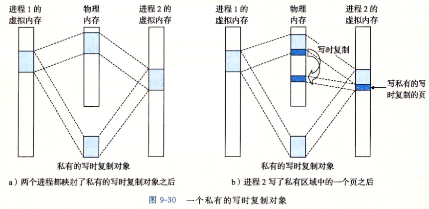

写时拷贝顾名思义就是“写的时候才分配内存空间”，这实际上是一种拖延战术。传统的 fork() 系统调用直接把所有的资源复制给新创建的进程，这种实现过于简单并且效率低下，因为它拷贝的数据或许可以共享，或者有时候 fork() 创建新的子进程后，子进程往往要调用一种 exec 函数以执行另一个程序。而 exec 函数会用磁盘上的一个新程序替换当前子进程的正文段、数据段、堆段和栈段，如果之前 fork() 时拷贝了内存，则这时被替换了，这是没有意义的。 Linux 的 fork() 使用写时拷贝（Copy-on-write）页实现。写时拷贝是一种可以推迟甚至避免拷贝数据的技术。内核此时并不复制整个进程的地址空间，而是让父子进程共享同一个地址空间。只用在需要写入的时候才会复制地址空间，从而使各个进行拥有各自的地址空间。也就是说，资源的复制是在需要写入的时候才会进行，在此之前，只有以只读方式共享。这种技术使地址空间上的页的拷贝被推迟到实际发生写入的时候，大大提高了效率。

> **私有对象使用一种写时复制（copy on write)的技术被映射到虚拟内存中**。即每个映射私有对象的进程，相应的私有区域的页表条目都标记为只读，只要没有进程试图写自己的私有区域，则进程可继续共享物理内存中的单独副本，然而一旦有一个进程试图写私有区域，这个写操作就会触发一个保护故障，故障处理程序就会在物理内存中为该页面创建一个新副本，更新页表条目指向这个新副本，然后恢复该页面的可写权限，处理程序返回时，CPU重新执行该操作，便可在新页面上正常执行写操作。
>
> 

#### *再看fork函数*

- **fork函数被当前进程调用时**，内核为新进程创建各种数据结构，并分配一个唯一PID。为了给新进程创建虚拟内存，它创建了当前进程的mm_struct、区域结构和页表的原样副本。它将两个进程中每个页面都标记为只读，并**将两个进程中每个区域结构都标记为私有的写时复制**
- **fork在新进程返回时**，新进程当前的虚拟内存和调用fork时存在的虚拟内存相同。接下来，当这**两个进程中任意一个进行写操作时，写时复制机制便会创建新页面，因此就为每个进程保持了私有地址空间的抽象概念。**