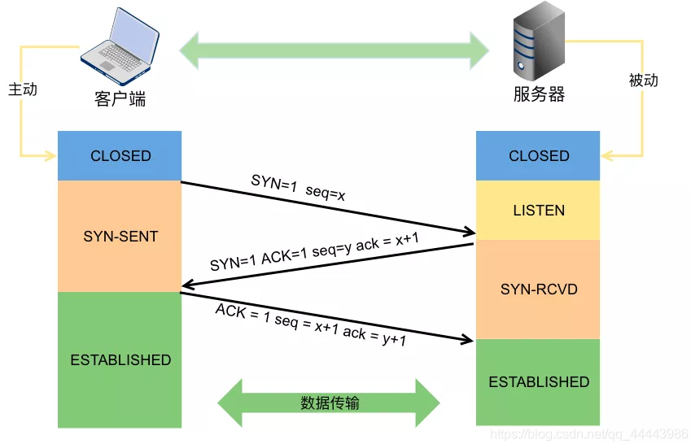

## 三次握手

1. 服务端监听进入LISTEN状态。客户端建立新socket调用connect，发送连接请求SYN，进入SYN_SENT状态，等待服务器确认
2. 服务端监听到连接请求，将连接放入内核等待队列，向客户端发送SYN和确认报文段ACK，进入SYN_RECD状态
3. 客户端收到SYN+ACK报文后向服务端发送确认报文段ACK，并进入ESTABLISHED状态，开始读写数据。服务端收到客户端的确认报文，进入ESTABLISHED状态，可以读写数据

### 问题

#### 为什么不是两次或四次

两次不安全，四次没必要。tcp通信需要确保双方都具有数据收发的能力，**得到ACK响应则认为对方具有数据收发的能力**，因此双方都要发送SYN确保对方具有通信的能力。第一次握手是客户端发送SYN，服务端接收，服务端得出客户端的发送能力和服务端的接收能力都正常；第二次握手是服务端发送SYN+ACK，客户端接收，客户端得出客户端发送接收能力正常，服务端发送接收能力也都正常，但是此时服务器并不能确认客户端的接收能力是否正常；第三次握手客户端发送ACK，服务器接收，服务端才能得出客户端发送接收能力正常，服务端自己发送接收能力也都正常。

#### 三次握手可以携带数据吗

第一次、第二次握手不可以携带数据，而第三次握手是可以携带数据的。假设第一次可以携带数据，如果有人恶意攻击服务器，每次都在第一次握手中的SYN报文放入大量数据，重复发送大量SYN报文，此时服务器会花费大量内存空间来缓冲这些报文，服务器就更容易被攻击了

#### tcp三次握手失败原因，服务端如何处理

握手失败的原因有两种，第一种是服务端没有收到SYN，则什么都不做；第二种是服务端回复了SYN+ACK后，长时间没有收到ACK响应，则**超时后就会发送RST重置连接报文，释放资源**

#### 为什么是半连接队伍

服务器第一次收到客户端的SYN之后，就会处于SYN_RECD状态，此时双方还没有完全建立连接。服务器会把这种状态下的请求连接放在一个队列里，我们把这种队列称之为半连接队列。当然还有一个全连接队列，就是已经完成三次握手，建立起来连接的就会放在全连接队列中，如果队列满了就有可能出现丢包现象

#### ISN代表什么？意义何在？ISN是固定不变的吗？ISN为何要动态随机

ISN全称是Initial Sequence Number，是TCP发送方的字节数据编号的原点，告诉对方我要开始发送数据的初始化序列号。ISN如果是固定的，攻击者很容易猜出后序的确认号，为了安全起见，避免被第三方猜到从而发送伪造的RST报文，因此ISN是动态生成的

## 四次挥手

1. 客户端主动调用close时，向服务端发送结束报文段FIN报，同时进入FIN_WAIT1状态；
2. 服务器会收到结束报文段FIN报，服务器返回确认报文段ACK并进入CLOSE_WAIT状态，此时如果服务端有数据要发送的话，客户端依然需要接收。客户端收到服务器对结束报文段的确认，就会进入到FIN_WAIT2状态，开始等待服务器的结束报文段；
3. 服务器端数据发送完毕后，当服务器真正调用close关闭连接时，会向客户端发送结束报文段FIN包，此时服务器进入LAST_ACK状态，等待最后一个ACK的带来；
4. 客户端收到服务器发来的结束报文段, 进入TIME_WAIT, 并发出送确认报文段ACK；服务器收到了对结束报文段确认的ACK，进入CLOSED状态，断开连接。而客户端要等待2MSL的时间，才会进入到CLOSED状态

### 问题

#### 为什么握手三次，挥手四次

**TCP握手的时候，接收端将SYN包和ACK确认包合并到一个包中发送的，所以减少了一次包的发送**。对于四次挥手，由于TCP是全双工通信，主动关闭方发送FIN请求不代表完全断开连接，只能表示主动关闭方不再发送数据了。而接收方可能还要发送数据，就不能立即关闭服务器端到客户端的数据通道，所以就不能将服务端的FIN包和对客户端的ACK包合并发送，只能先确认ACK，等服务器无需发送数据时在发送FIN包，所以四次挥手时需要四次数据包的交互

#### TIME_WAIT状态有什么作用，为什么主动关闭方没有直接进入CLOSED状态释放资源？

如果主动关闭方进入CLOSED状态后，被动关闭方发送FIN包后没有得到ACK确认，超时后就会重传一个FIN包。如果客户端没有TIME_WAIT状态而直接进入CLOSED状态释放资源，下次启动新的客户端就可能使用了与之前客户端相同的地址信息，有两个危害，第一种是这个刚启动的新的客户端绑定地址成功时，就会收到了一个重传的FIN包，对新连接就会造成影响。第二种是如果该新客户端向相同的服务端发送SYN连接请求，但是此时服务端处于LAST_ACK状态，要求收到的是ACK而不是SYN，因此就会发送RST重新建立请求

#### 为什么TIME_WAIT状态需要经过2MSL才能进入CLOSED状态?

**MSL指的是报文在网络中最大生存时间**。在客户端发送对服务端的FIN确认包ACK后，这个**ACK包有可能到达不了，服务器端如果接收不到ACK包就会重新发送FIN包**。所以客户端发送ACK后需要**留出2MSL时间**（**ACK到达服务器器+服务器发送FIN重传包**，一来一回）等待确认服务器端缺失收到了ACK包。也就是说客户端如果等待2MSL时间也没收到服务器端重传的FIN包，则就可以确认服务器已经收到客户端发送的ACK包

#### 一台主机上出现大量的TIME_WAIT是什么原因？应该如何处理？

TIME_WAIT是主动关闭方出现的，一台主机出现大量的TIME_WAIT证明这台主机上发起大量的主动关闭连接。常见于一些爬虫服务器。这时候我们应该调整TIME_WAIT的等待时间，或者开启套接字地址重用选项

#### 一台主机上出现大量的CLOSE_WAIT是什么原因？应该如何处理？

CLOSE_WAIT是被动关闭方收到FIN请求进行回复之后的状态，等待上层程序进一步处理，若出现大量CLOSE_WAIT，有可能是被动关闭方主机程序中忘了最后一步断开连接后调用close释放资源。这是一个 BUG.，只需要加上对应的 close 即可解决问题

#### tcp连接管理中的保活机制

tcp通信中，若两端长时间没有数据往来，则这时候每隔一段时间，服务端会向客户端发送一个保活探测数据报，要求客户端进行回复。若连续多次没有收到响应，就认为连接已经断开。长时间默认为7200s，每隔一段时间默认为75s，连续多次无响应默认为9次。这些数据都可以在套接字中修改，接口：Setsockopt
