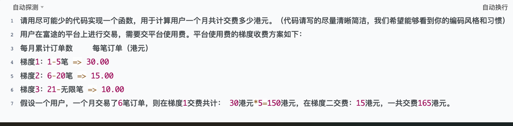

## 1

http介绍

http半连接队伍

服务器第一次收到客户端的SYN之后，就会处于SYN_RECD状态，此时双方还没有完全建立连接。服务器会把这种状态下的请求连接放在一个队列里，我们把这种队列称之为半连接队列。当然还有一个全连接队列，就是已经完成三次握手，建立起来连接的就会放在全连接队列中，如果队列满了就有可能出现丢包现象

tcp介绍

tcp重传为什么不再ip层进行重传？

​	应为IP层解析包再重传会导致很多tcp包都被重传，浪费

介绍虚拟内存

介绍缺页中断

编程

二分法，预先将梯度的费用都算出来，就可以不用每次都计算一遍