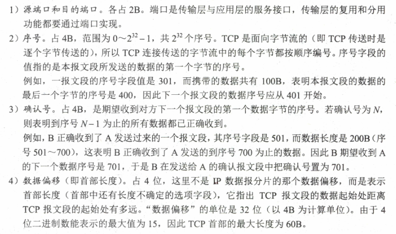
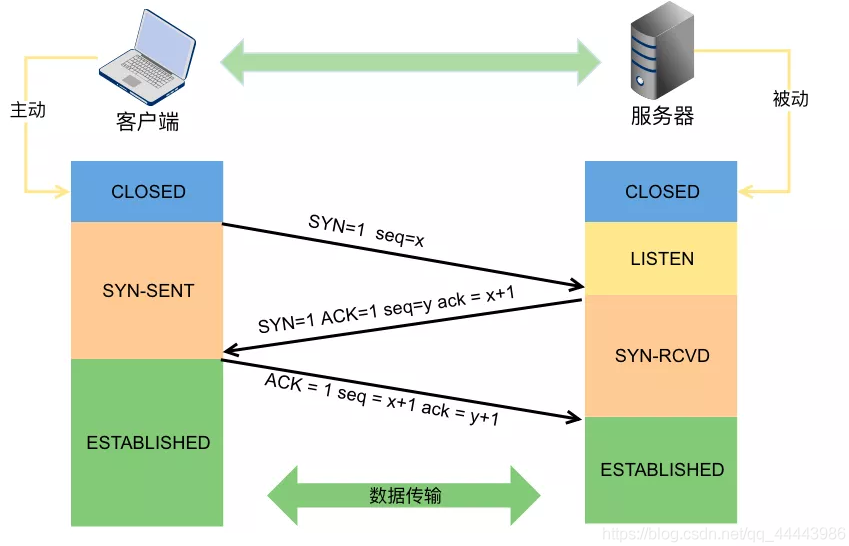
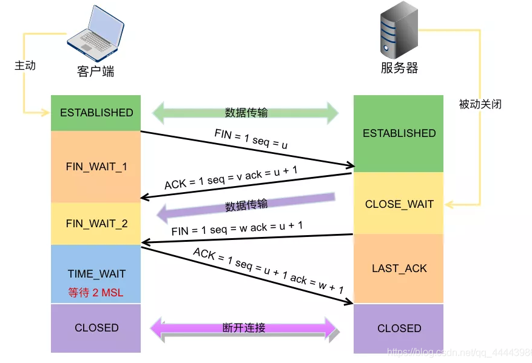

# 网络层

## 功能

只提供简单、灵活、无连接、尽力交付的数据报服务

传送的分组可能重复、出错、丢失、失序或超时

## NAT网络地址转换

将**专用网络地址转换为公用地址，从而对外隐藏内部IP**

大大节省了IP地址的消耗

#### 私有地址：

- A类 1个A类网段 10.0.0.0 ~ 10.255.255.255
- B类 16个B类网段 172.16.0.0 ~ 172.31.255.255
- C类 256个C类网段 192.168.0.0 ~ 192.168.255.255

宿舍4台主机使用私有地址，宿舍网关路由器开启NAT，并且路由器根据NAT转换表进行地址转换。路由器从LAN接受源IP、端口号192.168.0.2 2333的数据报，将其映射为外网IP 端口，138.76.29.7 5001，然后从WAN口发送到外网，当收到WAN端口的报文，目的IP 端口为138.76.29.7 5060的数据报，将其映射为192.168.0.3 1234 然后从LAN端口发送给相应主机

#### 注：

普通路由器转发IP数据报，不修改源IP和目的IP，**NAT路由器一定会改变**

普通路由器仅工作在网络层，**NAT路由器转发数据报还需要查看和转换传输层的端口号**

## 子网划分、子网掩码、CIDR

两级IP地址缺点：不够灵活，IP地址空间利用率有时很低，每个物理网络分配一个网络号会使路由表变得太大而使网络性能变坏

#### 增加子网号地址，使两级->三级地址，也叫子网划分

- 子网对外仍然表现为没有划分子网的网络
- IP = {网络号，子网号，主机号}
- **从其他网络发送到本子网某台主机的IP数据报，仍然是根据IP的目的网络号，先找到本子网连接的路由器，然后路由器收到IP数据报，按目的网络号和子网号找到目的子网，再交给主机**

IP地址192.168.5.56 掩码255.255.255.0 与运算获得子网网络号192.168.5.0

### 使用子网掩码的情况下：

- 主机设置IP信息时必须设置子网掩码
- 同属一个子网的所有主机、路由器的相应端口，必须设置相同的子网掩码
- 路由器路由表，包含信息主要内容有目的IP、子网掩码和下一跳地址

### CIDR无分类编址

变长子网掩码基础上消除A B C类网络划分，软件支持下实现超网构造的IP地址划分方法

IP = {网络前缀，主机号}

网络前缀 = IP & 掩码

#### **网络前缀相同的连续IP地址组成CIDR地址块**

使用CIDR，路由表每个项目由网络前缀和下一跳地址组成，根据匹配结果找到**最长网络前缀**的路由

#### 路由器分组转发

##### 注：得到下一跳IP后，还需要获取MAC地址(ARP)，将MAC地址放入MAC帧首部，根据MAC地址找下一跳路由器，因为在不同网络中传送可能会修改MAC帧的源地址和目的地址，在网桥中不改变帧源地址

## ARP地址解析协议

**数据链路层看不到数据报的IP地址**

路由器的隔离导致IP地址无法通过广播MAC地址来实现跨地址的寻址，因此**网络层使用IP地址完成MAC寻址**

ARP高速缓存存放局域网**各主机和路由器IP->MAC的映射表**

### 原理

同一局域网：

1. 缓存中有，直接将硬件地址写入MAC帧
2. 没有则发送广播ARP白问，目的MAC地址FF-FF-FF-FF-FF-FF，包含了目的IP地址，局域网内各主机收到，如果和目的地址相同则发送相应ARP，不同则忽略
3. 接收相应报文后将硬件地址写入MAC帧

### 四种情况

## DHCP 动态主机配置协议

#### 应用层协议，基于UDP

### 原理

#### 交换过程

1. client**广播**找DHCP server，源地址0.0.0.0 目的255.255.255.255
2. server收到广播后，**广播DHCP提供消息**，消息包括DHCP client的IP地址 源地址为server地址，目的地址255.255.255.255
3. client收到消息，如果接受该地址，**广播DHCP请求消息**，请求server提供IP地址，源地址0.0.0.0 目的255.255.255.255
4. server**广播DHCP确认消息**，IP地址分配给client，源地址server，目的255.255.255.255

## ICMP 网际控制报文协议

为了提高IP数据报交付成功的机会，**网络层**使用了ICMP**让主机、路由器报告差错和异常情况**

### 种类：

#### 差错报文（报告差错、异常情况）

- 终点不可达
- 源点抑制
- 超时(Traceroute)
- 参数问题
- 路由改变（重定向）

#### 询问报文

- **回送请求+回答报文（PING）**
- 时间戳请求+回答报文
- 地址掩码请求+回答报文
- 路由器询问+通告报文

## 解决IP地址耗尽的方法

1. 无类别编址CIDR，让IP地址分配更合理
2. NAT
3. IPV6

## IPV6

特点

- 128bit
- 首部格式灵活
- 增强了安全性、身份验证、保密功能
- 只允许源节点进行分片，传输过程中的路由器不能分片，IPV4可以分片

## 路由协议

### 自治系统AS

### 内部网关协议（IGP）

一个自治系统内部使用的路由选择协议

#### 路由信息协议RIP

**应用层协议**，使用UDP（作为UDP的**数据部分**传输）

通过**距离向量算法完成路由表更新**，最初路由器只知道直连的网络，每30s一次广播，相邻的路由器发送信息，第一次RIP广播知道了跳数为1的网络，直到最后知道了整个网络的路由表

- 规定
  - 每个路由器都要维护自身到其他每个目的网络的距离记录
  - 优先选择跳数少的
  - 一条路径最多15个路由器，最多15跳，==16表示网络不可达，为了防止数据报不断在环路上循环，减少网络拥塞
- 特点
  - 仅和相邻路由交换信息
  - 交换所有信息
  - 固定间隔时间交换信息
- 距离向量算法
  - 每个路由表项有三个数据<目的网络N，距离d，下一跳路由地址X>
- 优缺点
  - 实现简单、开销小、收敛较快
  - 限制了网络规模，最大距离15
  - 有更快但跳数多路径，还是会选较慢但跳数少的
  - 网络规模越大，开销越大
  - 网络出现故障，会出现慢收敛现象（较长时间才能将相关信息传给所有路由器）

#### 开放最短路径优先OSPF

**网络层协议**，**直接使用IP数据报传送**（作为IP数据报的**数据部分**）

OSPF向本自治系统中所有路由器发送信息

发送的信息是**与本路由器相邻的所有路由器的链路状态**，如相邻路由器和度量

链路状态变化时才向所有路由器发送信息

更新过程收敛快

如果**有相同代价的路径，会进行负载均衡**

支持可变长度子网划分和CIDR

##### 五种分组类型

1. 问候分组，发现、维持邻站可达性
2. 数据库描述分组
3. 链路状态请求分组
4. 链路状态更新分组
5. 链路状态确认分组

### 边界网关协议(EGP)

不同自治系统路由器间交换路由信息的协议

互联网太大，自治系统间路由选择很困难

寻找最佳路由不现实

#### BGP原理

每个自治系统管理员选路由器（一个或多个）作为该自治系统的“发言人”，不同自治系统**发言人间交换信息，通过TCP连接**，所有发言人交换完信息，各发言人找到通向各自治系统的较好路由

#### BGP特点

发言人数量少，路由选择不会很复杂

支持CIDR，路由表包括目的网络前缀、下一跳路由以及到达目的网络所要经过的所有自治系统序列

刚开始运行时，要和邻站交换整个BGP路由表，但以后只交换变化部分，节省开销和带宽

#### BGP四种报文

1. 打开，与相邻另一个BGP发言人建立关系
2. 更新，发送路由信息
3. 保活，心跳报文
4. 通知，发送检测的差错

## 组播

**仅用于UDP**

组播地址 224.0.0.0 ~ 239.255.255.255

需要组播路由器，即**支持组播协议的路由器支持才能实现**

数据在分叉时会分组赋值继续转发，发送者只需发一次就可发送到所有接受者，降低了网络负载

## 网络层设备

### 冲突域和广播域

#### 冲突域

连接到同一物理介质上所有节点的集合，1层设备无法划分冲突域

2（网桥、交换机）、3层（路由器）都可划分冲突域

#### 广播域

接受同样广播消息的节点集合

3层可以划分广播域

# 传输层

只在IP数据报服务上增加了**复用、分用和差错检测**

### 功能

1. 提供**端到端的通信**，网络层提供的是主机间的逻辑通信
2. 复用：发送方不同的应用进程都可使用同一个传输层协议传输数据
3. 分用：接收方的传输层在去除报文首部后能成功将数据正确交付给目的进程
4. 对收到的报文进行差错检测（首部+数据），网络层只检测IP数据报首部，不检查数据部分
5. 提供两种协议，面向连接TCP，无连接UDP，网络层无法同时实现两种协议（要么只提供面向连接如虚电路，要么只提供无连接如数据报）

### 端口

## UDP

### 特点

1. 无连接，面向报文的
2. 不保证可靠交付
3. 分组首部开销小
4. 支持一对一、一对多、多对一和多对多的交互通信

### 格式

根据IP数据报获得UDP数据报，再根据首部目的端口号传送给应用进程

如果接收方UDP发现目的端口不正确，丢弃报文并发送ICMP发送端口不可达差错报文

### UDP校验

在UDP数据报前添加12B伪首部，用于计算校验和

## TCP

### 特点

1. 面向连接
2. 只能一对一
3. 可靠交付
4. 全双工
5. 面向字节流
6. udp报文数据大小取决于进程，TCP报文大小取决于接收方窗口值和网络拥塞程度

### 格式

### 三次握手

### 四次挥手

### 可靠传输

IP层不可靠、尽力交付，要在传输层建立一种可靠数据传输服务

使用**校验、序号、确认、重传**等机制

#### 序号

保证数据有序交给应用层

#### 确认

如果收到了0-2 6-7的报文段，但3-5报文段还未收到，则下个报文段的**确认号字段**为3

#### 重传

1. 超时

   每发送一个报文段，就设置一次计时器，超时RTT（报文往返时间）还未收到确认，重传

   问题在于**超时周期太长**

2. 冗余确认

   再次确认某个报文段的ACK，而发送方已经收到过该报文段的确认

   A发送序号1-5的报文段给B，2丢失，3 4 5到达，但不是接收方期望的，B发送3个对1号报文段的冗余ACK，A认为是这个报文段2丢失，A立刻重发2

   

### 流量控制

**基于滑动窗口**协议的流量控制

接收方根据缓存大小，动态调整发送方发送窗口大小，称为**接受窗口rwnd**，调整TCP首部的**窗口字段值**，限制发送方速率。同时发送方根据网络拥塞程度确定窗口值，称为**拥塞窗口cwnd**

#### 和数据链路层的流量控制区别

传输层控制端到端的流量，窗口可动态变化

数据链路层控制两个节点间的流量，窗口不能动态变化

### TCP拥塞控制

防止过多数据注入网络，保证网络中路由器、链路不过载

拥塞往往表现为通信时延增加

要求发送方维护两个窗口：

1. 接收窗口rwnd

   接收方发给发送方

2. 拥塞窗口cwnd

   发送方自己根据网络拥塞程度设置

**发送窗口 = min(rwnd,cwnd)**

#### 慢开始和拥塞避免

- ##### 慢开始

  **开始时，cwnd=1，每收一个新报文段的确认，cwnd*=2**

  A给B发送数据，A收到一个B的确认，cwnd = 2,A接收2个报文段，cwnd = 4，B下一次可以发送4个报文段

  慢开始的“慢”不是指增长速度慢，而是指TCP开始发送报文的cwnd = 1，目的是试探网络拥塞情况，然后乘2，**到了慢开始门限（阈值ssthresh）进行拥塞避免**

- ##### 拥塞避免

  思路：让cwnd缓慢增大，每经过一个往返时延RTT cwnd+1，只要出现拥塞，就把阈值设置为出现拥塞时cwnd/2，然后重新慢开始

##### 特点

1. 拥塞窗口缓慢增加，防止网络过早拥塞
2. 不能完全避免拥塞

#### 快重传和快恢复

- ##### 快重传

  使用冗余ACK检测丢包

  发送方连续收到3个重复ACK报文，直接重传对方未收到的报文段，不必等待报文段设置的超时重传

- ##### 快恢复

  连续收到3个冗余ACK，阈值=cwnd/2，然后拥塞避免

TCP建立连接和网络超时时，用慢开始+拥塞避免，发送方收到冗余ACK，使用快重传和快恢复

# 应用层

## DNS域名系统

### 层次域名空间

### 域名服务器

联机分布式数据库，CS模型

1. 根域名服务器

   本地域名服务器无法解析，首先求助根域名服务器

2. 顶级域名服务器

   负责管理该顶级域名服务器注册的二级域名

3. 授权域名服务器

   每台主机必须在此等级，总能将其管辖的主机名转换为该主机的IP地址

4. 本地域名服务器

   一台主机发出DNS请求时，就发送给本地域名服务器。

### 域名解析过程

正向解析：域名->IP

反向解析：IP->域名

#### 方式

1. 递归查询
2. 递归、迭代相结合查询

主机向本地域名服务器使用递归

本地域名服务器向根域名服务器采用迭代查询，根域名服务器如果找到对应IP，就返回IP，否则会告诉本地域名服务器接下来该向哪个顶级域名服务器查询，顶级服务器如果没有，则继续告诉该向哪个授权域名服务器查询

## FTP

数据连接端口20 控制连接端口21

监听端口21，用于传送传输控制信息

### 数据连接两种模式

1. 主动模式

   客户连接到21端口，成功后**客户端随机开放一个端口，发送命令告知服务器**，服务器通过20端口和客户端开放的端口发送数据

2. 被动模式

   客户端读取数据时，发送PASV命令给服务器，**服务器随机开放端口，告知客户端**，客户端再连接到服务器开放的端口进行数据传输

## HTTP

监听TCP端口80，建立TCP连接

HTTP本身是无连接的、无状态的

HTTP既可以使用非持久连接，也可以使用持久连接

### 持久连接

1. 非流水线：客户收到响应后才能发送下一个请求
2. 流水线：客户可以连续发送请求

### 结构

